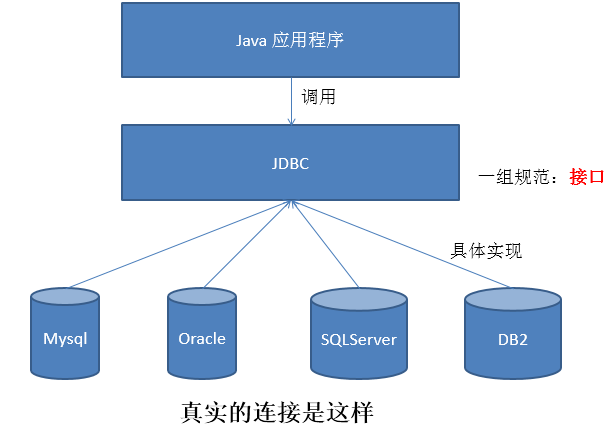

# JDBC 概述

## 数据的持久化

持久化（persistence）：**把数据保存到可掉电式存储设备中以供之后使用**。大多数情况下，特别是企业级应用，**数据持久化意味着将内存中的数据保存到硬盘**上加以”固化”，**而持久化的实现过程大多通过各种关系数据库来完成**。

持久化的主要应用是将内存中的数据存储在关系型数据库中。

## Java 中的数据存储技术

主要分为：

* JDBC 直接访问数据库；
* JDO（Java Data Object）技术；
* 第三方 ORM 框架，如 Hibernate、Mybatis 等。

JDBC 是 Java 访问数据库的基石，其他技术和框架只是更好的封装了 JDBC。

## JDBC 介绍

* JDBC（Java Database Connectivity）是一个**独立于特定数据库管理系统、通用的SQL数据库存取和操作的公共接口**，定义了用来访问数据库的标准 Java 类库（**java.sql、javax.sql**），使用这些类库可以以一种**标准**的方法、方便地访问数据库资源。
* JDBC 的目标是使 Java 开发者使用 JDBC 可以连接任何**提供了 JDBC 驱动程序**的数据库系统，这样就使得程序员无需对特定的数据库系统的特点有过多的了解，从而大大简化和加快了开发过程。

## JDBC 体系结构

JDBC 接口包括两个层次：

* **面向应用的API**：Java API，抽象接口，供应用程序开发人员使用（连接数据库，执行SQL语句，获得结果）。
* **面向数据库的API**：Java Driver API，供开发商开发数据库驱动程序用。

## JDBC 编写步骤

* 1.导入 `java.sql` 包；
* 2.附加相应厂商的驱动，或建立数据源；
* 3.加载并注册驱动；
* 4.创建 Connection 对象；
* 5.创建 Statement 对象；
* 6.执行 SQL 语句；
* 7.使用和关闭相关对象。

## 总结和练习
