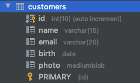
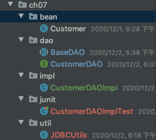

# DAO 相关

## 概念

**DAO**：Data Access Object 访问数据信息的类和接口，包括了对数据的 CRUD（Create、Retrival、Update、Delete），而不包含任何业务相关的信息。有时也称作 BaseDAO。

作用：为了实现功能的模块化，更有利于代码的维护和升级。

## 使用

**表结构**：



**DAO使用**：



---

```java
package cn.parzulpan.jdbc.ch07.util;

import com.alibaba.druid.pool.DruidDataSourceFactory;
import org.apache.commons.dbutils.DbUtils;

import javax.sql.DataSource;
import java.io.InputStream;
import java.sql.*;
import java.text.ParseException;
import java.text.SimpleDateFormat;
import java.util.Properties;

/**
 * @Author : parzulpan
 * @Time : 2020-12-02
 * @Desc : 操作数据库的工具类，最终版
 */

public class JDBCUtils {
    private static DataSource dataSource = null;

    static {
        try {
            Properties properties = new Properties();
            InputStream is = ClassLoader.getSystemClassLoader().getResourceAsStream("druid.properties");
            properties.load(is);
            dataSource = DruidDataSourceFactory.createDataSource(properties);
        } catch (Exception e) {
            e.printStackTrace();
        }
    }

    /**
     * 获取数据库连接，使用 Druid 数据库连接池
     * @return 数据库连接
     */
    public static Connection getDruidConnection() throws SQLException {
        return dataSource.getConnection();
    }

    /**
     * 使用DbUtils，静默关闭数据库资源
     * @param connection 数据库连接
     * @param statement 声明
     * @param resultSet 结果集
     */
    public static void closeResourceQuietly(Connection connection, Statement statement, ResultSet resultSet) {
        DbUtils.closeQuietly(connection);
        DbUtils.closeQuietly(statement);
        DbUtils.closeQuietly(resultSet);
    }

    public static Date getSqlDate(String dateStr) {
        java.sql.Date date = null;
        try {
            java.util.Date parse = new SimpleDateFormat("yyyy-MM-dd").parse(dateStr);
            date = new java.sql.Date(parse.getTime());
        } catch (ParseException e) {
            e.printStackTrace();
        }
        return date;
    }
}
```

---

```java
package cn.parzulpan.jdbc.ch07.dao;

import org.apache.commons.dbutils.QueryRunner;
import org.apache.commons.dbutils.handlers.BeanHandler;
import org.apache.commons.dbutils.handlers.BeanListHandler;
import org.apache.commons.dbutils.handlers.ScalarHandler;

import java.lang.reflect.ParameterizedType;
import java.lang.reflect.Type;
import java.sql.Connection;
import java.sql.SQLException;
import java.util.List;

/**
 * @Author : parzulpan
 * @Time : 2020-12-01
 * @Desc : 对数据表的通用操作
 */

public abstract class BaseDAO<T> {
    // 泛型的类型
    private Class<T> type;
    private QueryRunner queryRunner = new QueryRunner();

    // 获取 T 类对象，获取泛型的类型，泛型是在被子类继承时才确定的
    public BaseDAO() {
        // 获取子类的类型
        Class<? extends BaseDAO> clazz = this.getClass();

        // 获取父类的类型
        ParameterizedType parameterizedType = (ParameterizedType) clazz.getGenericSuperclass();

        // 获取具体的泛型
        Type[] types = parameterizedType.getActualTypeArguments();

        this.type = (Class<T>)types[0];
    }

    /**
     * 通用的增删改操作
     * @param connection 数据库连接
     * @param sql   sql 语句
     * @param args 参数
     * @return 更新的条数
     */
    public int update(Connection connection, String sql, Object ... args) {
        int update = 0;
        try {
            update = queryRunner.update(connection, sql, args);
        } catch (SQLException e) {
            e.printStackTrace();
        }
        return update;
    }

    /**
     * 通用的查询操作
     * @param connection 数据库连接
     * @param sql   sql 语句
     * @param args 参数
     * @return 返回一个对象
     */
    public T getBean(Connection connection, String sql, Object ... args) {
        T t = null;
        BeanHandler<T> beanHandler = new BeanHandler<>(type);
        try {
            t = queryRunner.query(connection, sql, beanHandler, args);
        } catch (SQLException e) {
            e.printStackTrace();
        }
        return t;
    }

    /**
     * 通用的查询操作
     * @param connection 数据库连接
     * @param sql   sql 语句
     * @param args 参数
     * @return 返回一个对象列表
     */
    public List<T> getBeanList(Connection connection, String sql, Object ... args) {
        List<T> list = null;
        BeanListHandler<T> beanListHandler = new BeanListHandler<>(type);
        try {
            list = queryRunner.query(connection, sql, beanListHandler, args);
        } catch (SQLException e) {
            e.printStackTrace();
        }
        return list;
    }

    /**
     * 查询特殊值，类似于最大的，最小的，平均的，总和，个数相关的操作
     * @param connection 数据库连接
     * @param sql   sql 语句
     * @param args 参数
     * @return 特殊值
     */
    public Object getValue(Connection connection, String sql, Object ... args) {
        Object obj = null;
        ScalarHandler scalarHandler = new ScalarHandler();
        try {
            obj = queryRunner.query(connection, sql, scalarHandler, args);
        } catch (SQLException e) {
            e.printStackTrace();
        }
        return obj;
    }
}
```

---

```java
package cn.parzulpan.jdbc.ch07.dao;

import cn.parzulpan.jdbc.ch07.bean.Customer;

import java.sql.Connection;
import java.sql.Date;
import java.util.List;

/**
 * @Author : parzulpan
 * @Time : 2020-12-01
 * @Desc : 此接口用于规范 customers 表的常用操作
 */

public interface CustomerDAO {

    /**
     * 将 customer 对象添加到数据库中
     * @param connection 数据库连接
     * @param customer customer 对象
     */
    void insert(Connection connection, Customer customer);

    /**
     * 用 customer 对象修改数据库对应的数据中
     * @param connection 数据库连接
     * @param customer customer 对象
     */
    void update(Connection connection, Customer customer);

    /**
     * 根据 Id 删除一条记录
     * @param connection 数据库连接
     * @param id
     */
    void deleteById(Connection connection, int id);

    /**
     * 根据 Id 查询一条记录
     * @param connection 数据库连接
     * @param id
     * @return
     */
    Customer getCustomerById(Connection connection, int id);

    /**
     * 查询多条记录
     * @param connection 数据库连接
     * @return
     */
    List<Customer> getCustomerList(Connection connection);

    /**
     * 查询记录条数
     * @param connection 数据库连接
     * @return
     */
    Long getCount(Connection connection);

    /**
     * 查询最大的生日记录
     * @param connection 数据库连接
     * @return
     */
    Date getMaxBirth(Connection connection);

}
```

---

```java
package cn.parzulpan.jdbc.ch07.impl;

import cn.parzulpan.jdbc.ch07.bean.Customer;
import cn.parzulpan.jdbc.ch07.dao.BaseDAO;
import cn.parzulpan.jdbc.ch07.dao.CustomerDAO;

import java.sql.Connection;
import java.sql.Date;
import java.util.List;

/**
 * @Author : parzulpan
 * @Time : 2020-12-01
 * @Desc :
 */

public class CustomerDAOImpl extends BaseDAO<Customer> implements CustomerDAO {
    /**
     * 将 customer 对象添加到数据库中
     *
     * @param connection 数据库连接
     * @param customer   customer 对象
     */
    @Override
    public void insert(Connection connection, Customer customer) {
        String sql = "insert into customers(name, email, birth)values(?,?,?)";
        update(connection, sql, customer.getName(), customer.getEmail(), customer.getBirth());
    }

    /**
     * 用 customer 对象修改数据库对应的数据中
     *
     * @param connection 数据库连接
     * @param customer   customer 对象
     */
    @Override
    public void update(Connection connection, Customer customer) {
        String sql = "update customers set name = ?, email = ?, birth = ? where id = ?";
        update(connection, sql, customer.getName(), customer.getEmail(), customer.getBirth(), customer.getId());
    }

    /**
     * 根据 Id 删除一条记录
     *
     * @param connection 数据库连接
     * @param id
     */
    @Override
    public void deleteById(Connection connection, int id) {
        String sql = "delete from customers where id = ?";
        update(connection, sql, id);
    }

    /**
     * 根据 Id 查询一条记录
     *
     * @param connection 数据库连接
     * @param id
     * @return
     */
    public Customer getCustomerById(Connection connection,  int id) {
        String sql = "select id, name, email, birth from customers where id = ?";
        return getBean(connection, sql, id);
    }

    /**
     * 查询多条记录
     *
     * @param connection 数据库连接
     * @return
     */
    @Override
    public List<Customer> getCustomerList(Connection connection) {
        String sql = "select id, name, email, birth from customers";
        return getBeanList(connection, sql);
    }

    /**
     * 查询记录条数
     *
     * @param connection 数据库连接
     * @return
     */
    @Override
    public Long getCount(Connection connection) {
        String sql = "select count(*) from customers";
        return (Long) getValue(connection, sql);
    }

    /**
     * 查询最大的生日记录
     *
     * @param connection 数据库连接
     * @return
     */
    @Override
    public Date getMaxBirth(Connection connection) {
        String sql = "select max(birth) from customers";
        return (Date) getValue(connection, sql);
    }
}
```

---

```java
package cn.parzulpan.jdbc.ch07.junit;

import cn.parzulpan.jdbc.ch07.bean.Customer;
import cn.parzulpan.jdbc.ch07.impl.CustomerDAOImpl;
import cn.parzulpan.jdbc.ch07.util.JDBCUtils;
import org.junit.After;
import org.junit.Before;
import org.junit.Test;

import java.sql.Connection;
import java.sql.Date;
import java.sql.SQLException;
import java.util.List;

import static org.junit.Assert.*;

/**
 * @Author : parzulpan
 * @Time : 2020-12-02
 * @Desc :
 */

public class CustomerDAOImplTest {


    @Before
    public void setUp() throws Exception {
        System.out.println("CustomerDAOImplTest Before");
    }

    @After
    public void tearDown() throws Exception {
        System.out.println("CustomerDAOImplTest Down");
    }

    private CustomerDAOImpl customerDAO = new CustomerDAOImpl();

    @Test
    public void insert() {
        Connection connection = null;
        try {
            connection = JDBCUtils.getDruidConnection();
            Customer customer = new Customer(30, "DAO", "dao@163.com", JDBCUtils.getSqlDate("1995-1-1"));
            customerDAO.insert(connection, customer);
        } catch (SQLException e) {
            e.printStackTrace();
        } finally {
            JDBCUtils.closeResourceQuietly(connection, null, null);
        }
    }

    @Test
    public void update() {
        Connection connection = null;
        try {
            connection = JDBCUtils.getDruidConnection();
            Customer customer = new Customer(24, "DAOUpdate", "dao@163.com", JDBCUtils.getSqlDate("1995-1-1"));
            customerDAO.update(connection, customer);
        } catch (SQLException e) {
            e.printStackTrace();
        } finally {
            JDBCUtils.closeResourceQuietly(connection, null, null);
        }
    }

    @Test
    public void deleteById() {
        Connection connection = null;
        try {
            connection = JDBCUtils.getDruidConnection();
            customerDAO.deleteById(connection, 23);
        } catch (SQLException e) {
            e.printStackTrace();
        } finally {
            JDBCUtils.closeResourceQuietly(connection, null, null);
        }
    }

    @Test
    public void getCustomerById() {
        Connection connection = null;
        try {
            connection = JDBCUtils.getDruidConnection();
            Customer customer = customerDAO.getCustomerById(connection, 10);
            System.out.println(customer);
        } catch (SQLException e) {
            e.printStackTrace();
        } finally {
            JDBCUtils.closeResourceQuietly(connection, null, null);
        }
    }

    @Test
    public void getCustomerList() {
        Connection connection = null;
        try {
            connection = JDBCUtils.getDruidConnection();
            List<Customer> customers = customerDAO.getCustomerList(connection);
            customers.forEach(System.out::println);
        } catch (SQLException e) {
            e.printStackTrace();
        } finally {
            JDBCUtils.closeResourceQuietly(connection, null, null);
        }
    }

    @Test
    public void getCount() {
        Connection connection = null;
        try {
            connection = JDBCUtils.getDruidConnection();
            Long count = customerDAO.getCount(connection);
            System.out.println(count);
        } catch (SQLException e) {
            e.printStackTrace();
        } finally {
            JDBCUtils.closeResourceQuietly(connection, null, null);
        }
    }

    @Test
    public void getMaxBirth() {
        Connection connection = null;
        try {
            connection = JDBCUtils.getDruidConnection();
            Date maxBirth = customerDAO.getMaxBirth(connection);
            System.out.println(maxBirth);
        } catch (SQLException e) {
            e.printStackTrace();
        } finally {
            JDBCUtils.closeResourceQuietly(connection, null, null);
        }
    }
}
```

---

## 练习和总结
