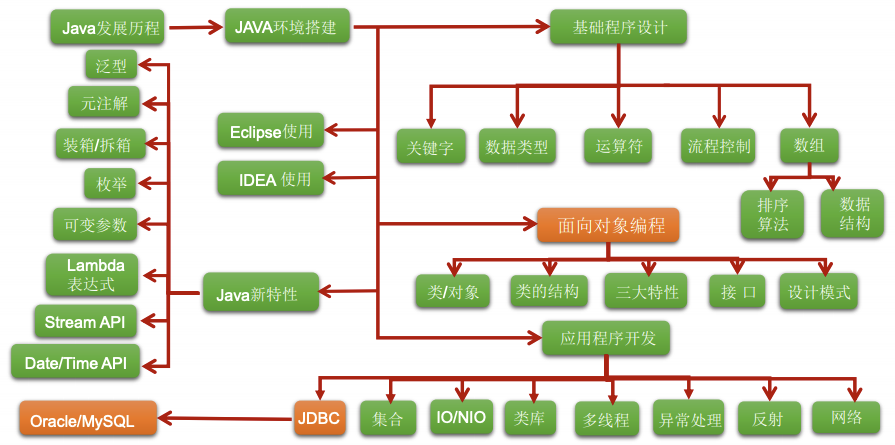

# Java 语言概述

## 主要应用场景

JavaEE、大数据、Android 开发方向。

## 基础知识概述

* 编程语言核心结构
* 变量、基本语法、分支、循环、数组、…
* Java 面向对象的核心逻辑
  * OOP、封装、继承、多态、接口、…
* 开发 Java SE 高级应用程序
  * 异常、集合、I/O、多线程、反射机制、网络编程、……
* 实训项目
  * 项目一：家庭收支记账软件
  * 项目二：客户信息管理软件
  * 项目三：开发团队人员调度软件
  * 附加项目一：银行业务管理软件
  * 附件项目二：单机考试管理软件



## 练习和总结

---
**Java 语言的特点是什么？**

* 面向对象性
  * 两个基本概念：类、对象
  * 三大特性：封装、继承、多态
* 语言健壮性
  * 吸收了 C/C++ 语言的优点，但去掉了其影响程序健壮性的部分（如指针、内存的申请与释放等），提供了一个相对安全的内存管理和访问机制。
  * 自动的垃圾回收机制。
* 跨平台性
  * 通过 Java 语言编写的应用程序在不同的系统平台上都可以运行。
  * 只需要在运行 Java 应用程序的 OS 上，先安装一个 JVM，由 JVM 来负责 Java 程序在该系统中的运行。

---

**System.out.println() 和 System.out.print() 有什么区别？**

一个换行，一个不换行。

---

**一个 ".java" 源文件中是否可以包括多个类（不是内部类）？有什么限制？**

可以，但是最多只有一个类名声明为 public，类名与文件名相同。

---

**Something 类的文件名叫 OtherThing.java 是否正确？**

```java
class Something {
    public static void main(String[] something_to_do) {
        System.out.println("Do something ...");
    }
}
```

正确。从来没有人说过 Java 的 Class 名字必须和其文件名相同。但public class 的名字必须和文件名相同。

---

**设置 path 的目的是什么？**

目的是为了在控制台的任何文件路径下，都可以调用 jdk 指定目录下的所有指令。

---

**JDK、JRE 和 JVM 的关系是什么？**

JDK（Java Development Kit），即 Java 开发工具包、JRE（Java Runtime Environment），即 Java 运行环境、JVM（Java Virtual Machine），即 Java 虚拟机。

JDK 包含 JRE，JRE 包含 JVM。

JDK = JRE + 开发工具集

JRE = JVM + 核心类库

---

**源文件名是否必须与类名相同？如果不是，那么什么情况下，必须相同？**

不是，只有 public class 的名字必须和文件名相同

---

**程序中若只有一个 public 修饰的类，且此类含 main 方法。那么类名与源文件名可否不一致？**

不可以。

---

**Java 的注释方式有哪几种，格式是什么？**

单行注释、多行注释、文档注释 (java 特有)

---

**GC 是什么? 为什么要有 GC？**

GC 即 垃圾收集机制，内存处理是编程人员容易出现问题的地方，
忘记或者错误的内存回收会导致程序或系统的不稳定甚至崩溃，Java 提供的 GC 功能可以自动监测对象是否超过作用域从而达到自动回收内存的目的，Java语言没有提供释放已分配内存的显式操作方法。

---

**垃圾回收器的基本原理是什么？垃圾回收器可以马上回收内存吗？有什么办法主动通知虚拟机进行垃圾回收？**

对于 GC 来说，当程序员创建对象时，GC 就开始监控这个对象的地址、大小以及使用情况。通常，GC 采用有向图的方式记录和管理堆(heap)中的所有对象。通过这种方式确定哪些对象是"可达的"，哪些对象是"不可达的"。
当 GC 确定一些对象为"不可达"时，GC 就有责任回收这些内存空间。

可以。程序员可以手动执行 System.gc()，通知 GC 运行，但是 Java 语言规范并不保证 GC 一定会执行。

---

**结合\n(换行)，\t(制表符)，空格等在控制台打印出心形的效果？**

```java
package com.parzulpan.java.ch01;

/**
 * @author : parzulpan
 * @time :2020-11-16
 * @attention : 结合\n(换行)，\t(制表符)，空格等在控制台打印出心形的效果
 */

public class PrintStar {
    public static void main(String[] args) {
        System.out.print("\t" + "*" + "\t\t\t\t\t\t\t\t\t\t\t\t" + "*" + "\t" + "\n");
        System.out.print("*" + "\t\t" + "*" + "\t\t\t\t" + "I love Java" + "\t\t\t\t" + "*" + "\t\t" + "*" + "\n");
        System.out.print("\t" + "*" + "\t\t\t\t\t\t\t\t\t\t\t\t" + "*" + "\t" + "\n");
        System.out.print("\t\t" + "*" + "\t\t\t\t\t\t\t\t\t\t" + "*" + "\t\t" + "\n");
        System.out.print("\t\t\t" + "*" + "\t\t\t\t\t\t\t\t" + "*" + "\t" + "\n");
        System.out.print("\t\t\t\t" + "*" + "\t\t\t\t\t\t" + "*" + "" + "\t" + "\n");
        System.out.print("\t\t\t\t\t" + "*" + "\t\t\t\t" + "*" + "" + "\t\t" + "\n");
        System.out.print("\t\t\t\t\t\t" + "*" + "\t\t" + "*" + "" + "\t\t" + "\n");
        System.out.print("\t\t\t\t\t\t\t" + "*" + "\n");
    }
}

```

---
