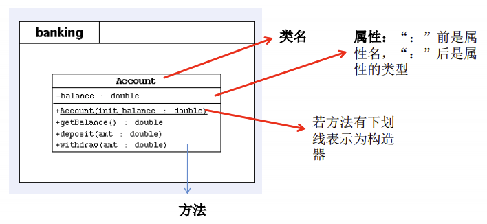
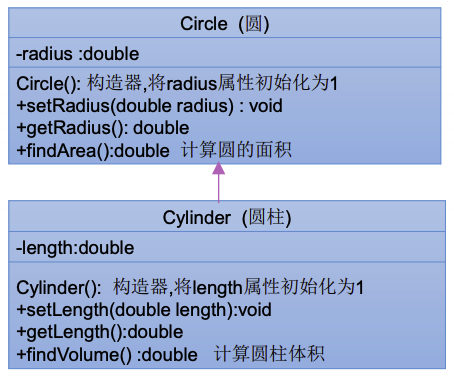
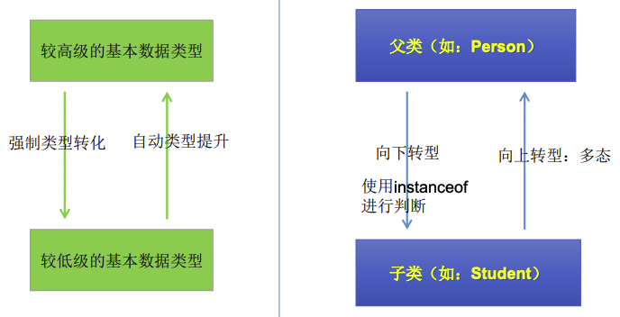

# 面向对象中

这一章主要涉及面向对象的三大特征，包括封装、继承、多态、（抽象）。

## 封装

程序设计追求“高内聚，低耦合”：

* 高内聚 ：类的内部数据操作细节自己完成，不允许外部干涉；
* 低耦合 ：仅对外暴露少量的方法用于使用。

通俗的说，把该隐藏的隐藏起来，该暴露的暴露出来，这就是封装性的设计思想。

通过将数据声明为私有的（private），再提供公共的（public）方法：getXxx() 和 setXxx() 实现对该属性的操作，以实现下述目的：

* 隐藏一个类中不需要对外提供的实现细节；
* 使用者只能通过事先定制好的方法来访问数据，可以方便地加入控制逻辑，限制对属性的不合理操作；
* 便于修改，增强代码的可维护性。

四种访问权限修饰符：Java 权限修饰符 `private`、 `default(缺省)`、`protected`、`public` 置于**类的成员定义**前，用来限定对象对该类成员的访问权限。

| 权限修饰符 | 类内部 | 同一个包 | 不同包的子类 | 同一个工程 |
| :--- | :--- | :--- | :--- | :--- |
| `private` | Yes | | | |
| `default(缺省)` | Yes | Yes | | |
| `protected` | Yes | Yes | Yes | |
| `public` | Yes | Yes | Yes | Yes |

**注意**：对于 class 的权限修饰符号只可以用 `public` 和 `default(缺省)`。

* public 类可以在任意地方被访问；
* default 类只可以被同一个包内部的类访问。

为什么呢？因为外部类和外部类之间访问权限就只有包内和包外。

封装性的体现：

* 类的属性私有化；
* 不对外暴露私有的方法；
* 单例模式的实现。

## 构造器

构造器的特征：

* 它具有与类相同的名称；
* 它不声明返回值类型；
* 不能被 static、final、synchronized、abstract、native 修饰，不能有 return 语句返回值。

构造器的作用：

* 创建对象；
* 给对象进行初始化。

语法格式：

```java
修饰符 类名(参数列表) {
    初始化语句;
}
```

构造器的分类：

* 隐式无参构造器（系统默认提供）；
* 显式定义一个或多个构造器（无参、有参）。

**使用注意**：

* Java 中，每个类都至少有一个构造器；
* 默认构造器的**修饰符**与所属类的修饰符一致；
* 一旦显式定义了构造器，则系统不再提供默认构造器；
* 一个类可以创建多个重载的构造器；
* 父类的构造器不能被子类继承。

例子：

```java
public class ConstructorTest {
    public static void main(String[] args) {
//        StudentA s1 = new StudentA(); // Error
        StudentA s2 = new StudentA("A", 11);
        s2.printInfo();
        StudentA s3 = new StudentA("A", 11, "B");
        s3.printInfo();
        StudentA s4 = new StudentA("A", 11, "B", "C");
        s4.printInfo();
    }
}


class StudentA {
    String name;
    int age;
    String school;
    String major;

    StudentA(String n, int a) {
        name = n;
        age = a;
    }

    StudentA(String n, int a, String s) {
        name = n;
        age = a;
        school = s;
    }

    StudentA(String n, int a, String s, String m) {
        name = n;
        age = a;
        school = s;
        major = m;
    }

    public void printInfo() {
        System.out.println(name + " " + age + " " + school + " " + major);
    }
}
```

## JavaBean

**JavaBean 是一种 Java 语言写成的可重用组件。**

所谓 JavaBean，是指符合如下标准的 Java 类：

* 类是公共的；
* 有一个无参的公共的构造器；
* 有属性，且有对应的 get、set 方法。

## UML 类图



* `+` 表示 public 类型，`-` 表示 private 类型， `#` 表示 protected 类型;
* 方法的写法：方法的类型（`+`、`-` ）方法名（参数名：参数类型）: 返回值类型。

## this 的使用

* 它的作用和其词义相近：
  * 它在方法内部使用，即这个方法所属对象的引用；
  * 它在构造器内部使用，表示该构造器正在初始化的对象。
* this 可以调用类的属性、方法和构造器；
* 挡在方法内需要调用该方法的对象时，就用 this，具体的，可以用 this 来区分属性和局部变量。

注意：

* 可以在类的构造器中使用 `this(形参列表)` 的方式，调用本类中重载的其他构造器；
* 但是，构造器不能通过 `this(形参列表)` 的方式调用自身构造器；
* 如果一个类中声明了n个构造器，则最多有 n - 1个构造器中使用了 `this(形参列表)`；
* **`this(形参列表)` 必须声明在类的构造器的首行**；
* **在类的一个构造器中，最多只能声明一个 `this(形参列表)`**；

## package、import 的使用

* package 语句作为 Java 源文件的第一条语句，指明该文件中定义的类所在的包，若缺省该语句，则指定为无名包，它的格式为：`package 顶层包名.子包名;`；
* 包对应于文件系统的目录，用 `“.”` 来指明包（目录）的层次；
* 包通常用小写单词标识，通常使用所在公司域名的倒置：`cn.parzulpan.xxx`。

包的作用：

* 包帮助管理大型软件系统，将功能相近的类划分到同一个包中。比如 MVC 的设计模式；
* 包可以包含类和子包，划分项目层次，便于管理；
* 解决类命名冲突的问题，同一个包下类名不能相同；
* 控制访问权限。

## MVC 设计模式

MVC是常用的设计模式之一，将整个程序分为三个层次：**视图模型层**，**控制器层**，与**数据模型层**。这种将程序输入输出、数据处理，以及数据的展示分离开来的设计模式使程序结构变的灵活而且清晰，同时也描述了程序各个对象间的通信方式，降低了程序的耦合性。

* 模型层（Model）：处理数据，
* 视图层（View）：显示数据，
* 控制层（Controller）：处理业务逻辑，

## import

为使用定义在不同包中的 Java 类，需用 import 语句来引入指定包层次下所需要的类或全部类`(.*)`。import 语句告诉编译器到哪里去寻找类。

语法格式：`import 包名. 类名;`

注意：

* 在源文件中使用 import 显式的导入指定包下的类或接口；
* 声明在包的声明和类的声明之间。；
* 如果需要导入多个类或接口，那么就并列显式多个 import 语句即可；
* 举例：可以使用 java.util.* 的方式，一次性导入 util 包下所有的类或接口；
* 如果导入的类或接口是 java.lang 包下的，或者是当前包下的，则可以省略此import语句；
* 如果在代码中使用不同包下的同名的类。那么就需要使用类的全类名的方式指明调用的是哪个类；
* 如果已经导入 java.a 包下的类。那么如果需要使用 a 包的子包下的类的话，仍然需要导入；
* import static 组合的使用：调用指定类或接口下的**静态的属性或方法**。

## 继承

为什么要有继承？多个类中存在相同属性和行为时，将这些内容抽取到单独一个类中，那么多个类无需再定义这些属性和行为，只要继承那个类即可。

多个类称为子类(派生类)，单独的这个类称为父类(基类 或 超类)。可以理解为:“子类 is a 父类”。

**类继承语法规则**：`class SubClass extends SuperClass{}`

继承的作用：

* 减少了代码冗余，提高了代码的复用性；
* 更加有利于功能的扩展；
* 让类和类之间产生了关系，提供了多态的前提。

**注意：**

* 在 Java 中，继承的关键字用的是 `“extends”`，即子类不是父类的子集，而是对父类的“**扩展**”。
* 子类**不能直接访问**（但是继承到了）父类中私有的（private）的成员变量和方法。
* Java 只支持**单继承**和**多层继承**，不允许**多重继承**：
  * 一个子类只能有一个父类；
  * 一个父类可以派生出多个子类。

根据 UML 类图 实现功能：



[Circle](../../code/src/com/parzulpan/java/ch04/Circle.java)

[Cylinder](../../code/src/com/parzulpan/java/ch04/Cylinder.java)

[CylinderTest](../../code/src/com/parzulpan/java/ch04/CylinderTest.java)

## 方法的重写

重写：在子类中可以根据需要对从父类中继承来的方法进行改造，也称为方法的重置、覆盖。在程序执行时，子类的方法将覆盖父类的方法。

**要求**：

* 子类重写的方法**必须**和父类被重写的方法具有**相同的方法名称**、**参数列表**；
* 子类重写的方法的**返回值类型不能大于**父类被重写的方法的返回值类型；
  * **特例**：被重写的方法的返回值类型是 void，则子类重写的方法的返回值类型必须是 void；
  * 被重写的方法的返回值类型是引用类型 A，则子类重写的方法的返回值类型可以是 A 或者是 A 的子类；
  * 被重写的方法的返回值类型是基本数据类型 B，则子类重写的方法的返回值类型必须是 B。
* 子类重写的方法的**访问权限不能小于**父类被重写的方法的访问权限；
  * **特例**：子类不能重写父类中声明为 private 权限的方法；
* 子类重写的方法的**抛出的异常不能大于**父类被重写方法的抛出的异常。

**注意**：

* 子类与父类中同名同参数的方法必须同时声明为 **非 static** 的（即为重写），或者同时声明为 **static** 的（不是重写），因为 static 方法是属于类的，子类无法覆盖父类的方法。

方法的重写，也是一种“多态性”：同名的方法，用不同的对象来区分调用的是哪一个方法。

## super

在 Java 类中使用 super 来调用父类中的指定操作：

* super 可用于访问父类中定义的属性；
* super 可用于调用父类中定义的成员方法；
* super 可用于在子类构造器中调用父类的构造器。

**注意**：

* 尤其当子父类出现同名成员时，可以用 super 表明调用的是父类中的成员；
* **super 的追溯不仅限于直接父类**；
* super 和 this 的用法相像，this 代表**本类对象的引用**，super 代表**父类的内存空间的标识**。

对于调用父类构造器：

* 子类中所有的构造器**默认**都会访问父类中**空参数**的构造器；
* 当父类中没有**空参数**的构造器时，子类的构造器必须通过 `this(参数列表)` 或者 `super(参数列表)` 语句指定调用本类或者父类中相应的构造器。同时，只能”二选一”，且必须放在构造器的首行；
* 如果子类构造器中既未显式调用父类或本类的构造器，且父类中又没有**无参**的构造器，则**编译出错**。

```java
package com.parzulpan.java.ch04;

import java.util.Date;

/**
 * @Author : parzulpan
 * @Time : 2020-11-20
 * @Desc :
 */

public class SuperTest {
    public static void main(String[] args) {

    }
}


class SuperPerson {
    private String name;
    private int age;
    private Date birthDate;

    public SuperPerson(String name, int age, Date d) {
        this.name = name;
        this.age = age;
        this.birthDate = d;
    }
    public SuperPerson(String name, int age) {
        this(name, age, null);
    }
    public SuperPerson(String name, Date d) {
        this(name, 30, d);
    }
    public SuperPerson(String name) {
        this(name, 30);
    }

}

class SuperStudent extends SuperPerson {
    private String school;
    public SuperStudent(String name, int age, String s) {
        super(name, age);
        school = s;
    }

    public SuperStudent(String name, String s) {
        super(name);
        school = s;
    }

    // 编译出错: no super()，系统将调用父类无参数的构造器。
    public SuperStudent(String s) {
        school = s;
    }

}

```

this 和 super 的区别：

| 区别点 | this | super |
| :--- | :--- | :--- |
| 访问属性| 访问本类中的属性，如果本类没有此属性则从父类中继续查找 | 直接访问父类中的属性 |
| 调用方法 | 访问本类中的方法，如果本类没有此方法则从父类中继续查找| 直接访问父类中的方法 |
| 调用构造器 | 代表本类对象的引用，调用本类构造器，必须放在构造器的首行 | 代表父类的内存空间的标识，调用父类构造器，必须放在子类构造器的首行 |

## 子类对象实例化过程

从结果上看：

* 子类继承父类以后，就获取了父类中声明的属性和方法；
* 创建子类的对象，在堆空间中，就会加载所有父类的属性；

从过程上看：

* 当通过子类的构造器创建子类对象时，一定会直接或者间接的调用其父类的构造器，进而调用父类的父类的构造器，直到调用了 java.lang.Object 类中空参的构造器为止。

## 多态

理解多态性：可以理解为一个事物的多种状态。

对象的多态性：**父类的引用指向子类的对象**。它也可以直接应用在抽象类和接口上。

多态的使用：当调用子父类**同名同参数**的方法时，实际执行的是子类重写的方法，即虚拟方法调用。

Java 引用变量有两个类型：**编译时类型**和**运行时类型**。编译时类型由声明该变量时使用的类型决定，而运行时类型由实际赋给该变量的对象决定。**所以，编译时，看左边；运行时，看右边。**

若编译时类型和运行时类型不一致，就出现了对象的多态性（Polymorphism）。在多态情况下，看左边即看的是父类的引用（父类中不具备子类特有的方法），看右边即看的是子类的对象（实际运行的是子类重写父类的方法）。

子类可看做是特殊的父类，所以父类类型的引用可以指向子类的对象，即向上转型（upcasting）。

总结以上，多态性的使用前提是：1. 类的继承关系；2. 方法的重写。

**为什么要有多态性？**

```java
// 使用举例一

package com.parzulpan.java.ch04;

/**
 * @Author : parzulpan
 * @Time : 2020-11-20
 * @Desc : 多态的使用举例一
 */

public class PolymorphismTest {
    public static void main(String[] args) {
        PolymorphismTest polymorphismTest = new PolymorphismTest();
        polymorphismTest.func(new Cat());   //
        polymorphismTest.func(new Dog());   //

    }

    public void func(AnimalA animalA) {
        animalA.eat();
        animalA.shout();
    }
}

class AnimalA {
    public void eat() {
        System.out.println("动物：进食！");
    }

    public void shout() {
        System.out.println("动物：叫！");
    }
}

class Cat extends AnimalA {

    public void eat() {
        System.out.println("猫：进食！");
    }

    public void shout() {
        System.out.println("猫：叫！");
    }

}

class Dog extends AnimalA {
    public void eat() {
        System.out.println("狗：进食！");
    }

    public void shout() {
        System.out.println("狗：叫！");
    }
}
```

```java
// 使用举例二

package com.parzulpan.java.ch04;

import java.sql.Connection;

/**
 * @Author : parzulpan
 * @Time : 2020-11-20
 * @Desc : 多态的使用举例二，操作不同的数据库
 */

public class PolymorphismTest1 {
    public static void main(String[] args) {
        DBDriver d = new DBDriver();
        d.doData(new MySQLConnection);
        d.doData(new OracleConnection);
        d.doData(new Db2Connection);
    }
}


class DBDriver {
    public void doData(Connection connection) {
        // 一些数据库操作
    }
}
```

对于**重载**而言，在方法调用之前，编译器就已经确定了所要调用的方法，
这称为“早绑定”或“静态绑定”；而对于**多态**而言，只有等到方法调用的那一刻，解释运行器才会确定所要调用的具体方法，这称为“晚绑定”或“动态绑定”。

**注意**：**多态性不适用于属性**。

**解释**：这是由于 Java 为了实现多态的这个机制，选择让方法在运行期间绑定对应对象所对应实际类型，选择让属性在编译期间绑定其所对应实际类型。

## instanceof 操作符

语法：`x instanceof A`  检验 x 是否为类 A 的对象，返回值为 boolean 型。

* 要求 x 所属的类与类 A 必须是子类和父类的关系，否则编译错误。
* 如果 x 属于类 A 的子类 B，x instanceof A 值也为 true。

## 对象类型转换

基本数据类型的转换：

* 自动类型转换：小的数据类型可以自动转换成大的数据类型；
* 强制类型转换：可以把大的数据类型**强制转换**成小的数据类型。

对 Java 对象的强制类型转换称为**造型**。需要注意：

* 从子类到父类的类型转换可以自动进行；
* 从父类到子类的类型转换必须通过强制类型转换实现；
* **无继承关系的引用类型间的转换是非法的**；
* 在造型前可以使用 instanceof 操作符测试一个对象的类型。



## Object

* Object 类是所有 Java 类的根父类，Object 只声明了一个空参的构造器；
* 如果在类的声明中未使用 extends 关键字指明其父类，则默认父类为 java.lang.Object 类；
  
  ```java
    public class Person {
      // ...
    }
  
    // 等价于：

    public class Person extends Object {
      // ...
    }

    method(Object obj){…} //可以接收任何类作为其参数
    Person o=new Person();
    method(o);
  ```

Object 类的主要方法：

equals

## 包装类


## 练习和总结