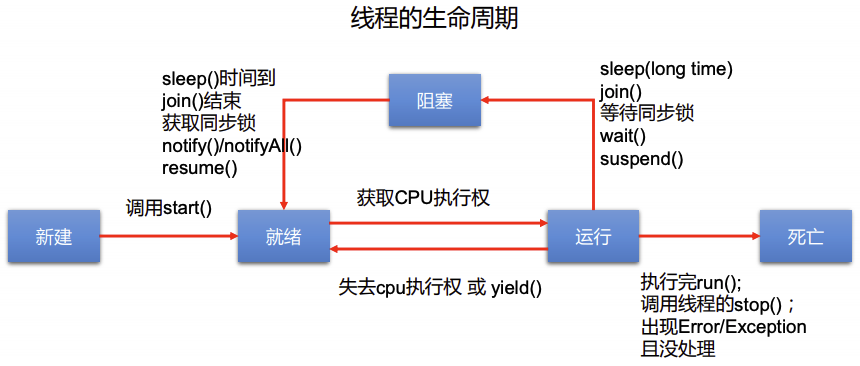

# 多线程

## 基本概念

**程序**（program）是为完成特定任务、用某种语言编写的一组指令的集合。即指一段**静态的**代码，静态对象。

**进程**（process）**是程序的一次执行过程，或是正在运行的一个程序**。是一个动态的过程，有它自身的产生、存在和消亡的进程，即生命周期。

* 例如运行中的微信、VSCode 等；
* 程序是静态的，而进程是动态的；
* **进程是资源分配的单位**，系统在运行时会为每个进程分配不同的内存区域（堆和方法区）。

**线程**（thread）**是程序内部的一条执行路径**。

* 若一个进程同一时间**并行**执行多个线程，就是支持多线程的；
* **线程是调度和执行的单位**，每个线程拥有独立的运行栈和程序计数器，线程切换的开销很小；
* 一个进程中的多个线程共享相同的内存单元，它们从同一堆中分配对象，可以访问相同的变量和对象。**这就使得线程间通信更简便、高效，但多个线程操作共享的系统资源可能就会带来安全的隐患。**

单核 CPU 和 多核 CPU：

* 单核 CPU，其实是一种假的多线程，因为在一个时间单元内，也只能执行一个线程的任务；
* 多核 CPU，才能更好的发挥多线程的效率；
* 一个 Java 程序，**至少有三个线程**：main() 主线程、gc() 垃圾回收线程、异常处理线程。当发生异常时，会影响主线程。

并行和并发：

* 并行：多个 CPU 同时执行多个任务，比如多个人同时做不同的事。
* 并发：一个 CPU（采用时间片） 同时执行多个任务，比如多个人“同时”做相同的事。

使用多线程的优点：

* 提高应用程序的响应，对图形化界面更有意义，可增强用户体验；
* 提高计算机系统 CPU 的利用率；
* 改善程序结构，将既长又复杂的进程分为多个线程，独立运行，利于理解和修改。

何时需要多线程：

* 程序需要同时执行两个或多个任务；
* 程序需要实现一些需要等待的任务时，如用户输入、文件读写操作、网络操作、搜索等；
* 需要一些后台运行的程序时。

## 线程的创建和使用

Java 语言的 JVM 允许程序运行多个线程，它通过 java.lang.Thread 类来体现。这个类的特征：

* 每个线程都是通过某个特定 Thread 对象的 run() 方法来完成操作的，经常把 run() 方法的主题称为**线程体**；
* 通过该 Thread 对象的 start() 方法来启动这个线程，而非直接调用 run() 。

**多线程的创建方式一**：继承 Thread 类

* 创建一个继承于 Thread 类的子类；
* 重写 Thread 类的 run() 方法，并将线程执行的操作声明在 run() 中；
* 创建 Thread 类的子类的对象；
* 调用此对象的 start() 方法；
  * 启动当前线程；
  * JVM 调用当前线程的 run() 。

```java
package com.parzulpan.java;

/**
 * @Author : parzulpan
 * @Time : 2020-11-23
 * @Desc : 多线程的创建方式一：继承 Thread 类
 * 创建两个子线程，让其中一个线程输出1-1000之间的偶数，另一个线程输出1-1000之间的奇数。
 */

public class ThreadTest {
    public static void main(String[] args) {
        MyThread myThread = new MyThread("偶数线程",0);
        MyThread myThread1 = new MyThread("奇数线程",1);
        myThread.start();
        myThread1.start();

        for (int i = 0; i < 100; i++) {
            if (i % 2 == 0) {
                System.out.println("主线程"  + Thread.currentThread().getName() + " " + i);
            }
        }
    }
}

class MyThread extends Thread {
    private int flag;
    private String msg;

    public MyThread(String msg, int flag) {
        super();
        this.msg = msg;
        this.flag = flag;
    }

    @Override
    public void run() {
        for (int i = 0; i < 1000; i++) {
            if (i % 2 == flag) {
                System.out.println(msg + Thread.currentThread().getName()  + " " + i);
            }
        }
    }
}
```

创建方式一的**注意**问题：

* 不能直接调用 run() 去启动线程；
* 不能让已经 start() 的线程 再去 start()，会报 IllegalThreadStateException。

Thread 类的有关方法：

* 构造器 Thread()：创建新的 Thread 对象；
* 构造器 Thread(String threadname)：创建线程并指定线程实例名；
* 构造器 Thread(Runnable target)：指定创建线程的目标对象，它实现了 Runable 接口中的 run()；
* 构造器 Thread(Runnable target, String name)：创建新的 Thread 对象，并指定线程实例名和目标对象；
* start()：启动当前线程，调用当前线程的 run()；
* run()：通常需要重写 Thread 类中的此方法，将创建的线程要执行的操作声明在此方法中；
* currentThread()：静态方法，返回执行当前代码的线程；
* getName()：获取当前线程的名字；
* setName()：设置当前线程的名字；
* yield()：释放当前 CPU 的执行权，线程让步。
  * 暂停当前正在执行的线程，把执行机会让给优先级相同或更高的线程；
  * 若队列中没有同优先级的线程，忽略此方法。
* join()：在线程 A 中调用线程 B 的 join()，此时线程 A 就进入 阻塞状态，直到线程 B 完全执行完以后，线程 A 才结束阻塞状态。低优先级的线程也可以获得执行。
* stop()：**Deprecated 已过时**。当执行此方法时，强制结束当前线程。
* sleep()：令当前活动线程在指定时间段内放弃对 CPU 控制，使其他线程有机会被执行，时间到后重新排队。会抛出 InterruptedException 异常，**只能用 try-catch-finally 处理异常**，不能使用 throws，因为 run() 没有 throws 异常，重写方法不能抛出比被重写方法范围更大的异常类型。这是因为多态性存在的缘故。
* isAlive()：判断线程是否还活着。

线程的调度：

* 调度策略：
  * 时间片；
  * 抢占式，高优先级的线程抢占 CPU；
* 调度方法：
  * 同优先级线程组成先进先出队列（先到先服务），使用时间片策略；
  * 对高优先级，使用优先调度的抢占式策略；

线程的优先级：

* 优先级等级：
  * MAX_PRIORITY：10；
  * MIN _PRIORITY：1；
  * NORM_PRIORITY：5；
* 涉及的方法：
  * getPriority()：返回线程优先值；
  * setPriority(int newPriority)：改变线程的优先级。
* **说明**：
  * 线程创建时继承父线程的优先级；
  * 低优先级只是获得调度的概率低，并非一定是在高优先级线程之后才被调用。

**多线程的创建方式二**：实现 Runnable 接口

* 定义子类，实现 Runnable 接口；
* 子类中重写 Runnable 接口中的 run()；
* 通过 Thread 类含参构造器创建线程对象；
* 将 Runnable 接口的子类对象作为实际参数传递给 Thread 类的构造器中；
* 调用 Thread 类的 start()，开启线程，**调用 Runnable 子类接口**的 run()。

```java
package com.parzulpan.java;

/**
 * @Author : parzulpan
 * @Time : 2020-11-23
 * @Desc : 多线程的创建方式二：实现 Runnable 接口
 */

public class ThreadTest1 {
    public static void main(String[] args) {
        // 3.
        MyThreadA myThreadA = new MyThreadA();
        // 4.
        Thread thread1 = new Thread(myThreadA);
        // 5.
        thread1.setName("线程1");
        thread1.start();

        Thread thread2 = new Thread(myThreadA);
        // 5.
        thread2.setName("线程2");
        thread2.start();
    }
}

// 1.
class MyThreadA implements Runnable {
    // 2.
    @Override
    public void run() {
        for (int i = 0; i < 100; i++) {
            if (i % 2 == 0) {
                System.out.println(Thread.currentThread().getName()  + ": " + i);
            }
        }
    }
}
```

**继承方式和实现方式的区别和联系**：

* 继承 Thread：线程代码存放在 Thread 子类 run 方法中；
* 实现 Runnable：线程代码存放在接口的子类的 run 方法中。
* 开发中，优先选择 **实现 Runnable** 的方式：
  * 实现的方式没有类的单继承的局限性；
  * 实现的方式更适合来处理多个线程有共享数据的情况。

线程的分类：一种是**守护线程**，一种是**用户线程**。

* 它们在几乎每个方面都是相同的，唯一的区别是判断JVM何时离开；
* 守护线程是用来服务用户线程的，通过在 start() 方法前调用 thread.setDaemon(true) 可以把一个用户线程变成一个守护线程；
* Java 垃圾回收就是一个典型的守护线程；
* 若 JVM 中都是守护线程，当前 JVM 将退出。

## 线程的生命周期

JDK 中用 Thread.State 类定义了线程的几种状态。

线程的一个完整生命周期中通常要经历五个状态：

* **新建**：当一个 Thread 类或其子类的对象被声明并创建时，新生的线程对象处于新建状态；
* **就绪**：处于新建状态的线程被 start() 后，将进入线程队列等待 CPU 时间片，此时它已经具备了运行的条件，只是没分配到 CPU 资源；
* **运行**：处于就绪的线程被调度并获得 CPU 资源时，便进入了运行状态，run() 方法定义了线程的操作和功能；
* **阻塞**：在某种特殊情况下，被人为挂起或执行输入输出操作时，让出 CPU 并临时中止自己的执行，进入阻塞状态；
* **死亡**：线程 完成了它的全部工作 或 线程被提前强制性地中止 或 出现异常 导致结束。

线程的生命周期：



## 线程的同步

多线程会出现安全问题。

问题的原因：当多条语句在操作同一个线程共享数据时，一个线程对多条语句只执行了一部分，还没有执行完，另一个线程参与进来执行，导致共享数据的错误。

解决方法：对多条操作共享数据的语句，只能让一个线程都执行完，在执行过程中，其他线程不可以参与执行。

**同步机制** 是 Java 对于多线程的安全问题提供的专业解决方式。

方式一：**同步代码块**

```java
synchronixed(同步监视器) {
    // 需要被同步的代码
}

// 说明：操作共享数据的代码，即为需要被同步的代码。
// 共享数据即为多个线程共同操作的数据。
// 同步监视器，俗称锁。任何一个类的对象，都可以充当锁。要求多个线程必须要公用同一把锁。
```

```java
package com.parzulpan.java;

/**
 * @Author : parzulpan
 * @Time : 2020-11-23
 * @Desc : 多线程的创建方式二：实现 Runnable 接口
 * 线程的同步 - 同步代码块，解决线程同步（安全）的问题
 */

public class WindowTest2 {
    public static void main(String[] args) {
        Window2 window2 = new Window2();
        Thread thread1 = new Thread(window2);
        thread1.setName("窗口1");
        Thread thread2 = new Thread(window2);
        thread2.setName("窗口2");
        Thread thread3 = new Thread(window2);
        thread3.setName("窗口3");
        thread1.start();
        thread2.start();
        thread3.start();

    }
}

class Window2 implements Runnable {
    private int ticket = 100;
    private final Object object = new Object();

    @Override
    public void run() {
        while (true) {
            // 正确
//            synchronized (this) {
                // 正确
            synchronized (object) {
                if (ticket > 0) {
                    try {
                        Thread.sleep(100);
                    } catch (InterruptedException e) {
                        e.printStackTrace();
                    }
                    System.out.println(Thread.currentThread().getName() + "：卖票，票号为：" + ticket);
                    --ticket;
                } else {
                    break;
                }
            }
        }
    }
}
```

```java
package com.parzulpan.java;

/**
 * @Author : parzulpan
 * @Time : 2020-11-23
 * @Desc : 多线程的创建方式一：继承 Thread 类
 * 线程的同步 - 同步代码块，解决线程同步（安全）的问题
 */

public class WindowTest3 {
    public static void main(String[] args) {
        Window3 window1 = new Window3("窗口1");
        Window3 window2 = new Window3("窗口2");
        Window3 window3 = new Window3("窗口3");
        window1.start();
        window2.start();
        window3.start();
    }
}

class Window3 extends Thread {
    // static
    private static int ticket = 100;
    private static Object object = new Object();

    Window3(String name) {
        super(name);
    }

    @Override
    public void run() {
        super.run();
        while (true) {
            // 错误，因为 this 代表 window1 window2 window3 三个对象
//            synchronized (this) {
            // 正确，因为 Class clazz = Window3.class，Window3 只会加载一次
            synchronized (Window3.class) {
            // 正确
//            synchronized (object) {
                if (ticket > 0) {
                    try {
                        Thread.sleep(100);
                    } catch (InterruptedException e) {
                        e.printStackTrace();
                    }
                    System.out.println(getName() + "：卖票，票号为：" + ticket);
                    --ticket;
                } else {
                    break;
                }
            }

        }
    }
}
```

同步的方式，解决了线程的安全问题。但是操作同步代码时，只能有一个线程参与，其他线程等待，相当于一个单线程的过程，效率低。

方法二：**同步方法**

```java
public synchronized void show (String name){
    //
}
```

```java
package com.parzulpan.java;

/**
 * @Author : parzulpan
 * @Time : 2020-11-23
 * @Desc : 多线程的创建方式二：实现 Runnable 接口
 * 线程的同步 - 同步方法，解决线程同步（安全）的问题
 */

public class WindowTest4 {
    public static void main(String[] args) {
        Window4 window4 = new Window4();
        Thread thread1 = new Thread(window4);
        thread1.setName("窗口1");
        Thread thread2 = new Thread(window4);
        thread2.setName("窗口2");
        Thread thread3 = new Thread(window4);
        thread3.setName("窗口3");
        thread1.start();
        thread2.start();
        thread3.start();

    }
}

class Window4 implements Runnable {
    private int ticket = 100;

    @Override
    public void run() {    //  同步监视器为 this
        while (true) {
            show();
        }
    }

    private synchronized void show() {
        if (ticket > 0) {
            try {
                Thread.sleep(100);
            } catch (InterruptedException e) {
                e.printStackTrace();
            }
            System.out.println(Thread.currentThread().getName() + "：卖票，票号为：" + ticket);
            --ticket;
        }
    }
}
```

```java
package com.parzulpan.java;

/**
 * @Author : parzulpan
 * @Time : 2020-11-23
 * @Desc : 多线程的创建方式一：继承 Thread 类
 * 线程的同步 - 同步方法，解决线程同步（安全）的问题
 */

public class WindowTest5 {
    public static void main(String[] args) {
        Window5 window1 = new Window5("窗口1");
        Window5 window2 = new Window5("窗口2");
        Window5 window3 = new Window5("窗口3");
        window1.start();
        window2.start();
        window3.start();
    }
}

class Window5 extends Thread {
    // static
    private static int ticket = 100;

    Window5(String name) {
        super(name);
    }

    @Override
    public void run() {
        super.run();
        while (true) {
            show();
        }
    }

    private static synchronized void show() {  // 正确，同步监视器为 Window5.class
//    private synchronized void show() {  // 错误，同步监视器为 window1 window2 window3
        if (ticket > 0) {
            try {
                Thread.sleep(100);
            } catch (InterruptedException e) {
                e.printStackTrace();
            }
            System.out.println(Thread.currentThread().getName() + "：卖票，票号为：" + ticket);
            --ticket;
        }
    }
}
```

[线程安全的单例模式之懒汉式](../../code/ch06/src/com/parzulpan/java/BankTest.java)

线程的死锁问题：

* 死锁：不同的线程分别占用对方需要的同步资源不放弃，都在等待对方放弃自己需要的同步资源，就形成了线程的死锁。出现死锁后，不会出现异常，不会出现提示，只是所有的线程都处于阻塞状态，无法继续。
* 解决方法：专门的算法、原则；尽量减少同步资源的定义；尽量避免嵌套同步。

[线程死锁的例子](../../code/ch06/src/com/parzulpan/java/DeadLock.java)

方法三：**Lock 锁，JDK5新增**

java.util.concurrent.locks.Lock **接口**是控制多个线程对共享资源进行访问的工具。锁提供了对共享资源的独占访问，每次只能有一个线程对 Lock 对象加锁，线程开始访问共享资源之前应先获得 Lock 对象。ReentrantLock 类实现了 Lock ，它拥有与 synchronized 相同的并发性和内存语义，在实现线程安全的控制中，比较常用的是 ReentrantLock，可以显式加锁、释放锁。

```java
package com.parzulpan.java;

import java.util.concurrent.locks.ReentrantLock;

/**
 * @Author : parzulpan
 * @Time : 2020-11-23
 * @Desc : 方法二：Lock 锁，JDK5新增
 */

public class LockTest {
    public static void main(String[] args) {
        Window6 window1 = new Window6();
        Thread thread1 = new Thread(window1);
        thread1.setName("窗口1");
        Thread thread2 = new Thread(window1);
        thread2.setName("窗口2");
        Thread thread3 = new Thread(window1);
        thread3.setName("窗口3");
        thread1.start();
        thread2.start();
        thread3.start();
    }
}

class Window6 implements Runnable {
    private int ticket = 100;
    private final ReentrantLock lock = new ReentrantLock(true); // fair 为 true 代表公平锁，为 false 代表不公平锁，默认为 false

    @Override
    public void run() {
        while (true) {
            lock.lock();
            try {
                if (ticket > 0) {
                    try {
                        Thread.sleep(100);
                    } catch (InterruptedException e) {
                        e.printStackTrace();
                    }
                    System.out.println(Thread.currentThread().getName() + "：卖票，票号为：" + ticket);
                    --ticket;
                } else {
                    break;
                }
            } finally {
                lock.unlock();
            }
        }
    }
}
```

synchronized 与 Lock 的对比

* Lock 是显式锁，手动开启和关闭锁。而 synchronied 式隐式锁，出了作用域自动释放；
* Lock 只有代码块锁。而 synchronized 有代码块锁和方法锁；
* 使用 Lock 锁，JVM 将花费较少的时间来调度线程，性能更好，并且具有更好的扩展性。

优先使用顺序：Lock -> 同步代码块（已经进入了方法体，分配了相应资源）-> 同步方法（在方法体之外）

## 线程的通信

线程通信的有关方法：

* wait()：一旦执行此方法，当前线程就进入阻塞状态，并释放同步监视器；
* notify()：一旦执行此方法，就会唤醒被 wait 的一个线程，如果有多个线程被 wait，就唤醒优先级最高的那个；
* notifyAll()：一旦执行此方法，就会唤醒所有被 wait 的线程。

**注意**：

* 这三个方法只有在 synchronized 方法 或 synchronized 代码块 中才能使用，否则会报 java.lang.IllegalMonitorStateException 异常；
* 这三个方法的调用者必须是同步代码块或者同步方法中的同步监视器，否则会报 java.lang.IllegalMonitorStateException 异常；
* 这三个方法是定义在 java.lang.Object 类中。

```java
package com.parzulpan.java;

/**
 * @Author : parzulpan
 * @Time : 2020-11-23
 * @Desc : 线程通信的例子：使用两个线程打印 1-100。线程1, 线程2 交替打印
 */

public class CommunicationTest {
    public static void main(String[] args) {
        Communication communication = new Communication();
        Thread thread1 = new Thread(communication);
        Thread thread2 = new Thread(communication);
        thread1.setName("线程1");
        thread2.setName("线程2");
        thread1.start();
        thread2.start();
    }
}

class Communication implements Runnable {
    private int number = 1;

    @Override
    public void run() {
        while (true) {
            synchronized (this) {
                notify();

                if (number <= 100) {
                    System.out.println(Thread.currentThread().getName() + ":" + number++);
                } else {
                    break;
                }

                try {
                    wait();
                } catch (InterruptedException e) {
                    e.printStackTrace();
                }
            }
        }
    }
}

```

## JDK5 新增线程创建方式

**多线程的创建方式三**：实现 Callable 接口

与使用 Runnable 相比， Callable 功能更强大些：

* 相比 run() 方法，可以有返回值；
* 方法可以抛出异常；
* 支持泛型的返回值；
* 需要借助 FutureTask 类，比如获取返回结果。

**Future 接口：**

* 可以对具体 Runnable、Callable 任务的执行结果进行取消、查询是否完成、获取结果等；
* FutrueTask 是 Futrue 接口的唯一的实现类；
* FutureTask 同时实现了 Runnable, Future 接口。它既可以作为 Runnable 被线程执行，又可以作为 Future 得到 Callable 的返回值。

```java
package com.parzulpan.java;

import java.util.concurrent.Callable;
import java.util.concurrent.ExecutionException;
import java.util.concurrent.FutureTask;

/**
 * @Author : parzulpan
 * @Time : 2020-11-23
 * @Desc : 多线程的创建方式三：实现 Callable 接口
 */

public class NumberThreadTest {
    public static void main(String[] args) {
        // 3. 创建 Callable 接口实现类的对象
        NumberThread numberThread = new NumberThread();

        // 4. 将此 Callable 接口实现类的对象传递到 FutureTask 构造器中，创建 FutureTask 对象
//        FutureTask futureTask = new FutureTask(numberThread);
        FutureTask<Integer> futureTask = new FutureTask<Integer>(numberThread);

        // 5. 将 FutureTask 对象传递到 Thread 构造器中，创建 Thread 对象，并 start() 启动
        Thread thread = new Thread(futureTask);
        thread.start();

        try {
            // 6. 获取 Callable 中 call 方法的返回值
            // get() 返回值 即为 FutureTask 构造器参数 Callable 实现类重写的 call() 返回值
//            Object sum = futureTask.get();
            Integer sum = futureTask.get();

            System.out.println("偶数和为：" + sum);
        } catch (InterruptedException | ExecutionException e) {
            e.printStackTrace();
        }
    }
}

// 1. 创建一个实现 Callable 的实现类
class NumberThread implements Callable<Integer> {

    // 2. 实现 call() ，将此线程需要执行的操作声明在 call() 中
    @Override
    public Integer call() throws Exception {
        int sum = 0;
        for (int i = 0; i < 100; i++) {
            if (i % 2 == 0) {
                System.out.println(i);
                sum += i;
            }
        }

        return sum;
    }
}
```

**多线程的创建方式四**：使用线程池

**重要！！！**

**背景**：经常创建和销毁、使用量特别大的资源，比如并发情况下的线程，
对性能影响很大。

**思路**：提前创建好多个线程，放入线程池中，使用时直接获取，使用完放回池中。可以避免频繁创建销毁、实现重复利用。类似生活中的**公共交通工具**。

**好处**：

* 提高响应速度（减少了创建新线程的时间）；
* 降低资源消耗（重复利用线程池中线程，不需要每次都创建）；
* 便于线程管理。
  * corePoolSize：核心池的大小；
  * maximumPoolSize：最大线程数；
  * keepAliveTime：线程没有任务时最多保持多长时间后会终止；
  * ...

JDK5 起提供了线程池相关 API：**ExecutorService** 和 **Executors**。

ExecutorService：真正的线程池接口，常见子类 **ThreadPoolExecutor**

* `void execute(Runnable command)`：执行任务/命令，没有返回值，一般用来执行 Runnable；
* `<T> Future<T> submit(Callable<T> task)`：执行任务，有返回值，一般又来执行 Callable；
* `void shutdown()` ：**关闭连接池**。

Executors：工具类、线程池的工厂类，用于创建并返回不同类型的线程池

* `Executors.newCachedThreadPool()`：创建一个可根据需要创建新线程的线程池；
* `Executors.newFixedThreadPool(n)`：创建一个可重用固定线程数的线程池；
* `Executors.newSingleThreadExecutor()`：创建一个只有一个线程的线程池；
* `Executors.newScheduledThreadPool(n)`：创建一个线程池，它可安排在给定延迟后运行命令或者定期地执行。

```java
package com.parzulpan.java;

import java.util.concurrent.Callable;
import java.util.concurrent.ExecutorService;
import java.util.concurrent.Executors;
import java.util.concurrent.ThreadPoolExecutor;

/**
 * @Author : parzulpan
 * @Time : 2020-11-23
 * @Desc : 多线程的创建方式四：使用线程池
 */

public class ThreadPool {
    public static void main(String[] args) {
        ExecutorService executorService = Executors.newFixedThreadPool(10);
        ThreadPoolExecutor threadPoolExecutor = (ThreadPoolExecutor) executorService;

        threadPoolExecutor.setCorePoolSize(15);

        executorService.execute(new OddNumThread());
        executorService.execute(new EvenNumThread());

        executorService.execute(new Runnable() {
            @Override
            public void run() {
                for (int i = 0; i < 100; i++) {
                    System.out.println(Thread.currentThread().getName() + ": " + i);
                }
            }
        });

        executorService.submit(new Callable<Integer>() {

            @Override
            public Integer call() throws Exception {
                for (int i = 0; i < 100; i++) {
                    System.out.println(Thread.currentThread().getName() + ": " + i);
                }
                return null;
            }
        });

        executorService.shutdown();

    }
}

class OddNumThread implements Runnable {

    @Override
    public void run() {
        for (int i = 0; i < 100; i++) {
            if (i % 2 != 0) {
                System.out.println(Thread.currentThread().getName() + ": " + i);
            }
        }
    }
}

class EvenNumThread implements Runnable {
    @Override
    public void run() {
        for (int i = 0; i < 100; i++) {
            if (i % 2 == 0) {
                System.out.println(Thread.currentThread().getName() + ": " + i);
            }
        }
    }
}
```

## 练习和总结

---

**模拟火车站售票程序，开启三个窗口售票。**

[多线程的创建方式一：继承 Thread 类](../../code/ch06/src/com/parzulpan/java/WindowTest.java)

[多线程的创建方式二：实现 Runnable 接口](../../code/ch06/src/com/parzulpan/java/WindowTest1.java)

---

**银行有一个账户。有两个储户分别向同一个账户存3000元，每次存1000，存3次。每次存完打印账户余额。**

```java
package com.parzulpan.exer;

import java.util.concurrent.locks.ReentrantLock;

/**
 * @Author : parzulpan
 * @Time : 2020-11-23
 * @Desc : 银行有一个账户。
 * 银行有一个账户。有两个储户分别向同一个账户存3000元，每次存1000，存3次。每次存完打印账户余额。
 * 分析：
 * 1. 是否是多线程问题？ 是，两个储户线程
 * 2. 是否有共享数据？ 有，账户（账户余额）
 * 3. 该程序是否有安全问题，如果有，如何解决？ 有，使用同步机制，有三种方式。
 */

public class AccountTest {
    public static void main(String[] args) {
        Account account = new Account(0);

//        Customer customer1 = new Customer(account);
//        Customer customer2 = new Customer(account);
//        customer1.setName("甲");
//        customer2.setName("乙");
//        customer1.start();
//        customer2.start();

        CustomerA customerA1 = new CustomerA(account);
        Thread thread1 = new Thread(customerA1);
        Thread thread2 = new Thread(customerA1);
        thread1.setName("甲");
        thread2.setName("乙");
        thread1.start();
        thread2.start();
    }
}


class Account {
    private double balance;
    private static final ReentrantLock lock = new ReentrantLock(true);  // 如果有多个 Account，这里的 lock 最好为 static

    public Account(double balance) {
        this.balance = balance;
    }

    // 存钱，线程不同步（安全）
    public void deposit(double amt) {
        if (amt > 0) {
            this.balance += amt;

            try {
                Thread.sleep(1000);
            } catch (InterruptedException e) {
                e.printStackTrace();
            }

            System.out.println(Thread.currentThread().getName() + ": 存钱成功。余额为：" + this.balance);
        }
    }

    // 线程的同步 - 同步代码块，解决线程同步（安全）的问题
    public void deposit1(double amt) {
        synchronized (this) {   //  同步监视器为 this
            if (amt > 0) {
                this.balance += amt;

                try {
                    Thread.sleep(1000);
                } catch (InterruptedException e) {
                    e.printStackTrace();
                }

                System.out.println(Thread.currentThread().getName() + ": 存钱成功。余额为：" + this.balance);
            }
        }

    }

    // 线程的同步 - 同步方法，解决线程同步（安全）的问题
    public synchronized void deposit2(double amt) {     //  同步监视器为 this，此时为一个 Account。
                                                        // 注意：在继承 Thread 类创建多线程时，要慎用 this
        if (amt > 0) {
            this.balance += amt;

            try {
                Thread.sleep(1000);
            } catch (InterruptedException e) {
                e.printStackTrace();
            }

            System.out.println(Thread.currentThread().getName() + ": 存钱成功。余额为：" + this.balance);
        }
    }

    // 线程的同步 - Lock，解决线程同步（安全）的问题
    public void deposit3(double amt) {
        lock.lock();
        try {
            if (amt > 0) {
                this.balance += amt;

                try {
                    Thread.sleep(1000);
                } catch (InterruptedException e) {
                    e.printStackTrace();
                }

                System.out.println(Thread.currentThread().getName() + ": 存钱成功。余额为：" + this.balance);
            }
        } finally {
            lock.unlock();
        }
    }
}

// 多线程的创建方式一：继承 Thread 类
class Customer extends Thread {
    private Account account;

    public Customer(Account account) {
        this.account = account;
    }

    @Override
    public void run() {

        for (int i = 0; i < 3; i++) {
//            account.deposit(1000);
//            account.deposit1(1000);
//            account.deposit2(1000);
            account.deposit3(1000);
        }
    }
}

// 多线程的创建方式二：实现 Runnable 接口
class CustomerA implements Runnable {
    private Account account;

    public CustomerA(Account account) {
        this.account = account;
    }

    @Override
    public void run() {
        for (int i = 0; i < 3; i++) {
//            account.deposit(1000);
//            account.deposit1(1000);
//            account.deposit2(1000);
            account.deposit3(1000);
        }
    }
}
```

---

**sleep() 和 wait() 的异同？**

相同点：一旦执行方法，都可以使得当前的线程进入阻塞状态。

不同点：1. 声明的位置不同：sleep() 声明在 Thread 类中。wait() 声明在 Object 类中。2. 调用的要求不同：sleep() 可以在任何场景下调用。wait() 必须在 同步代码块或同步方法中调用。3. 释放同步监视器不同：如果都在同步代码块或同步方法中调用，sleep() 不会释放锁，wait() 会释放锁。

---

**生产者/消费者问题？**

```java
package com.parzulpan.exer;

/**
 * @Author : parzulpan
 * @Time : 2020-11-23
 * @Desc : 线程通信应用：生产者/消费者问题
 * 生产者(Producer)将产品交给店员(Clerk)，而消费者(Customer)从店员处取走产品，店员一次只能持有固定数量的产品(比如:20），
 * 如果生产者试图生产更多的产品，店员会叫生产者停一下，如果店中有空位放产品了再通知生产者继续生产；
 * 如果店中没有产品了，店员会告诉消费者等一下，如果店中有产品了再通知消费者来取走产品。
 * 1. 是否是多线程问题？ 是，生产者线程、消费者线程
 * 2. 是否共享数据？ 是，店员（产品）
 * 3. 是否有安全问题，如果有，如何解决？ 有，使用同步机制，有三种方式。
 * 4. 是否有线程通信？是
 */

public class ProductTest {
    public static void main(String[] args) {
        Clerk clerk = new Clerk();

        Producer producer = new Producer(clerk);
        Consumer consumer = new Consumer(clerk);
        Thread thread1 = new Thread(producer);
        Thread thread2 = new Thread(consumer);
        Thread thread3 = new Thread(consumer);
        thread1.setName("生产者");
        thread2.setName("消费者1");
        thread3.setName("消费者2");
        thread1.start();
        thread2.start();
        thread3.start();

    }
}

// 售货员
class Clerk {
    private int product;

    public synchronized void addProduct() {
        if (product >= 20) {
            try {
                wait();
            } catch (InterruptedException e) {
                e.printStackTrace();
            }
        } else {
            ++product;
            System.out.println(Thread.currentThread().getName() + " 生产了第 " + product + " 个产品");
            notifyAll();
        }

    }

    public synchronized void removeProduct() {
        if (product <= 0) {
            try {
                wait();
            } catch (InterruptedException e) {
                e.printStackTrace();
            }
        } else {
            System.out.println(Thread.currentThread().getName() + " 消费了第 " + product + " 个产品");
            --product;
            notifyAll();
        }

    }

}

// 生产者
class Producer implements Runnable {
    private Clerk clerk;

    Producer(Clerk clerk) {
        this.clerk = clerk;
    }

    @Override
    public void run() {
        System.out.println(Thread.currentThread().getName() + " 开始生产产品");
        while (true) {
            try {
                Thread.sleep((long) (Math.random() * 500));
            } catch (InterruptedException e) {
                e.printStackTrace();
            }
            this.clerk.addProduct();
        }
    }
}

// 消费者
class Consumer implements Runnable {
    private Clerk clerk;

    Consumer(Clerk clerk) {
        this.clerk = clerk;
    }

    @Override
    public void run() {
        System.out.println(Thread.currentThread().getName() + " 开始消费产品");
        while (true) {
            try {
                Thread.sleep((long) (Math.random() * 1000));
            } catch (InterruptedException e) {
                e.printStackTrace();
            }
            this.clerk.removeProduct();
        }
    }
}
```

---
