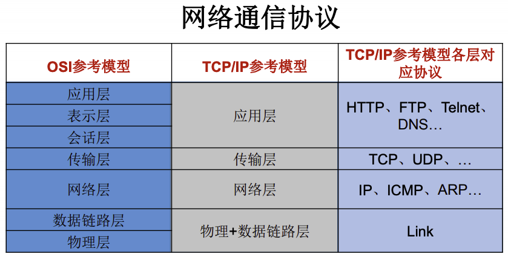
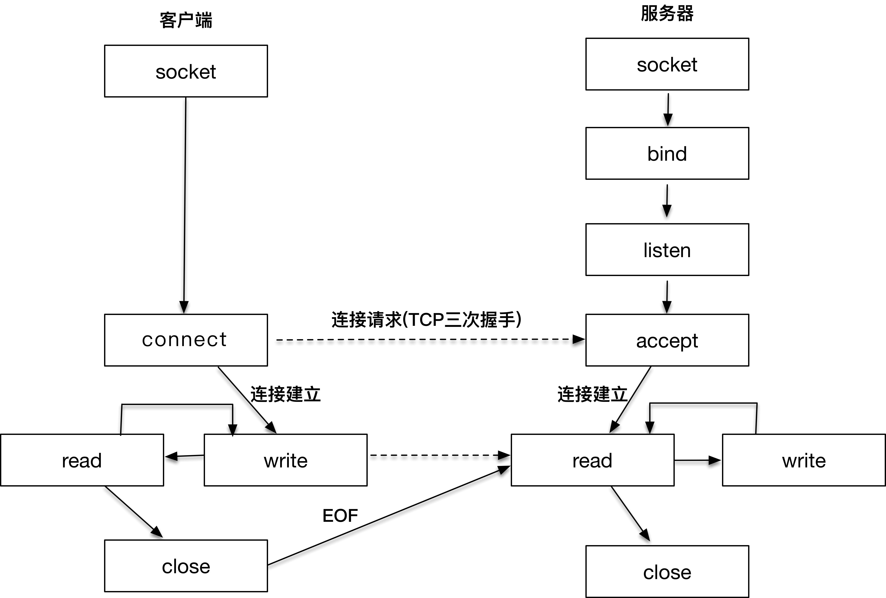
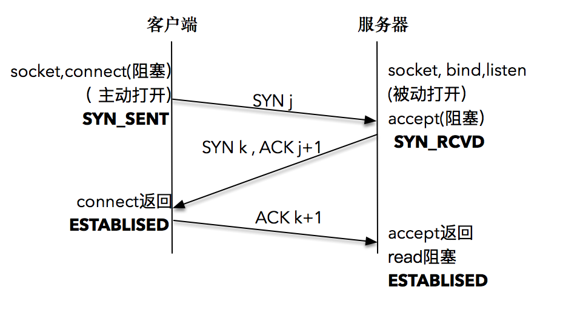

# 网络编程

## 网络编程概述

网络编程的目的：直接或简洁地通过网络协议与其他计算机实现数据交换，进行通讯。

网络编程的两个主要问题：

* 如果准确地定位网络上一台或多台主机，并定位主机上的特定应用；
* 找到主机后如何可靠高效地进行数据传输。

## 网络通信要素概述

通信双方地址：

* IP
* Port

网络协议：

* OSI 参考模型：模型过于理想化，未能在因特网上进行广泛推广
* TCP / IP 参考模型：事实上的国际标准



## 通信要素1：IP&Port

**IP 地址（InetAddress）**：

* 唯一的标识 Internet 上的计算机（通信实体）；
* 本地回环地址（hostAddress）：`127.0.0.1`、主机名（hostName）：`localhost`
* IP 地址分类方式1：IPV4 和 IPV6
  * IPV4：4个字节组成，以点分十进制表示，如 192.168.0.1
  * IPV6：16个字节组成，写成8个无符号整数，每个整数用四个十六进制位表示，如 3ffe:3201:1401:1280:c8ff:fe4d:db39:1984
* IP地址分类方式2：公网地址（万维网使用）和私有地址（局域网使用）

**Port**：

* 标识正在计算机上运行的进程（程序），不同的进程有不同的端口号；
* 被规定为一个 16 位的整数 0~65535；
* 端口分类：
  * **公认端口**：0~1023。被预先定义的服务通信占用（如：HTTP 占用端口
 80，FTP 占用端口 21，Telnet 占用端口 23）；
  * **注册端口**：1024~49151。分配给用户进程或应用程序。（如：Tomcat占用端口 8080，MySQL 占用端口 3306，Oracle 占用端口 1521）。
  * **私有端口**：49152~65535。

InetAddress 类没有提供公共的构造器，而是提供了如下几个静态方法来获取
 InetAddress 实例：

* `public static InetAddress getLocalHost()`
* `public static InetAddress getByName(String host)`

InetAddress 提供了如下几个常用的方法：

* `public String getHostAddress()`：返回 IP 地址字符串
* `public String getHostName()`：获取此 IP 地址的主机名
* `public boolean isReachable(int timeout)`：测试是否可以达到该地址

```java
package parzulpan.com.java;

import java.io.IOException;
import java.net.InetAddress;
import java.net.UnknownHostException;

/**
 * @Author : parzulpan
 * @Time : 2020-11-27
 * @Desc :
 */

public class InetAdressTest {
    public static void main(String[] args) {
        InetAddress inet1 = null;
        InetAddress inet2 = null;
        InetAddress inet3 = null;
        InetAddress inet4 = null;
        try {
            inet1 = InetAddress.getByName("www.parzulpan.cn");
            System.out.println(inet1);

            inet2 = InetAddress.getByName("61.135.185.32");
            System.out.println(inet2);

            inet3 = InetAddress.getByName("localhost");
            System.out.println(inet3);

            inet4 = InetAddress.getLocalHost();
            System.out.println(inet4);

            System.out.println(inet1.getHostAddress());
            System.out.println(inet1.getHostName());
            boolean reachable = false;
            try {
                reachable = inet1.isReachable(1000);
                System.out.println(reachable);
            } catch (IOException e) {
                e.printStackTrace();
            }
        } catch (UnknownHostException e) {
            e.printStackTrace();
        }
    }
}
```

## 通信要素2：网络协议

计算机网络中实现通信必须有一些约定，即通信协议（网络协议），对速率、传输代码、代码结构、传输控制步骤、出错控制等制定标准。

在制定协议时，把复杂成份分解成一些简单的成份，再将它们复合起来。最常
用的复合方式是层次方式，即同层间可以通信、上一层可以调用下一层，而与
再下一层不发生关系。各层互不影响，利于系统的开发和扩展。

**传输层协议**中有两个非常重要的协议：

* **传输控制协议 TCP**（Transmission Control Protocol）
* **用户数据报协议 UDP**（User Datagram Protocol）

**TCP/IP** 以其两个主要协议：**传输控制协议**（TCP）和 **网络互联协议**（IP，Internet Protocol，是**网络层**的主要协议，支持网间互连的数据通信）而得名，实际上是一组协议，包括多个具有不同功能且互为关联的协议。

**TCP/IP 协议模型**从更实用的角度出发，形成了高效的四层体系结构，即
物理链路层、网络层、传输层和应用层。

### Socket

客户端和服务器端工作的核心逻辑：



Socket：

* 网络上具有唯一标识的 IP地址 和 端口号 组合在一起才能构成唯一能识别的标识符套接字；
* 通信的两端都要有 Socket，是两台机器间通信的端点，网络通信其实就是 Socket 间的通信；
* Socket 允许程序把网络连接当成一个**流**，数据在两个 Socket 间通过 **IO 传输**；
* 一般主动发起通信的应用程序属客户端，等待通信请求的为服务端；
* 分类：
  * **流套接字**（stream socket）：使用 TCP 提供可依赖的**字节流**服务；
  * **数据报套接字**（datagram socket）：使用 UDP 提供“尽力而为”的**数据报**服务；

在 **Java** 中，

Socket 类的**常用构造器**：

* `public Socket(InetAddress address,int port)` 创建一个流套接字并将其连接到指定 IP 地址的指定端口号。
* `public Socket(String host,int port)` 创建一个流套接字并将其连接到指定主机上的指定端口号。

Socket 类的**常用方法**：

* `public InputStream getInputStream()` 返回此套接字的输入流。可以用于接收网络消息
* `public OutputStream getOutputStream()` 返回此套接字的输出流。可以用于发送网络消息
* `public InetAddress getInetAddress()` 此套接字连接到的远程 IP 地址；如果套接字是未连接的，则返回 null
* `public InetAddress getLocalAddress()` 获取套接字绑定的本地地址。 即本端的IP地址
* `public int getPort()` 此套接字连接到的远程端口号；如果尚未连接套接字，则返回 0
* `public int getLocalPort()` 返回此套接字绑定到的本地端口。 如果尚未绑定套接字，则返回 -1。即本端的端口号
* `public void close()` 关闭此套接字。套接字被关闭后，便不可在以后的网络连接中使用（即无法重新连接或重新绑定）。需要创建新的套接字对象。 关闭此套接字也将会关闭该套接字的 InputStream 和OutputStream
* **`public void shutdownInput()`** 如果在套接字上调用 `shutdownInput()` 后从套接字输入流读取内容，则流将返回 EOF（文件结束符）。 即不能在从此套接字的输入流中接收任何数据
* **`public void shutdownOutput()`** 禁用此套接字的输出流。对于 TCP 套接字，任何以前写入的数据都将被发送，并且后跟 TCP 的正常连接终止序列。 如果在套接字上调用 `shutdownOutput()` 后写入套接字输出流，
则该流将抛出 IOException。 即不能通过此套接字的输出流发送任何数据

**直观的理解 Socket**：

* 把客户端和服务器工作想象成打电话，socket 就好比是我们的手机， connect 就好比是拿着手机拨号，服务器端的 bind 就好比是去电信公司开户，将号码和绑定，这样别人就可以通过号码联系你，listen 就好比是让手机处于可接听的状态，accept 就好比是被叫的一方拿起手机进行应答；
* 然后对方拨通手机号建立通话（connect），拨打电话的人说（write）：你好，接听电话的人听到（write）：并回答（write）你好。这样，就等同进入了 read/write 的数据传输过程；
* 最后，拨打电话的人完成了此次交流，挂上电话，对应的操作可以理解为 close，接听电话的人知道对方已挂机，也挂上电话，也是一次 close；
* 在整个通话过程中，手机是我们可以和外面通信的设备，对应到网络编程的世界里，socket 也是我们可以和外界进行网络通信的途径。

### TCP 三次握手

TCP三次握手过程：



**其中**：

* 确认ACK，仅当ACK=1时，确认号字段才有效。TCP规定，在连接建立后所有报文的传输都必须把ACK置1；
* 同步SYN，在连接建立时用来同步序号。当SYN=1，ACK=0，表明是连接请求报文，若同意连接，则响应报文中应该使SYN=1，ACK=1；
* 终止FIN，用来释放连接。当FIN=1，表明此报文的发送方的数据已经发送完毕，并且要求释放；
* 复位RST，当RST=1，表明TCP连接中出现严重差错，必须释放连接，然后再重新建立连接；

**解读**：

* 这里使用的网络编程模型都是阻塞式的。所谓阻塞式，就是调用发起后不会直接返回，由操作系统内核处理之后才会返回。相对的，还有一种叫做非阻塞式的。

* 最初的过程：服务器端通过 socket，bind 和 listen 完成了被动套接字的准备工作，被动的意思就是等着别人来连接，然后调用 accept，就会阻塞在这里，等待客户端的连接来临；客户端通过调用 socket 和 connect 函数之后，也会阻塞。接下来的事情是由操作系统内核完成的，更具体一点的说，是操作系统内核的网络协议栈在工作。

**具体的过程**：

* 客户端的协议栈向服务器端发送一个值为 j 的 SYN 包，客户端进入 SYN_SENT 状态；
* 服务器端的协议栈收到 SYN 包之后，服务器端发送一个值为 j + 1 的 ACK 应答包和 一个值为 k 的 SYN 包，服务器端进入 SYN_RCVD 状态；
* 客户端的协议栈收到 ACK+SYN 包之后，使得应用程序从 connect 调用返回，表示客户端到服务器端的单向连接建立成功，客户端进入 ESTABLISHED 状态，同时客户端协议栈向服务器端发送一个值为 k + 1 的 ACK 应答包；
* 服务器端的协议栈收到 ACK 应答包之后，使得 accept 阻塞调用返回，表示服务器端到客户端的单向连接也建立成功，服务器端进入 ESTABLISHED 状态。

**形象的比喻**：

* A 先对 B 说：“喂，你在么？我在的，我的口令是 j。”
* B 收到之后大声回答：“我收到你的口令 j 并准备好了，你准备好了吗？我的口令是 k。”
* A 收到之后也大声回答：“我收到你的口令 k 并准备好了，我们开始吧。”

### TCP 四次挥手

TCP四次挥手过程：


**具体的过程**：

* TCP 连接终止时，主机1 发送值为 m 的 FIN 包，主机1 进入 FIN_WAIT_1（终止等待1） 状态。
* 主机2 收到 FIN 包后，发送值为 m + 1 的 ACK 应答包，主机2 进入 CLOSE_WAIT（关闭等待）状态。注意，此时处于半关闭的状态，主机1 到主机2 的方向释放了，但是主机2 到主机1 的方向还正常，即主机2 依然能向主机1 发送数据且主机1 能接收。主机1 接收到 ACK 应答包后，主机1 进入 FIN_WAIT_2（终止等待2） 状态。
* 主机2 准备好关闭连接时，发送值为 n 的 FIN 包，主机2 进入 LAST_ACK（最后确认）状态，等待主机1 的确认。
* 主机1 收到 FIN 包后，发送值为 n + 1 的 ACK 应答包，主机1 进入 TIME_WAIT（时间等待） 状态。注意，此时 TCP 连接还没有释放，必须经过 2MSL（Maximum Segment Lifetime，最长报文段寿命）的时间后，才进入 CLOSED（关闭）状态。
* 主机2 接收到 ACK 应答包后，进入 CLOSED（关闭）状态。

## TCP 网络编程

TCP协议：

* 使用 TCP协议前，**须先建立**TCP连接，形成传输数据通道
* 传输前，采用“**三次握手**”方式，点对点通信，**是可靠的**
* TCP 协议进行通信的两个应用进程：客户端、服务端。
* 在连接中**可进行大数据量的传输**
* 传输完毕，需释放已建立的连接，**效率低**

**客户端**的工作过程包含以下四个基本的步骤：

* **创建 Socket**：根据指定服务端的 IP 地址或端口号构造 Socket 类对象。若服务器端响应，则建立客户端到服务器的通信线路。若连接失败，会出现异常。
  * 客户端程序可以使用 Socket 类创建对象，**创建的同时会自动向服务器方发起连接**。Socket的构造器是：
    * `Socket(String host,int port)throws UnknownHostException,IOException`：向服务器 (域名是 host。端口号为 port) 发起 TCP 连接，若成功，则创建Socket对象，否则抛出异常。
    * `Socket(InetAddress address,int port)throws IOException`：根据 InetAddress 对象所表示的 IP地址 以及 端口号port 发起连接。
* **打开连接到 Socket 的输入/输出流**： 使用 getInputStream()方法获得输入流，使用 getOutputStream() 方法获得输出流，进行数据传输。
* **按照一定的协议对 Socket 进行读/写操作**：通过输入流读取服务器放入线路的信息（但不能读取自己放入线路的信息），通过输出流将信息写入线程。
* **关闭 Socket**：断开客户端到服务器的连接，释放线路。

**服务器**的工作过程包含以下四个基本的步骤：

* **调用 ServerSocket(int port)**：创建一个服务器端套接字，并绑定到指定端口上。用于监听客户端的请求。
  * ServerSocket 对象负责等待客户端请求建立套接字连接，类似邮局某个窗口中的业务员。也就是说，服务器必须事先建立一个等待客户请求建立套接字连接的 ServerSocket 对象。
  * 所谓“接收”客户的套接字请求，就是accept()方法会返回一个 Socket 对象。
* **调用 accept()**：监听连接请求，如果客户端请求连接，则接受连接，返回通信套接字对象。
* **调用 该Socket类对象的 getOutputStream() 和 getInputStream ()**：获取输出流和输入流，开始网络数据的发送和接收。
* **关闭 ServerSocket 和 Socket 对象**：客户端访问结束，关闭通信套接字。

```java
package parzulpan.com.java;

import org.junit.Test;

import java.io.ByteArrayOutputStream;
import java.io.IOException;
import java.io.InputStream;
import java.io.OutputStream;
import java.net.InetAddress;
import java.net.ServerSocket;
import java.net.Socket;

/**
 * @Author : parzulpan
 * @Time : 2020-11-28
 * @Desc : TCP 网络编程
 * 例子1：客户端发送消息给服务端，服务端将数据显示在控制台上
 */

public class TCPTest {

    // 客户端
    @Test
    public void client() {
        Socket socket = null;
        OutputStream os = null;
        try {
            // 1. 创建 Socket 对象，指明服务器端的 IP 和 Port
            InetAddress inet = InetAddress.getByName("127.0.0.1");
            socket = new Socket(inet, 28888);

            // 2. 获取一个输出流，用于输出数据
            os = socket.getOutputStream();

            // 3. 写出数据
            os.write("我是客户端".getBytes());
        } catch (IOException e) {
            e.printStackTrace();
        } finally {
            // 4. 关闭资源
            try {
                if (os != null) {
                    os.close();
                }
                if (socket != null) {
                    socket.close();
                }
            } catch (IOException e) {
                e.printStackTrace();
            }
        }


    }

    // 服务端
    @Test
    public void server() {
        ServerSocket ss = null;
        Socket socket = null;
        InputStream is = null;
        ByteArrayOutputStream baos = null;
        try {
            // 1. 创建服务器端的 ServerSocket，指明自己的端口号
            ss = new ServerSocket(28888);

            // 2. 调用 accept() 表示接收到来自于客户端的 Socket
            socket = ss.accept();

            // 3. 获取一个输入流，用于输入数据
            is = socket.getInputStream();

            // 4. 读取数据
            baos = new ByteArrayOutputStream();
            byte[] buffer = new byte[5];
            int data;
            while ((data = is.read(buffer)) != -1) {
                baos.write(buffer, 0, data);
            }
            System.out.println(baos.toString());
            System.out.println("数据来自于：" + socket.getInetAddress().getHostAddress());
        } catch (IOException e) {
            e.printStackTrace();
        } finally {
            // 5. 关闭资源
            try {
                if (baos != null) {
                    baos.close();
                }
                if (is != null) {
                    is.close();
                }
                if (socket != null) {
                    socket.close();
                }
                if (ss != null) {
                    ss.close();
                }
            } catch (IOException e) {
                e.printStackTrace();
            }
        }
    }
}
```

```java
package parzulpan.com.java;

import org.junit.Test;

import java.io.*;
import java.net.InetAddress;
import java.net.ServerSocket;
import java.net.Socket;

/**
 * @Author : parzulpan
 * @Time : 2020-11-28
 * @Desc : TCP 网络编程
 * 例子2：客户端发送文件给服务端，服务端将文件保存在本地。
 */

public class TCPTest1 {

    @Test
    public void client() {
        Socket socket = null;
        OutputStream os = null;
        BufferedInputStream bis = null;
        try {
            // 1.
            socket = new Socket(InetAddress.getByName("127.0.0.1"), 29999);

            // 2.
            os = socket.getOutputStream();

            // 3.
            bis = new BufferedInputStream(new FileInputStream(new File("tcp.png")));

            // 4.
            byte[] buffer = new byte[1024];
            int data;h 
            while ((data = bis.read(buffer)) != -1) {
                os.write(buffer, 0, data);
            }
        } catch (IOException e) {
            e.printStackTrace();
        } finally {
            // 5.
            try {
                if (bis != null) {
                    bis.close();
                }
                if (os != null) {
                    os.close();
                }
                if (socket != null) {
                    socket.close();
                }
            } catch (IOException e) {
                e.printStackTrace();
            }
        }
    }

    @Test
    public void server() {
        ServerSocket ss = null;
        Socket socket = null;
        InputStream is = null;
        BufferedOutputStream bos = null;
        try {
            // 1.
            ss = new ServerSocket(29999);

            //2.
            socket = ss.accept();

            // 3.
            is = socket.getInputStream();

            // 4.
            bos = new BufferedOutputStream(new FileOutputStream(new File("tcpServer.png")));
            byte[] buffer = new byte[1024];
            int data;
            while ((data = is.read(buffer)) != -1) {
                bos.write(buffer, 0, data);
            }
        } catch (IOException e) {
            e.printStackTrace();
        } finally {
            // 5.
            try {
                if (bos != null) {
                    bos.close();
                }
                if (is != null) {
                    is.close();
                }
                if (socket != null) {
                    socket.close();
                }
                if (ss != null) {
                    ss.close();
                }
            } catch (IOException e) {
                e.printStackTrace();
            }
        }


    }
}
```

```java
package parzulpan.com.java;

import org.junit.Test;

import java.io.*;
import java.net.InetAddress;
import java.net.ServerSocket;
import java.net.Socket;

/**
 * @Author : parzulpan
 * @Time : 2020-11-28
 * @Desc : TCP 网络编程
 * 例子3：从客户端发送文件给服务端，服务端保存到本地。并返回“发送成功”给客户端。并关闭相应的连接。
 */

public class TCPTest2 {

    @Test
    public void client() {
        Socket socket = null;
        OutputStream os = null;
        InputStream is = null;
        BufferedInputStream bis = null;
        ByteArrayOutputStream baos = null;
        try {
            // 创建 Socket 对象，指明服务器端的 IP 和 Port
            socket = new Socket(InetAddress.getByName("127.0.0.1"), 29998);

            // 获取一个输出流，用于输出数据
            os = socket.getOutputStream();
            // 获取一个输入流，用于输入数据
            is = socket.getInputStream();

            // 写出和读入数据
            bis = new BufferedInputStream(new FileInputStream(new File("tcp.png")));
            baos = new ByteArrayOutputStream();

            //
            byte[] buffer1 = new byte[1024];
            int data1;
            while ((data1 = bis.read(buffer1)) != -1) {
                os.write(buffer1, 0, data1);
            }
            // 关闭数据的输出，结束阻塞式的等待
            socket.shutdownOutput();

            byte[] buffer2 = new byte[1024];
            int data2;
            while ((data2 = is.read(buffer2)) != -1) {
                baos.write(buffer2, 0, data2);
            }
            System.out.println(baos.toString());
        } catch (IOException e) {
            e.printStackTrace();
        } finally {
            try {
                if (baos != null) {
                    baos.close();
                }
                if (bis != null) {
                    bis.close();
                }
                if (is != null) {
                    is.close();
                }
                if (os != null) {
                    os.close();
                }
                if (socket != null) {
                    socket.close();
                }
            } catch (IOException e) {
                e.printStackTrace();
            }
        }
    }

    @Test
    public void server() {
        ServerSocket ss = null;
        Socket socket = null;
        InputStream is = null;
        OutputStream os = null;
        BufferedOutputStream bos = null;
        try {
            ss = new ServerSocket(29998);
            socket = ss.accept();

            is = socket.getInputStream();
            os = socket.getOutputStream();

            bos = new BufferedOutputStream(new FileOutputStream(new File("tcpServer1.png")));

            byte[] buffer1 = new byte[1024];
            int data1;
            while ((data1 = is.read(buffer1)) != -1) {
                bos.write(buffer1, 0, data1);
            }

            System.out.println("图片传输完成！");
            os.write("服务器端已经接收到客户端发送的图片！".getBytes());

        } catch (IOException e) {
            e.printStackTrace();
        } finally {
            try {
                if (bos != null) {
                    bos.close();
                }
                if (os != null) {
                    os.close();
                }
                if (is != null) {
                    is.close();
                }
                if (socket != null) {
                    socket.close();
                }
                if (ss != null) {
                    ss.close();
                }
            } catch (IOException e) {
                e.printStackTrace();
            }
        }
    }
}
```

## UDP 网络编程

UDP协议：

* 将数据、源、目的封装成数据包，**不需要建立连接**
* 每个数据报的大小限制在 **64K** 内
* 发送不管对方是否准备好，接收方收到也不确认，故是**不可靠的**
* 可以广播发送
* 发送数据结束时无需释放资源，开销小，**速度快**

**工作流程**：

* 使用 DatagramSocket 与 DatagramPacket
* 建立发送端，接收端
* 建立数据包
* 调用 Socket 的发送、接收方法
* 关闭 Socket
* 发送端与接收端是两个独立的运行程序

```java
package parzulpan.com.java;

import org.junit.Test;

import java.io.IOException;
import java.net.DatagramPacket;
import java.net.DatagramSocket;
import java.net.InetAddress;

/**
 * @Author : parzulpan
 * @Time : 2020-11-28
 * @Desc : UDP 网络编程
 */

public class UDPTest {

    // 发送端
    @Test
    public void sender() {
        DatagramSocket socket = null;
        try {
            socket = new DatagramSocket();
            byte[] str = "我是 UDP 方式发送的数据！".getBytes();

            DatagramPacket packet = new DatagramPacket(str, 0, str.length, InetAddress.getByName("127.0.0.1"), 28877);
            socket.send(packet);

        } catch (IOException e) {
            e.printStackTrace();
        } finally {
            if (socket != null) {
                socket.close();
            }
        }
    }

    @Test
    public void receiver() {
        DatagramSocket socket = null;
        try {
            socket = new DatagramSocket(28877);
            byte[] buffer = new byte[1024];

            DatagramPacket packet = new DatagramPacket(buffer, buffer.length);
            socket.receive(packet);

            String string = new String(packet.getData(), 0, packet.getLength());
            System.out.println(string + " -- " + packet.getAddress());
        } catch (IOException e) {
            e.printStackTrace();
        } finally {
            if (socket != null) {
                socket.close();
            }
        }


    }
}
```

## URL 网络编程

**URL**（Uniform Resource Locator）即统一资源定位符，它表示 Internet 上某一资源的地址。不但可以用来标识一个资源，而且还指明了如何 locate 这个资源。

URL 的基本结构由五部分组成：

* `<传输协议>://<主机名>:<端口号>/<文件名>#片段名?参数列表`
* 例如：`http://192.168.1.100:8080/helloworld/index.jsp#a?username=shkstart&password=123`

```java
package parzulpan.com.java;

import java.net.MalformedURLException;
import java.net.URL;

/**
 * @Author : parzulpan
 * @Time : 2020-11-28
 * @Desc : URL 网络编程
 */

public class URLTest {
    public static void main(String[] args) {
        URL url = null;
        try {
            url = new URL("http://localhost:8080/examples/tcp.png?username=tomcat");
        } catch (MalformedURLException e) {
            e.printStackTrace();
        }
        if (url != null) {
            System.out.println("getProtocol() : "+url.getProtocol());
            System.out.println("getHost() : "+url.getHost());
            System.out.println("getPort() : "+url.getPort());
            System.out.println("getPath() : "+url.getPath());
            System.out.println("getFile() : "+url.getFile());
            System.out.println("getQuery() : "+url.getQuery());
        }
    }
}
```

```java
package parzulpan.com.java;

import java.io.*;
import java.net.HttpURLConnection;
import java.net.URL;

/**
 * @Author : parzulpan
 * @Time : 2020-11-28
 * @Desc : URL 网络编程，从 tomcat 下载数据保存到本地
 */

public class URLTest1 {
    public static void main(String[] args) {

        HttpURLConnection urlConnection = null;
        InputStream is = null;
        BufferedOutputStream bos = null;
        try {
            URL url = new URL("http://localhost:8080/examples/cat.png?username=tomcat");

            urlConnection = (HttpURLConnection) url.openConnection();   // 针对 HTTP 协议的 URLConnection 类

            urlConnection.connect();

            is = urlConnection.getInputStream();
            bos = new BufferedOutputStream(new FileOutputStream(new File("ch12/tomcat.png")));

            byte[] buffer = new byte[1024];
            int data;
            while ((data = is.read(buffer)) != -1) {
                bos.write(buffer, 0, data);
            }
        } catch (IOException e) {
            e.printStackTrace();
        } finally {
            try {
                if (bos != null) {
                    bos.close();
                }
            } catch (IOException e) {
                e.printStackTrace();
            }
            try {
                if (is != null) {
                    is.close();
                }
            } catch (IOException e) {
                e.printStackTrace();
            }
            if (urlConnection != null) {
                urlConnection.disconnect();
            }
        }
    }
}
```

几个名词的区别：

* URI，是 uniform resource identifier，统一资源标识符，用来唯一的标识一个资源。
* URL，是 uniform resource locator，统一资源定位符，它是一种具体
的 URI，即 URL 可以用来标识一个资源，而且还指明了如何 locate 这个资源。
* URN，是 uniform resource name，统一资源命名，是通过名字来标识资源。

## 练习和总结

---

**为什么要需要进行三次握手，不是两次或者四次呢？**

是为了确定双方都具备接收发送能力，为后续可靠性传输做准备。

第一次握手，服务器端只能确定客户端的发送能力和服务器端的接收能力。

第二次握手，客户端可以确定客户端和服务器端具备接收发送能力。

第三次握手，服务器端就能确定客户端的接收能力和服务器端的发送能力。

---

**为什么要需要进行四次挥手，不是两次或者三次呢？**

因为 TCP 连接是双向传输的对等模式，关闭连接时，当收到对方的 FIN 报文时，仅仅表示对方不再发送数据了但是还能接收数据，己方是否现在关闭发送数据通道，需要上层应用来决定，因此，己方 ACK 和 FIN 一般都会分开发送，这里就相对于三次握手多了一次。

---

**三次握手连接阶段，最后一次ACK包丢失会进入什么样的一个状态？**

对于服务器端，此时的状态为 SYN_RECV，它会根据 TCP 的超时重传机制，会等待3秒、6秒、12秒后重新发送 SYN+ACK 包，以便让客户端重新发送ACK包。如果重发指定次数之后，仍然未收到客户端的应答，那么一段时间后，服务器端自动关闭这个连接。

对于客户端，此时的状态为 ESTABLISHED，如果客户端向服务器端发生数据，服务器端将以 RST 包响应，客户端感知到错误。

---
