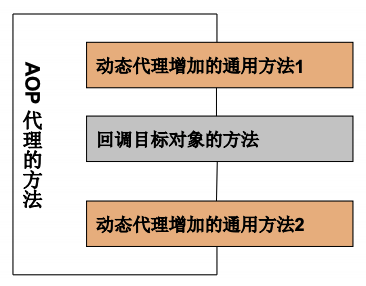

# 反射

## 反射的概述

反射（Reflection）是被视为**动态语言**的关键，反射机制允许程序在执行期借助 Reflection API 取得任何类的内部信息，并能直接操作任意对象的内部属性和方法。

加载完类之后，在堆内存的方法区中就产生了一个 Class 类型的对象（一个
类只有一个 Class 对象），这个对象就包含了**完整的类的结构信息**。可
以通过这个对象看到类的结构。这个对象就像一面**镜子**，透过这个镜子看
到类的结构，所以，我们形象的称之为**反射**。

Java 不是动态语言（在运行时代码可以根据某些条件改变自身结构），但J ava 可以称之为“**准动态语言**”。即 Java **有一定的动态性**，可以利用**反射机制**、**字节码操作**获得类似动态语言的特性。

## 类的加载与 ClassLoader 的理解

在 Object 类中定义了 `public final Class getClass()` 方法，此方法
将被所有子类继承。它的返回值的类型是一个 Class 类，此类是 Java 反射的**源头**。

**通俗的将，Class 对应着加载到内存中（通过类加载器）的一个运行时类**。

Class 类的常用方法：

* `static Class forName(String name)` 返回指定类名 name 的 Class 对象
* `Object newInstance()` 调用缺省构造函数，返回该 Class 对象的一个实例
* `getName()` 返回此 Class 对象所表示的实体（类、接口、数组类、基本类型或 void）名称
* `Class getSuperClass()` 返回当前 Class 对象的父类的 Class 对象
* `Class [] getInterfaces()` 获取当前 Class 对象的接口
* `ClassLoader getClassLoader()` 返回该类的类加载器
* `Class getSuperclass()` 返回表示此 Class 所表示的实体的超类的 Class
* `Constructor[] getConstructors()` 返回一个包含某些 Constructor 对象的数组
* `Field[] getDeclaredFields()` 返回 Field 对象的一个数组
* `Method getMethod(String name,Class … paramTypes)` 返回一个Method 对象，此对象的形参类型为 paramType

```java
package parzulpan.com.java;

import org.junit.Test;

import java.lang.annotation.ElementType;
import java.lang.reflect.Constructor;
import java.lang.reflect.Field;
import java.lang.reflect.Method;

/**
 * @Author : parzulpan
 * @Time : 2020-11-28
 * @Desc : 反射初体验
 */

public class ReflectionTest {

    // 反射之前，对 Person 的操作
    @Test
    public void test1() {
        // 创建 Person 对象
        Person p1 = new Person("Tom", 22);

        // 调用属性
        p1.age = 10;
        System.out.println(p1.toString());

        // 调用方法
        p1.show();

        // 不能调用私有的构造器、属性、方法等
    }

    // 反射之后，对 Person 的操作
    @Test
    public void test2() {
        try {
            // 通过反射，创建 Person 对象
            Class<Person> clazz = Person.class;
            Constructor<Person> cons = clazz.getConstructor(String.class, int.class);
            Person p1 = cons.newInstance("Tom", 22);

            // 通过反射，调用属性
            Field age = clazz.getDeclaredField("age");
            age.set(p1, 10);
            System.out.println(p1.toString());

            // 通过反射，调用方法
            Method show = clazz.getDeclaredMethod("show");
            show.invoke(p1);

            System.out.println();

            // 通过反射，能调用私有的构造器、属性、方法等

            // 调用私有的构造器
            Constructor<Person> cons1 = clazz.getDeclaredConstructor(String.class);
            cons1.setAccessible(true);
            Person p2 = cons1.newInstance("Jerry");
            System.out.println(p2.toString());

            // 调用私有的属性
            Field name = clazz.getDeclaredField("name");
            name.setAccessible(true);
            name.set(p2, "JerryCat");
            System.out.println(p2);

            // 调用私有的方法
            Method showNation = clazz.getDeclaredMethod("showNation", String.class);
            showNation.setAccessible(true);
            Object nation = showNation.invoke(p2, "China");
            System.out.println(nation);
        } catch (Exception e) {
            e.printStackTrace();
        }
    }

    // 获取 Class 类的实例
    @Test
    public void test3() {
        // 方式一：通过运行时类的属性 .class
        Class<Person> clazz1 = Person.class;
        System.out.println(clazz1);

        // 方式二：通过运行时类的对象，调用 getClass()
        Person p1 = new Person();
        Class<? extends Person> clazz2 = p1.getClass();
        System.out.println(clazz2);

        Class<?> clazz3 = null;
        Class<?> clazz4 = null;
        try {
            // 方式三：通过 Class 的静态方法，forName(String classPath)，这个方式使用频率最高
            clazz3 = Class.forName("parzulpan.com.java.Person");
            System.out.println(clazz3);
            clazz4 = Class.forName("java.lang.String");
            System.out.println(clazz4);
        } catch (ClassNotFoundException e) {
            e.printStackTrace();
        }

        // 这三种方式获得的类的实例均相同
        System.out.println(clazz1 == clazz2);   // true
        System.out.println(clazz1 == clazz3);   // true

        // 方式四：使用类的加载器，ClassLoader
        try {
            ClassLoader clazzL = this.getClass().getClassLoader();
            Class<?> clazz5 = clazzL.loadClass("parzulpan.com.java.Person");
            System.out.println(clazz5);
        } catch (ClassNotFoundException e) {
            e.printStackTrace();
        }
    }

    // 哪些类型可以有 Class 对象
    @Test
    public void test4() {
        Class<Object> c1 = Object.class;
        Class<Comparable> c2 = Comparable.class;
        Class<String[]> c3 = String[].class;
        Class<int[][]> c4 = int[][].class;
        Class<ElementType> c5 = ElementType.class;
        Class<Override> c6 = Override.class;
        Class<Integer> c7 = int.class;
        Class<Void> c8 = void.class;
        Class<Class> c9 = Class.class;

        int[] a = new int[10];
        int[] b = new int[100];
        Class<? extends int[]> c10 = a.getClass();
        Class<? extends int[]> c11 = b.getClass();
        // 只要元素类型与维度一样，就是同一个Class
        System.out.println(c10 == c11);     // true
    }
}
```

着重掌握获取 Class 类的实例的四种方式，特别是第三种。

**类的加载过程**，当程序主动使用某个类时，如果该类还未被加载到内存中，则系统会通过如下三个步骤来对该类进行初始化：

* 类的加载（Load）：将类的 class 文件读入内存，并为之创建一个 `java.lang.Class` 对象，此过程由类加载器完成；
* 类的链接（Link）：将类的二进制数据合并到 JRE 中；
* 类的初始化（Initialize）：JVM 负责对类进行初始化。

**什么时候会发生类的初始化？**

* 当虚拟机启动，先初始化 main 方法所在的类；
* new 一个类的对象；
* 调用类的静态成员（除了 final 常量）和静态方法；
* 使用 `java.lang.reflect` 包的方法对类进行反射调用；
* 当初始化一个类，如果其父类没有被初始化，则先会初始化它的父类；
* **注意**，通过数组定义类引用，不会触发此类的初始；
* **注意**，引用常量也不会触发此类的初始化，因为常量在链接阶段就存入调用类的常量池中了。

类加载器作用是用来把类装载进内存的，JVM 规范定义了如下类型的类的加载器：

* **引导类加载器**：用 C++ 编写的，是 JVM 自带的类加载器，负责 Java 平台核心库，用来装载核心类库。**该加载器无法直接获取**。
* **扩展类加载器**：负责 jre/lib/ext 目录下的 jar 包或 `–
D java.ext.dirs` 指定目录下的 jar 包装入工作库。
* **系统类加载器**：负责 `java –classpath` 或 `–D
java.class.path` 所指的目录下的类与 jar 包装入工作，是最常用的加载器。

```java
package parzulpan.com.java;

import org.junit.Test;

import java.io.FileInputStream;
import java.io.IOException;
import java.io.InputStream;
import java.util.Properties;

/**
 * @Author : parzulpan
 * @Time : 2020-11-28
 * @Desc : 了解类的加载器
 */

public class ClassLoaderTest {

    // 类加载器
    @Test
    public void test1() {
        // 对于自定义类，获取一个系统类加载器
        ClassLoader classLoader = ClassLoaderTest.class.getClassLoader();
        System.out.println(classLoader);

        // 获取系统类加载器的父类加载器，即扩展类加载器
        ClassLoader parent = classLoader.getParent();
        System.out.println(parent);

        // 获取扩展类加载器的父类加载器，即引导类加载器
        // 无法获取引导类加载器，它主要负责加载 Java 的核心类库，无法加载自定义类
        ClassLoader parent1 = parent.getParent();
        System.out.println(parent1);    // null

        ClassLoader classLoader1 = String.class.getClassLoader();
        System.out.println(classLoader1);   // null

        ClassLoader classLoader2 = null;
        try {
            classLoader2 = Class.forName("java.lang.Object").getClassLoader();  // null，说明也是引导类加载器
        } catch (ClassNotFoundException e) {
            e.printStackTrace();
        }
        System.out.println(classLoader2);
    }

    @Test
    // 读取配置文件
    public void test2() {
        Properties properties = new Properties();

        try {
            // 读取配置文件方式一：使用 IO 流
            // 此时文件默认在当前 module 下
            FileInputStream fis = new FileInputStream("jdbc.properties");
            properties.load(fis);

            // 读取配置文件方式二：使用类加载器
            // 此时文件默认在当前 module 的 src 下
            ClassLoader classLoader = ClassLoaderTest.class.getClassLoader();
            InputStream rss = classLoader.getResourceAsStream("jdbc1.properties");
            properties.load(rss);
        } catch (IOException e) {
            e.printStackTrace();
        }

        String user = properties.getProperty("user");
        String password = properties.getProperty("password");
        System.out.println("user = " + user + ", password = " + password);
    }
}
```

## 创建运行时类的对象

```java
package parzulpan.com.java;

import org.junit.Test;

import java.util.Random;

/**
 * @Author : parzulpan
 * @Time : 2020-11-28
 * @Desc : 通过反射 创建对应的运行时类的对象
 */

public class NewInstanceTest {

    // 创建运行时类的对象
    @Test
    public void test1() {
        Class<Person> clazz = Person.class;

        try {
            /* 调用了运行时类的空参构造器，需要满足两个条件
             1. 类必须有一个无参数的构造器
             2. 类的构造器的访问权限需要足够，通常设置为 public

             所以，在 JavaBean 中要求提供一个 public 的空参构造器，原因：
             1. 便于通过反射，创建运行时类的对象；
             2. 便于子类继承此运行时类的时候，默认调用 super() 保证父类有此构造器
             */
            Person p1 = clazz.newInstance();
            System.out.println(p1);

        } catch (InstantiationException | IllegalAccessException e) {
            e.printStackTrace();
        }
    }

    // 体会反射的动态性
    @Test
    public void test2() {
        for (int i = 0; i < 10; i++) {
            int num = new Random().nextInt(3);// 0 1 2
            String classPath;
            switch (num) {
                case 0:
                    classPath = "java.util.Date";
                    break;
                case 1:
                    classPath = "java.lang.Object";
                    break;
                case 2:
                    classPath = "parzulpan.com.java.Person";
                    break;
                default:
                    classPath = "";
            }

            try {
                Object instance = getInstance(classPath);
                System.out.println(instance);
            } catch (Exception e) {
                e.printStackTrace();
            }

        }

    }

    /**
     * 创建一个指定类的对象
     * @param classPath 指定类的全类名
     * @return  指定类的对象
     */
    public Object getInstance(String classPath) throws Exception {
        Class<?> clazz = Class.forName(classPath);
        return clazz.newInstance();
    }

}
```

## 获取运行时类的完整结构

完整结构包括：实现的全部接口、所继承的父类、全部的构造器、全部的方法、全部的属性等。

[获取运行时类的完整结构 - 类](../../code/ch13/src/parzulpan/com/java/MyPerson.java)

[获取运行时类的完整结构 - 父类](../../code/ch13/src/parzulpan/com/java/MyCreature.java)

[获取运行时类的完整结构 - 接口](../../code/ch13/src/parzulpan/com/java/MyInterface.java)

[获取运行时类的完整结构 - 注解](../../code/ch13/src/parzulpan/com/java/MyAnnotation.java)

[获取运行时类的完整结构](../../code/ch13/src/parzulpan/com/java/MyTest.java)

## 调用运行时类的指定结构

```java
package parzulpan.com.java;

import org.junit.Test;

import java.lang.reflect.Constructor;
import java.lang.reflect.Field;
import java.lang.reflect.Method;

/**
 * @Author : parzulpan
 * @Time : 2020-11-28
 * @Desc : 调用运行时类的指定结构
 */

public class ReflectionTest1 {

    // 调用运行时类的指定结构 - 指定属性
    @Test
    public void test1() throws Exception{
        // 获取类的实例
        Class<Person> clazz = Person.class;

        // 创建运行时类的对象
        Person person = clazz.newInstance();    // 调用空参构造器

        // public Field getField(String name)
        // 返回此 Class 对象表示的类或接口的指定的 public 的 Field
        // 通常不用，因为很少用 public 修饰属性
        Field age = clazz.getField("age");
        age.set(person, 99);
        Object o = age.get(person);
        System.out.println(o);

        System.out.println();

        // public Field getDeclaredField(String name)
        // 返回此 Class 对象表示的类或接口的指定的 Field
        Field name = clazz.getDeclaredField("name");
        name.setAccessible(true);   // 禁用访问安全检查
        name.set(person, "Tom");
        Object o1 = name.get(person);
        System.out.println(o1);
    }

    // 调用运行时类的指定结构 - 指定方法
    @Test
    public void test2() throws Exception{
        // 获取类的实例
        Class<Person> clazz = Person.class;

        // 创建运行时类的对象
        Person person = clazz.newInstance();

        // 1. 通过 Class 类的 getMethod(String name, Class…parameterTypes) 方法
        // 取得一个 Method 对象，并设置此方法操作时所需要的参数类型
        Method showNation = clazz.getDeclaredMethod("showNation", String.class);
        // 2. 使用后使用 Object invoke(Object obj, Object[] args)进行调用，
        // 并向方法中传递要设置的 obj 对象的参数信息
        showNation.setAccessible(true);   // 禁用访问安全检查
        Object china = showNation.invoke(person, "China");
        System.out.println(china);  // 返回值

        System.out.println();

        // 对于原方法若为静态方法，此时形参 Object obj 可为 null
        Method showNationStatic = clazz.getDeclaredMethod("showNationStatic");
        showNationStatic.setAccessible(true);
        Object invoke = showNationStatic.invoke(null);
        System.out.println(invoke);
    }

    // 调用运行时类的指定结构 - 指定构造器
    // 用的比较少，一般会直接调用空参构造器 clazz.newInstance();
    @Test
    public void test3() throws Exception{
        Class<Person> clazz = Person.class;

        // 参数指明构造器的参数列表
        Constructor<Person> declaredConstructor = clazz.getDeclaredConstructor(String.class);
        declaredConstructor.setAccessible(true);

        // 调用此构造器创建运行时类的对象
        Person tom = declaredConstructor.newInstance("Tom");
        System.out.println(tom);    // Person{name='Tom', age=0}
    }
}
```

## 反射的应用：动态代理

**代理设计模式**：使用一个代理将对象包装起来, 然后用该代理对象取代原始对象。任何对原始对象的调用都要通过代理。代理对象决定是否以及何时将方法调用转到原始对象上。

代理一般分为两种：

* 静态代理；
* 动态代理。

**静态代理**的缺点：

* 代理类和被代理类在编译期间就被确定了，不利于程序的扩展。
* 同时，每一个代理类只能为一个接口服务，这样一来程序开发中必然产生过多的代理。

```java
package parzulpan.com.java1;

/**
 * @Author : parzulpan
 * @Time : 2020-11-28
 * @Desc : 静态代理的举例
 * 特点：代理类和被代理类在编译期间就被确定了，不利于程序的扩展。
 * 同时，每一个代理类只能为一个接口服务，这样一来程序开发中必然产生过多的代理。
 */

public class StaticProxyTest {
    public static void main(String[] args) {
        // 创建被代理类的对象
        NikeClothFactory nikeClothFactory = new NikeClothFactory();
        // 创建代理类的对象
        ProxyClothFactory proxyClothFactory = new ProxyClothFactory(nikeClothFactory);

        proxyClothFactory.produceCloth();
    }
}

// 工厂接口
interface ClothFactory {
    void produceCloth();
}

// 代理类
class ProxyClothFactory implements ClothFactory {
    private ClothFactory factory;   // 用被代理类对象进行实例化

    public ProxyClothFactory(ClothFactory factory) {
        this.factory = factory;
    }

    @Override
    public void produceCloth() {
        System.out.println("代理工厂进行准备工作！");

        factory.produceCloth();

        System.out.println("代理工厂进行收尾工作！");
    }
}


// 被代理类
class NikeClothFactory implements ClothFactory {

    @Override
    public void produceCloth() {
        System.out.println("Nike 工厂生产一批球鞋！");
    }
}
```

**动态代理**是指客户通过代理类来调用其它对象的方法，并且是在程序运行时
根据需要动态创建目标类的代理对象。动态代理使用场合有**调试**、**远程方法调用**等。

**动态代理实现步骤**：

* 创建一个实现接口 InvocationHandler 的类，它必须实现 invoke 方法，以完成代理的具体操作。
* 创建被代理的类以及接口。
* 通过 Proxy 的静态方法 `newProxyInstance(ClassLoader loader, Class[] interfaces, InvocationHandler h)` 创建一个接收被代理类接口的代理工厂类。
* 通过代理工厂类代理调用实现类的方法。

```java
package parzulpan.com.java1;

import java.lang.reflect.InvocationHandler;
import java.lang.reflect.Method;
import java.lang.reflect.Proxy;

/**
 * @Author : parzulpan
 * @Time : 2020-11-28
 * @Desc : 动态代理的举例
 * 要想实现动态代理，需要解决两个问题：
 * 1. 如果根据加载到内存中的被代理类，动态的创建一个代理类及其对象？
 * 2. 当通过代理类的对象调用方法时，如果动态的去调用被代理类中的同名方法？
 */

public class ProxyTest {
    public static void main(String[] args) {
        // 被代理类
        SuperMan superMan = new SuperMan();
//        Object proxyInstance = ProxyFactory.getProxyInstance(superMan);
        // 动态代理类
        Human proxyInstance = (Human) ProxyFactory.getProxyInstance(superMan);
        String belief = proxyInstance.getBelief();
        System.out.println(belief);
        proxyInstance.eat("回锅肉");

        System.out.println();

        // 被代理类
        NikeClothFactory nikeClothFactory = new NikeClothFactory();
        // 动态代理类
        ClothFactory proxyInstance1 = (ClothFactory) ProxyFactory.getProxyInstance(nikeClothFactory);
        proxyInstance1.produceCloth();
    }
}

// 被代理接口
interface Human {
    String getBelief();
    void eat(String food);
}

// AOP
class HumanUtil {
    public void method1() {
        System.out.println("我是方法一！");
    }

    public void method2() {
        System.out.println("我是方法二！");
    }
}

// 被代理类
class SuperMan implements Human {

    @Override
    public String getBelief() {
        return "我相信我可以飞！";
    }

    @Override
    public void eat(String food) {
        System.out.println("我喜欢吃 " + food);
    }
}

// 代理工厂
class ProxyFactory {
    /**
     * 解决问题1
     * @param obj 被代理类的对象
     * @return 代理类的对象
     */
    public static Object getProxyInstance(Object obj) {
        MyInvocationHandler handler = new MyInvocationHandler();

        handler.bind(obj);

        return Proxy.newProxyInstance(obj.getClass().getClassLoader(), obj.getClass().getInterfaces(), handler);
    }
}

// 实现接口 InvocationHandler 的类
class MyInvocationHandler implements InvocationHandler {
    private Object obj; // 需要使用被代理类的对象进行赋值

    // 绑定被代理类
    public void bind(Object obj) {
        this.obj = obj;
    }

    // 当通过代理类的对象调用方法 A 时，就会调用这个 invoke()
    // 解决问题2，将被代理类要执行的方法 A 的功能就声明在 invoke() 中
    @Override
    public Object invoke(Object proxy, Method method, Object[] args) throws Throwable {
        // 使用 AOP
        HumanUtil humanUtil = new HumanUtil();

        humanUtil.method1();

        // method 作为被代理类对象要调用的方法
        // obj 被代理类对象
        // returnValue 作为当前类的 invoke() 的返回值
        Object returnValue = method.invoke(obj, args);

        humanUtil.method2();

        return returnValue;
    }
}
```

动态代理和 AOP（Aspect Orient Programming，**面向切面编程**），即 AOP 代理里的方法可以在执行目标方法之前、之后插入一些通用处理。如下图：



实现如上代码的 HumanUtil 类。

## 总结和练习

---

**反射机制与面向对象中的封装性是不是矛盾的？如何看待这两个技术？**

不矛盾。封装性解决的是建议你使用什么的问题，而反射是我能不能使用的问题。

---

**反射机制的使用时机？应用举例？**

动态代理。

框架 = 注解 + 反射 + 设计模式。

---
