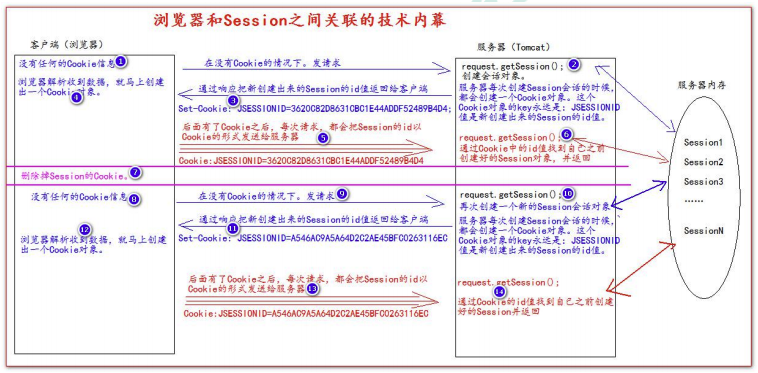

# Cookie&Session

## Cookie

### 什么是 Cookie

* Cookie 即饼干的意思
* Cookie 是服务器通知客户端保存键值对的一种技术
* 客户端有了 Cookie 后，每次请求都发送给服务器
* 每个 Cookie 的大小**不能超过** 4kb

### 创建 Cookie

* 客户端（浏览器）：
  * 如果没有 Cookie，则通知服务器
  * 收到响应后，发现有 **响应头** `Set-Cookie`，就去看一下，有没有这个 Cookie，无则创建，有则修改
* 服务器（Tomcat）：
  * 创建 Cookie 对象
  * 通知客户端保存 Cookie
  * 通过 **响应头** `Set-Cookie`（Set-Cookie: key1=value1）通知客户端保存 Cookie

```java
// 创建 Cookie
protected void createCookie(HttpServletRequest request, HttpServletResponse response) throws ServletException, IOException {
    // 1. 创建 Cookie 对象
    Cookie cookie = new Cookie("key1", "value1");
    // 2. 通知客户端保存 Cookie
    response.addCookie(cookie);
    // 1. 创建 Cookie 对象
    Cookie cookie2 = new Cookie("key2", "value2");
    // 2. 通知客户端保存 Cookie
    response.addCookie(cookie2);
    response.getWriter().write("Cookie 创建成功");
}
```

### 服务器如何获取 Cookie

* 客户端（浏览器）：
  * 如果有了 Cookie，通过 **请求头** `Cookie: xx=xx` 把 Cookie 信息发送给服务器
* 服务器（Tomcat）：获取客户端发送过来的 Cookie

```java
 // 获取 Cookie
protected void getCookie(HttpServletRequest request, HttpServletResponse response) throws ServletException, IOException {
    // 获取客户端发送过来的 Cookie
    Cookie[] cookies = request.getCookies();
    response.getWriter().write("Cookie 获取成功");

    for (Cookie cookie : cookies) {
        response.getWriter().write("Cookie[" + cookie.getName() + "=" + cookie.getValue() + "] <br/>");
    }

    Cookie iWantCookie = CookieUtils.findCookie("key1", cookies);
    if (iWantCookie != null) {
        response.getWriter().write("找到了需要的 key1 Cookie: " + iWantCookie.getValue());
    }
}
```

### Cookie 值的修改

```java
 // 修改 Cookie
    protected void updateCookie(HttpServletRequest request, HttpServletResponse response) throws ServletException, IOException {
        // 方案一：
        //1、先创建一个要修改的同名（指的就是 key）的 Cookie 对象
        //2、在构造器，同时赋于新的 Cookie 值
        Cookie newCookie = new Cookie("key1", "new-value1");
        //3、调用 response.addCookie( Cookie ) 通知客户端保存修改
        response.addCookie(newCookie);

        // 方案二：
        //1、先查找到需要修改的 Cookie 对象
        Cookie newCookie2 = CookieUtils.findCookie("key2", request.getCookies());
        //2、调用 setValue()方法赋于新的 Cookie 值
        if (newCookie2 != null) {
            newCookie2.setValue("new-value2");
        }
        //3、调用 response.addCookie( Cookie ) 通知客户端保存修改
        response.addCookie(newCookie2);

        response.getWriter().write("Cookie 修改成功");
    }
```

### Cookie 生命周期

Cookie 的生命控制指的是如何管理 Cookie 什么时候被销毁（删除）。

`setMaxAge(maxAge)`:

* 正数，表示在指定的秒数后过期
* 负数，表示浏览器一关，Cookie 就会被删除（默认值是-1），这是默认值
* 零，表示马上删除 Cookie

```java

// Cookie 存活 120s。
protected void life120Cookie(HttpServletRequest request, HttpServletResponse response) throws ServletException, IOException {
    Cookie cookie = new Cookie("life120Cookie", "life120Cookie");
    cookie.setMaxAge(60 * 2);
    response.addCookie(cookie);
    response.getWriter().write("已经创建了一个存活二分钟的 life120Cookie");
}

// Cookie 存活 0s，即删除。
protected void deleteCookie(HttpServletRequest request, HttpServletResponse response) throws ServletException, IOException {
    Cookie cookie = CookieUtils.findCookie("defaultCookie", request.getCookies()) ;
    if (cookie != null) {
        cookie.setMaxAge(0);
        response.addCookie(cookie);
        response.getWriter().write("defaultCookie 已经被删除了");
    }

}

// Cookie 默认的会话级别 session。
protected void defaultCookie(HttpServletRequest request, HttpServletResponse response) throws ServletException, IOException {
    Cookie cookie = new Cookie("defaultCookie", "defaultCookie");
    cookie.setMaxAge(-1);
    response.addCookie(cookie);
    response.getWriter().write("已经创建了一个默认的 defaultCookie");
}
```

### Cookie 有效路径 Path 的设置

Cookie 的 path 属性可以有效的过滤哪些 Cookie 可以发送给服务器，哪些不发。path 属性是通过请求的地址来进行有效的过滤。

```java
 // 路径设置
protected void setPath(HttpServletRequest request, HttpServletResponse response) throws ServletException, IOException {
    Cookie cookie = new Cookie("path1", "path1");
    cookie.setPath(request.getContextPath() + "AA");    // 得到工程路径
    response.addCookie(cookie);
    response.getWriter().write("创建了一个带有 Path 路径的 Cookie");
}
```

### 免输入用户名登录

```jsp
<%--
  Created by IntelliJ IDEA.
  User: parzulpan
  Date: 2020/12/12
  Time: 5:47 下午
  To change this template use File | Settings | File Templates.
--%>
<%@ page contentType="text/html;charset=UTF-8" language="java" %>
<html>
<head>
    <title>免输入用户名登录</title>
</head>
<body>

    <form action="cookieServlet" method="get">
        <input type="hidden" name="action" value="loginWithCookie"/>
        用户名：<input type="text" name="username" value="${cookie.username.value}"> <br>
        密码：<input type="password" name="password"> <br>
        <input type="submit" value="登录">
    </form>

</body>
</html>
```

```java
 // 免输入用户名登录
protected void loginWithCookie(HttpServletRequest request, HttpServletResponse response) throws ServletException, IOException {
    String username = request.getParameter("username");
    String password = request.getParameter("password");

    if ("parzulpan".equals(username) && "123456".equals(password)) {
        // 登录成功
        Cookie cookie = new Cookie("username", username);
        cookie.setMaxAge(60 * 60 * 24 * 7); // 当前 Cookie 一周内有效
        response.addCookie(cookie);
        System.out.println("登录成功");
    } else {
        System.out.println("登录失败");
    }
}
```

## Session

### 什么是 Session 会话

* Session 就是一个接口（HttpSession）
* Session 就是会话，它是用来维护一个客户端和服务器之间关联的一种技术
* 每个客户端都有自己的一个 Session 会话
* Session 会话中，经常用来保存用户登录之后的信息

### 创建和获取 Session

* request.getSession() 第一次调用是创建 Session 会话，之后调用都是获取前面创建好的 Session 会话对象
* isNew() 判断是不是新的 Session，true 表示刚创建，false 表示获取之前创建
* getId() 得到 Session 的会话 ID 值，每个会话都有一个唯一的 ID 值

```java
// 创建和获取 Session
protected void createOrGetSession(HttpServletRequest request, HttpServletResponse response) throws ServletException, IOException {
    HttpSession session = request.getSession();
    boolean isNew = session.isNew();
    String id = session.getId();

    response.getWriter().write("得到的 Session 的 Id 是：" + id + "<br>");
    response.getWriter().write("这个 Session 是否是新创建的：" + isNew + "<br>");
}

// 向 Session 中保存数据
protected void setAttribute(HttpServletRequest request, HttpServletResponse response) throws ServletException, IOException {
    request.getSession().setAttribute("key1", "value1");
    response.getWriter().write("已经往 Session 中保存了数据");
}

// 获取 Session 域中的数据
protected void getAttribute(HttpServletRequest request, HttpServletResponse response) throws ServletException, IOException {
    Object key1 = request.getSession().getAttribute("key1");
    response.getWriter().write("从 Session 中获取出 key1 的数据是：" + key1);
}
```

### Session 生命周期

* `public void setMaxInactiveInterval(int interval)` 设置 Session 的超时时间（以秒为单位），超过指定的时长 Session 就会被销毁。值为正数的时候，设定 Session 的超时时长。负数表示永不超时（**极少使用**）
* `public int getMaxInactiveInterval()` 获取当前 Session 的超时时间
* `public void invalidate()` 让当前 Session 会话马上超时无效

Session 默认的超时时间长为 30 分钟。因为在 Tomcat 服务器的配置文件 web.xml中默认有以下的配置，它就表示配置了当前 Tomcat 服务器下所有的 Session 超时配置默认时长为：30 分钟。

**Session 超时指的是客户端两次请求的最大时间间隔时长**。

```xml
<session-config>
    <session-timeout>30</session-timeout>
</session-config>
```

如果说希望你的 web 工程，默认的 Session 的超时时长为其他时长，可以在你自己的 web.xml 配置文件中做以上相同的配置。

```xml
<!--表示当前 web 工程。创建出来 的所有 Session 默认是 20 分钟 超时时长-->
<session-config>
    <session-timeout>30</session-timeout>
</session-config>
```

```java
// Session 默认超时，默认超时时长为 30 分钟，可以通过 Tomcat 的 web.xml 配置更改
protected void defaultSession(HttpServletRequest request, HttpServletResponse response) throws ServletException, IOException {
    int maxInactiveInterval = request.getSession().getMaxInactiveInterval();
    response.getWriter().write("Session 默认超时时长：" + maxInactiveInterval);
}

// Session 10s 后超时
protected void life10Session(HttpServletRequest request, HttpServletResponse response) throws ServletException, IOException {
    HttpSession session = request.getSession();
    session.setMaxInactiveInterval(10);
    response.getWriter().write("当前 Session 已经设置为 10 秒后超时");
}

// Session 马上超时
protected void deleteSession(HttpServletRequest request, HttpServletResponse response) throws ServletException, IOException {
    // 先获取 Session 对象
    HttpSession session = request.getSession();
    // 让 Session 会话马上超时
    session.invalidate();
    response.getWriter().write("Session 已经设置为超时（无效）");
}
```

### 浏览器和 Session

**Session 技术，底层其实是基于 Cookie 技术来实现的**。

