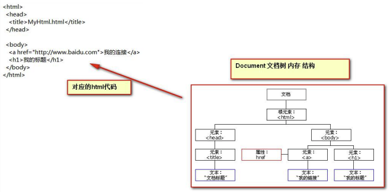

# JavaScript 基础

## 事件

事件是指输入设备与页面之间进行交互的响应。

**常用的事件**：

* `onload` 加载完成事件：页面加载完成之后，常用于页面 js 代码初始化操作；
* `onclick` 单击事件：常用于按钮的点击响应操作；
* `onblur` 失去焦点事件：常用于输入框失去焦点后验证其输入内容是否合法；
* `onchange` 内容发生改变事件：常用于下拉列表和输入框内容发生改变后操作；
* `onsubmit` 表单提交事件：常用于表单提交前，验证所有表单项是否合法。

事件的注册（绑定）：告诉浏览器，当事件响应后需要执行哪些操作代码。分为两种类型：

* **静态**注册事件：通过 html 标签的事件属性直接赋予事件响应后的代码；
* **动态**注册事件：先通过 js 代码得到标签的 DOM 对象，然后再通过  `对象.事件名 = funciton() {}` 这种形式赋予事件响应后的代码。基本步骤：
  * 获取标签 DOM 对象
  * `对象.事件名 = funciton() {}`

### onload

```html
<!DOCTYPE html>
<html lang="en">
<head>
    <meta charset="UTF-8">
    <title>onload 加载完成事件</title>
    <script type="text/javascript">
        // 静态注册
        function onLoadFun() {
            alert("静态注册 onload 事件");
        }

        // 动态注册
        window.onload = function () {
            alert("动态注册 onload 事件");
        }
    </script>
</head>
<!--onload 事件是浏览器解析完页面之后就会自动触发的事件-->
<body onload="onLoadFun()">

</body>
</html>
```

### onclick

```html
<!DOCTYPE html>
<html lang="en">
<head>
    <meta charset="UTF-8">
    <title>onclick 单击事件</title>
    <script type="text/javascript">
        function onClickFun() {
            alert("静态注册 onclick 事件");
        }

        window.onload = function () {
            // 1.
            let btnObj = document.getElementById("btn02");
            // 2.
            btnObj.onclick = function () {
                alert("动态注册 onclick 事件");
            }
        }
    </script>
</head>
<body>

    <button onclick="onClickFun()">按钮1</button>
    <button id="btn02">按钮2</button>

</body>
</html>
```

### onblur

```html
<!DOCTYPE html>
<html lang="en">
<head>
    <meta charset="UTF-8">
    <title>onblur 失去焦点事件</title>
    <script type="text/javascript">
        // console 是控制台对象，是由 JavaScript 语言提供，专门用来向浏览器的控制器打印输出， 用于测试使用
        function onBlurFun() {
            console.log("静态注册 onblur 事件");
        }

        window.onload = function () {
            let element = document.getElementById("password");
            element.onblur = function () {
                console.log("动态注册 onblur 事件");
            }
        }
    </script>
</head>
<body>

    <table>
        <tr>
            <th>用户名</th>
            <th><input type="text" onblur="onBlurFun()"></th>
        </tr>
        <tr>
            <th>密码</th>
            <th><input type="password" id="password"></th>
        </tr>
    </table>

</body>
</html>
```

### onchange

```html
<!DOCTYPE html>
<html lang="en">
<head>
    <meta charset="UTF-8">
    <title>onchange 内容发生改变事件</title>
    <script type="text/javascript">
        function onChangeFun() {
            alert("最喜欢的编程语言已变化！")
        }

        window.onload = function () {
            let tools = document.getElementById("tools");
            tools.onchange = function () {
                alert("最喜欢的开发工具已变化！")
            }
        }

    </script>
</head>
<body>

    <label>
        请选择你最喜欢的编程语言：
        <select onchange="onChangeFun()">
            <option>Java</option>
            <option selected="selected">Python</option>
            <option>JavaScript</option>
            <option>C++</option>
        </select>
    </label>

    <br>

    <label for="tools">请选择你最喜欢的开发工具：</label><select id="tools">
        <option>IDEA</option>
        <option>VSCode</option>
        <option>Vim</option>
        <option>GitHub</option>
    </select>

</body>
</html>
```

### onsubmit

```html
<!DOCTYPE html>
<html lang="en">
<head>
    <meta charset="UTF-8">
    <title>onsubmit 表单提交事件</title>
    <script type="text/javascript">
        function onSubmitFun() {
            // 要验证所有表单项是否合法，如果，有一个不合法就阻止表单提交
            alert("静态注册表单提交事件 - 发现不合法");
            return false;
        }

        window.onload = function () {
            let form1 = document.getElementById("form1");
            form1.onsubmit = function () {
                alert("静态注册表单提交事件 - 发现合法");
                return true;
            }

        }
    </script>
</head>
<body>

    <!--return false 可以阻止 表单提交 -->
    <form action="http://localhost:8080" method="get" onsubmit="return onSubmitFun()">
        <input type="submit" name="submit" value="静态注册">
    </form>
    <form action="http://localhost:8080" method="post" id="form1">
        <input type="submit" name="submit" value="动态注册">
    </form>

</body>
</html>
```

## DOM

DOM（Document Object Model），即**文档对象模型**。它把 HTML 文档中的标签，属性，文本等转换成**对象**来管理。

**Document 对象**：



对 Document 对象的理解：

* Document 它管理了所有的 HTML 文档内容；
* Document 是一种树结构的文档，有层级关系；
* Document 把所有的标签都**对象化**。

```html
<body>
    <div id="div01">div01</div>
</body>
```

以上的 html 标签对象化，相当于：

```java
class DOM {
    private String id;  // id 属性
    private String tagNmae; // 标签名
    private DOM parentNode; // 父节点
    private List<DOM> childrens;    // 孩子节点
    private String innerHTML;   // 起始标签和结束标签中间的内容
}
```

**Document 对象的常用方法**：

* `document.getElementById(elementId)` 通过标签的 id 属性查找标签的 DOM 对象引用，elementId 是标签的 id 属性值；
* `document.getElementsByname(elementName)` 通过标签的 name 属性查找标签的 DOM 对象集合，elementName 是标签的 name 属性值；
* `document.getElementsByTagName(tagName)` 通过标签名查找标签 DOM 对象集合，tagName 是标签名；
* `document.createElement(tagName)` 通过给定的标签名，创建一个标签对象，tagName 是要创建的标签名。

**注意**：Document 对象的三个查询方法，如果有 id 属性，优先使用  getElementById 方法来进行查询。如果没有 id 属性，则优先使用  getElementsByName 方法来进行查询。如果 id 属性和 name 属性都没有最后再按标签名来进行查询 getElementsByTagName。**而且**，一定要在页面加载完成之后执行，才能查询到标签对象。

---

```html
<!DOCTYPE html>
<html lang="en">
<head>
    <meta charset="UTF-8">
    <title>getElementById 方法示例</title>
    <style type="text/css">
        img {
            width: 18px;
            height: 18px;
        }
    </style>
    <script type="text/javascript">
        // 当用户点击了较验按钮，要获取输出框中的内容。然后验证其是否合法。
        // 验证的规则是：必须由字母，数字。下划线组成。并且长度是 5 到 12 位。
        function onClickFun() {
            let username = document.getElementById("username");
            let usernameText = username.value;

            // 正则表达式
            let pattern = /^\w{5,12}$/;

            let usernameSpan = document.getElementById("usernameSpan");
            usernameSpan.innerHTML = "Hello World!";

            if (pattern.test(usernameText)) {
                // usernameSpan.innerHTML = "用户名合法！";
                usernameSpan.innerHTML = "";

            } else {
                // usernameSpan.innerHTML = "用户名不合法！";
                usernameSpan.innerHTML = "";
            }
        }
    </script>
</head>
<body>

    <label for="username">用户名：</label><input type="text" id="username" value="xxx"/>
    <button onclick="onClickFun()">校验</button>
    <span id="usernameSpan" style="color: red">

    </span>

</body>
</html>
```

---

```html
<!DOCTYPE html>
<html lang="en">
<head>
    <meta charset="UTF-8">
    <title>getElementsByName 方法示例</title>
    <script type="text/javascript">
        // 实现 全选 全不选 反选
        // document.getElementsByName() 是根据 指定的 name 属性查询返回多个标签对象集合
        // 这个集合的操作跟数组一样，集合中每个元素都是 dom 对象
        let lang = document.getElementsByName("lang");

        function checkAll() {
            for (let i = 0; i < lang.length; i++) {
                lang[i].checked = true;
            }
        }

        function checkNo() {
            for (let i = 0; i < lang.length; i++) {
                lang[i].checked = false;
            }
        }

        function checkReverse() {
            for (let i = 0; i < lang.length; i++) {
                lang[i].checked = !lang[i].checked;
            }
        }
    </script>
</head>
<body>

    喜欢的编程语言：
    <label>
        <input type="checkbox" name="lang" value="java" checked="checked">
    </label>Java
    <label>
        <input type="checkbox" name="lang" value="cpp">
    </label>C++
    <label>
        <input type="checkbox" name="lang" value="python">
        Python
    </label>
    <label>
        <input type="checkbox" name="lang" value="js">
        JavaScript
    </label>

    <br>

    <button onclick="checkAll()">全选</button>
    <button onclick="checkNo()">全不选</button>
    <button onclick="checkReverse()">反选</button>


</body>
</html>
```

---

```html
<!DOCTYPE html>
<html lang="en">
<head>
    <meta charset="UTF-8">
    <title>getElementsByTagName 方法示例</title>
    <script type="text/javascript">
        let lang = document.getElementsByTagName("input");

        function checkAll() {
            for (let i = 0; i < lang.length; i++) {
                lang[i].checked = true;
            }
        }

        function checkNo() {
            for (let i = 0; i < lang.length; i++) {
                lang[i].checked = false;
            }
        }

        function checkReverse() {
            for (let i = 0; i < lang.length; i++) {
                lang[i].checked = !lang[i].checked;
            }
        }
    </script>
</head>
<body>

喜欢的编程语言：
<label>
    <input type="checkbox" name="lang" value="java" checked="checked">
</label>Java
<label>
    <input type="checkbox" name="lang" value="cpp">
</label>C++
<label>
    <input type="checkbox" name="lang" value="python">
    Python
</label>
<label>
    <input type="checkbox" name="lang" value="js">
    JavaScript
</label>

<br>

<button onclick="checkAll()">全选</button>
<button onclick="checkNo()">全不选</button>
<button onclick="checkReverse()">反选</button>


</body>
</html>
```

---

```html
<!DOCTYPE html>
<html lang="en">
<head>
    <meta charset="UTF-8">
    <title>createElement 方法示例</title>
    <script type="text/javascript">
        window.onload = function () {
            // 使用 js 创建 html 标签，并显示在页面上
            // 标签内容为 <div> Hello World </div>
            let divObj = document.createElement("div");
            let textNodeObj = document.createTextNode("Hello World");
            divObj.appendChild(textNodeObj);
            document.body.appendChild(divObj);
        }
    </script>
</head>
<body>

</body>
</html>
```

---

**节点的常用属性和方法**：

* 节点就是标签对象；
* `getElementsByTagName()`  获取当前节点的指定标签名孩子节点
* `appendChild( oChildNode)`  可以添加一个子节点，oChildNode 是要添加的孩子节点
* `childNodes`  获取当前节点的所有子节点
* `firstChild`  获取当前节点的第一个子节点
* `lastChild`  获取当前节点的最后一个子节点
* `parentNode`  获取当前节点的父节点
* `nextSibling`  获取当前节点的下一个节点
* `previousSibling`  获取当前节点的上一个节点
* `className`  用于获取或设置标签的 class 属性值
* `innerHTML`  表示获取/设置起始标签和结束标签中的内容
* `innerText`  表示获取/设置起始标签和结束标签中的文本

## 练习和总结
