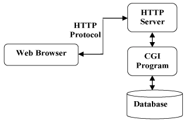

# Servlet 程序

## Servlet

Servlet 是在 Web 服务器中运行的小型 Java 程序。Servlet 通常通过 HTTP（超文本传输​​协议）接收和响应来自 Web 客户端的请求。

Servlet 也是 JavaWeb 三大组件之一，即 Servlet 程序、Filter 过滤器、Listener 监听器。

**方式一：手动实现 Servlet 程序**：

* 编写一个类去实现 Servlet 接口
* 实现 service 方法，处理请求，并响应数据
* 到 web.xml 中去配置 Servlet 程序的访问地址

```java
package cn.parzulpan.servlet;

import javax.servlet.*;
import java.io.IOException;

/**
 * @Author : parzulpan
 * @Time : 2020-12-06
 * @Desc :
 */

public class HelloServlet implements Servlet {

    @Override
    public void init(ServletConfig servletConfig) throws ServletException {

    }

    @Override
    public ServletConfig getServletConfig() {
        return null;
    }

    /**
     * 专门处理请求和响应
     * @param servletRequest 包含客户端请求的 ServletRequest 对象
     * @param servletResponse 包含 Servlet 响应的 ServletResponse 对象
     * @throws ServletException .
     * @throws IOException .
     */
    @Override
    public void service(ServletRequest servletRequest, ServletResponse servletResponse) throws ServletException, IOException {
        System.out.println("Hello Servlet 被访问了！");
    }

    @Override
    public String getServletInfo() {
        return null;
    }

    @Override
    public void destroy() {

    }
}

```

```xml
<?xml version="1.0" encoding="UTF-8"?>
<web-app xmlns="http://xmlns.jcp.org/xml/ns/javaee"
         xmlns:xsi="http://www.w3.org/2001/XMLSchema-instance"
         xsi:schemaLocation="http://xmlns.jcp.org/xml/ns/javaee http://xmlns.jcp.org/xml/ns/javaee/web-app_4_0.xsd"
         version="4.0">

    <!--给 Tomcat 配置 Servlet 程序-->
    <servlet>
        <!--给 Servlet 程序起一个别名，一般是类名-->
        <servlet-name>HelloServlet</servlet-name>
        <!--Servlet 程序的全类名-->
        <servlet-class>cn.parzulpan.servlet.HelloServlet</servlet-class>
    </servlet>

    <!--给 Servlet 程序配置访问地址-->
    <servlet-mapping>
        <!--告诉服务器，当前配置的地址给哪个 Servlet 程序使用-->
        <servlet-name>HelloServlet</servlet-name>
        <!--配置访问地址-->
        <url-pattern>/hello</url-pattern>
    </servlet-mapping>


</web-app>
```

**url 地址到 Servlet 程序的过程**：

* `http://localhost:8080/Servlet/hello`
* `http://` 表示 http 协议；
* `localhost` 通过 ip 地址定位服务器；
* `8080` 通过 port 定位 Tomcat；
* `/Servlet` 通过工程路径确定访问那个工程；
* `/hello` 通过资源路径找到 `servlet-mapping` 中的 `url-pattern`，然后到 `servlet-name`，之后到 `servlet` 中的 `servlet-name`，然后到 `servlet-class`，最后定位到 `Java` 代码。

**Servlet 程序的生命周期方法**：

1. `构造` Servlet，然后使用 `init` 方法初始化，第一次访问时调用。
2. 客户端对 `service` 方法的所有调用都会得到处理，每次访问时调用。
3. 将该 Servlet 退出服务，然后使用 `destroy` 方法将其破坏，然后将垃圾回收并完成，Web 工程停止时调用。

除了生命周期方法外，此接口还提供了 Servlet 可用于获取任何启动信息的 getServletConfig 方法，以及允许 Servlet 返回有关自身的基本信息（如作者，版本和版本）的 getServletInfo 方法。

**GET 和 POST 请求的分发处理**：

```java
package cn.parzulpan.servlet;

import javax.servlet.*;
import javax.servlet.http.HttpServletRequest;
import java.io.IOException;

/**
 * @Author : parzulpan
 * @Time : 2020-12-06
 * @Desc :
 */

public class HelloServlet implements Servlet {

    @Override
    public void init(ServletConfig servletConfig) throws ServletException {

    }

    @Override
    public ServletConfig getServletConfig() {
        return null;
    }

    /**
     * 专门处理请求和响应
     * @param servletRequest 包含客户端请求的 ServletRequest 对象
     * @param servletResponse 包含 Servlet 响应的 ServletResponse 对象
     * @throws ServletException .
     * @throws IOException .
     */
    @Override
    public void service(ServletRequest servletRequest, ServletResponse servletResponse) throws ServletException, IOException {
        System.out.println("Hello Servlet 被访问了！");

        HttpServletRequest httpServletRequest = (HttpServletRequest) servletRequest;
        // 获取请求的方式
        String method = httpServletRequest.getMethod();

        if ("GET".equals(method)) {
            doGet();
        } else if ("POST".equals(method)) {
            doPost();
        }
    }

    @Override
    public String getServletInfo() {
        return null;
    }

    @Override
    public void destroy() {

    }

    public void doGet() {
        System.out.println("GET请求！");
    }

    public void doPost() {
        System.out.println("POST请求！");
    }
}
```

**方式二：通过继承 HttpServlet 实现 Servlet 程序**：

Servlet 类的继承体系：Servlet 接口，只负责定义 Servlet 程序的访问规范；GenericServlet 类实现了 Servlet 接口，做了很多空实现并持有一个 ServletConfig 类的引用；HttpServlet 抽象类实现了 service 方法，并实现了请求的分发处理；自定义的 Servlet 程序继承 HttpServlet 类，并根据自己的业务逻辑重写 doGet 或 doPost 方法。

一般在实际项目开发中，都是使用继承 HttpServlet 类的方式去实现 Servlet 程序。步骤为：

* 编写一个类去继承 HttpServlet 类
* 根据业务需要重写 doGet 或 doPost 方法
* 到 web.xml 中的配置 Servlet 程序的访问地址

```java
package cn.parzulpan.servlet;

import javax.servlet.ServletException;
import javax.servlet.http.HttpServlet;
import javax.servlet.http.HttpServletRequest;
import javax.servlet.http.HttpServletResponse;
import java.io.IOException;

/**
 * @Author : parzulpan
 * @Time : 2020-12-07
 * @Desc :
 */

public class HelloServlet2 extends HttpServlet {

    /**
     * 在 GET 请求时调用
     * @param req
     * @param resp
     * @throws ServletException
     * @throws IOException
     */
    @Override
    protected void doGet(HttpServletRequest req, HttpServletResponse resp) throws ServletException, IOException {
        super.doGet(req, resp);
        System.out.println("HelloServlet2 doGet()");
    }

    /**
     * 在 POST 请求时调用
     * @param req
     * @param resp
     * @throws ServletException
     * @throws IOException
     */
    @Override
    protected void doPost(HttpServletRequest req, HttpServletResponse resp) throws ServletException, IOException {
        super.doPost(req, resp);
        System.out.println("HelloServlet2 doPost()");
    }

}

```

```xml
<?xml version="1.0" encoding="UTF-8"?>
<web-app xmlns="http://xmlns.jcp.org/xml/ns/javaee"
         xmlns:xsi="http://www.w3.org/2001/XMLSchema-instance"
         xsi:schemaLocation="http://xmlns.jcp.org/xml/ns/javaee http://xmlns.jcp.org/xml/ns/javaee/web-app_4_0.xsd"
         version="4.0">

    <!--给 Tomcat 配置 Servlet 程序-->
    <servlet>
        <!--给 Servlet 程序起一个别名，一般是类名-->
        <servlet-name>HelloServlet</servlet-name>
        <!--Servlet 程序的全类名-->
        <servlet-class>cn.parzulpan.servlet.HelloServlet</servlet-class>
    </servlet>
    <!--给 Servlet 程序配置访问地址-->
    <servlet-mapping>
        <!--告诉服务器，当前配置的地址给哪个 Servlet 程序使用-->
        <servlet-name>HelloServlet</servlet-name>
        <!--配置访问地址-->
        <url-pattern>/hello</url-pattern>
    </servlet-mapping>

    <servlet>
        <servlet-name>HelloServlet2</servlet-name>
        <servlet-class>cn.parzulpan.servlet.HelloServlet2</servlet-class>
    </servlet>
    <servlet-mapping>
        <servlet-name>HelloServlet2</servlet-name>
        <url-pattern>/hello2</url-pattern>
    </servlet-mapping>

</web-app>
```

**方式三：通过 IDEA 创建 Servlet 程序**：

* `New -> Create New Servlet`
* 设置注解内容

```java
package cn.parzulpan.servlet;

import javax.servlet.ServletException;
import javax.servlet.annotation.WebServlet;
import javax.servlet.http.HttpServlet;
import javax.servlet.http.HttpServletRequest;
import javax.servlet.http.HttpServletResponse;
import java.io.IOException;

/**
 * @Author : parzulpan
 * @Time : 2020-12-07
 * @Desc : IDEA 创建 Servlet 程序，使用注解
 */

// urlPatterns 相当于 web.xml 的 url-pattern
@WebServlet(name = "HelloServlet3", urlPatterns = ("/hello3"))
public class HelloServlet3 extends HttpServlet {
    protected void doPost(HttpServletRequest request, HttpServletResponse response) throws ServletException, IOException {
        System.out.println("IDEA 创建 Servlet 程序 doPost()");

    }

    protected void doGet(HttpServletRequest request, HttpServletResponse response) throws ServletException, IOException {
        System.out.println("IDEA 创建 Servlet 程序 doGet()");
    }
}
```

## ServletConfig

Servlet 容器使用的 Servlet 配置对象，用于在初始化期间将信息传递给 Servlet。

Servlet 程序默认是第一次访问的时候创建，ServletConfig 是每个 Servlet 程序创建时，就创建一个对应的 ServletConfig 对象。

**ServletConfig 的作用**：

* 获取 Servlet 程序的别名 servlet-name 的值
* 获取初始化参数 init-param
* 获取 ServletContext 对象

```java
public class HelloServlet implements Servlet {

    @Override
    public void init(ServletConfig servletConfig) throws ServletException {
        // * 获取 Servlet 程序的别名 servlet-name 的值
        System.out.println("Servlet 程序的别名" + servletConfig.getServletName());

        // * 获取初始化参数 init-param
        System.out.println("获取初始化参数 username 的值：" + servletConfig.getInitParameter("username"));
        System.out.println("获取初始化参数 url 的值：" + servletConfig.getInitParameter("url"));

        // * 获取 ServletContext 对象
        System.out.println(servletConfig.getServletContext());
    }
}
```

## ServletContext

**什么是 ServletContext**：

* ServletContext 是一个接口，它表示 Servlet 上下文对象；
* 一个 Web 工程，只有一个 ServletContext 对象实例；
* ServletContext 对象是一个**域对象**；
* ServletContext 是在 Web 工程部署启动的时候创建，在 Web 工程停止的时候销毁。

**域对象**：是可以像 Map 一样存取数据的对象，这里的域指的是存取数据的操作范围，即整个 Web 工程。

**ServletContext 的作用**：

* 获取 web.xml 中配置的上下文参数 `context-param`
* 获取当前的工程路径，格式: `/工程路径`
* 获取工程部署后在服务器磁盘上的绝对路径
* 像 Map 一样存取数据

```java
package cn.parzulpan.servlet;

import javax.servlet.ServletContext;
import javax.servlet.ServletException;
import javax.servlet.http.HttpServlet;
import javax.servlet.http.HttpServletRequest;
import javax.servlet.http.HttpServletResponse;
import java.io.IOException;

/**
 * @Author : parzulpan
 * @Time : 2020-12-07
 * @Desc :
 */

public class ContextServlet extends HttpServlet {
    protected void doPost(HttpServletRequest request, HttpServletResponse response) throws ServletException, IOException {

    }

    protected void doGet(HttpServletRequest request, HttpServletResponse response) throws ServletException, IOException {
        // * 获取 web.xml 中配置的上下文参数 `context-param`
        ServletContext servletContext = getServletContext();
        String username = servletContext.getInitParameter("username");
        System.out.println("context-param 参数 username 的值是: " + username);
        System.out.println("context-param 参数 password 的值是: " + servletContext.getInitParameter("password"));

        // * 获取当前的工程路径，格式: `/工程路径`
        System.out.println( "当前工程路径: " + servletContext.getContextPath());  // 当前工程路径: /Servlet

        // * 获取工程部署后在服务器磁盘上的绝对路径
        // / 斜杠被服务器解析地址为: http://ip:port/工程名/ 映射到 IDEA 代码的 web 目录
        // 工程部署的路径是: /Users/parzulpan/Study/LearnJava/Web/code/JavaWeb/out/artifacts/Servlet_war_exploded/
        System.out.println("工程部署的路径是: " + servletContext.getRealPath("/"));
        
        // * 像 Map 一样存取数据
        // 保存之前: Context1 获取 key1 的值是: null
        System.out.println("保存之前: Context1 获取 key1 的值是: "+ servletContext.getAttribute("key1"));
        servletContext.setAttribute("key1", "value1");
        // 更新之后: Context1 中获取 key1 的值是: value1
        System.out.println("更新之后: Context1 中获取 key1 的值是: "+ servletContext.getAttribute("key1"));
    }
}
```

## HTTP

HTTP 协议是 `Hyper Text Transfer Protocol`（超文本传输协议）的缩写，是用于从万维网（World Wide Web）服务器传输超文本到本地浏览器的传送协议。它基于 `TCP/IP` 通信协议来传递数据。它的**特点**：

* **HTTP 是无连接的**，即限制每次连接只处理一个请求。服务器处理完客户的请求，并收到客户的应答后，就断开连接。这样做能节省传输时间。
* **HTTP 是媒体独立的**，即只要客户端和服务器知道如何处理数据内容，任何类型的数据都可以传输。客户端和服务器指定合适的 `MIME-type` 内容类型。
* **HTTP 是无状态的**，即对于事务处理是没有记忆能力的。意味这如果后续处理需要前面的信息，那么它必须重传，可能导致每次连接传送的数据量增大。

**HTTP 协议通信流程**：



***HTTP 请求方法**：

* `GET` 请求指定的页面信息，并返回实体主体
* `POST` 向指定资源提交数据进行处理请求，数据被包含在请求体中，POST 请求可能会导致新的资源的建立或已有资源的修改
* `PUT` 从客户端向服务器传送的数据取代指定的文档的内容
* `DELETE` 请求服务器删除指定的页面
* `HEAD` 类似与 GET 请求，只不过返回的响应中没有具体的内容，用于获取报头
* `PATCH` 是对 PUT 的补充，用来对已知资源进行局部更新
* `CONNECT` HTTP/1.1 协议中预留给能够将连接改为管道方式的代理服务器
* `OPTIONS` 允许客户端查看服务器的性能
* `TRACE` 回显服务器收到的请求，主要用于测试或诊断

***HTTP 状态码**：

* 常见的状态码：
  * `200` 请求成功
  * `301` 资源被永久转移到其他 URL
  * `302` 请求被重定向
  * `404` 请求的资源不存在
  * `500` 内部服务器错误
* 状态码分类：
  * `1**` 信息，服务器收到请求，需要请求者继续执行操作
  * `2**` 成功，操作被成功接收并处理
  * `3**` 重定向，需要进一步的操作以完成请求
  * `4**` 客户端错误，请求包含语法错误或者无法完成请求
  * `5**` 服务器错误，服务器在处理请求的过程中发生了错误
* 状态码列表：
  * `100 Continue` 继续。客户应该继续其请求
  * `101 Switching Protocols` 切换协议。服务器根据客户端的请求切换协议，只能切换到更高级的协议
  * `200 OK` 请求成功。一般用于 GET、POST请求
  * `201 Created` 已创建。成功请求并创建了新的资源
  * `202 Accpted` 以接受。已经接受请求，但是未处理完成
  * `203 Non-Authoritative Information` 非授权信息。请求成功，但是返回的 meta 信息不再原始的服务器，而是一个副本
  * `204 No Content` 无内容。服务器成功处理，但是未返回内容，在未更新网页的情况下，可继续显示当前内容
  * `205 Reset Content` 重置内容。服务器成功处理，用户终端应该重置文档视图，可通过它清楚浏览器的表单域
  * `206 Partial Content` 部分内容。服务器成功处理了部分 GET 请求
  * `300 Multiple Choices` 多种选择。请求的资源可包括多个位置，相应可返回一个资源特征与地址的列表用于用户终端选择
  * `301 Moved Permanently` 永久移动。请求的资源已经被永久的移动到新的 URI，返回信息会包括新的 URI，浏览器会自动定向到新的 URI，今后任何新的请求都会使用新的 URI 代替
  * `302 Found` 临时移动。与 301 类似，但资源只是临时被移动，客户端应继续使用原有 URI
  * `303 See Other` 查看其他地址。与 301 类似，使用 GET 和 POST 请求查看
  * `304 Not Modified` 未修改。所请求的资源未修改，不会返回任何资源。客户端通常会缓存访问过的资源，通过提供一个头信息指出客户端希望只返回在指定日期之后修改的资源
  * `305 Use Proxy` 使用代理。所请求的资源必须通过代理访问
  * `306 Unused` **已经被废弃的 HTTP 状态码**
  * `307 Temporary Redirect` 临时重定向。与 302 类似，使用 GET 请求重定向
  * `400 Bad Request` 客户端请求的语法错误，服务器无法理解
  * `401 Unauthorized` 请求要求用户的身份认证
  * `402 Payment` Required 保留，将来使用
  * `403 Forbidden` 服务器理解客户端的请求，但是拒绝执行此请求
  * `404 Not Found` 服务器无法根据客户端的请求找到资源
  * `405 Method Not Allowed` 客户端请求中的方法被禁止
  * `406 Not Accpetable` 服务器无法根据客户端请求的内容特性完成请求
  * `407 Proxy Authentication Required` 请求要求代理的身份认证，与 401 类似，但请求者应当使用代理进行授权
  * `408 Request Time-out` 超时，服务器等待客户端发送的请求时间过长
  * `409 Conflict` 服务器处理 PUT 请求时发生了冲突
  * `410 Gone` 客户端请求的资源已经不存在。**410 不同于 404**，如果资源以前有现在被永久删除了可使用 410 代码，网站设计人员可通过 301 代码指定资源的新位置
  * `411 Length Required` 服务器无法处理客户端发送的不带 **Content-Length** 的请求信息
  * `412 Precondition Failed` 客户端请求信息的先决条件错误
  * `413 Request Entity Too Large` 由于请求的实体过大，服务器无法处理，因此拒绝请求。为防止客户端的连续请求，服务器可能会关闭连接。如果只是服务器暂时无法处理，则会包含一个 Retry-After 的响应信息
  * `414 Request-URI Too Large` 请求的 URI 过长（ URI 通常为网址），服务器无法处理
  * `415 Unsupported Media Type` 服务器无法处理请求附带的媒体格式
  * `416 Requested range not satisfiable` 客户端请求的范围无效
  * `417 Expectation Failed` 服务器无法满足 Expect 的请求头信息
  * `500 Internal Server Error` 服务器内部错误，无法完成请求
  * `501 Not Implemented` 服务器不支持请求的功能，无法完成请求
  * `502 Bad Gateway` 作为网关或者代理工作的服务器尝试执行请求时，从远程服务器接收到了一个无效的响应
  * `503 Service Unavailable` 由于超载或系统维护，服务器暂时的无法处理客户端的请求。延时的长度可包含在服务器的 Retry-After 头信息中
  * `504 Gateway Time-out` 充当网关或代理的服务器，未及时从远端服务器获取请求
  * `505 HTTP Version not supported` 服务器不支持请求的 HTTP 协议的版本，无法完成处理

## GET 请求

**格式**：

* 请求行
  * 请求的方式：GET
  * 请求的资源路径[+?+请求参数]
  * 请求的协议的版本号：HTTP/1.1
* 请求头
  * 键值对组成，有不同的含义

```txt
// 请求行
GET /Servlet/hello1 HTTP/1.1

// 请求头
Host: localhost:8080    // 表示请求的服务器的 IP、Port
Connection: keep-alive  // 告诉服务器如何连接，keep-alive 告诉服务器回传数据不要马上关闭，保持一小段时间的连接；closed 告诉服务器马上关闭
Upgrade-Insecure-Requests: 1
User-Agent: Mozilla/5.0 (Macintosh; Intel Mac OS X 10_14_6) AppleWebKit/537.36 (KHTML, like Gecko) Chrome/86.0.4240.198 Safari/537.36   // 浏览器信息
Accept: text/html,application/xhtml+xml,application/xml;q=0.9,image/avif,image/webp,image/apng,*/*;q=0.8,application/signed-exchange;v=b3;q=0.9     // MIME类型，告诉服务器，客户端可以接收的数据类型
Accept-Encoding: gzip, deflate, br  // 客户端可以接收的数据编码/压缩格式
Accept-Language: zh-CN,zh;q=0.9,en-US;q=0.8,en;q=0.7    // 客户端可以接收的语言类型
```

## PUT 请求

**格式**：

* 请求行
  * 请求的方式：GET
  * 请求的资源路径[+?+请求参数]
  * 请求的协议的版本号：HTTP/1.1
* 请求头
  * 键值对组成，有不同的含义
* 空行
* 请求体
  * 发送给服务器的数据

```txt
// 请求行
POST /Servlet/hello3 HTTP/1.1

// 请求头
Host: localhost:8080
Connection: keep-alive
Content-Length: 26
Cache-Control: max-age=0
Upgrade-Insecure-Requests: 1
Origin: http://localhost:8080
Content-Type: application/x-www-form-urlencoded
User-Agent: Mozilla/5.0 (Macintosh; Intel Mac OS X 10_14_6) AppleWebKit/537.36 (KHTML, like Gecko) Chrome/86.0.4240.198 Safari/537.36
Accept: text/html,application/xhtml+xml,application/xml;q=0.9,image/avif,image/webp,image/apng,*/*;q=0.8,application/signed-exchange;v=b3;q=0.9
Sec-Fetch-Site: same-origin
Sec-Fetch-Mode: navigate
Sec-Fetch-User: ?1
Sec-Fetch-Dest: document
Referer: http://localhost:8080/Servlet/a.html
Accept-Encoding: gzip, deflate, br
Accept-Language: zh-CN,zh;q=0.9,en-US;q=0.8,en;q=0.7
Cookie: JSESSIONID=812492A6EEF743670B1D2BB4245847D6; Idea-536ddefc=28096f4b-2a17-4863-bced-f8f999cd2f5d

// 空行

// 请求体
action=login&username=root
```

**常见的 GET 和 POST 请求**：

* GET 请求：
  * form 标签 method=get
  * a 标签
  * link 标签引入 css
  * script 标签引入 js 文件
  * img 标签引入图片
  * iframe 引入 html 页面
  * **在浏览器地址栏中输入地址后敲回车**
* POST 请求
  * form 标签 method=post

### 响应

格式：

* 响应行
  * 响应的协议和版本：HTTP/1.1
  * 响应的状态码：200
  * 响应状态描述符：OK
* 响应头
  * 键值对组成，有不同的含义
* 空行
* 响应体
  * 回传给客户端的数据

```txt
// 响应行
HTTP/1.1 200 OK

// 响应头
Server: Apache-Coyote/1.1   // 服务器的信息
Date: Mon, 07 Dec 2020 07:35:58 GMT // 请求响应的时间
Accept-Ranges: bytes
ETag: W/"356-1607321457000"
Last-Modified: Mon, 07 Dec 2020 06:10:57 GMT
Content-Type: text/html //  MIME类型，响应体的格式
Content-Length: 356 // 响应体的长度

// 空行

// 响应体
<!DOCTYPE html>
<html lang="en">
<head>
    <meta charset="UTF-8">
    <title>Title</title>
</head>
<body>
    <form action="http://localhost:8080/Servlet/hello3" method="post">
        <input type="hidden" name="action" value="login" />
        <input type="hidden" name="username" value="root" />
        <input type="submit">
    </form>
</body>
</html>
```

## MIME 类型

MIME（Multipurpose Internet Mail Extensions，多功能 Internet 邮件扩充服务） 是 HTTP 协议中数据类型，它的格式是`“大类型/小类型”`，并与某一种文件的扩展名相对应。

常见的 MIME 类型：

* `text/html` 超文本标记语言文本
* `text/plain` 普通文本
* `application/rtf` RTF 文本
* `image/gif` GIF 图形
* `image/jpeg` JPEG 图形
* `audio/basic` au 声音文件
* `audio/midi,audio/x-midi` MIDI 音乐文件
* `audio/x-pn-realaudio` RealAudio 音乐文件
* `video/mpeg` MPEG 文件
* `video/x-msvideo` AVI 文件
* `application/x-gzip` GZIP 文件
* `application/x-tar` TAR 文件

## HttpServletRequest 类

每次只要有请求进入 Tomcat 服务器，Tomcat 服务器就会把请求过来的 HTTP 协议信息解析好封装到 Request 对象中，然后传递到 service 方法中。可以通过 HttpServletRequest 对象，获取到所有请求的信息。

**常用方法**：

* `getRequestURI()` 获取请求的资源路径
* `getRequestURL()` 获取请求的统一资源定位符（绝对路径）
* `getRemoteHost()` 获取客户端的 ip 地址
* `getHeader()` 获取请求头
* `getParameter()` 获取请求的参数
* `getParameterValues()` 获取请求的参数（多个值的时候使用）
* `getMethod()` 获取请求的方式 GET 或 POST
* `setAttribute(key, value)` 设置域数据
* `getAttribute(key)` 获取域数据
* `getRequestDispatcher()` 获取请求转发对象

```java
package cn.parzulpan.servlet;

import javax.servlet.ServletContext;
import javax.servlet.ServletException;
import javax.servlet.http.HttpServlet;
import javax.servlet.http.HttpServletRequest;
import javax.servlet.http.HttpServletResponse;
import java.io.IOException;

/**
 * @Author : parzulpan
 * @Time : 2020-12-07
 * @Desc :
 */

public class ContextServlet extends HttpServlet {
    protected void doPost(HttpServletRequest request, HttpServletResponse response) throws ServletException, IOException {

    }

    protected void doGet(HttpServletRequest request, HttpServletResponse response) throws ServletException, IOException {
        // * 获取 web.xml 中配置的上下文参数 `context-param`
        ServletContext servletContext = getServletContext();
        String username = servletContext.getInitParameter("username");
        System.out.println("context-param 参数 username 的值是: " + username);
        System.out.println("context-param 参数 password 的值是: " + servletContext.getInitParameter("password"));

        // * 获取当前的工程路径，格式: `/工程路径`
        System.out.println( "当前工程路径: " + servletContext.getContextPath());  // 当前工程路径: /Servlet

        // * 获取工程部署后在服务器磁盘上的绝对路径
        // / 斜杠被服务器解析地址为: http://ip:port/工程名/ 映射到 IDEA 代码的 web 目录
        // 工程部署的路径是: /Users/parzulpan/Study/LearnJava/Web/code/JavaWeb/out/artifacts/Servlet_war_exploded/
        System.out.println("工程部署的路径是: " + servletContext.getRealPath("/"));

        // * 像 Map 一样存取数据
        // 保存之前: Context1 获取 key1 的值是: null
        System.out.println("保存之前: Context1 获取 key1 的值是: "+ servletContext.getAttribute("key1"));
        servletContext.setAttribute("key1", "value1");
        // 更新之后: Context1 中获取 key1 的值是: value1
        System.out.println("更新之后: Context1 中获取 key1 的值是: "+ servletContext.getAttribute("key1"));
    }
}

```

### 获取请求参数

```html
<!DOCTYPE html>
<html lang="en">
<head>
    <meta charset="UTF-8">
    <title>Title</title>
</head>
<body>
<form action="http://localhost:8080/Servlet/parameterServlet" method="post">
    用户名：<input type="text" name="username"><br/>
    密码：<input type="password" name="password"><br/>
    兴趣爱好：<input type="checkbox" name="hobby" value="cpp">C++
    <input type="checkbox" name="hobby" value="java">Java
    <input type="checkbox" name="hobby" value="js">JavaScript<br/>
    <input type="submit">
</form>

</body>
</html>
```

```java
package cn.parzulpan.servlet2;

import javax.servlet.ServletException;
import javax.servlet.annotation.WebServlet;
import javax.servlet.http.HttpServlet;
import javax.servlet.http.HttpServletRequest;
import javax.servlet.http.HttpServletResponse;
import java.io.IOException;
import java.nio.charset.StandardCharsets;
import java.util.Arrays;

/**
 * @Author : parzulpan
 * @Time : 2020-12-07
 * @Desc :
 */

@WebServlet(name = "ParameterServlet", urlPatterns = ("/parameterServlet"))
public class ParameterServlet extends HttpServlet {
    protected void doPost(HttpServletRequest request, HttpServletResponse response) throws ServletException, IOException {
        System.out.println("doPost");
        // Post 请求中文乱码解决
        // 1. 设置请求体的字符集为 UTF-8
        request.setCharacterEncoding(String.valueOf(StandardCharsets.UTF_8));


        // 获取请求参数
        String username = request.getParameter("username");
        String password = request.getParameter("password");
        String[] hobbies = request.getParameterValues("hobby");

        System.out.println("用户名: " + username);
        System.out.println("密 码: " + password);
        System.out.println("兴趣爱好: " + Arrays.asList(hobbies));

    }

    protected void doGet(HttpServletRequest request, HttpServletResponse response) throws ServletException, IOException {
        System.out.println("doGet");
        // Get 请求中文乱码解决
        // 1. 先以 iso8859-1 进行编码
        // 2. 再以 utf-8 进行解码

        // 获取请求参数
        String username = request.getParameter("username");
        String password = request.getParameter("password");
        String[] hobbies = request.getParameterValues("hobby");

        System.out.println("用户名: " + new String(username.getBytes(StandardCharsets.ISO_8859_1), StandardCharsets.UTF_8));
        System.out.println("密 码: " + password);
        System.out.println("兴趣爱好: " + Arrays.asList(hobbies));
    }
}
```

### 请求转发

请求转发，是指服务器收到请求后，从一个资源跳转到另一个资源的操作叫请求转发。

以材料盖章转发为例：

```java
package cn.parzulpan.servlet2;

        import javax.servlet.RequestDispatcher;
        import javax.servlet.ServletException;
        import javax.servlet.annotation.WebServlet;
        import javax.servlet.http.HttpServlet;
        import javax.servlet.http.HttpServletRequest;
        import javax.servlet.http.HttpServletResponse;
        import java.io.IOException;

/**
 * @Author : parzulpan
 * @Time : 2020-12-07
 * @Desc : 请求转发，Servlet1，输入 http://localhost:8080/Servlet/forwardServlet1?username=parzulpan
 */

@WebServlet(name = "ForwardServlet1", urlPatterns = ("/forwardServlet1"))
public class ForwardServlet1 extends HttpServlet {
    protected void doPost(HttpServletRequest request, HttpServletResponse response) throws ServletException, IOException {

    }

    protected void doGet(HttpServletRequest request, HttpServletResponse response) throws ServletException, IOException {
        // 获取请求的参数（材料）
        String username = request.getParameter("username");
        System.out.println("ForwardServlet1: " + username); // ForwardServlet2: parzulpan

        // 给材料盖章并转发
        request.setAttribute("key1", "ForwardServlet1 doGet()");
        RequestDispatcher requestDispatcher = request.getRequestDispatcher("/forwardServlet2");
        requestDispatcher.forward(request, response);
    }
}
```

```java
package cn.parzulpan.servlet2;

import javax.servlet.ServletException;
import javax.servlet.annotation.WebServlet;
import javax.servlet.http.HttpServlet;
import javax.servlet.http.HttpServletRequest;
import javax.servlet.http.HttpServletResponse;
import java.io.IOException;

/**
 * @Author : parzulpan
 * @Time : 2020-12-07
 * @Desc : 请求转发，Servlet2
 */

@WebServlet(name = "ForwardServlet2", urlPatterns = ("/forwardServlet2"))
public class ForwardServlet2 extends HttpServlet {
    protected void doPost(HttpServletRequest request, HttpServletResponse response) throws ServletException, IOException {

    }

    protected void doGet(HttpServletRequest request, HttpServletResponse response) throws ServletException, IOException {
        // 获取请求的参数（材料）
        String username = request.getParameter("username");
        System.out.println("ForwardServlet2: " + username); // ForwardServlet2: parzulpan

        // 查看 ForwardServlet1
        Object key1 = request.getAttribute("key1");
        System.out.println("ForwardServlet1: " + key1); // ForwardServlet1: ForwardServlet1 doGet()

        // 处理业务
        System.out.println("ForwardServlet2 doGet(): ");    // ForwardServlet2 doGet():
    }
}
```

**请求转发的特点**：

* 浏览器地址栏没有变化；
* 它们是一次请求；
* 它们共享 Request 域中的数据；
* 可以转发到 WEB-INF 目录下；
* 不可以访问工程以外的资源。

## HttpServletResponse 类

每次请求进来，Tomcat 服务器都会创建一个 Response 对象传递给 Servlet 程序去使用，HttpServletRequest 表示请求过来的信息，HttpServletResponse 表示所有响应的信息，如果需要设置返回给客户端的信息，都可以通过 HttpServletResponse 对象来进行设置。

往客户端回传数据需要用到输出流：

* `getOutputStream() 字节流` 常用于下载（传递二进制数据）
* `getWriter() 字符流` 常用于回传字符串
* 注意：这两个流同时只能使用一个，使用了字节流，就不能再使用字符流，反之亦然

```java
package cn.parzulpan.servlet2;

import javax.servlet.ServletException;
import javax.servlet.annotation.WebServlet;
import javax.servlet.http.HttpServlet;
import javax.servlet.http.HttpServletRequest;
import javax.servlet.http.HttpServletResponse;
import java.io.IOException;
import java.io.PrintWriter;

/**
 * @Author : parzulpan
 * @Time : 2020-12-08
 * @Desc :
 */

@WebServlet(name = "ResponseIOServlet", urlPatterns = ("/responseIOServlet"))
public class ResponseIOServlet extends HttpServlet {
    protected void doPost(HttpServletRequest request, HttpServletResponse response) throws ServletException, IOException {
    }

    protected void doGet(HttpServletRequest request, HttpServletResponse response) throws ServletException, IOException {
        // 解决乱码问题
        // 方法1，不推荐使用
        // 1. 设置服务器字符集
        response.setCharacterEncoding("UTF-8");
        response.setHeader("Content-Type", "text/html; charset=UTF-8");

        // 方法2，推荐使用
        response.setContentType("text/html; charset=UTF-8");

        // 往客户端回传字符串数据
        PrintWriter writer = response.getWriter();
        writer.write("response content! 往客户端回传字符串数据");
    }
}
```

### 请求重定向

请求重定向，是指客户端给服务器发请求，然后服务器告诉客户端说，我给你一些地址，你去新地址访问（因为之前的地址可能已经被废弃）。

```java
package cn.parzulpan.servlet2;

import javax.servlet.ServletException;
import javax.servlet.annotation.WebServlet;
import javax.servlet.http.HttpServlet;
import javax.servlet.http.HttpServletRequest;
import javax.servlet.http.HttpServletResponse;
import java.io.IOException;

/**
 * @Author : parzulpan
 * @Time : 2020-12-08
 * @Desc :
 */

@WebServlet(name = "ResponseServlet1", urlPatterns = ("/responseServlet1"))
public class ResponseServlet1 extends HttpServlet {
    protected void doPost(HttpServletRequest request, HttpServletResponse response) throws ServletException, IOException {

    }

    protected void doGet(HttpServletRequest request, HttpServletResponse response) throws ServletException, IOException {
        System.out.println("see responseServlet1");

        request.setAttribute("key1", "value1");

        // 请求重定向的第一种方案
        // 1. 设置响应状态码 302 ，表示重定向
//        response.setStatus(302);
        // 2. 设置响应头，说明新的地址在哪里
//        response.setHeader("Location", "http://localhost:8080/Servlet/responseServlet2");

        // 请求重定向的第二种方案，推荐使用
        response.sendRedirect("http://localhost:8080/Servlet/responseServlet2");
    }
}

```

```java
package cn.parzulpan.servlet2;

import javax.servlet.ServletException;
import javax.servlet.annotation.WebServlet;
import javax.servlet.http.HttpServlet;
import javax.servlet.http.HttpServletRequest;
import javax.servlet.http.HttpServletResponse;
import java.io.IOException;

/**
 * @Author : parzulpan
 * @Time : 2020-12-08
 * @Desc :
 */

@WebServlet(name = "ResponseServlet2", urlPatterns = ("/responseServlet2"))
public class ResponseServlet2 extends HttpServlet {
    protected void doPost(HttpServletRequest request, HttpServletResponse response) throws ServletException, IOException {

    }

    protected void doGet(HttpServletRequest request, HttpServletResponse response) throws ServletException, IOException {
        System.out.println(request.getAttribute("key1"));   // null，说明不共享 Request 域中数据
        response.getWriter().write("responseServlet2 content!");
    }
}
```

**请求重定向的特点**：

* 浏览器地址栏会发生变化
* 两次请求
* 不共享 Request 域中的数据
* 不能访问 WEB-INF 下的资源
* 可以访问工程外的资源

## 练习和总结

---

**谈谈对请求转发和请求重定向的理解？**

请求转发，是指服务器收到请求后，从一个资源跳转到另一个资源的操作叫请求转发。

请求重定向，是指客户端给服务器发请求，然后服务器告诉客户端说，我给你一些地址，你去新地址访问（因为之前的地址可能已经被废弃）。

**请求转发的特点**：

* 浏览器地址栏没有变化；
* 它们是一次请求；
* 它们共享 Request 域中的数据；
* 可以转发到 WEB-INF 目录下；
* 不可以访问工程以外的资源。

**请求重定向的特点**：

* 浏览器地址栏会发生变化
* 两次请求
* 不共享 Request 域中的数据
* 不能访问 WEB-INF 下的资源
* 可以访问工程外的资源

---
