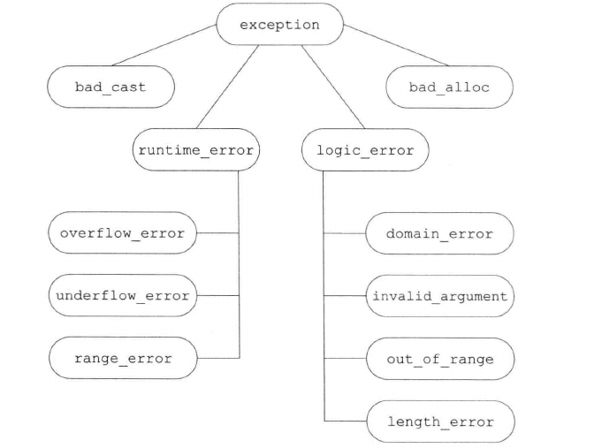

# 第十八章 用于大型程序的工具

大规模应用程序的特殊要求包括：

* 在独立开发的子系统之间协同处理错误的能力。
* 使用各种库进行协同开发的能力。
* 对比较复杂的应用概念建模的能力。

## 一、异常处理

**异常处理(exception handling)** 机制允许程序中独立开发的部分能够在运行时就出现的问题进行通信并作出相应的处理。

### 1. 抛出异常

* 一个异常如果没有被捕获，则它将终止当前的程序。
* 在栈展开的过程中，运行类类型的局部对象的析构函数。因为这些析构函数是自动执行的，所以它们不应该抛出异常。一旦在栈展开的过程中析构函数抛出了异常，并且析构函数自身没能捕获到该异常，则程序将被终止。
* 当抛出一条表达式时，该表达式的静态编译时类型决定了异常对象的类型。抛出指针要求在任何对应的处理代码存在的地方，指针所指的对象都必须存在。

### 2. 捕获异常

* 通常情况下，如果`catch`接受的异常与某个继承体系有关，则最好将该`catch`的阐述定义为引用类型。
* 如果在多个`catch`语句的类型之间存在着继承关系，则我们应该把继承链最低端的类放在前面，而将继承链最顶端的类放在后面。
* 如果`catch(...)`与其他几个`catch`语句一起出现，则`catch(...)`必须在最后的位置。出现在捕获所有异常语句后面的`catch`语句将永远不会被匹配。

### 3. 函数try语句块与构造函数

* 处理构造函数初始值异常的唯一方法是将构造函数写成函数try语句块。

### 4. noexcept异常说明

* C++11新标准中，通过提供`noexcept`说明符指定某个函数不会抛出异常。

```c++
void recoup(int) noexcept;  // 不会抛出异常
void alloc(int);    // 可能抛出异常

```

* 可以在函数指针的声明和定义中指定`noexcept`；在`typedef`或类型别名中则不能出现`noexcept`；在成员函数中，`noexcept`说明符需要跟在`const`及其引用限定符之后，`final`、`override`或虚函数的`=0`之前。
* `noexcept`可以用在两种情况下：**确定函数不会抛出异常**；**根本不知道该如何处理异常**；
* 通常情况下，编译器不能也不必在编译时验证异常说明。
* `noexcept`有两层含义：当跟在函数参数列表后面时它是异常说明符；而当作为`noexcept`异常说明的`bool`实参出现时，它是一个运算符。

### 5. 异常类层次

* **标准exception层次**:



* 书店应用程序的异常类

```c++
class out_of_staock: public std::runtime_error {
public:
    explicit out_of_stock(const std::string &s): std::runtime_error(s) {}
};

class isbn_mismatch: public std::logic_error {
    public:
    explicit isbn_mismatch(const std::string &s): std::logic_error(s) {}
    isbn_mismatch(const std::string &s, const std::string &lhs, const std::string &rhs): std::logic_error(s), left(lhs), right(rhs) {}
    const std::string left. right;
};

// 使用自定义异常类
Sales_data &Sales_data::operator += (const Sales_data& rhs) {
    if(isbn() != rhs.isbn())
        throw isbn_mismatch("wrong isbn", isbn(), rhs.isbn());
    units_sold += rhs.units_sold;
    revenue += rhs.revenue;
    return *this;
}

Sales_data item1, item2, sum;
while (cin >> item1 >> item2) {
    try {
        sum = item1 + item2;
    } catch (const isbn_mismatch &e) {
        cerr << e.what() << ": left isbn(" << e.left << ") right isbn (" << e.right << ")" << endl;
    }
}
```

## 二、命名空间

多个库将名字放置在全局命名空间中将引发**命名空间污染**。**命名空间(namespace)** 为防止名字冲突提供了更加可控的机制。

### 1. 命名空间定义

* 一个命名空间的定义包括两个部分：首先是**关键字namespace**，随后是**命名空间的名字**。在命名空间名字后面是一系列由花括号括起来的声明和定义。只要能出现在全局作用域中的声明就能置于命名空间内，主要包括：类、变量(及其初始化操作)、函数(及其定义)、模板和其他命名空间。

```c++
namespace cplusplus_primer {
    class Sales_data {};
    Sales_data operator+(const Sales_data&, const Sales_data&);
    class Query {};
    class Query_base {};
}

// 使用
cplusplus_primer::Query q = cplusplus_primer::Query("hello");
```

* 定义多个类型不相关的命名空间应该使用单独的文件分别表示每个类型(或关联类型构造的集合)。
* **未命名的命名空间**是指关键字namespace后紧跟花括号括起来的一系列声明语句。它定义的变量拥有静态生命周期；他们在第一次使用前创建，并且直到程序结束时才销毁。**和其他命名空间不同，未命名的命名空间仅在特定的文件内部有效，其作用范围不会横跨多个不同的文件**。

```c++
int i;  // i的全局声明
namespace local {
    namespace {
        int i;
    }
}

local::i = 42;
```

* **未命名的命名空间取代文件的静态声明。**

### 2. 使用命名空间成员

* 一个命名空间可以有好几个同义词或别名，所有别名都与命名空间原来的名字等价。

```c++
namespace cplusplus_primer {};

namespace primer = cplusplus_primer;
```

* **避免`using`指示**

### 3. 类、命名空间与作用域

* 对命名空间内部名字的查找遵循常规的**查找规则**：即由内向外依次查找每个外层作用域。外层作用域也可能是一个或多个嵌套的命名空间，直到最外层的全局命名空间查找过程终止。只有位于开放的块中且在使用点之前的名字才被考虑。
* 可以从函数的限定名与推断出查找名字时检查作用域的次序，限定名以相反次序指出被查找的作用域。

### 4. 重载与命名空间

`using`声明语句声明的是一个名字，而非特定的函数，也就是包括该函数的所有版本，都被引入到当前作用域中。

## 三、多重继承与虚继承

### 1. 多重继承

### 2. 类型转换与多个基类

### 3. 多重继承下的类作用域

* 当一个类拥有多个基类时，有可能出现派生类从两个或更多基类中继承了同名成员的情况。此时，不加前缀限定符直接使用该名字将引发二义性。

### 4. 虚继承

* 虚继承的目的是令某个类做出声明，承诺愿意共享它的基类。其中，共享的基类子对象成为**虚基类**。在这种机制下，不论虚基类在继承体系中出现了多少次，在派生类中都只包含唯一一个共享的虚基类子对象。
* 虚派生只影响从指定了虚基类的派生类中进一步派生出的类，它不会影响派生类本身。

### 5. 构造函数与虚继承

* h含有虚基类的对象的构造顺序与一般的顺序稍有**区别**：首先使用提供给最底层派生类构造函数的初始值初始化该对象的虚基类子部分，接下来按照直接基类在派生列表中出现的次序对其进行初始化。
* 虚基类总是先于非虚基类构造，与它们在继承体系中的次序和位置无关。
