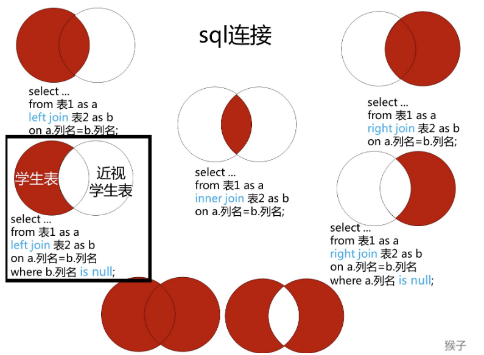

# LeetCode 数据库模块

## 175. 组合两个表

### 题目描述

```
表1: Person
+-------------+---------+
| 列名        | 类型    |
+-------------+---------+
| PersonId    | int     |
| FirstName   | varchar |
| LastName    | varchar |
+-------------+---------+
PersonId 是上表主键

表2: Address
+-------------+---------+
| 列名         | 类型    |
+-------------+---------+
| AddressId   | int     |
| PersonId    | int     |
| City        | varchar |
| State       | varchar |
+-------------+---------+
AddressId 是上表主键

编写一个 SQL 查询，满足条件：
无论 person 是否有地址信息，都需要基于上述两表提供 person 的以下信息：

FirstName, LastName, City, State
```

```sql
# 表架构

DROP TABLE IF EXISTS Person;
CREATE TABLE Person(
    PersonId INT,
    FirstName VARCHAR(255),
    LastName VARCHAR(255)
);

DROP TABLE IF EXISTS Address;
CREATE TABLE Address(
    AddressId INT,
    PersonId INT,
    City VARCHAR(255),
    State VARCHAR(255)
);

INSERT INTO Person(
    PersonId,
    FirstName,
    LastName
) VALUES (
    1,
    'Wang',
    'Allen'
);

INSERT INTO Address(
    AddressId,
    PersonId,
    City,
    State
) VALUES (
    1,
    2,
    'New York City',
    'New York'
);
```

### 错误的解法

```sql
SELECT P.FirstName, P.LastName, A.City, A.State
FROM Person AS P, Address AS A
WHERE P.PersonId = A.PersonId;
```

**原因**：没有考虑到 `Person` 表中的信息即使在 `Address` 表没有关联信息也要保留的情况。

### 左外联结解法

**分析**：对两个表进行联结操作时，考虑到 `Person` 表中的信息即使在 `Address` 表没有关联信息也要保留的情况，此时可以用左外联结，将 `Person` 表放在 `LEFT JOIN` 的左边。

```sql
SELECT FirstName, LastName, City, State
FROM Person AS P LEFT JOIN Address AS A ON P.PersonId = A.PersonId;
```

### 总结

多表的联结分为以下几种类型：

* **左联结（left join）**，联结结果保留左表的全部数据
* **右联结（right join）**，联结结果保留右表的全部数据
* **内联结（inner join）**，取两表的公共数据

## 176. 第二高的薪水

### 题目描述

```
编写一个 SQL 查询，获取 Employee 表中第二高的薪水（Salary） 。
+----+--------+
| Id | Salary |
+----+--------+
| 1  | 100    |
| 2  | 200    |
| 3  | 300    |
+----+--------+

例如上述 Employee 表，SQL查询应该返回 200 作为第二高的薪水。如果不存在第二高的薪水，那么查询应返回 null。

+---------------------+
| SecondHighestSalary |
+---------------------+
| 200                 |
+---------------------+
```

```sql
# 表架构

DROP TABLE IF EXISTS Employee;
CREATE TABLE Employee(
     Id INT,
    Salary INT
);
INSERT INTO Employee(
    Id,
    Salary
) VALUES (
    1,
    100
), (
    2,
    200
), (
    3,
    300
);
```

### 子查询和 `LIMIT` 子句解法

**分析**：使用子查询和 `LIMIT` 子句，如果不存在第二高的薪水，为了返回 `null` ，可以利用临时表。

```sql
SELECT(
    SELECT DISTINCT Salary
    FROM Employee
    ORDER BY Salary DESC
    LIMIT 1 OFFSET 1   # 从第1行开始取1行
) AS SecondHighestSalary;
```

### `IFNULL` 函数解法

**分析**：解决 `NULL` 问题的另一种方法是使用 `IFNULL` 函数。

```sql
SELECT IFNULL(
    (
        SELECT DISTINCT Salary
        FROM Employee
        ORDER BY Salary DESC
        LIMIT 1 OFFSET 1   # 从第1行开始取1行
    ), NULL
) as SecondHighestSalary;
```

### 总结

MySQL中 `ISNULL`、`IFNULL`、`NULLIF` 的用法：

* `ISNULL(expr)`：如果 `expr` 为 `NULL`，那么 `ISNULL()` 的返回值为 1，否则返回值为 0。值得注意的是， 使用 `=` 的 `NULL` 值对比通常是错误的。
* `IFNULL(expr1, expr2)`：如果 `expr1` 不为 `NULL`，则 `IFNULL()` 的返回值为 `expr1` ；否则其返回值为 `expr2` 。`IFNULL()` 的返回值是数字或是字符串，具体情况取决于其所使用的语境。
* `NULLIF(expr1, expr2)`：如果 `expr1 = expr2` 成立，那么返回值为 `NULL`，否则返回值为`expr1`。这和`CASE WHEN expr1 = expr2 THEN NULL ELSE expr1 END`相同。

`LIMIT x OFFSET y;` 等价于 `LIMIT y, x;` 即从第y行开始取x行。

## 177. 第N高的薪水

### 题目描述

```
编写一个 SQL 查询，获取 Employee 表中第 n 高的薪水（Salary）。

+----+--------+
| Id | Salary |
+----+--------+
| 1  | 100    |
| 2  | 200    |
| 3  | 300    |
+----+--------+
例如上述 Employee 表，n = 2 时，应返回第二高的薪水 200。如果不存在第 n 高的薪水，那么查询应返回 null。

+------------------------+
| getNthHighestSalary(2) |
+------------------------+
| 200                    |
+------------------------+
```

```sql
# 表架构同 176. 第二高的薪水
```

### `IFNULL` 函数解法

**分析**：单表不分组 `TOPN` 问题。解法同176. 第二高的薪水。

```sql
CREATE FUNCTION getNthHighestSalary(N INT) RETURNS INT
BEGIN
  SET N := N-1;
  RETURN (
      # Write your MySQL query statement below.
      SELECT IFNULL(
                (SELECT DISTINCT Salary
                FROM Employee
                ORDER BY Salary DESC
                LIMIT 1 OFFSET N    # 等价于 LIMIT N, 1
                ), NULL)
  );
END
```

### 总结

查看数据库函数：

```sql
SHOW FUNCTION STATUS;
```

创建一个函数：

```sql
CREATE FUNCTION test (id CHAR(100)) RETURN INTEGER;
BEGIN   -- 开始
    DECLARE temp INTEGER;   -- 声明一个变量

    SELECT COUNT(*) INTO temp   -- 做查询语句，将结果赋值给temp
    FROM demo_table
    WHERE id = id;  -- 给定条件

    RETURN temp; -- 返回结果temp

END -- 结束
```

在Linux下编写函数：

```sql
set global log_bin_trust_function_creators = 1; -- 开启 bin_log 复制函数创建
DELIMITER $$    -- 在Linux下要定义一个标识符

CREATE FUNCTION test (id CHAR(100)) RETURN INTEGER; -- 创建一个函数
BEGIN   -- 开始
    DECLARE temp INTEGER;   -- 声明一个变量

    SELECT COUNT(*) INTO temp   -- 做查询语句，将结果赋值给temp
    FROM demo_table
    WHERE id = id;  -- 给定条件

    RETURN temp; -- 返回结果temp

END $$ -- 后跟的是定义的标识符

DELIMITER $$ -- 结束
```

`binlog` 是MySQL数据库的二进制日志，用于记录用户对数据库操作的SQL语句（除了数据查询语句）信息。可以使用 `mysqlbinlog` 命令查看二进制日志的内容。

`binlog` 的格式有三种：

* **STATMENT模式**：基于SQL语句的复制(`statement-based replication, SBR`)，每一条会修改数据的SQL语句会记录到 `binlog` 中。
  * **优点**：不需要记录每一条SQL语句与每行的数据变化，这样 `binlog` 的日志也会比较少，减少了磁盘`IO`，提高性能。
  * **缺点**：在某些情况下会导致主从数据不一致。
* **ROW模式**：基于行的复制(`row-based replication, RBR`)，不记录每一条SQL语句的上下文信息，仅需记录哪条数据被修改，修改成什么样子。
  * **优点**：不会出现主从数据不一致的情况。
  * **缺点**：会产生大量的日志，尤其是`ALTER TABLE`的时候会让日志暴涨。
* **MIXED模式**：混合模式复制(`mixed-based replication, MBR`)，以上两种模式的混合使用，一般的复制使用**STATEMENT模式**保存 `binlog`，对于**STATEMENT模式**无法复制的操作使用**ROW模式**保存 `binlog`，MySQL会根据执行的SQL语句选择日志保存方式。

无论是增量备份还是主从复制，都是需要开启 `binlog` 日志，最好跟数据目录设置到不同的磁盘分区，可以降低 `IO` 等待，提升性能；并且在磁盘故障的时候可以利用 `binlog` 恢复数据。

## 178. 分数排名

### 题目描述

```
编写一个 SQL 查询来实现分数排名。

如果两个分数相同，则两个分数排名（Rank）相同。请注意，平分后的下一个名次应该是下一个连续的整数值。换句话说，名次之间不应该有“间隔”。

+----+-------+
| Id | Score |
+----+-------+
| 1  | 3.50  |
| 2  | 3.65  |
| 3  | 4.00  |
| 4  | 3.85  |
| 5  | 4.00  |
| 6  | 3.65  |
+----+-------+
例如，根据上述给定的 Scores 表，你的查询应该返回（按分数从高到低排列）：

+-------+------+
| Score | Rank |
+-------+------+
| 4.00  | 1    |
| 4.00  | 1    |
| 3.85  | 2    |
| 3.65  | 3    |
| 3.65  | 3    |
| 3.50  | 4    |
+-------+------+

重要提示：对于 MySQL 解决方案，如果要转义用作列名的保留字，可以在关键字之前和之后使用撇号。例如 `Rank`
```

```sql
# 表架构
DROP TABLE IF EXISTS Scores;
CREATE TABLE Scores (Id int, Score DECIMAL(3,2));
insert into Scores (Id, Score) values ('1', '3.5');
insert into Scores (Id, Score) values ('2', '3.65');
insert into Scores (Id, Score) values ('3', '4.0');
insert into Scores (Id, Score) values ('4', '3.85');
insert into Scores (Id, Score) values ('5', '4.0');
insert into Scores (Id, Score) values ('6', '3.65');
```

### 数学解法

**分析**：先提取出大于等于X的所有分数集合H，将H去重后的元素个数就是X的排名。

```sql
SELECT A.Score AS Score,
       (SELECT COUNT(DISTINCT B.Score)
        FROM Scores AS B
        WHERE B.Score >= A.Score) AS 'Rank'
FROM Scores AS A
ORDER BY A.Score DESC;
```

### 窗口函数解法

**分析**：涉及到排名问题，可以使用窗口函数。MySQL从8.0开始支持窗口函数。

```sql
SELECT Score, DENSE_RANK() OVER (ORDER BY Score DESC) AS 'Rank'
FROM Scores;
```

### 总结

涉及到排名问题，可以使用窗口函数，非常高效简洁。

窗口函数，也叫 `OLAP` 函数（`Online Anallytical Processing`，联机分析处理），可以对数据库数据进行实时分析处理。

```sql
# 基本语法
<窗口函数> OVER (partition by <分组的名字>
                 order by <用于排序的列名>)
```

`<窗口函数>` 主要分为两种：

* 专用窗口函数，如`rank`, `dense_rank`, `row_number`等。
* 聚合函数，如`max`,`sum`等。

从语法可以知道，窗口函数有以下功能：

* 同时具有分组（partition by）和排序（order by）的功能。
* 不减少原表的行数，所以经常用来在每组内排名。

因为窗口函数是对`where`或者`group by`子句处理后的结果进行操作，所以**窗口函数原则上只能写在select子句中**。

**`RANK()`** ：

```sql
SELECT * FROM Scores;

# 输出
+------+-------+
| Id   | Score |
+------+-------+
|    1 |  3.50 |
|    2 |  3.65 |
|    3 |  4.00 |
|    4 |  3.85 |
|    5 |  4.00 |
|    6 |  3.65 |
+------+-------+

# 使用 RANK()
SELECT Id, Score, RANK() OVER (ORDER BY Score DESC) AS 'Rank'
FROM Scores;

# 输出
+------+-------+------+
| Id   | Score | Rank |
+------+-------+------+
|    3 |  4.00 |    1 |
|    5 |  4.00 |    1 |
|    4 |  3.85 |    3 |
|    2 |  3.65 |    4 |
|    6 |  3.65 |    4 |
|    1 |  3.50 |    6 |
+------+-------+------+
```

**`DENSE_RANK()`** ：

```sql
SELECT * FROM Scores;

# 输出
+------+-------+
| Id   | Score |
+------+-------+
|    1 |  3.50 |
|    2 |  3.65 |
|    3 |  4.00 |
|    4 |  3.85 |
|    5 |  4.00 |
|    6 |  3.65 |
+------+-------+

# 使用 DENSE_RANK()
SELECT Id, Score, DENSE_RANK() OVER (ORDER BY Score DESC) AS 'Dense_Rank'
FROM Scores;

# 输出
+------+-------+------------+
| Id   | Score | Dense_Rank |
+------+-------+------------+
|    3 |  4.00 |          1 |
|    5 |  4.00 |          1 |
|    4 |  3.85 |          2 |
|    2 |  3.65 |          3 |
|    6 |  3.65 |          3 |
|    1 |  3.50 |          4 |
+------+-------+------------+
```

**`ROW_NUMBER()`** ：

```sql
SELECT * FROM Scores;

# 输出
+------+-------+
| Id   | Score |
+------+-------+
|    1 |  3.50 |
|    2 |  3.65 |
|    3 |  4.00 |
|    4 |  3.85 |
|    5 |  4.00 |
|    6 |  3.65 |
+------+-------+

# 使用 ROW_NUMBER()
SELECT Id, Score, ROW_NUMBER() OVER (ORDER BY Score DESC) AS 'ROW_NUMBER'
FROM Scores;

# 输出
+------+-------+------------+
| Id   | Score | ROW_NUMBER |
+------+-------+------------+
|    3 |  4.00 |          1 |
|    5 |  4.00 |          2 |
|    4 |  3.85 |          3 |
|    2 |  3.65 |          4 |
|    6 |  3.65 |          5 |
|    1 |  3.50 |          6 |
+------+-------+------------+
```

**聚合函数`SUM()`作为窗口函数**：

```sql
SELECT * FROM Scores;

# 输出
+------+-------+
| Id   | Score |
+------+-------+
|    1 |  3.50 |
|    2 |  3.65 |
|    3 |  4.00 |
|    4 |  3.85 |
|    5 |  4.00 |
|    6 |  3.65 |
+------+-------+

# 使用 聚合函数SUM()作为窗口函数
SELECT Id, Score, SUM(Score) OVER (ORDER BY Score DESC) AS 'SumScore'
FROM Scores;

# 输出
+------+-------+----------+
| Id   | Score | SumScore |
+------+-------+----------+
|    3 |  4.00 |     8.00 |
|    5 |  4.00 |     8.00 |
|    4 |  3.85 |    11.85 |
|    2 |  3.65 |    19.15 |
|    6 |  3.65 |    19.15 |
|    1 |  3.50 |    22.65 |
+------+-------+----------+
```

## 180. 连续出现的数字

### 题目描述

```
编写一个 SQL 查询，查找所有至少连续出现三次的数字。

+----+-----+
| Id | Num |
+----+-----+
| 1  |  1  |
| 2  |  1  |
| 3  |  1  |
| 4  |  2  |
| 5  |  1  |
| 6  |  2  |
| 7  |  2  |
+----+-----+
例如，给定上面的 Logs 表， 1 是唯一连续出现至少三次的数字。

+-----------------+
| ConsecutiveNums |
+-----------------+
| 1               |
+-----------------+
```

```sql
# 表架构
DROP TABLE IF EXISTS Logs;
CREATE TABLE Logs(
    Id INT, Num INT
);

INSERT INTO Logs(
    Id, Num
)VALUES (
    1, 1
), (
    2, 1
), (
    3, 1
), (
    4, 2
), (
    5, 1
), (
    6, 2
), (
    7, 2
);
```

### `DISTINCT`和`WHERE`语句解法

**分析**：假设连续出现的意味着相同数字的 Id 是连着的，使用 Logs 并检查是否有 3 个连续的相同数字。显然，这种解法效率很低，而且题目好像有点牵强。

```sql
SELECT DISTINCT L1.Num AS ConsecutiveNums
FROM Logs AS L1, Logs AS L2, Logs AS L3
WHERE L1.Id = L2.Id - 1 AND L2.Id = L3.Id - 1 AND L1.Num = L2.Num AND L2.Num = L3.Num;
```

### 窗口函数解法

**分析**：使用窗口函数的偏差函数 `LEAD()`。理解为：将Num复制两列Num1和Num2，然后Num1整体向上移动一行，Num2整体向上移动两行。

```sql
SELECT DISTINCT Num as ConsecutiveNums
FROM (
    SELECT Num, LEAD(Num, 1) OVER() AS Num1, LEAD(Num, 2) OVER() AS Num2
    FROM Logs
) AS C
WHERE C.Num = C.Num1 AND C.Num1 = C.Num2;
```

### 总结

`LEAD()` 函数对于计算同一结果集中当前行和后续行之间的差异非常有用。

```sql
# 语法
LEAD(<expression>[,offset[, default_value]]) OVER (
    PARTITION BY (expr)
    ORDER BY (expr)
)
```

`offset` 是从当前行向前行的行数，以获取值。`offset` 必须是一个非负整数。如果`offset` 为零，则 `LEAD()` 函数计算 `expression` 当前行的值。如果省略 `offset`，则 `LEAD()` 函数默认使用一个。如果没有后续行，则 `LEAD()` 函数返回 `default_value` 。例如，如果 `offset` 是1，则最后一行的返回值为 `default_value` 。如果您未指定 `default_value`，则函数返回 `NULL`。

```sql
# 查找每个客户的订单日期和下一个订单日期
SELECT
    customerName,
    orderDate,
    LEAD(orderDate,1) OVER (
        PARTITION BY customerNumber
        ORDER BY orderDate ) nextOrderDate
FROM
    orders
INNER JOIN customers USING (customerNumber);

# 输出
+------------------------------------+------------+---------------+
| customerName                       | orderDate  | nextOrderDate |
+------------------------------------+------------+---------------+
| Atelier graphique                  | 2013-05-20 | 2014-09-27    |
| Atelier graphique                  | 2014-09-27 | 2014-11-25    |
| Atelier graphique                  | 2014-11-25 | NULL          |
| Signal Gift Stores                 | 2013-05-21 | 2014-08-06    |
| Signal Gift Stores                 | 2014-08-06 | 2014-11-29    |
| Signal Gift Stores                 | 2014-11-29 | NULL          |
| Australian Collectors, Co.         | 2013-04-29 | 2013-05-21    |
| Australian Collectors, Co.         | 2013-05-21 | 2014-02-20    |
| Australian Collectors, Co.         | 2014-02-20 | 2014-11-24    |
| Australian Collectors, Co.         | 2014-11-24 | 2014-11-29    |
| Australian Collectors, Co.         | 2014-11-29 | NULL          |
| La Rochelle Gifts                  | 2014-07-23 | 2014-10-29    |
| La Rochelle Gifts                  | 2014-10-29 | 2015-02-03    |
| La Rochelle Gifts                  | 2015-02-03 | 2015-05-31    |
| La Rochelle Gifts                  | 2015-05-31 | NULL          |
| Baane Mini Imports                 | 2013-01-29 | 2013-10-10    |
| Baane Mini Imports                 | 2013-10-10 | 2014-10-15    |
+------------------------------------+------------+---------------+
```

## 181. 超过经理收入的员工

### 题目描述

```
EmployeeA 表包含所有员工，他们的经理也属于员工。每个员工都有一个 Id，此外还有一列对应员工的经理的 Id。

+----+-------+--------+-----------+
| Id | Name  | Salary | ManagerId |
+----+-------+--------+-----------+
| 1  | Joe   | 70000  | 3         |
| 2  | Henry | 80000  | 4         |
| 3  | Sam   | 60000  | NULL      |
| 4  | Max   | 90000  | NULL      |
+----+-------+--------+-----------+
给定 EmployeeA 表，编写一个 SQL 查询，该查询可以获取收入超过他们经理的员工的姓名。在上面的表格中，Joe 是唯一一个收入超过他的经理的员工。

+----------+
| EmployeeA |
+----------+
| Joe      |
+----------+
```

```sql
# 表架构
Create table If Not Exists EmployeeA (Id int, Name varchar(255), Salary int, ManagerId int)
insert into EmployeeA
(Id, Name, Salary, ManagerId)
values
(1, 'Joe', 70000, 3),
(2, 'Henry', 80000, 4),
(3, 'Sam', 60000, NULL),
(4, 'Max', 90000, NULL);
```

### `WHERE`语句解法

**分析**：WHERE语句中减少笛卡尔乘积的行数。

```sql
SELECT a.Name AS 'EmployeeA'
FROM EmployeeA AS a, EmployeeA AS b
WHERE a.ManagerId = b.Id AND a.Salary > b.Salary;
```

### `JOIN`语句解法

```sql
SELECT a.Name AS 'EmployeeA'
FROM EmployeeA AS a INNER JOIN EmployeeA AS b ON a.ManagerId = b.Id AND a.Salary > b.Salary;
```

### 总结

这两个解法本质是一样的。但是用联结的效率更高点。

## 182. 查找重复的电子邮箱

### 题目描述

```
编写一个 SQL 查询，查找 Person 表中所有重复的电子邮箱。

示例：

+----+---------+
| Id | Email   |
+----+---------+
| 1  | a@b.com |
| 2  | c@d.com |
| 3  | a@b.com |
+----+---------+
根据以上输入，你的查询应返回以下结果：

+---------+
| Email   |
+---------+
| a@b.com |
+---------+
说明：所有电子邮箱都是小写字母。
```

```sql
# 表架构
Create table If Not Exists Person (Id int, Email varchar(255));
Truncate table Person;
insert into Person (Id, Email) values ('1', 'a@b.com');
insert into Person (Id, Email) values ('2', 'c@d.com');
insert into Person (Id, Email) values ('3', 'a@b.com');
```

### `GROUP BY` 和临时表解法

**分析**：看到“找重复”的关键字眼，一般要用 `group by` 分组，因为 `where` 不能过滤分组，可以用一个临时表保存分组结果然后过滤。

```sql
select Email
from (
    select Email, count(Email) as num
    from Person
    group by Email
 ) as tempTable
where num > 1;
```

### `GROUP BY` 和 `HAVING` 解法

**分析**：`where` 过滤行，而 `having` 可以过滤分组。

```sql
select Email
from Person
group by Email
having count(Email) > 1;
```

### 总结

* 必须要记住的优先顺序：`where` > `group by` > `having` > `order by`

* `where` 子句无法与聚合函数一起使用。

* 找出重复出现 `n` 次的数据，只需要改变 `having` 语句中的条件即可

```sql
select 列名
from 表名
group by 列名
having count(列名) > n;
```

## 183. 从不订购的客户

### 题目描述

```
某网站包含两个表，Customers 表和 Orders 表。编写一个 SQL 查询，找出所有从不订购任何东西的客户。

Customers 表：

+----+-------+
| Id | Name  |
+----+-------+
| 1  | Joe   |
| 2  | Henry |
| 3  | Sam   |
| 4  | Max   |
+----+-------+
Orders 表：

+----+------------+
| Id | CustomerId |
+----+------------+
| 1  | 3          |
| 2  | 1          |
+----+------------+
例如给定上述表格，你的查询应返回：

+-----------+
| Customers |
+-----------+
| Henry     |
| Max       |
+-----------+
```

```sql
# 表架构
Create table If Not Exists Customers (Id int, Name varchar(255));
Create table If Not Exists Orders (Id int, CustomerId int);
Truncate table Customers;
insert into Customers (Id, Name) values ('1', 'Joe');
insert into Customers (Id, Name) values ('2', 'Henry');
insert into Customers (Id, Name) values ('3', 'Sam');
insert into Customers (Id, Name) values ('4', 'Max');
Truncate table Orders;
insert into Orders (Id, CustomerId) values ('1', '3');
insert into Orders (Id, CustomerId) values ('2', '1');
```

### 常规排除解法

**分析**：常规解法。

```sql
select Name as Customers
from Customers
where Id not in (
    select CustomerId
    from Orders
);
```

### 左联结解法

**分析**：左联结很适合找在A中但不再B中的类型。

```sql
select c.Name as Customers
from Customers as c left join Orders as o on c.Id = o.CustomerId
where o.CustomerId is null;
```

### 总结

对于多表联结问题，**一张图**就够了，`left join` 意思是左边的全保留，如果左边的和右边的不符合 `on` 的条件，那么左边对应右边的列自动为 `null`。



<center> 图出自《图解SQL面试题》</center>

## 184. 部门工资最高的员工

### 题目描述

```
Employee 表包含所有员工信息，每个员工有其对应的 Id, salary 和 department Id。

+----+-------+--------+--------------+
| Id | Name  | Salary | DepartmentId |
+----+-------+--------+--------------+
| 1  | Joe   | 70000  | 1            |
| 2  | Jim   | 90000  | 1            |
| 3  | Henry | 80000  | 2            |
| 4  | Sam   | 60000  | 2            |
| 5  | Max   | 90000  | 1            |
+----+-------+--------+--------------+
Department 表包含公司所有部门的信息。

+----+----------+
| Id | Name     |
+----+----------+
| 1  | IT       |
| 2  | Sales    |
+----+----------+
编写一个 SQL 查询，找出每个部门工资最高的员工。对于上述表，您的 SQL 查询应返回以下行（行的顺序无关紧要）。

+------------+----------+--------+
| Department | Employee | Salary |
+------------+----------+--------+
| IT         | Max      | 90000  |
| IT         | Jim      | 90000  |
| Sales      | Henry    | 80000  |
+------------+----------+--------+
解释：

Max 和 Jim 在 IT 部门的工资都是最高的，Henry 在销售部的工资最高。
```

```sql
# 表架构
Create table If Not Exists Employee (Id int, Name varchar(255), Salary int, DepartmentId int);
Create table If Not Exists Department (Id int, Name varchar(255));
Truncate table Employee;
insert into Employee (Id, Name, Salary, DepartmentId) values (1, 'Joe', '70000', 1);
insert into Employee (Id, Name, Salary, DepartmentId) values (2, 'Jim', '90000', 1);
insert into Employee (Id, Name, Salary, DepartmentId) values (3, 'Henry', '80000', 2);
insert into Employee (Id, Name, Salary, DepartmentId) values (4, 'Sam', '60000', 2);
insert into Employee (Id, Name, Salary, DepartmentId) values (5, 'Max', '90000', 1);
Truncate table Department;
insert into Department (Id, Name) values (1, 'IT');
insert into Department (Id, Name) values (2, 'Sales');
```

### 内联结和 `IN` 解法

**分析**：先把两个表内联结，然后用 `IN` 语句查询结果是否在部门内最高工资的临时表中。

```sql
select d.name as 'Department', e.name as 'Employee', Salary
from Employee as e inner join Department as d on e.DepartmentId = d.Id
where (e.DepartmentId, Salary) in (
    select DepartmentId, max(Salary)
    from Employee
    group by DepartmentId
);
```

### 总结

多用联结。

## 185. 部门工资前三高的所有员工

### 题目描述

```
Employee 表包含所有员工信息，每个员工有其对应的工号 Id，姓名 Name，工资 Salary 和部门编号 DepartmentId 。

+----+-------+--------+--------------+
| Id | Name  | Salary | DepartmentId |
+----+-------+--------+--------------+
| 1  | Joe   | 85000  | 1            |
| 2  | Henry | 80000  | 2            |
| 3  | Sam   | 60000  | 2            |
| 4  | Max   | 90000  | 1            |
| 5  | Janet | 69000  | 1            |
| 6  | Randy | 85000  | 1            |
| 7  | Will  | 70000  | 1            |
+----+-------+--------+--------------+
Department 表包含公司所有部门的信息。

+----+----------+
| Id | Name     |
+----+----------+
| 1  | IT       |
| 2  | Sales    |
+----+----------+
编写一个 SQL 查询，找出每个部门获得前三高工资的所有员工。例如，根据上述给定的表，查询结果应返回：

+------------+----------+--------+
| Department | Employee | Salary |
+------------+----------+--------+
| IT         | Max      | 90000  |
| IT         | Randy    | 85000  |
| IT         | Joe      | 85000  |
| IT         | Will     | 70000  |
| Sales      | Henry    | 80000  |
| Sales      | Sam      | 60000  |
+------------+----------+--------+
解释：

IT 部门中，Max 获得了最高的工资，Randy 和 Joe 都拿到了第二高的工资，Will 的工资排第三。销售部门（Sales）只有两名员工，Henry 的工资最高，Sam 的工资排第二。
```

```sql
# 表架构
Create table If Not Exists Employee (Id int, Name varchar(255), Salary int, DepartmentId int);
Create table If Not Exists Department (Id int, Name varchar(255));
Truncate table Employee;
insert into Employee (Id, Name, Salary, DepartmentId) values ('1', 'Joe', '85000', '1');
insert into Employee (Id, Name, Salary, DepartmentId) values ('2', 'Henry', '80000', '2');
insert into Employee (Id, Name, Salary, DepartmentId) values ('3', 'Sam', '60000', '2');
insert into Employee (Id, Name, Salary, DepartmentId) values ('4', 'Max', '90000', '1');
insert into Employee (Id, Name, Salary, DepartmentId) values ('5', 'Janet', '69000', '1');
insert into Employee (Id, Name, Salary, DepartmentId) values ('6', 'Randy', '85000', '1');
insert into Employee (Id, Name, Salary, DepartmentId) values ('7', 'Will', '70000', '1');
Truncate table Department;
insert into Department (Id, Name) values ('1', 'IT');
insert into Department (Id, Name) values ('2', 'Sales');
```

### 窗口函数解法

**分析**： 多表分组 `TOPN` 问题。每组最大的N条记录。这类问题涉及到“既要分组，又要排序”的情况，要能想到用窗口函数来实现。

```sql
select  d.Name as Department, a.Name as Employee, a.Salary as Salary
from (
    select *, dense_rank() over (partition by DepartmentId
                                 order by Salary desc) as salary_rank
    from Employee
) as a, Department as d
where salary_rank <= 3 and a.DepartmentId = d.Id;
```

### 总结

`TOPN` 问题，一般分为单表不分组、多表不分组、单表分组、多表分组。单表不分组一般用 `limit` 子句就能解决，多表不分组一般用 `limit` 子句加上联结就能解决。单表分组、多表分组一般用窗口函数和联结解决。

涉及到“既要分组，又要排序”的情况，要能想到用窗口函数来实现。

## 196. 删除重复的电子邮箱

### 题目描述

```
编写一个 SQL 查询，来删除 Person 表中所有重复的电子邮箱，重复的邮箱里只保留 Id 最小 的那个。

+----+------------------+
| Id | Email            |
+----+------------------+
| 1  | john@example.com |
| 2  | bob@example.com  |
| 3  | john@example.com |
+----+------------------+
Id 是这个表的主键。
例如，在运行你的查询语句之后，上面的 Person 表应返回以下几行:

+----+------------------+
| Id | Email            |
+----+------------------+
| 1  | john@example.com |
| 2  | bob@example.com  |
+----+------------------+

提示：

执行 SQL 之后，输出是整个 Person 表。
使用 delete 语句。
```

```sql
# 表架构


```

### 解法

**分析**：

```sql

```

### 总结

## 197. 上升的温度

### 题目描述

```

```

```sql
# 表架构


```

### 解法

**分析**：

### 总结

## 262. 行程和用户

### 题目描述

```

```

```sql
# 表架构


```

### 解法

**分析**：

### 总结

## 595. 大的国家

### 题目描述

```

```

```sql
# 表架构


```

### 解法

**分析**：

### 总结

## 596. 超过5名学生的课

### 题目描述

```

```

```sql
# 表架构


```

### 解法

**分析**：

### 总结

## 601. 体育馆的人流量

### 题目描述

```

```

```sql
# 表架构


```

### 解法

**分析**：

### 总结

## 620. 有趣的电影

### 题目描述

```

```

```sql
# 表架构


```

### 解法

**分析**：

### 总结

## 626. 换座位

### 题目描述

```

```

```sql
# 表架构


```

### 解法

**分析**：

### 总结

## 627. 交换工资

### 题目描述

```

```

```sql
# 表架构


```

### 解法

**分析**：

### 总结
