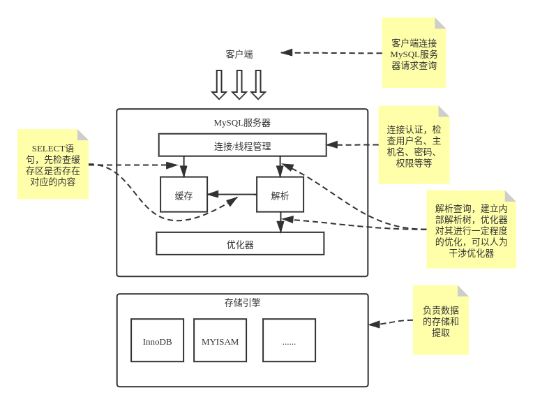

# 高性能MySQL

## 简介

《高性能MySQL》第一部分的学习笔记和总结，包括其基础部分，即**第一章到第七章**。

[书籍链接](https://book.douban.com/subject/23008813/)

[电子书提取码: 待更新](.)

## MySQL架构与历史

MySQL并不完美，却足够灵活，能够适应高要求的环境。MySQL既可以嵌入到应用程序中，也可以支持数据仓库、内容索引和部署软件、高可用的冗余系统、在线事务处理系统(OLTP)等各种应用类型。

### MySQL逻辑架构

MySQL服务器逻辑架构图：



第一层并不是MySQL独有的，大多数基于网络的客户端/服务器的工具或者服务都有类似的架构。

第二层是MySQL的核心服务功能，包括查询解析、分析、优化、缓存以及所有的内置函数，所有跨存储引擎的功能都在这一层实现：存储过程、触发器、视图等。

第三层包含了存储引擎，存储引擎负责MySQL中数据的存储和提取。存储引擎不会去解析SQL，不同存储引擎之间也不会相互通信，而只是简单地响应上层服务器的请求。

#### 连接管理与安全性

每个客户端连接都会在服务器进程中拥有一个线程，这个连接的查询智只会在这个单独的线程中执行。服务器会负责缓存线程，因此不需要为没一个新建的连接创建或销毁线程。

#### 优化与执行

MySQL会解析查询，并创建内部解析树，然后对其进行各种优化，包括重写查询、决定表的读取顺序，以及选择合适的索引等。可以通过特殊的关键字提示优化器等人为干扰优化器。

### 并发控制

#### 读写锁

在处理并发读或者写时，可以通过实现一个由两种类型的锁组成的锁系统来解决问题。这两种类型的锁通常被称为共享锁和排它锁，或者读锁和写锁。

读锁是共享的，或者说是相互不阻塞的。多个客户在同一时刻可以同时读取同一资源，而互不干扰。写锁是排它的，也就是说一个写锁会阻塞其他的写锁和读锁。

#### 锁粒度

一种提高共享资源并发性的方式就是让锁定对象更有选择性，尽量只锁定修改的部分数据，而不是所有的资源。

任何时候，在给定的资源上，锁定的数据量越少，则系统的并发程序越高，只要相互之间不发生冲突即可。

显然，加锁也需要消耗资源。所谓的锁策略，不过就是在锁的开销和数据的安全性之间寻找平衡罢了。MySQL提供了多种选择，每种MySQL存储引擎都可以实现自己的锁策略和锁粒度。

两种最重要的**锁策略**：

* **表锁**：它是MySQL中最基本的锁策略，也是开销最小的策略。它会锁定整张表，一个用户对表进行写操作，需要先获得写锁，这会阻塞其他用户对该表的所有读写操作。尽管存储引擎可以管理自己的锁，但是MySQL本身还是会使用各种有效的表锁来实现不同的目的。例如：服务器会为某些语句使用表锁，而忽略存储引擎的锁机制。
* **行级锁**：它可以最大限度地支持并发处理，但是也带来了最大的锁开销。行级锁只在存储引擎层实现。

### 事务

事务就是一组原子性的SQL查询，或者说一个独立的工作单元。事务内的语句，要么全部执行成功，要么全部执行失败。

银行应用是解释事务必要性的的一个经典例子。假设一个银行的数据库有两张表：支票(checking)表和储蓄(savings)表。现在从用户A的支票账户转移1000元到他的储蓄账户，那么至少需要三个步骤：

* 检查支票账户的余额高于1000元。
* 从支票账户余额减去1000元。
* 在储蓄账户余额中增加1000元。

这三个步骤必须打包在一个事务中，任何一个步骤失败，则必须回滚所有的步骤。

```sql
start transaction;
select balance from checking where customer_id = 1234;
update checking set balance = balance - 1000 where customer_id = 1234;
update savings set balance = balance + 1000 where customer_id = 1234;
commit;
```

单纯的事务并不能完全解决问题。如果执行到第四条语句时服务器崩溃了呢？如果在执行第三条和第四条语句之间时，另外一个进程要删除支票账户的所有余额呢？

所以一个运行良好的事务处理系统必须通过严格的`ACID`测试，才有可能完全解决问题。

* **原子性(`Atomicity`)** ：一个事务被视为一个不可分割的最小工作单元，整个事务的所有操作要么全部提交成功，要么全部失败回滚。对于一个事务来说，不可能只执行其中的一部分操作。
* **一致性(`Consistency`)** ：数据库总是从一个一致性的状态转换到另外一个一致性的状态。即使中途崩溃。因为事务没有提交，所以事务中所做的修改也不会被保存到数据库中。
* **隔离性(`Isolation`)** ：**通常来说**，一个事务的修改在最终提交之前，对其他事务是不可见的。由不同的隔离级别决定。
* **持久性(`Durability`)** ：一旦事务提交，则其所有的修改就会永远保存到数据库中。持久性是个模糊的概念，因为实际上持久性也分为很多不同的级别。

但是就像锁粒度那样，保证`ACID`特性也需要额外的资源。但是这也则正是MySQL存储引擎架构可以发挥优势的地方，用户可以根据业务是否需要事务处理，来选择合适的引擎。`MyISAM`和`InnoDB`是两种最常使用的引擎，前者不支持明确的事务处理管理，而后者支持。

#### 隔离级别

在SQL标准中定义了四种隔离级别，每一种级别都规定了一个事务中所做的修改，哪些在事务内和事务间是可见的，哪些是不可见的。

较低级别的隔离通常可以执行更高的并发，系统的开销也更低。

**四种隔离级别**：

* `READ UNCOMMITTED`(**未提交读**)：事务中的修改，即使没有提交，对其他事务也都是可见的。事务可以读取未提交的数据，这也被成为**脏读**(`Dirty Read`)。这种级别会导致很多问题，从性能上讲，它不会比其他级别好很多，在实际应用一般很少使用它。
* `READ COMMITTED`(**提交读**)：一个事务提交之前，所做的任何修改对其他事务都是不可见的。它也被称为**不可重复读**，因为两次执行同样的查询，可能会得到不一样的结果。大多数数据库系统的默认隔离级别都是提交读，但是MySQL不是。
* `REPEATABLE READ`(**可重复读**)：它保证了在同一个事务中多次读取同样记录的结果是一致的，解决了脏读的问题。但是在理论上，他还是无法解决另外一个**幻读**(`Phantom Read`)的问题，所谓幻读，指的是当某个事务在读取某个范围内的记录时，另外一个事务又在该范围内插入了新的记录，当之前的事务再次读取该范围的记录时，会产生**幻行**(`Phantom Row`)。InnoDB等存储引擎通过**多版本并发控制**(`MVCC`)解决了幻读的问题。MySQL默认隔离级别是可重复读。
* `SERIALIZABLE`(**可串行化**)：它是最高的隔离级别。它通过强制事务执行，避免了前面说的幻读的问题。即它会在读取每一行数据上都加锁，所以可能导致大量的超时和锁争用的问题。在实际应用一般很少使用它。

总结：

| 隔离级别 | 脏读可能性 | 不可重复读可能性 | 幻读可能性 | 加锁读 |
| :--- | :--- | :--- | :--- | :--- |
| 未提交读 | Y | Y | Y | N |
| 提交读 | N | Y | Y | N |
| 可重复读 | N | N | Y |  N|
| 可串行化 | N | N | N | N |

#### 死锁

死锁是指两个或多个事务在同一个资源上相互占用，并请求锁定对方占用的资源，从而导致恶性循环的现象。

当多个事务以不同的顺序锁定资源时，就可能产生死锁。多个事务同时锁定同一个资源时，也会产生死锁。

两个事务同时处理Products表：

```sql
# 事务A
start transaction;
update Products set price = 10 where id = 4;
update Products set price = 15 where id = 3;
commit;
```

```sql
# 事务B
start transaction;
update Products set price = 34 where id = 3;
update Products set price = 12 where id = 4;
commit;
```

如果两个事务都执行了第一条update语句，更新了一行数据，同时也锁定了该行数据，接着执行第二条update语句时就会产生死锁。

为了解决这种问题，数据库系统实现了各种死锁检测和死锁超时机制。一种好的方式是，检测到死锁的循环依赖，并立即返回一个错误。一种不太好的方式是，当查询的时间达到锁等待超时的设定后放弃锁请求。

InnoDB目前处理死锁的方式是，将持有最少行级排它锁的事务进行回滚。

锁的行为和顺序是和存储引擎相关的，用同样的顺序执行语句，有的存储引擎可能会死锁，有的可能不会。死锁产生的双重原因：真正的数据冲突导致；存储引擎的实现方式导致。

#### 事务日志

事务日志可以帮助提高事务的效率。使用事务日志，存储引擎在修改表的数据时只需要修改其内存拷贝，再把修改行为记录到持久在硬盘上的事务日志中，而不用每次都将修改的数据本身持久到磁盘。

事务日志采用的是追加的方式，因此写日志的操作是磁盘上一小快区域的顺序IO，速度相对较快。事务日志持久以后，内存中被修改的数据在后台可以慢慢刷回磁盘，这被称之为**预写式日志**，修改数据需要写两次磁盘。

#### MySQL中的事务

**自动提交(`autocommit`)** ：

MySQL默认采用自动提交(autocommit)模式。即如果不是显式地开始一个事务，则每个查询都被当作一个事务执行提交操作。

```sql
# 查看自动提交模式状态
show variables like 'autocommit';

# 输出
+---------------+-------+
| Variable_name | Value |
+---------------+-------+
| autocommit    | ON    |
+---------------+-------+

# 并更改，1或者ON表示启用，0或者OFF表示禁用
set autocommit = 1;
```

```sql
# 查看事务隔离级别
select @@tx_isolation;

# 输出
+-----------------+
| @@tx_isolation  |
+-----------------+
| REPEATABLE-READ |
+-----------------+

# 设置事务隔离级别
set session transaction ioslation level read committed;
```

**在事务中混合使用存储引擎**：

如果在事务中混合使用了事务型和非事务型的表(例如InnoDB表和MyISAM表)，在正常提交的情况下不会有什么问题。但是如果该事务需要回滚，非事务型的表上的更改就无法撤销，这种情况很难修复，事务的最终结果将无法确定。

**隐式和显式锁定**：

InnoDB采用的是**两阶段锁定协议**。在事务执行过程中，随时可以执行锁定，锁只有在执行COMMIT或ROLLBACK的时候才会释放，并且所有的锁在同一时刻被释放，这被称为隐式锁定。

InnoDB也支持通过特定语句进行显式锁定：

```sql
select ... lock in share mode;
select ... for update;
```

**注意**：建议除了事务中禁用了AUTOCOMMIT，可以使用LOCK TABLES之外。其他任何时候都不要显式使用LOCK TABLES。

### 多版本并发控制

可以认为MVCC是行级锁的一个变种，但是它在很多情况下都避免了加锁操作，因此开销更低。虽然实现机制有所不同，但大都实现了非阻塞的读操作，写操作也只锁定必要的行。

MVCC的实现，**是通过保存数据在某个时间点的快照来实现的**。根据事务开始的时间不同，每个事务对同一张表，同一个时刻看到的数据都是一致的。

不同的存储引擎的MVCC实现是不同的，典型的有**乐观并发控制**和**悲观并发控制**。

**MVCC的工作流程**：

InnoDB的MVCC，**是通过在每行记录后面保存两个隐藏的列来实现的**。这两个列，一个保存了行的创建时间，一个保存了行的过期时间(或删除时间)，这里的时间指的是系统版本号。每开始一个新的事务，系统版本号都会自动递增。事务开始时刻的系统版本号会作为事务的版本号，用来和查询到的每行记录的版本号进行比较。

**可重复读隔离级别下，InnoDB的MVCC的具体操作**：

* `SELECT`：会根据以下两个条件检查每行记录，只有符合这两个条件，才能返回查询结果。
  * 只查找行的系统版本号小于或等于食物的系统版本号，这样可以确保事务读取的行，要么是在事务开始前就已经存在的，要么是事务自身插入或者修改过的。
  * 行的删除版本要么未定义，要么大于当前事务系统版本号。这样可以确保事务读取到的行，在事务开始之前未被和删除。
* `INSERT`：为插入的每一行保存当前系统版本号作为行版本号。
* `DELETE`：为删除的每一行保持当前系统版本好作为删除标识。
* `UPDATE`：为插入一行新记录，保存当前系统版本号作为行版本号，同时保存当前系统版本号到原来的行作为行删除标识。

MVCC只在提交读和可重复读两个隔离级别下工作，其他两个级别都不兼容MVCC。因为未提交读总是读取最新的数据行，而不是当前事务版本的数据行。可串行化则会对所有的行都加锁。

### MySQL的存储引擎

#### InnoDB存储引擎

* InnoDB的数据存储在表空间中，表空间是由InnoDB管理的一个黑盒子，有一系列的数据文件组成。
* InnoDB采用MVCC来支持高并发，并且实现了四个标准的隔离级别，默认为可重复读。并且通过间隙锁策略防止幻读的出现，间隙锁使得InnoDB不仅仅锁定查询涉及的行，还会对索引中的间歇进行锁定，以防止幻影行的插入。
* InnoDB表是基于聚簇索引建立的，聚簇索引对主键查询有很高的性能。
* InnoDB通过一些机制和工具支持真正的热备份。

#### MyISAM存储引擎

* 不支持事务和行级锁，而且崩溃后无法安全恢复。
* 它的数据以紧密格式存储，如果表在创建并导入数据以后，不会再进行修改操作，那么十分适合该引擎。

#### 选择合适的存储引擎

主要从以下几个方面考虑：

* **事务**：需要事务支持，推荐InnoDB。
* **备份**：需要在线热备份，推荐InnoDB。
* **崩溃恢复**：MyISAM崩溃后发生损坏的概率比InnoDB高很多，而且恢复速度也很慢。
* **特有的特性**：比如只有MyISAM支持地理空间搜索。

#### 转换表的引擎

**方法1**：`ALTER TABLE`

```sql
alter table mytable engine = InnoDB;
```

这种方法适用与任何存储引擎，但是需要执行很长时间。因为MySQL会执行将数据从原表复制到一张新的表中，在复制期间可能会消耗系统所有的I/O能力，同时原表会加上读锁。

**方法2**：导出和导入

使用`mysqldump`工具将数据导出到文件。

**方法3**：创建和查询

先创建一个新的存储引擎的表，然后利用`INSERT ... SELECT`语法来导数据。如果数据量太大，可以考虑分批处理，针对每一段数据执行事务提交操作。

## MySQL基准测试

### 为什么需要基准测试

### 基准测试的策略

#### 测试何种指标

考虑以下指标，看看如何满足测试的需求：

* 吞吐量：指的是单位时间内的事务处理数。常见的测试单位是每秒事务数(`TPS`)。
* 响应时间或者延迟：用于测试任务所需的整体时间。
* 并发性：关注的是正在工作中的并发操作，或者是同时工作中的线程数或者连接数。当并发性增加时，需要测量吞吐量是否下降，响应时间是否变长。
* 可扩展性：指的是给系统增加一倍的工作，在理想情况下就能获得两倍的结果。

## 服务器性能剖析

### 性能优化简介

## Schema与数据类型优化

## 创建高性能的索引

## 查询性能优化

## MySQL高级特性
