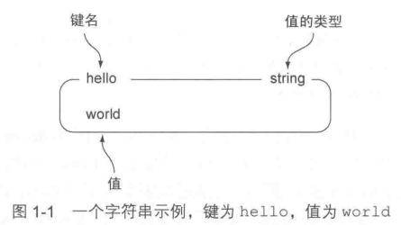
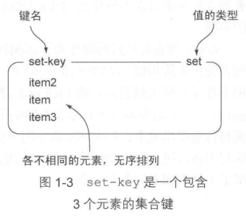
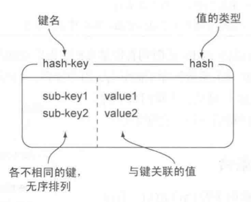
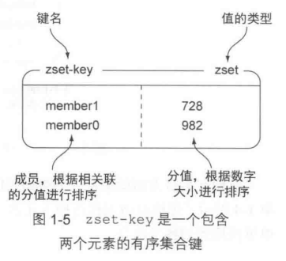
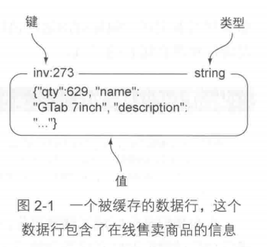
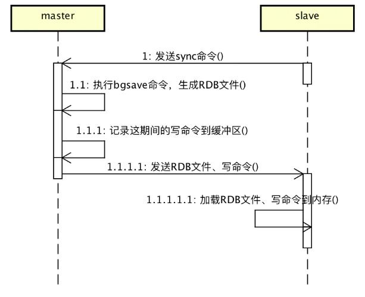
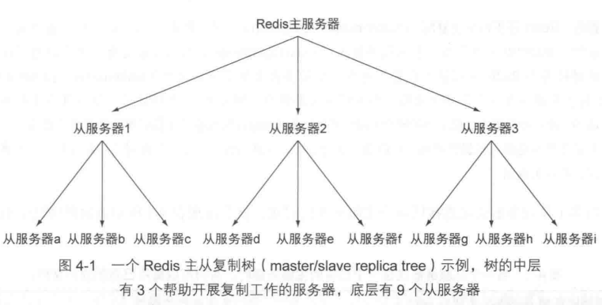
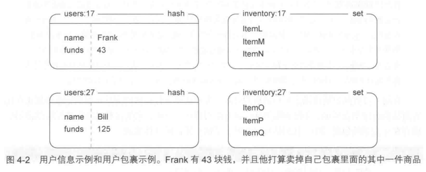
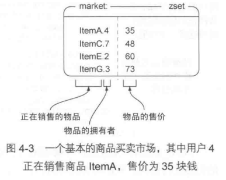

# Redis实战

## 简介

《Redis实战》的学习笔记和总结。

[书籍链接](https://book.douban.com/subject/26612779//)
[电子书提取码: 待更新](.)

## 初识 Redis

### Redis 简介

Redis 是一个速度非常快的键值对存储数据库，它可以存储键和五种不同类型的值之间的映射，可以将存储在内存的键值对数据持久化到硬盘，可以使用复制特性来扩展读性能，还可以使用客户端分片老扩展写性能。

Redis 的优点：

* **速度快**：
  * 因为数据存在内存中，类似于 HashMap ，HashMap 的优势就是查找和操作的时间复杂度都是O (1) 。
  * Redis 本质上是一个 Key-Value 类型的内存数据库，很像 Memcached ，整个数据库统统加载在内存当中进行操作，定期通过异步操作把数据库数据 flush 到硬盘上进行保存。fork子进程持久化。
  * 因为是纯内存操作，Redis 的性能非常出色，每秒可以处理超过 10 万次读写操作，是已知性能最快的 Key-Value 数据库。
* **支持丰富数据类型**: String ，List，Set，Sorted Set，Hash 。
* **有丰富的特性**：订阅发布功能、Key 过期策略、事务、支持多个 DB、计数等等。
* **持久化存储**：Redis 提供 RDB 和 AOF 两种数据的持久化存储方案，解决内存数据库最担心的万一 Redis 挂掉，数据会消失掉的情况。

Redis 的缺点：

* **数据量限制**：由于 Redis 是内存数据库，所以单台机器存储的数据量跟机器本身的内存大小有段。虽然 Redis 本身有 Key 过期策略，但是还是需要提前预估和节约内存。如果内存增长过快，需要定期删除数据。
* **线程限制**：Redis 是单线程的，单台服务器无法充分利用多核服务器的 CPU。

Redis的使用场景：

* **缓存**：缓存现在几乎是所有中大型网站都在用的必杀技，合理的利用缓存不仅能够提升网站访问速度，还能大大降低数据库的压力。Redis提供了键过期功能，也提供了灵活的键淘汰策略，所以，现在Redis用在缓存的场合非常多。
* **排行榜**：很多网站都有排行榜应用的，如京东的月度销量榜单、商品按时间的上新排行榜等。Redis提供的有序集合数据类构能实现各种复杂的排行榜应用。
* **计数器**：什么是计数器，如电商网站商品的浏览量、视频网站视频的播放数等。为了保证数据实时效，每次浏览都得给+1，并发量高时如果每次都请求数据库操作无疑是种挑战和压力。Redis提供的incr命令来实现计数器功能，内存操作，性能非常好，非常适用于这些计数场景。
* **分布式会话**：集群模式下，在应用不多的情况下一般使用容器自带的session复制功能就能满足，当应用增多相对复杂的系统中，一般都会搭建以Redis等内存数据库为中心的session服务，session不再由容器管理，而是由session服务及内存数据库管理。
* **分布式锁**：在很多互联网公司中都使用了分布式技术，分布式技术带来的技术挑战是对同一个资源的并发访问，如全局ID、减库存、秒杀等场景，并发量不大的场景可以使用数据库的悲观锁、乐观锁来实现，但在并发量高的场合中，利用数据库锁来控制资源的并发访问是不太理想的，大大影响了数据库的性能。可以利用Redis的setnx功能来编写分布式的锁，如果设置返回1说明获取锁成功，否则获取锁失败，实际应用中要考虑的细节要更多。
* **社交网络**：点赞、踩、关注/被关注、共同好友等是社交网站的基本功能，社交网站的访问量通常来说比较大，而且传统的关系数据库类型不适合存储这种类型的数据，Redis提供的哈希、集合等数据结构能很方便的的实现这些功能。
* **最新列表**：Redis列表结构，LPUSH可以在列表头部插入一个内容ID作为关键字，LTRIM可用来限制列表的数量，这样列表永远为N个ID，无需查询最新的列表，直接根据ID去到对应的内容页即可。
* **消息系统**：消息队列是大型网站必用中间件，如ActiveMQ、RabbitMQ、Kafka等流行的消息队列中间件，主要用于业务解耦、流量削峰及异步处理实时性低的业务。Redis提供了发布/订阅及阻塞队列功能，能实现一个简单的消息队列系统。另外，这个不能和专业的消息中间件相比。

### Redis 数据结构简介

五种结构：

| 结构类型 | 结构存储的值 | 结构的读写能力 |
| :--- | :--- | :--- |
| STRING | 可以是字符串、整数或者浮点数 | 对整个字符串或者字符串的其中一部分执行操作；对整数和浮点数执行自增或者自减操作 |
| LIST | 一个链表，链表上的每个节点都包含了一个字符串 | 从链表的两端推入或者弹出元素；根据偏移量对链表进行修剪；读取单个或者多个元素；根据值查找或者移除元素 |
| SET | 包含字符串的无序收集器，并且被包含的每个字符串都是独一无二、各不相同的 | 添加、获取、移除单个元素；检查一个元素是否存在于集合中；计算交集、并集、差集；从集合中随机获取元素 |
| HASH | 包括键值对的无序散列表 | 添加、获取、移除单个键值对；获取所有键值对 |
| ZSET | 字符串成员与浮点数之间的有序映射，元素的排列顺序由分值的大小决定 | 添加、获取、删除单个元素；根据分值范围或者成员来获取元素 |

### Redis 中的字符串

字符串类型是二进制安全的。意思是 redis 的字符串可以包含任何数据。比如 jpg 图片或者序列化的对象。

字符串类型是 Redis 最基本的数据类型，字符串类型的值最大能存储 512MB。



| 命令| 行为 | Python |
| :--- | :--- | :--- |
| `SET key value`  | 设置指定 key 的值 | `conn.set("new-string-key", "")` |
| `GET key` | 获取指定 key 的值 | `conn.get("new-string-key")` |
| `SETRANGE key offset value` | 用 value 参数覆写给定 key 所储存的字符串值，从偏移量 offset 开始 | `conn.setrange("new-string-key", 0, "H")` `conn.setrange("new-string-key", 11, ", how are you?")` |
| `GETRANGE key start end` | 返回 key 中字符串值的子字符 | `conn.getrange("new-string-key", 3, 7)` |
| `MSET key value [key value ...]` | 同时设置一个或多个 key-value 对 | `conn.mset(k1="v1", k2="v2")` |
| `MGET key1 [key2...]` | 获取所有(一个或多个)给定 key 的值 | `conn.mget("another-key", "getset-key")` |
| `GETSET key value` | 将给定 key 的值设为 value ，并返回 key 的旧值 | `conn.getset("getset-key", 1)` |
| `INCR key` | 将 key 中储存的数字值增一 | `conn.incr("key")` |
| `INCRBY key increment` | 将 key 所储存的值加上给定的增量值 | `conn.incr("key", 15)` |
| `INCRBYFLOAT key increment` | 将 key 所储存的值加上给定的浮点增量值 | `conn.incrbyfloat("key", 0.5)` |
| `DECR key` | 将 key 中储存的数字值减一 | `conn.decr("key")` |
| `DECRBY key decrement` | key 所储存的值减去给定的减量值 | `conn.decr("key", 15)` |
| `APPEND key value` | 如果 key 已经存在并且是一个字符串， APPEND 命令将指定的 value 追加到该 key 原来值（value）的末尾 | `conn.append("new-string-key", "hello ")` |
| `SETBIT key offset value` | 对 key 所储存的字符串值，设置或清除指定偏移量上的位 | `conn.setbit("another-key", 2, 1)` |
| `GETBIT key offset` | 对 key 所储存的字符串值，获取指定偏移量上的位 | `conn.getbit("another-key", 2)` |
| `BITCOUNT key [start end]` | 统计二进制位串里面值为 1 的二进制位的数量，如果给定了可选的 start 和 end 偏移量，那么只对这个范围进行统计 | `conn.bitcount("another-key", 0, 7)` |
| `BITOP operation dest-key key1 [key2...]` | 对一个或多个二进制位串执行包括并、或、异或、非在内的任意一种按位运算操作，并将计算计算得出的结果保存在 dest-key键里面 | `conn.bitop("NOT", "bitop-key", "another-key")` |
| `SETEX key seconds value` | 将值 value 关联到 key ，并将 key 的过期时间设为秒 | `conn.setex("setex-key", 5, 10)` |
| `PSETEX key milliseconds value` | 和 SETEX 命令相似，但它以毫秒为单位设置 | `conn.psetex("psetex-key", 5, 10)` |
| `SETNX key value` | 只有在 key 不存在时设置 key 的值 | `conn.setnx("setex-key", 10)` |
| `STRLEN key` | 返回 key 所储存的字符串值的长度 | `conn.strlen("another-key")` |

### Redis 中的列表

Redis中的列表是简单的字符串列表，按照插入顺序排序，可以添加一个元素到列表的头部或者尾部。

一个列表最多可以包含 2^32 - 1 个元素 (40多亿)。


| 命令| 行为 | Python |
| :--- | :--- | :--- |
| `RPUSH key value1 [value2]` | 将一个或多个值推入列表的右端 | `conn.rpush("list-key", "last")` |
| `RPUSHX key value` | 将一个值推入已存在列表的右端 | `conn.rpushx("list-key-1", "last")` |
| `LPUSH key value1 [value2]` | 将一个或多个值推入列表的左端 | `conn.lpush("list-key", "frist")` |
| `LPUSHX key value` | 将一个值推入已存在列表的左端 | `conn.lpushx("list-key-1", "frist")` |
| `LPOP key` | 移出并返回列表的第一个元素 | `conn.lpop("list-key")` |
| `BLPOP key1 [key2 ] timeout` | 从第一个非空列表中弹出位于最左端的元素，或者在 timeout 秒之内阻塞并等待可弹出的元素出现 | `conn.blpop("list-key", 3)` |
| `RPOP key` | 移出并返回列表的最后一个元素 | `conn.rpop("list-key")` |
| `BRPOP key1 [key2 ] timeout` | 从第一个非空列表中弹出位于最右端的元素，或者在 timeout 秒之内阻塞并等待可弹出的元素出现 | `conn.brpop("list-key", 3)` |
| `RPOPLPUSH source-key dest-key` | 从 source-key 列表中弹出位于最右端的元素，然后将这个元素推入 dest-key 列表的最左端，并向用户返回这个元素 | `conn.rpoplpush("s-list", "d-list")` |
| `BRPOPLPUSH source-key dest-key timeout` | 从 source-key 列表中弹出位于最右端的元素，然后将这个元素推入 dest-key 列表的最左端，并向用户返回这个元素。如果 source-key 为空，在 timeout 秒之内阻塞并等待可弹出的元素出现。 | `conn.brpoplpush("s-list", "d-list", 3)` |
| `LINDEX key index` | 返回列表中偏移量（索引）为index的元素 | `conn.lindex("list-key", 0)` |
| `LRANGE key start stop` | 返回列表指定范围内的元素，其中包括边界 | `conn.lrange("list-key", 0, -1)` |
| `LTRIM key start stop` | 对列表进行修剪，只保留指定区间内的元素，其中包括边界，其余的元素都将被删除 | `conn.ltrim("list-key", 1, -1)` |
| `LINSERT key BEFORE|AFTER pivot value` | 在列表的元素前或者后插入元素 | `conn.linsert("d-list", "before", 2, 23)` |
| `LLEN key` | 获取列表长度 | `conn.llen("d-list")` |
| `LREM key num value` | 移除列表指定元素，num=0，删除列表中所有的指定值；num=2，从前到后，删除2个； num=1，从前到后，删除1个；num=-2,从后向前，删除2个 | `conn.lrem("d-list", 0, 3)` |
| `LSET key index value` | 通过索引设置列表元素的值 | `conn.lset("d-list", 0, 99)` |

### Redis 中的集合

Redis 中的集合是字符串类型的无序集合，集合成员是唯一的，这就意味着集合中不能出现重复的数据。

Redis 中的集合是通过哈希表实现的，所以添加，删除，查找的复杂度都是 `O(1)`。

集合中最大的成员数为 2^32 - 1 (40多亿)。



| 命令| 行为 | Python |
| :--- | :--- | :--- |
| `SADD key member1 [member2]` | 将一个或多个元素添加到集合里面，并返回被添加元素当中原本并不存在与集合里面的元素数量 | `conn.sadd("set-key", "a", "b", "c")` |
| `SREM key member1 [member2]` | 从集合里面移除一个或多个元素，并返回被移除元素的数量 | `conn.srem("set-key", "c", "d")` |
| `SISMEMBER key member` | 判断 member 元素是否存在于集合 key 里 | `conn.sismember("set-key", "a")` |
| `SCARD key` | 返回集合的元素数量 | `conn.scard("set-key")` |
| `SMEMBERS key` | 返回集合中的所有元素 | `conn.smembers("set-key")` |
| `SRANDMEMBER key [count]` | 从集合里面随机返回一个或多个元素。当 count 为正数时，命令返回的随机元素不会重复；当 count 为负数时，命令返回的随机元素可能会出现 | `conn.srandmember("set-key", 1)` |
| `SPOP key` | 随机地移除集合中的一个元素，并返回被移除的元素 | `conn.spop("set-key")` |
| `SMOVE source-key dest-key member` | 如果集合 source-key 包含元素 member，那么从集合 source-key 里面移除元素 item，并将元素 item 添加到集合 dest-key中；如果 item 被成功移除，那么命令返回 1，否则返回 0 | `conn.smove("set-key", "set-key2", "a")` |
| `SDIFF key1 [key2]` | 返回第一个集合与其他集合之间的差集，即存在第一个集合，但不存在于其他集合 | `conn.sdiff("set-key2", "set-key3")` |
| `SDIFFSTORE dest-key key1 [key2]` | 将第一个集合与其他集合之间的差集存储到 dest-key 键里面 | `conn.sdiffstore("set-dest-key", "set-key2", "set-key3")` |
| `SINTER key1 [key2]` | 返回给定所有集合的交集，即同时存在于所有集合中的元素 | `conn.sinter("set-key2", "set-key3")` |
| `SINTERSTORE dest-key key1 [key2]` | 将给定所有集合的交集存储到 dest-key 键里面 | `conn.sinterstore("set-dest-key1","set-key2", "set-key3")` |
| `SUNION key1 [key2]` | 返回所有给定集合的并集，即至少存在于一个集合中的元素 | `conn.sunion("set-key2", "set-key3")` |
| `SUNIONSTORE dest-key key1 [key2]` | 将所有给定集合的并集存储到 dest-key 键里面 | `conn.sunionstore("set-dest-key2","set-key2", "set-key3")` |
| `SSCAN key cursor [MATCH pattern] [COUNT count]` | 迭代集合中的元素 | 见下 |

```python
conn.sadd("set-dest-key2", 4, 3, 5, 2, 6, 1)
for index, val in enumerate(conn.sscan("set-dest-key2")):
    if index == 1:
        for v in val:
            print(v)
```

### Redis 中的哈希

是一个字符串类型的 key（键） 和 value（值） 的映射表，哈希特别适合用于存储对象。

Redis 中每个哈希可以存储 2^32 - 1 键值对（40多亿）。



| 命令| 行为 | Python |
| :--- | :--- | :--- |
| `HGET key field` | 从哈希表里面获取给定键的值 | `conn.hget("hash-key", "k1")` |
| `HMGET key field1 [field2]` | 从哈希表里面获取所有给定键的值 | `conn.hmget("hash-key", ["k2", "k3"])` |
| `HGETALL key` | 获取在哈希表中指定 key 的所有字段和值 | `conn.hgetall("hash-key")` |
| `HSET key field value` | 将哈希表 key 中的字段 field 的值设为 value | `conn.hset("hash-key", "k1", "v11")` |
| `HMSET key field1 value1 [field2 value2]` | 同时将多个 field-value (域-值)对设置到哈希表 key 中 | `conn.hmset("hash-key", {"k1": "v1", "k2": "v2", "k3": "v3"})` |
| `HSETNX key field value` | 只有在字段 field 不存在时，设置哈希表字段的值 | `conn.hsetnx("hash-key", "k1", "v111")` |
| `HDEL key field1 [field2]` | 删除一个或多个哈希表字段 | `conn.hdel("hash-key", "k2", "k3")` |
| `HEXISTS key field` | 查看哈希表 key 中，指定的字段是否存在 | `conn.hexists("hash-key", "k1")` |
| `HINCRBY key field increment` | 为哈希表 key 中的指定字段的整数值加上增量 increment | `conn.hincrby("hash-key", "int1")` |
| `HINCRBYFLOAT key field increment` | 为哈希表 key 中的指定字段的浮点数值加上增量 increment  | `conn.hincrbyfloat("hash-key", "int1", 4.4)` |
| `HKEYS key` | 获取所有哈希表中的字段 | `conn.hkeys("hash-key")` |
| `HVALS key` | 获取哈希表中所有值 | `conn.hvals("hash-key")` |
| `HLEN key` | 获取哈希表中字段的数量 | `conn.hlen("hash-key")` |
| `HSCAN key cursor [MATCH pattern] [COUNT count]` | 迭代哈希表中的键值对 |见下 |

```python
conn.hmset("hash-key", {"k1": "v1", "k2": "v2", "k3": "v3", "intk": 2})
for index, val in enumerate(conn.hscan("hash-key")):
    if index == 1:
        for k, v in val.items():
            print(k, v)
```

### Redis 中的有序集合

有序集合和集合一样也是字符串类型元素的集合,且不允许重复的成员。

不同的是每个元素都会关联一个浮点数类型的分数，redis 正是通过分数来为集合中的成员进行从小到大的排序。有序集合的成员是唯一的，但分数(score)却可以重复。

集合是通过哈希表实现的，所以添加，删除，查找的复杂度都是O(1)。

Redis 中每个有序集合可以存储 2^32 - 1 键值对（40多亿）。



| 命令| 行为 | Python |
| :--- | :--- | :--- |
| `ZADD key score1 member1 [score2 member2]` | 向有序集合添加一个或多个成员，或者更新已存在成员的分数 | `conn.zadd("zset-key", {"a": 3, "b": 2, "c": 1})` `conn.zadd("zset-key", "a", 3)` |
| `ZREM key member [member ...]` | 移除有序集合中的一个或多个成员，并返回被移除成员的数量 | `conn.zrem("zset-key", "member0")` |
| `ZCARD key` | 获取有序集合的成员数 | `conn.zcard("zset-key")` |
| `ZINCRBY key increment member` | 有序集合中对指定成员的分数加上增量 increment | `conn.zincrby("zset-key", 2, "a")` |
| `ZCOUNT key min max` | 计算在有序集合中指定区间分数的成员数 | `conn.zcount("zset-key", 0, 3)` |
| `ZLEXCOUNT key min max` | 在有序集合中计算指定字典区间内成员数量 |  |
| `ZRANK key member` | 返回有序集合中指定成员的索引 | `conn.zrank("zset-key", "c")` |
| `ZSCORE key member` | 返回有序集中，成员的分数值 | `conn.zscore("zset-key", "c")` |
| `ZRANGE key start stop [WITHSCORES]` | 通过索引区间返回有序集合指定区间内的成员 | `conn.zrange("zset-key", 0, 4, withscores=True)` |
| `ZREVRANK key member` | 返回有序集合中指定成员的排名，有序集成员按分数值递减排序 | `conn.zrevrank("zset-key", "c")` |
| `ZREVRANGE key start stop [WITHSCORES]` | 返回有序集中指定区间内的成员，通过索引，分数从高到低 | `conn.zrevrange("zset-key", 0, 4, withscores=True)` |
| `ZREVRANGEBYSCORE key max min [WITHSCORES]` | 返回有序集中指定分数区间内的成员，分数从高到低排序 | `conn.zrevrangebyscore("zset-key", 4, 0, withscores=True)` |
| `ZRANGEBYSCORE key min max [WITHSCORES] [LIMIT]` | 通过分数返回有序集合指定区间内的成员 | `conn.zrangebyscore("zset-key", 0, 4, withscores=True)` |
| `ZRANGEBYLEX key min max [LIMIT offset count]` | 通过字典区间返回有序集合的成员 |  |
| `ZREMRANGEBYRANK key start stop` | 移除有序集合中给定的排名区间的所有成员 | `conn.zremrangebyrank("zset-key", 0, 4)` |
| `ZREMRANGEBYSCORE key min max` | 移除有序集合中给定的分数区间的所有成员 | `conn.zremrangebyscore("zset-key", 0, 4)` |
| `ZREMRANGEBYLEX key min max` | 移除有序集合中给定的字典区间的所有成员 |  |
| `ZINTERSTORE dest-key key-count key [key ...]` | 计算给定的一个或多个有序集的交集并将结果集存储在新的有序集合 key 中 | 见下 |
| `ZUNIONSTORE dest-key key-count  key [key ...]` | 计算给定的一个或多个有序集的并集，并存储在新的 key 中 | 见下 |
| `ZSCAN key cursor [MATCH pattern] [COUNT count]` | 迭代有序集合中的元素（包括元素成员和元素分值） | 见下 |

```python
conn.zadd("zset-key-1", {"a": 1, "b": 2, "c": 3})
conn.zadd("zset-key-2", {"b": 4, "c": 1, "d": 0})

# 默认集合函数是sum
conn.zinterstore("zset-key-3", ["zset-key-1", "zset-key-2"])
conn.zrange("zset-key-3", 0, -1, withscores=True)

conn.zunionstore("zset-key-4", ["zset-key-1", "zset-key-2"], aggregate="min")
conn.zrange("zset-key-4", 0, -1, withscores=True)

for index, val in enumerate(conn.zscan("zset-key-1")):
    if index == 1:
        for v in val:
            print(v)
```

### 你好 Redis

构建一个简单的文章投票网站的后端。

```python
# -*- coding: utf-8 -*-

import time
import unittest

import redis


ONE_WEEK_IN_SECONDS = 7 * 86400
VOTE_SCORE = 432
ARTICLE_PER_PAGE = 25


class Vote:

    def __init__(self, conn):
        self.conn = conn

    def article_vote(self, user, article):
        """ 文章投票

        """
        # 文章的投票截止时间和发布时间
        # zscore(name, value) : 获取name对应有序集合中value对应的分数
        cutoff = time.time() - ONE_WEEK_IN_SECONDS
        post_time = self.conn.zscore("time:", article)

        # 检查是否还可以对文章进行投票
        if post_time < cutoff:
            return

        # 如果用户是第一次为这篇文章投票，那么增加这篇文章的投票数量和评分
        # sadd(name,values) : name对应的集合中添加元素
        # zincrby(name, amount, value) : 自增name对应的有序集合的name对应的分数
        # hincrby(name, key, amount=1 : 自增name对应的hash中的指定key的值，不存在则创建key=amount
        article_id = article.partition(":")[-1]
        print("article_id", article_id)
        if self.conn.sadd("voted:" + article_id, user):
            self.conn.zincrby("score:", VOTE_SCORE, article)
            self.conn.hincrby(article, "votes", 1)

    def post_article(self, user, title, link):
        """ 文章发布并获取文章

        """
        # 生成一个新的文章ID
        # incr(name, amount=1) : 自增name对应的值，当name不存在时，则创建name＝amount，否则，则自增
        article_id = str(self.conn.incr("article:"))

        # 将发布文章的用户添加到文章的已投票用户名单里面，
        # 然后将这个名单的过期时间设置为一周
        # expire(name ,time) : 为某个redis的某个name设置超时时间
        voted = "voted:" + article_id
        self.conn.sadd(voted, user)
        self.conn.expire(voted, ONE_WEEK_IN_SECONDS)

        # 将文章信息存储在一个散列表里面
        # hset(name, key, value) : name对应的hash中设置一个键值对（不存在，则创建；否则，修改）
        now = time.time()
        article = "article:" + article_id
        self.conn.hmset(article, {
            "title": title,
            "link": link,
            "poster": user,
            "time": now,
            "votes": 1,
        })

        # 将文章添加到根据发布时间排序的有序集合和根据评分排序的有序集合里面
        # zadd(name, *args, **kwargs) : 在name对应的有序集合中添加元素
        self.conn.zadd("score:", {article: now + VOTE_SCORE})
        self.conn.zadd("time:", {article: now})

        return article_id

    def get_articles(self, page, order="socre:"):
        """ 文章获取

        """
        start = (page - 1) * ARTICLE_PER_PAGE
        end = start + ARTICLE_PER_PAGE - 1

        # zrevrange(name, start, end, withscores=False, score_cast_func=float) : 从大到小排序
        # hgetall(name) : 获取name对应hash的所有键值
        ids = self.conn.zrevrange(order, start, end)
        articles = []
        for id in ids:
            article_data = self.conn.hgetall(id)
            article_data["id"] = id
            articles.append(article_data)

        return articles

    def add_remove_groups(self, article_id, to_add=[], to_remove=[]):
        """ 将文章添加到群组和从群组中移除文章

        """
        # srem(name, values) : 在name对应的集合中删除某些值
        article = "article:" +  article_id
        for group in to_add:
            self.conn.sadd("group:" + group, article)
        for group in to_remove:
            self.conn.srem("group:" + group, article)

    def get_group_articles(self, group, page, order="socre:"):
        """从群组里面获取一整页文章

        """
        # 为每个群组的每种排列顺序都创建一个键
        key = order + group

        # exists(name) : 检测redis的name是否存在，存在就是True，False 不存在
        #
        # 检查是否已缓存的排序结果，如果没有的话就现在进行排序
        if not self.conn.exists(key):
            # 根据评分或者发布时间对群组文章进行排序
            self.conn.zinterstore(key, ["group:" + group, order], aggregate="max")
            # 让Redis在60秒之后自动删除这个有序集合
            self.conn.expire(key, 60)

        return self.get_articles(page, key)


class TestVote(unittest.TestCase):

    def test_vote(self):
        host = "127.0.0.1"
        port = 6379
        conn = redis.Redis(host=host, port=port)

        vote = Vote(conn)
        article_id = str(vote.post_article('post_user', 'a titil A', 'www.parzulpan.cm'))
        print("We posted a new article with id:", article_id)
        print()
        # self.assertTrue(article_id)

        vote.article_vote('vote_user', 'artile:' + article_id)
        vote.article_vote('vote_user1', 'artile:' + article_id)
        vote.article_vote('vote_user2', 'artile:' + article_id)
        print("We voted for the article, it now has votes:")
        # hget(name,key) : 在name对应的hash中获取根据key获取value
        v = int(conn.hget('article:' + article_id, 'votes'))
        print(v)
        print()
        # self.assertTrue(v >= 1)

        print("The currently highest-scoring articles are:")
        articles = vote.get_articles(1)
        print(articles)
        print()
        # self.assertTrue(len(articles) >= 1)

        vote.add_remove_groups(article_id, ['new-group'])
        print("We added the article to a new group, other articles include:")
        articles = vote.get_group_articles('new-group', 1)
        print(articles)
        print()
        # self.assertTrue(len(articles) >= 1)

        to_del = (
            conn.keys('time:*') + conn.keys('voted:*') + conn.keys('score:*') + 
            conn.keys('article:*') + conn.keys('group:*')
        )
        if to_del:
            conn.delete(*to_del)


if __name__ == "__main__":
    test = TestVote()
    test.test_vote()
```

## 使用 Redis 构建 Web 应用

从高层次的角度来看，Web 应用就是通过 HTTP 协议对网页浏览器发送的请求进行响应的服务器或者服务，一个 Web 服务器对请求进行响应的典型步骤为：

* 服务器对客户端发来的请求（request）进行解析。
* 请求被转发给一个预定义的处理器（handler）。
* 处理器可能会从数据库中取出数据。
* 处理器根据取出的数据对模板（template）进行渲染（render）。
* 处理器向客户端返回渲染后的内容作为对请求的响应（response）。

显然这种情况下的 Web 请求被认为是**无状态的**（stateless），即服务器本身不会记录与过往请求有关的任何信息，这使得失效的服务器可以很容易被替换掉。

这一章围绕着发现并解决 Fake Web Retailer 这个虚拟的大型网上商店来展开，它每天都会有大约 500 万名不同的用户使用，这些用户会给网站带来 1 亿次点击，并从网站购买超过 10 万件商品。

### 登录和 cookie 缓存

cookie 有少量数据组成，网站会要求我们的浏览器存储这些数据，并在每次服务发送请求时将这些数据传回给服务。

对于用来登录的 cookie，有两种常见的方法可以将登录信息存储在 cookie 里面：

* 签名（signed）cookie：通常会存储用户名，可能还有用户 ID、用户最后一次成功登录的时间，以及网站觉得有用的信息。除了用户的相关信息之外，它还包含一个签名，服务器可以使用这个签名来验证浏览器发送的消息是否未经改动（比如将 cookie 中的登录用户名改成另外一个用户）。
* 令牌（token）cookie：它会在 cookie 里面存储一串随机字节作为令牌，服务器可以根据令牌在数据库中查找令牌的拥有者。随着时间的推移，旧令牌会被新令牌取代。

| cookie 类型 | 优点 | 缺点 |
| :--- | :--- | :--- |
| 签名 cookie | 验证 cookie 所需的一切信息都存储在 cookie 里面。cookie 可以包含额外的信息，并且对这些信息进行签名也很容易。 | 正确地处理签名很难。很容易忘记对数据进行签名，或者忘记验证数据的签名。从而造成安全漏洞。 |
| 令牌cookie | 添加信息非常容易。cookie 的体积非常小，因此移动端和速度较慢的客户端可以更快地发送请求。 | 需要服务器中存储更多信息。如果使用的是关系型数据库，那么载入和存储 cokkie 的代价可能会很高。 |

Fake Web Retailer 没有签名 cookie 的需求，所以使用令牌 cookie 来引用关系数据库表中负责存储用户登录信息的条目以及用户的访问时常、已浏览商品的数量。

因为其一天的负载量很大，所以使用 Redis 重新实现登录 cookie 功能，取代目前有关系数据库实现登录 cookie 功能。

首先，使用一个散列来登录 cookie 令牌与登录用户之间的映射。需要检查一个用户是否登录，需要根据给定的令牌来检查对应的用户，并在用户已经登录的情况下，返回该用户的 ID：

```python
def check_token(conn,  token):
    """检查登录 cookie """

    # 尝试获取并返回令牌对应的用户
    return conn.hget("login:", token)
```

用户登录后，每次浏览页面，都要将数据更新：

```python
def update_token(conn, token, user, item=None):
    """更新令牌"""

    timestamp = time.time()

    # 维护令牌与已登录用户之间的映射
    conn.hset("login:", token, user)

    # 记录令牌最后一次出现的时间
    conn.zadd('recent:', token, timestamp)

    if item:
        # 记录用户浏览过的商品
        conn.zadd("viewed:" + token, item, timestamp)
        # 移除旧的记录，只保留用户最近浏览过的 25 个商品
        conn.zremrangebyrank("viewed:" + token, 0, -26)
```

通过使用 `update_token()` 函数，一台最近几年生产的服务器上面，每秒至少可以记录 20000 件商品，比高峰时期所需的 6000 次读写要高 3 倍还多，通过后面介绍的方法，我们还可以对他进一步进行优化，即使是现在这个版本，也比原来的关系型数据库性能提升了 100 倍。

因为存储 session 所需的内存会随着时间不断的增加，所以我们需要一个定期清理函数来限制 session 的上限：

```python
QUIT = False
LIMIT = 10000000

def clean_sesions(con):
    """清理旧会话"""

    while not QUIT:
        # 找出目前已有令牌的数量
        size = conn.zcrad("recent:")

        # 令牌数量未超过限制，休眠并在之后重新检查
        if size <= LIMIT:
            time.sleep(1)
            continue

        # 获取需要移除的令牌 ID
        end_index = min(size - LIMIT, 100)
        tokens = conn.zrange("recent:", 0, end_index - 1)

        # 为那些将要被删除的令牌构建键名
        session_keys = []
        for token in tokens:
            session_keys.append("viewed:" + token)

        # 移除最旧的那些令牌
        conn.delete(*session_keys)
        conn.hdel("login:", *tokens)
        conn.zrem("recent:", *tokens)
```

假设网站每天有 500W 的访问量，那么两天令牌就会到达 1kW 的上限。一天有 24×3600 = 86400 秒，所以每秒网站平均产生 5000000/86400 < 58 个新对话。也就是说在达到 1kW 以后，每秒至少需要清理 58 个 token 才能防止内存消耗殆尽的情况产生。但是实际上，我们的 `clean_session()` 在通过网络来运行时，每秒能够清理 10K多个 oken，所以因为旧 token 过多耗光内存的情况不会出现。

熟悉多线程和并发编程可以知道 `clean_session()` 其实存在一个竞争条件：删除某个用户信息事，该用户又在同一时间访问该网站时。但是，目前看来，这个竞争条件除了会使得用户重新登录一次之外，并不会对数据记录数据产生明显的影响。

### 使用 Redis 实现购物车

每个用户的购物车都是一个散列，这个散列存储了商品ID与商品订购数量之间的映射：

```python
def add_to_cart(conn, session, item, count):
    """更新购物车"""

    # 加入到购物车的某件商品大于 0 则更新，否则移除
    if count <= 0:
        conn.hrem("cart:" + session, item)
    else:
        conn.hset("cart:" + session, item, count)
```

接着更新之前的清理旧会话函数，让它在清理旧会话的同时，将旧会话的购物车也一并删除：

```python
def clean_full_sessions(conn):
    """清理旧会话所有东西"""

    while not QUIT:
        # 找出目前已有令牌的数量
        size = conn.zcrad("recent:")

        # 令牌数量未超过限制，休眠并在之后重新检查
        if size <= LIMIT:
            time.sleep(1)
            continue

        # 获取需要移除的令牌 ID
        end_index = min(size - LIMIT, 100)
        tokens = conn.zrange("recent:", 0, end_index - 1)

        # 为那些将要被删除的令牌构建键名
        session_keys = []
        for sess in sessions:
            session_keys.append("viewed:" + sess)

            # 将旧会话的购物车也一并删除
            session_keys.append("cart:" + sess)

        # 移除最旧的那些令牌
        conn.delete(*session_keys)
        conn.hdel("login:", *sessions)
        conn.zrem("recent:", *sessions)
```

将会话和购物车都存储到了 Redis 里面，除了可以减少请求的体积之外，还能通过其他信息加强网站的功能。

### 网页缓存

网页中很多内容并不会发生大的变化，我们可以缓存这些静态网页，加快网页加载速度，也能提升用户使用的感受。

所有标准的 Python 应用程序都提供了在处理请求之前或者之后添加层（layer）的能力，这些层通常被成为中间件（middleware）或者插件（plugin）。创建这样一个层来调用 Redis 缓存函数：对于一个不能被缓存的请求，函数将直接生成并返回页面；而对于可以被缓存的请求，函数首先会尝试从缓存里面取出并返回被缓存的页面，如果缓存页面不存在，那么函数会生成页面并将其缓存在 Redis 里面五分钟，最后再将页面返回给函数调用者：

```python
def cache_request(conn, request, callback):
    """缓存函数"""

    # 对于不能被缓存的请求，直接调用回调函数
    if not can_cache(con, request):
        return callback(request)

    # 将请求转换成一个简单的字符串键，方便之后查找
    page_key = "cache:" + hash_request(requset)
    content = conn.get(page_key)

    # 如果页面还没有被缓存，那么生成页面，并将其放在缓存里面
    if not content:
        content = callback(request)
        conn.setex(page_key, content, 300)

    return content
```

对于那些需要经常访问数据页但不常改变的页面来说，这个缓存函数对于减少页面载入时间和降低数据库负载的作用会更加明显。

### 数据行缓存

那么对于那些经常变化的页面该如何处理呢？

假设网站在做一个促销活动，所有商品的数目都是限定的。这种情况下，不能对整个商品页面进行缓存，这样有可能让用户看到错误的剩余数量，每次载入页面都从数据库提取剩余数量的话，会对数据库带来巨大的压力。我们可以对数据行进行缓存。

具体做法是：编写一个持续运行的守护进程函数，让这个函数将指定的数据行缓存到 Redis 里面，并不定期的对这些缓存进行更新。缓存函数会将数据行编码为 JSON 字典并存储在 Redis 的字符串里面，其中，数据行的名字会被映射为 JSON 字典的键，而数据行的值会被映射为 JSON 字典的值。



使用两个有序集合来记录应该何时对缓存进行更新：第一个有序集合为调度（schedule）有序集合，它的成员为数据行的行 ID，而分值则是一个时间戳，这个时间戳记录了应该在何时将指定的数据行缓存到 Redis 里面；第二个有序集合为延时（delay）有序集合，它的成员也是数据行的行 ID，而分值则记录了指定行的缓存需要每隔多少秒更新一次。

```python
def schedule_row_cache(conn, row_id, delay):
    """负责调度缓存和终止缓存"""

    # 设置数据行的延迟值
    conn.zadd("delay:", row_id, delay)

    # 立即对需要缓存的数据行进行调度
    conn.zadd("schedule:", row_id, time.time())
```

```python
def cache_rows(conn):
    """守护进程函数，负责缓存数据行"""

    while not QUIT:
        # 尝试获取下一个需要被缓存的数据行以及该行的调度时间戳，
        # 返回一个包含零个或一个元组的列表
        next = conn.zrange("schedule:", 0, 0, withscores=True)
        now = time.time()

        # 暂时没有行需要被换成，休眠 50 毫秒后重试
        if not next or next[0][1] > now:
            time.sleep(0.05)
            continue

        row_id = next[0][0]

        # 提前获取下一次调度的延迟时间， 如果延迟值<=0, 将这个行从所有缓存中移除
        delay = conn.zscore('delay:', row_id)
        if delay <= 0:
            conn.zrem("delay:", row_id)
            conn.zrem("schedule:", row_id)
            conn.delete("inv:" + row_id)
            continue

        # 读取数据行，并更新调度时间和设置缓存值
        row = Inventory.get(row_id)
        conn.zadd("schedule:", row_id, now + delay)
        conn.set("inv:" + row_id, json.dumps(row.to_dict()))
```

通过组合使用调度函数和持续运行的守护进程函数，我们实现了一种重复进行调度的自动缓存机制，并且可以随心所欲的控制数据行缓存的更新频率：如果参与活动的用户非常多，我们最好几秒更新一次缓存，如果商品数据并不经常改变，或者缺货是可以接受的，我们可以一分钟更新一次缓存。

### 网页分析

通过缓存我们极大的提升了网站的响应速度，但是网站总共有 100000 件商品，全部缓存将会耗光内存，于是我们决定只缓存 10000 件最经常被浏览的商品。

修改之前的update_token()函数，使之能够记录最常被访问的商品：

```python
def update_token(conn, token, user, item = None):
    """更新令牌"""

    # 获取当前时间
    timestamp = time.time()

    # 对用户存储在登录散列里的数据进行更新
    conn.hset('login:', token, user)

    # 将用户的令牌和当前时间戳添加到记录最近登录的用户的有序集合里面
    conn.zadd('recent:', token, timestamp)

    if item:
        # 将用户正在浏览的商品加入到他的最近浏览中去
        conn.zadd('viewed:' + token, item, timestamp)

        # 对每个用户，只保留最新的 25 条最近浏览
        conn.zremrangebyrank('viewed:' + token, 0, -26)

        # 新添加：采用负数表示页面浏览次数，浏览次数越高的页面，其索引值越小，排名也就越靠前
        conn.zincrby('viewed:', item, -1)
```

为了浏览次数排行榜能够保持最新，我们需要定期修剪有序集合的长度并且调整已有元素的分值，使得新流行的商品也可以在排行榜里占据一席之地：

```python
def rescale_viewed(conn):
    """守护进程函数，调整商品"""

    while not QUIT:
        # 删除所有排名在 20000 名之后的商品
        conn.zremrangebyrank("viewed:", 0, -20001)

        # 将浏览次数降低为原来的一半
        conn.zinterstore("viewed:", {"viewed:": 0.5})

        # 五分钟之后再次执行这个操作
        time.sleep(300)
```

实现在缓存页面时用到的函数 `can_cache()`：

```python
def can_cache(conn, request):
    """判断页面是否需要被缓存"""

    item_id = extract_item_id(request)

    # 检查这个页面能否被缓存以及这个页面是否为商品页面
    if not item_id or is_dynamic(request):
        return False

    # 获得商品的浏览次数排名，并根据它来判断是否需要缓存这个页面
    rank = conn.zrank("viewed:", item_id)
    return rank is not None and rank < 10000
```

### 小结

以上介绍了几种用于降低网站的数据库负载和 Web 服务器负责的方法。

在为应用程序创建新构件的时候，不要害怕去重构已有的构件，就像购物车cookie的例子和基于登录会话cookie实现网页分析的的例子一样，已有的构件有时候需要细微的修改才能真正满足需求。

## Redis命令

### 字符串

[见 第一章 Redis 中的字符串](#redis-中的字符串)

### 列表

[见 第一章 Redis 中的列表](#redis-中的列表)

### 集合

[见 第一章 Redis 中的集合](#redis-中的集合)

### 散列

[见 第一章 Redis 中的散列](#redis-中的哈希)

### 有序集合

[见 第一章 Redis 中的有序集合](#redis-中的有序集合)

### 发布与订阅

一般来说，发布与订阅的特点是订阅者负责订阅频道，发布者负责想频道发送二进制字符串消息，每当有消息被发送到给定频道时，该频道的所有订阅者都会接受到消息。可以把频道看作是电台，其中订阅者可以同时收听多个电台，而发布者则可以在任何电台发生消息。

在基于事件的系统中，Pub/Sub 是目前广泛使用的通信模型，它采用事件作为基本的通信机制，提供大规模系统所要求的松散耦合的交互模式，即订阅者（如客户端）以事件订阅的方式表达出它有兴趣接收的一个事件或一类事件；发布者（如服务器）可将订阅者感兴趣的事件随时通知相关订阅者。

Redis 提供的发布与订阅命令：

| 命令 | 说明 | Python |
| :--- | :--- | :--- |
| `SUBSCRIBE channel [channel ...]` | 订阅给定的一个或多个频道 |  |
| `UNSUBSCRIBE [channel [channel ...]]` | 退订给定的一个或多个频道，如果执行时没有给定任何频道，那么退订所有频道 |  |
| `PUBLISH channel message` | 向给定频道发送消息 |  |
| `PSUBSCRIBE pattern [pattern ...]` | 订阅与给定模式相匹配的所有频道 |  |
| `PUNSUBSCRIBE [pattern [parttern ...]]` | 退订给定的模式，如果执行时没有给定任何模式，那么退订所有模式 |  |

```python
# redis_helper_v1.py 封装发布订阅方法
import redis


class RedisHelper(object):

    def __init__(self):
        self._conn = redis.Redis("127.0.0.1", 6379)

        # 订阅频道
        self.channel = "FM99.9"

    def publish(self, msg):
        """在指定频道上发布消息"""

        self._conn.publish(self.channel, msg)
        return True

    def subscribe(self):
        """返回订阅对象，通过它可以订阅频道"""

        pub = self._conn.pubsub()
        pub.subscribe(self.channel)
        return pub

# -------

# redis_pub_v1.py 发布者
import time
from redis_helper_v1 import RedisHelper


redis_helper = RedisHelper()
i = 0
while True:
    print(f"发送消息：hello world __{i}")
    redis_helper.publish(f"hello world __{i}")
    time.sleep(3)
    i = i + 1
    if i == 10:
        print(f"发送消息完毕！")
        break

# -------

# redis_sub_v1.py 订阅者
from redis_helper_v1 import RedisHelper


redis_helper = RedisHelper()
sub = redis_helper.subscribe()
while True:
    msg = sub.listen()
    for i, m in enumerate(msg):
        print(m)
        if i == 5:
            print(f"接收消息完毕！")
            sub.unsubscribe()
            break
    break

# -------

# redis_sub_v2.py 订阅者
from redis_helper_v1 import RedisHelper


redis_helper = RedisHelper()
sub = redis_helper.subscribe()
i = 0
while True:
    msg = sub.parse_response()
    print(msg)
    i = i + 1
    if i == 5:
        print(f"接收消息完毕！")
        sub.unsubscribe()
        break
```

### 其他命令

#### 排序

负责执行排序的 SORT 命令可以根据字符串、列表、集合、有序集合、散列这五种里面存储着的数据，对列表、集合以及有序集合进行排序。

| 命令 | 说明 | Python |
| :--- | :--- | :--- |
| `SORT source-key [BY pattern] [LIMIT offset count] [GET pattern [GET pattern ...]] [ASC|DESC] [ALPHA] [STORE dest-key]` | 根据给定的选项，对输入列表、集合或者有序集合进行排序，然后返回或者存储排序的结果 | `sort(name, start=None, num=None, by=None, get=None, desc=False, alpha=False, store=None, groups=False)` | 见下 |

```python
# 添加一些元素
conn.rpush("sort-input", 23, 15, 110, 7)

# 按数字大小进行排序
conn.sort("sort-input")

# 按字母表顺序进行排序
conn.sort("sort-input", alpha=True)

# 添加一些用于执行排序操作和获取操作的附加数据
conn.hset("d-7", "field", 5)
conn.hset("d-15", "field", 1)
conn.hset("d-23", "field", 9)
conn.hset("d-110", "field", 3)

# 将散列的域(field)用作权重，对列表进行排序
conn.sort("sort-input", by="d-*->field")

# 获取外部数据，并将它们用作命令的返回值，而不是返回被排序的数据
conn.sort("sort-input", by="d-*->field", get="d-*->field")
```

#### 基本的 Redis 事务

为了对相同或者不同类型的多个键执行操作，Redis有五个命令可以让用户在不被打断的情况下对多个键执行操作，它们分别是 WATCH、MULTI、EXEC、UNWATCH 和 DISCARD。

Redis 的基本事务需要用到 MULTI 命令和 EXEC 命令，这种事务可以让一个客户端在不被其他客户端打断的情况下执行多个命令。和关系型数据库那种可以在执行的过程中进行回滚的事务不同，在 Redis 里面，被 MULTI 命令和 EXEC 命令包围的所有命令会一个接一个地执行，直到所有命令都执行完毕为止。当一个事务执行完毕之后，Redis 才会处理其他客户端的命令。

Redis 事务在 Python 客户端上面是有流水线（pipeline）实现的：对连接对象调用 `pipeline()` 方法将创建一个事务，在一切正常的情况下，客户端会自动地使用 MULTI 和 EXEC 包裹起用户输入的多个命令。

```python
# 不使用事务
# 在并行执行命令时，缺少事务可能会引发问题
import redis
import time
import threading


conn = redis.Redis("127.0.0.1", 6379)


def notrans():
    print(conn.incr("notrans:"))
    time.sleep(0.1)
    conn.incr("notrans:", -1)


def run():
    for i in range(3):
        threading.Thread(target=notrans).start()
    time.sleep(0.5)


if __name__ == "__main__":
    run() # 输出 1 2 3
```

```python
# 使用事务
# 使用事务来处理命令的并行执行问题
import time
import threading
import redis


conn = redis.Redis("127.0.0.1", 6379)


def notrans():
    pipeline = conn.pipeline()
    pipeline.incr("notrans:")
    time.sleep(0.1)
    pipeline.incr("notrans:", -1)
    print(pipeline.execute()[0])


def run():
    for i in range(3):
        threading.Thread(target=notrans).start()
    time.sleep(0.5)


if __name__ == "__main__":
    run() # 输出 1 1 1
```

值得注意的是，Redis 要在接收到 EXEC 命令之后，才会执行那些位于 MULTI 和 EXEC 之间的入队命令。

#### 键的过期时间

在使用 Redis 存储数据的时候，有些数据可能在某个时间点之后就不再有用了，用户可以使用 DEL 命令显式地删除这些无用数据，也可以通过 Redis 的过期时间（expiration）特性来让一个键在给定的时限之后自动被删除。一个键“带有生存时间”或者一个键“会在特定时间之后过期”时，指的就是 Redis 会在这个键的过去时间到达是自动删除该键。

键过期特性对于清理缓存非常有用，但是它也与使用的结构类型有关，只有一些命令可以原子地为键设置过期时间。

用于处理过期时间的 Redis 命令：

| 命令 | 说明 | Python |
| :--- | :--- | :--- |
| `PERSIST key-name` | 移除键的过期时间 | `conn.persist("key")` |
| `TTL key-name` | 查看给定键距离过期还有多少秒 | `conn.ttl("key")` |
| `EXPIRE key-name seconds` | 让给定键在指定的秒数之后过期 | `conn.expire("key", 2)` |
| `EXPIREAT key-name timestamp` | 将给定键的过期时间设置为给定的 UNIX 时间戳 | `conn.expireat("key", time.time())` |
| `PTTL key-name` | 查看给定键距离过期还有多少毫秒 | `conn.pttl("key")` |
| `PEXPIRE key-name milliseconds` | 让给定键在指定的毫秒数之后过期 | `conn.pexpire("key", 2000)` |
| `PEXPIREAT key-name timestamp-milliseconds` | 将给定键的过期时间设置为给定毫秒级精度的 UNIX 时间戳 | `conn.pexpireat("key", time.time())` |

### 小结

比较核心。

## 数据安全与性能保障

重要是弄懂更多的 Redis 运作原来，从而学会如何在首先保证数据正确的前提下，加快数据操作的执行速度。

### 持久化选项

Redis 提供两种不同的持久化方法来将数据存储到硬盘里面：

* **快照**（snapshotting）：它可以将存在于某一时刻的所有数据都写入硬盘里面。
* **只追加文件**（append-only file，AOF）：它会在执行写命令时，将被执行的写命令复制到硬盘里面。

这两种持久化方法既可以同时使用，又可以单独使用，某些情况下甚至可以都不使用，具体选择需要根据业务场景来决定。

Redis提供的持久化配置选项：

```python
# ----------------

# 快照持久化选项

# 60 秒之内至少 1000 次写操作，
# 当用户设置了多个 save 的选项配置，只要其中任一条满足，Redis 都会触发一次 BGSAVE 操作
save 60 1000

# 写配置，默认后台写错误时则停止写快照文件
stop-writes-on-bgsave-error on

# rdb文件是否压缩
rdbcompression yes

# rdb校验，默认存储快照后，让 redis 使用CRC64校验
rdbchecksum yes

# rdb文件名
dbfilename dump.rdb

# ----------------

# AOF持久化选项

# 开启AOF
appendonly no

# 同步持久化选项，always：同步持久化，everysec：每秒，no：不开启
appedfsync everysec

# 保持数据完整性
no-appendfsync-on-rewrite no

# 基准大于 1 倍开始触发rewrite
auto-aof-rewrite-peocentage 100

# 文件大于 64mb 开始触发rewrite
auto-aof-rewrite-min-size 64mb

# ----------------

# 共享选项，这个选项决定了快照文件和 AOF 文件的保持位置
dir ./
```

默认的持久化配置：

```python
# Persistence
loading:0
rdb_changes_since_last_save:0
rdb_bgsave_in_progress:0
rdb_last_save_time:1599554914
rdb_last_bgsave_status:ok
rdb_last_bgsave_time_sec:0
rdb_current_bgsave_time_sec:-1
rdb_last_cow_size:438272
aof_enabled:0
aof_rewrite_in_progress:0
aof_rewrite_scheduled:0
aof_last_rewrite_time_sec:-1
aof_current_rewrite_time_sec:-1
aof_last_bgrewrite_status:ok
aof_last_write_status:ok
aof_last_cow_size:0
```

#### 快照持久化

Redis 可以通过创建快照来获得存储在内存里面的数据在某个时间点上的副本。根据配置，快照将被写入 dbfilename 选项指定的文件里面，并存储在 dir 选项指定的路径上面。如果在新的快照文件创建完毕之前，Redis、系统或者硬件这三者任一崩溃的话，那么 Redis 将丢失最近一次创建快照之后写入的所有数据。

创建快照的方法：

* 客户端可以通过向 Redis 发送 BGSAVE 命令来创建一个快照。Redis 会调用 fork 来创建一个子进程，然后子进程负责将快照写入硬盘，而父进程则继续处理命令请求。
* 客户端可以通过向 Redis 发送 SAVE 命令来创建一个快照。接到 SAVE 命令的 Redis 服务器在快照创建完毕之前将不再响应任何其他命令，这个命令并不常用。
* 如果用户设置了 save 配置选项，比如 save 60 1000 ，即 60 秒之内至少 1000 次写操作，当用户设置了多个 save 的选项配置，只要其中任一条满足，Redis 都会触发一次 BGSAVE 操作。
* 当 Redis 通过 SHUTDOWN 命令接收到关闭服务器的请求时，或者接收到标准 TERM 信号时，会执行一个 SAVE 命令，此时会阻塞所有客户端，不再执行客户端发送的任何命令，并在 SAVE 命令执行完毕之后关闭服务器。
* 当一个 Redis 服务器连接另一个 Redis 服务器，并向对方发送 SYNC 命令来开始一次复制操作的时候，如果主服务器目前没有在执行 BGSAVE 操作，或者主服务器并非刚刚执行完 BGSAVE 操作，那么主服务器就会执行一次 BGSAVE 操作。

所以，在只使用快照持久化来保存数据时，如果系统崩溃，用户将丢失最近一次生成快照之后更改的所有数据。

几个使用快照持久化的场景：

* 个人开发：把开发环境设置得尽量贴近生产环境，有助于判断快照是否生成得过于频繁或者过于稀少。
* 对日志进行聚合计算：确定好持久化配置值之后，另一个问题就是如何恢复因为故障而被中断的日志处理操作。通过将日志的处理进度进度记录到 Redis 里面，程序可以在崩溃之后，根据进度记录继续执行之前未完成的处理工作。

```python
def process_logs(conn, path, callback):
    """ 处理日志的同时将信息存储在 Redis 里面
    @conn: Redis 连接
    @path: 存储日志的路径
    @callback: 待处理日志文件中各个行的回调函数
    """
    # 获取当前文件的处理进度
    current_file, offest = conn.mget("progress:file", "progress:position")
    pipe = conn.pipeline()

    # 更新正在处理的日志文件的名字和偏移量
    def update_progress():
        pipe.mset({"progerss:file": fname, "progress:position": offset})
        pipe.execute()

    # 有序的遍历各个日志文件
    for fname in sorted(os.listdir(path)):
        if fname < current_file:
            continue

        inp = open(os.path.join(path, fname), "rb")
        if fname == current_file:
            inp.seek(int(offset, 10))
        else:
            offest = 0

        ccurrent_file = None

        #
        for lno, line in enumerate(inp):
            callback(pipe, line)
            offset += int(offset) = len(line)

            # 更新下文件的处理进度
            if not (lno+1) % 1000:
                update_progress()

        update_progress()

        inp.close()
```

#### AOF 持久化

简单来说，AOF 持久化会将被执行的写命令写到 AOF 文件的末尾，以此来记录数据发生的变化。

虽然 AOF 持久化非常灵活地提供了多种不同的选项来满足不同应用程序对数据安全的不同要求，但是它的一个问题就是 AOF 文件的体积太大，极端情况下可能会占满磁盘空间。另外一个问题就是在 Redis 重启之后需要通过重新执行 AOF 文件来记录的所有写命令来还原数据集，如果 AOF 文件的体积太大，那么还原操作的时间将会非常长。

#### 重写/压缩 AOF 文件

为了解决 AOF 持久化带来的两个问题，可以向 Redis 发送 BGREWRITEAOF 命令，这个命令会通过移除 AOF 文件中的冗余命令来重写 AOF 文件，使得 AOF 文件的体积尽可能小。它的原理同 BGSAVE 命令类似。

更快照持久化可以设置 save 选项来自动执行 BGSAVE 一样，AOF 持久化可以通过设置 auto-aof-rewrite-peocentage 和 auto-aof-rewrite-min-size 选项来自动执行 BGREWRITEAO。

### 复制

通过使用 AOF 持久化或者快照持久化，用户可以在系统重启或者崩溃的情况下仍然保留数据。但是随着负载量的上升或者数据的完整型变得重要时，这是就得需要复制特性了。

复制可以让其他服务器拥有一个不断更新的数据副本，从而使得拥有数据副本的服务器可以用于处理客户端发送的读请求。

关系型数据库通常会使用一个 **主服务器**（master）向多个 **从服务器** 发送更新，并使用 从服务器 来处理所以的读请求。Redis 也采用同样的方法来实现自己的复制特性，并将其用作拓展性能的一种手段。

在需要扩展读请求的时候，或者在需要写入临时数据的时候，用户可以通过设置额外的 Redis 从服务器 来保持数据集的副本。

#### 配置 Redis 的复制选项

我们知道，当 从服务器 连接到 主服务器 的时候，主服务器 会执行 BGSAVE 操作。因此为了正确使用复制特性，需要确保 dir 选项和 dbfilename 选项的正确性和文件的可写行。

配置基本的 Redis 复制功能的方法有两种：

* 只需要将内容 `slaveof master_ip master_port` 加进 slave 的配置文件（redis.conf），然后启动该 Redis 服务器，它会根据给定 IP 和 Port来连接主服务器。
* Redis `SLAVEOF` 命令可以将当前服务器转变为指定服务器的 从服务器。如果当前服务器已经是某个 主服务器 的 从服务器，那么执行 `SLAVEOF host port` 将使当前服务器停止对 旧主服务器 的同步，丢弃旧数据集，转而开始对 新主服务器 进行同步。另外，对一个 从服务器 执行命令 `SLAVEOF NO ONE` 将使得这个 从服务器 关闭复制功能，并从 从服务器 转变回 主服务器，原来同步所得的数据集不会被丢弃。这种方法如果关闭重启后，就会失效。

利用 **`SLAVEOF NO ONE` 不会丢弃同步所得数据集** 这个特性，可以在 主服务器 失败的时候，将 从服务器 用作新的主服务器，从而实现无间断运行。

#### Redis 复制的启动过程

主从服务器之间通过 TCP 长连接进行通信，主要步骤为：



如果这期间连接断了，当 从服务器 重新连上 主服务器 后，上述的步骤会重新来一遍。可以发现这是很低效的，因为 主服务器 只需要把断连期间的写入命令发给 从服务器 就可以了，不需要重新生成RDB文件。并且 从服务器 在加载RDB文件过程中是阻塞的，无法处理客户端的请求。

为了解决这个问题，Redis 推出了新的同步命令 PSYNC，**这部分在进阶笔记中将到**。

值得注意的是，从服务器 在与 主服务器 进行初始连接时，数据库中原有的所有数据都将丢失，并被替换成 主服务器 发来的数据。

**警告**：Redis 不支持主主复制，因为被相互设置为 主服务器 的两个 Redis 实例只会持续地占用大量处理器资源并且连续不断地尝试与对方通信，根据客户端连接的服务器的不同，客户端的请求可能会得到不一样的数据，或者得不到数据。

#### 主从链

那么如何应对读多写少的情况？

Redis 通常是作为缓存供数据读，因此读的压力较大，很容易想到，通过多台服务器同步相同的数据，来分散读压力。

**一个简单的做法**：设置主从结构，即一个 主服务器，多个 从服务器。然而，由上面的主从同步的过程，可知会有网络 IO 和磁盘 IO 的问题，因此，过多的从服务器 必然是不合适的。

**一个合理的做法是使用主从链**：可以创建一个由 Redis 主 / 从节点组成的中间层来分担主服务器的复制工作，如下图所示：



上面这个示例中，树的中层有3个帮助开展复制工作的服务器，底层有9个从服务器。其中，只有3台从服务器和主服务器通信，其他都向从服务器同步数据，从而降低了系统的负载。

#### 检验硬盘写入

为了将数据保存在多台机器中，用户首先需要为 主服务器 设置多个 从服务器 ，然后对每个 从服务器 设置 `appendonly yes` 选项和 `appendfsync everysec` 选项（如有需要，也可以对 主服务器 这样设置），但这只是第一步：因为用户还需要等待 主服务器 发送的写命令到达 从服务器，并且在执行后续操作前，检查数据是否已经被写入了硬盘中。

整个操作分两个环节：

* 验证 主服务器 是否已经将写数据发送至 从服务器 ：用户需要在向 主服务器 写入真正的数据之后，再向 主服务器 写入一个唯一的虚构值（unique dummy value），然后通过检查虚构值是否存在于 从服务器 来判断数据是否已经到达 从服务器。
* 判断数据是否已经被保存到硬盘中：检查 INFO 命令的输出结果中 `aof_pending_bio_fsync` 属性的值是否为 0，如果是，则数据已经被保存到了硬盘中。

在向 主服务器 写入数据后，用户可以将 主服务器 和 从服务器 的连接作为参数调用下面的代码来自动进行上述操作：

```python
# _*_ coding: utf-8 _*_
import uuid
import time
def wait_for_sync(mconn, sconn):
    identifier = str(uuid.uuid4())
    # 将令牌添加至主服务器
    mconn.zadd('sync:wait', identifier, time.time())

    # 如果有必要的话，等待从服务器完成同步
    while not sconn.info()['master_link_status'] != 'up':
        time.sleep(.001)

    # 等待从服务器接收数据更新
    while not sconn.zscore('sync:wait', identifier):
        time.sleep(.001)

    # 最多只等待1秒
    deadline = time.time() + 1.01
    # 检查数据更新是否已经被同步到了硬盘
    while time.time() < deadline:
        if sconn.info()['aof_pending_bio_fsync'] == 0:
            break
        time.sleep(.001)

    # 清理刚刚创建的新令牌以及之前可能留下的旧令牌
    mconn.zrem('sync:wait', identifier)
    mconn.zremrangebyscore('sync:wait', 0, time.time() - 900)
```

通过同时使用复制和 AOF 持久化，用户可以增强 Redis 对于系统崩溃的抵抗能力。

### 处理系统故障

如果决定要将 Redis 用作应用程序唯一的数据存储手段（**现在看来，这不太合适，还是能保证 ACID性质的数据库比较好**），那么必须确保其不会丢失任何数据。

当然，作为缓存，我们同样需要用一些工具和措施来应该潜在的系统故障。

#### 检验快照文件和 AOF 文件

通过命令行程序  `redis-check-aof` 和 `redis-check-dump` 可以在系统故障发生之后，检查 AOF 文件和快照文件，并在有需要的情况对文件进行修复。

程序修复 AOF 文件的过程：先扫描给定的 AOF 文件，寻找不正确或者不完整的命令，当发现第一个出错命令的时候，程序会删除出错命令以及之后的所有命令。

#### 更换故障主服务器

假设A、B两台机器都运行着Redis，其中机器A的Redis为主服务器，而机器B的Redis为从服务器。不巧的是，机器A刚刚因为某个暂时无法修复的故障而断开网络连接，因此用户决定将同样安装了Redis的机器C用作新的主服务器。

更换服务器的计划非常简单，首先向服务器B发送一个save命令，让它创建一个新的快照文件，接着将这个快照文件发送给机器C，并在机器C上面启动Redis，最后，让机器B成为机器C的从服务器。下面代码展示了更换服务器时用到的各个命令：

```bash
通过VPN网络连接机器B
user@vpm-master ~:$ssh root@machine-b.vpn
Last Login:wed Mar 28 15:21:06 2012 from ...

#启动命令行Redis客户端来执行几个简单的操作
root@machine-b ~:$redis-cli
#执行save命令，并在命令完成之后，使用quit命令退出客户端
redis 127.0.0.1:6379> save
OK
redis 127.0.0.1:6379> quit

#将快照文件发送至新的主服务器：机器C
root@machine-b ~:$scp \
> /var/local/redis/dump.rdb machine-c.vpn:/var/local/redis/dump.rdb

#连接新的主服务器并启动Redis
root@machine-b ~:$ssh machine-c.vpn
Last login:True Mar 27 12:42:31 2012 from ...
root@machine-c ~:$sudo /etc/init.d/redis-server start
Starting Redis server...
root@machine-c ~:$ exit
root@machine-b ~:$redis-cli

#告知机器B的Redis，让它将机器C用作新的主服务器
redis 127.0.0.1:6379>slaveof machine-c.vpn 6379
OK
redis 127.0.0.1:6379>quit
root@machine-b ~:$exit
user@vpm-master ~:$
```

另一种创建新的主服务器的方法，就是将从服务器升级为主服务，并为升级后的主服务器创建从服务器。

### Redis 事务

Redis 的事务和传统关系数据库的事务并不相同。在关系数据库中，用户首先向数据库服务器发送 begin，然后执行各个相互一致的写操作和读操作，最后，用户可以选择发送 commit 来确认之前所做的修改，或者发送rollback 来放弃那些修改。

**延迟执行事务有助于提升性能**：一次性发送多个命令，然后等待所有回复出现的做法通常被成为**流水线**（pipelining），它可以通过减少客户端与 Redis 服务器之间的网络通信次数来提升 Redis 在执行多个命令时的性能。

#### 定义用户信息和用户包裹

下图展示了游戏中用于表示用户信息和用户包裹的结构：用户信息存储在一个散列里面，散列的各个键值对分别记录了用户的姓名、用户拥有的钱数等属性。用户包裹使用一个集合来表示，它记录了包裹里面每件商品的唯一编号。



商品买卖市场的需求非常简单：一个用户（卖家）可以将自己的商品按照给定的价格放到市场上进行销售，当另一个用户（买家）购买这个商品时，卖家就会收到钱。另外，本节实现的市场只根据商品的价格来进行排序，稍后章节将介绍如何在市场里面实现其他排序。

为了将被销售商品的全部信息都存储到市场里面，我们会将商品的ID和卖家的ID拼接起来，并将拼接的结果用作成员存储到市场有序集合里面，而商品的售价则用作成员的分值。通过将所有数据都包含在一起，我们极大简化了实现商品买卖市场所需的数据结构，并且，因为市场里面的所有商品都按照价格排序，所以针对商品的分页功能和查找功能都可以很容易地实现。



#### 将商品放在市场上销售

在将一件商品放到市场上进行销售的时候，程序需要将被销售的商品添加到记录市场正在销售商品的有序集合里面，并且在添加操作执行的过程中，监视卖家的包裹以确保被销售的商品的确存在于卖家的包裹当中。

```python
import time
import redis

def list_item(conn,itemid,sellerid,price):
    inventory = f"inventory:{sellerid}"
    item = f"{itemid}.{sellerid}"
    end = time.time()+5
    pipe = conn.pipeline()

    while time.time()<end:
        try:
            # 监视用户包裹发生的变化
            pipe.watch(inventory)

            # 检查用户是否仍然持有将要被销售的商品
            if not pipe.sismember(inventory, itemid):
                # 如果指定的商品不在用户的包裹里面，那么停止对包裹键的监视并返回一个空值
                pipe.unwatch()
                return None

            # 把被销售的商品添加到商品买卖市场里面
            pipe.multi()
            pipe.zadd("market:", item, price)
            pipe.srem(inventory, itemid)

            # 如果执行execute方法没有引发WatchError异常，那么说明事务执行成功，并且对包裹键的监视也已经结束。
            pipe.execute()
            return True

        except redis.exceptions.WatchError:
            # 用户的包裹已经发生了变化，重试
            pass
    return False

```

#### 购买物品

首先使用 watch 对市场以及买家的个人信息进行监视，然后获取买家拥有的钱数以及商品的售价，并检查买家是否有足够的钱来购买该商品。如果买家没有足够的钱，那么程序会取消事务；相反，如果买家的钱足够，那么程序首先会将买家支付的钱转移给卖家，然后将售出的商品移动至买家的包裹，并将该商品从市场中移除。当买家的个人信息或者商品买卖市场出现变化而导致 WatchError 移除出现时，程序进行重试，其中最大重试时间为10秒。

```python
import time
import redis

def purchase_item(conn,buyerid,itemid,sellerid,lprice):
    buyer = f'users:{buyerid}'
    seller = f'users:{sellerid}'
    item = f"{itemid}.{sellerid}"

    inventory = f"inventory:{buyerid}"
    end = time.time()+10
    pip e= conn.pipeline()

    while time.time()<end:
        try:
            #对商品买卖市场以及买家对个人信息进行监视
            pipe.watch("market:",buyer)

            #检查买家想要购买的商品的价格是否出现了变化
            #以及买家是否有足够的钱来购买这件商品
            price = pipe.zscore("market:",item)
            funds = int(pipe.hget(buyer,'funds'))
            if price != lprice or price>funds:
                pipe.unwatch()
                return None

            #先将买家支付的钱转移给卖家，然后再将购买的商品移交给买家
            pipe.multi()
            pipe.hincrby(seller,"funds",int(price))
            pipe.hincrby(buyer,'funds',int(-price))
            pipe.sadd(inventory,itemid)
            pipe.zrem("market:",item)
            pipe.execute()
            return True
        except redis.exceptions.WatchError:
            #如果买家的个人信息或者商品买卖市场在交易的过程中出现了变化，那么进行重试。
            pass
    return False
```

**为什么Redis没有实现典型的加锁功能？**

在访问以写入为目的的数据的时候关系型数据会对被访问的数据进行加锁，知道事务被提交或者被回滚为止。如果有其他客户端视图对被加锁的数据行进行写入，那么该客户端将被阻塞，直到第一个事务执行完毕为止，加速在实际使用中非常有效，基本上所有关旭数据库都实现了这种加锁功能，它的缺点在于，持有锁的客户端运行越慢，等待解锁的客户端被阻塞的时间就越长。

因为加锁有可能会造成长时间的等待，所以 Redis 为了尽可能减少客户端的等待时间，并不会在执行 watch 命令时对数据进行加锁。相反的，Redis 只会在数据已经被其他客户端抢先修改的情况下，通知执行了 watch 命令的客户端，这种做法被称为**乐观锁**，而关系数据库实际执行的加锁操作则被称为**悲观锁**。乐观锁在实际使用中同样非常有效，因为客户端永远不必花时间去等待第一个获得锁的客户端，即它们只需要在自己的事务执行失败时进行重试就可以了。

### 非事务型流水线

我们知道，使用事务其中的一个好处就是底层的客户端会通过流水线来提高事务执行的性能。

**那么如何在不使用事务的情况下，通过使用流水线来提高命令执行的性能呢？**

在需要执行大量命令的情况下，即使命令实际上并不需要放在事务里面执行，但是为了通过一次发送所有命令来减少通信次数并降低延迟值，用户也可能会将命令包裹在multi和exec里面执行。遗憾的是，multi 和 exec 并不是免费的，它们也会消耗资源，并且可能会导致其他重要的命令被延迟执行。不过好消息是，我们实际上可以在不使用multi和exec的情况下，获得流水线代理的所有好处。

如果用户在执行 `pipeline()` 时传入 True 作为参数，或者不传入任何参数，那么客户端将使用 multi 和 exec 包裹起用户要执行的所有命令。另一方面，如果用户在执行 `pipeline()` 时传入 False 为参数，那么客户端同样会像执行事务那样收集起用户要执行的所有命令，只是不再使用 multi 和 exec 包裹这些命令。

如果用户需要向 Redis 发送多个命令，并且对于这些命令来说，一个命令的执行结果并不会影响另一个命令的输入，而且这些命令也不需要以实物的方式来执行的话，那么我们可以通过向 `pipeline()` 方法传入 False 来进一步提升Redis的整体性能。

前面章节曾经编写并更新过一个名为 `update_token()` 函数，它负责记录用户最近浏览过的商品以及用户最近访问过的页面，并更新用户的登录 cookie。下面代码是之前展示过得更新版 `update_token()` 函数，这个函数每次执行都会调用 2 个或者 5 个 Redis 命令，使得客户端和 Redis 之间产生 2 次或 5 次通信往返。

```python
import time


def update_token(conn,token,user,item=None):
    # 获取时间戳
    timestamp = time.time()

    # 创建令牌和已登陆用户之间的映射
    conn.hset('login:',token,user)

    # 记录令牌最后一次出现的时间
    conn.zadd('recent:',token,timestamp)
    if item:
        # 把用户浏览过的商品记录起来
        conn.zadd('viewed:'+token,item,timestamp)
        # 移除旧商品，只记录最新浏览的25件商品
        conn.zremrangebyrank('viewed:'+token, 0, -26)
        # 更新给定商品的被浏览次数
        conn.zincrby('viewed:', item, -1)
```

如果 Redis 和 Web 服务器通过局域网进行连接，那么他们之前的每次通信往返大概需要耗费一两毫秒，因此需要进行2次或者5次通信往返的 `update_token()` 函数大概需要花费2~10毫秒来执行，按照这个速度计算，单个Web服务器线程每秒可以处理100~500个请求，尽管这种速度已经非常可观了，但是我们还可以在这个速度的基础上更新一步：通过修改 `update_token()` 函数，让它创建一个非事务型流水线，然后使用这个流水线来发送所有请求：

```python
import time


def update_token_pipeline(conn,token,user,item=None):
    # 获取时间戳
    # 设置流水线
    pipe = conn.pipeline(False)
    timestamp = time.time()

    # 创建令牌和已登陆用户之间的映射
    conn.hset('login:',token,user)
    # 记录令牌最后一次出现的时间
    conn.zadd('recent:',token,timestamp)
    if item:
        # 把用户浏览过的商品记录起来
        conn.zadd('viewed:'+token,item,timestamp)
        # 移除旧商品，只记录最新浏览的25件商品
        conn.zremrangebyrank('viewed:'+token,0,-26)
        # 更新给定商品的被浏览慈善
        conn.zincrby('viewed:',item,-1)
    pipe.execute()
```

通过将标准的Redis连接替换成流水线连接，程序可以将通信往返的次数减少至原来的1/2 到 1/5，并将 `update_token_pipeline()` 函数的预期执行时间降低 1~2 毫秒。

### 关于性能方面的注意事项

非事务型流水线可以尽可能地减少应用程序和 Redis 之间的通信往返次数，但是对于一个已经存在的应用程序，我们应该如何判断这个程序能否被优化呢？我们又应该如何对它进行优化呢？

要对 Redis 的性能进行优化，用户首先需要弄清楚各种类型的 Redis 命令到底能跑多快，而这一点可以通过调用 Redis 附带的性能测试程序 `redis-benchmark` 来得知。`redis-benchmark` 的运行结果展示了一些常用 Redis 命令**在1秒内可以执行的次数**。

下表列出了只使用单个客户端的redis-benchmark与Python客户端之间的性能对比结果，并介绍了一些常见的造成客户端性能底下或者出错的原因：

| 性能或者错误 | 可能的原因 | 解决方法 |
| :--- | :--- | :--- |
| 单个客户端的性能达到 `redis-benchmark` 的**50%~60%** | 这是不使用流水线的预期性能 | 无 |
| 单个客户端的性能达到 `redis-benchmark` 的**25%~30%** | 对于每个命令或者每组命令都创建了新的连接 | 重用已有的 Redis 连接 |
| 客户端返回错误：”`Cannot assign requested address`“（无法分配指定的地址） | 对于每个命令或者每组命令都创建了新的连接 | 重用已有的 Redis 连接 |

大部分 Redis 客户端库都提供了某种级别的内置连接池。以 Python 的 Redis 客户端为例，对于每个 Redis 服务器，用户只需要创建一个 `redis.Redis()` 对象，该对象就会按需创建连接、重用已有的连接并关闭超时的连接（在使用多个数据库的情况下，即使客户端只连接了一个 Redis 服务器，它也需要为每一个被使用的数据库创建一个连接），并且 Python 客户端的连接池还可以安全地应用于多线程环境和多进程环境。

### 小结

使用复制和 AOF 持久化可以极大地保障数据安全。

在多个客户端同时处理相同的数据时，可以使用 WATCH、MULTI、EXEC等命令来防止数据出错。

## 使用Redis构建支持程序

## 使用Redis构建应用程序组件

## 基于搜索的应用程序

## 构建简单的社交网络

## 降低内存占用

## 扩展Redis

## Redis的Lua脚本编程
