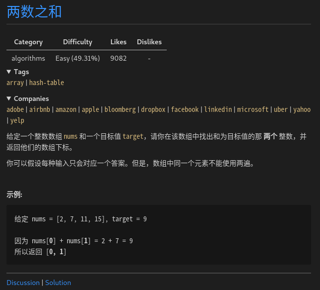

# LeetCode 精选 TOP 面试题

## 1.两数之和



### 解法一 暴力法

直接遍历每个元素 x ，并查找是否存在一个值与 target - x 的值。

时间复杂度`O(n²)`，空间复杂度`O(1)`。

<!-- tabs:start -->

#### **Cpp**

```cpp
class Solution {
public:
    vector<int> twoSum(vector<int>& nums, int target) {
        vector<int> res;
        int len = num.size();

        for(int i = 0; i < len; ++i) {
            for(int j = i + 1; j < len; ++j) {
                if(nums[i] + nums[j] == target) {
                    res.push_back(i);
                    res.push_back(j);

                    return res;
                }
            }
        }

        return res;
    }
};
```

#### **Python**

```python
class Solution:
    def twoSum(self, nums: List[int], target: int) -> List[int]:
        _len = len(nums)

        for i in range(_len):
            for j in range(i + 1, _len):
                if nums[i] + nums[j] == target:
                    return [i, j]
        return []

```

<!-- tabs:end -->

## 2.两数相加

## 3.无重复字符的最长子串

## 4.寻找两个正序数组的中位数

## 5.最长回文子串
