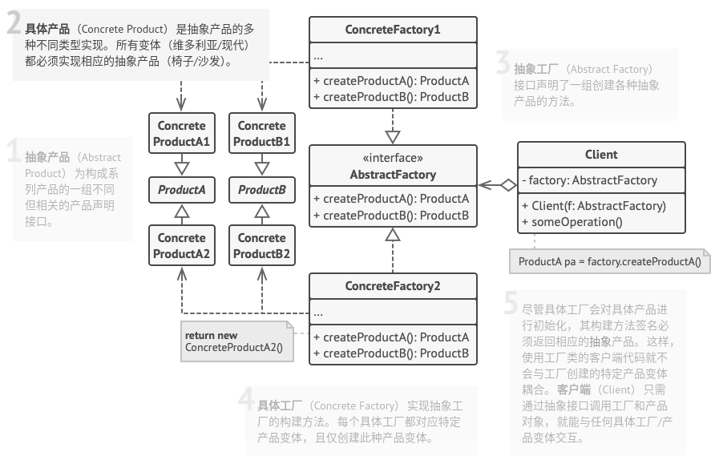

# 抽象工厂模式

## 简介


抽象工厂模式，其抽象程度更高，每一个具体工厂可以生产一组相关的具体产品对象。

**抽象工厂模式：提供一个创建一系列相关或相互依赖对象的接口，而无需指定它们具体的类。**

## 结构



## 实现

实现方式：

* 以不同的产品类型与产品变体为维度绘制矩阵。
* 为所有产品声明抽象产品接口。然后让所有具体产品类实现这些接口。
* 声明抽象工厂接口，并且在接口中为所有抽象产品提供一组构建方法。
* 为每种产品变体实现一个具体工厂类。
* 在应用程序中开发初始化代码。该代码根据应用程序配置或当前环境，对特定具体工厂类进行初始化。然后将该工厂对象传递给所有需要创建产品的类。
* 找出代码中所有对产品构造函数的直接调用，将其替换为对工厂对象中相应构建方法的调用。

```c++
#include <iostream>


class AbstractProductA {
public:
    virtual ~AbstractProductA() {};
    virtual std::string usefulFuncA() const = 0;
};

class ConcreteProductA1: public AbstractProductA {
public:
    std::string usefulFuncA() const override {
        return "The result of the product A1.";
    }
};

class ConcreteProductA2: public AbstractProductA {
public:
    std::string usefulFuncA() const override {
        return "The result of the product A2.";
    }
};

class AbstractProductB {
public:
    virtual ~AbstractProductB() {};
    virtual std::string usefulFuncB() const = 0;
    virtual std::string anotherUsefulFuncB(const AbstractProductA& collaborator) const = 0;
};

class ConcreteProductB1: public AbstractProductB {
public:
    std::string usefulFuncB() const override {
        return "The result of the product B1.";
    }
    std::string anotherUsefulFuncB(const AbstractProductA& collaborator) const override {
        const std::string result = collaborator.usefulFuncA();
        return "The result of the B1 collaborating with ( " + result + " )";
    }
};

class ConcreteProductB2: public AbstractProductB {
public:
    std::string usefulFuncB() const override {
        return "The result of the product B2.";
    }
    std::string anotherUsefulFuncB(const AbstractProductA& collaborator) const override {
        const std::string result = collaborator.usefulFuncA();
        return "The result of the B2 collaborating with ( " + result + " )";
    }
};

class AbstractFactory {
public:
    virtual AbstractProductA* CreateProductA() const  = 0;
    virtual AbstractProductB* CreateProductB() const  = 0;
};

class ConcreteFactory1 : public AbstractFactory {
public:
    AbstractProductA* CreateProductA() const override {
        return new ConcreteProductA1();
    }
    AbstractProductB* CreateProductB() const override {
        return new ConcreteProductB1();
    }
};

class ConcreteFactory2 : public AbstractFactory {
public:
    AbstractProductA* CreateProductA() const override {
        return new ConcreteProductA2();
    }
    AbstractProductB* CreateProductB() const override {
        return new ConcreteProductB2();
    }
};

void ClientCode(const AbstractFactory& factory) {
    const AbstractProductA* proA = factory.CreateProductA();
    const AbstractProductB* proB = factory.CreateProductB();
    std::cout << proB->usefulFuncB() << std::endl;
    std::cout << proB->anotherUsefulFuncB(*proA) << std::endl;
    delete proA;
    delete proB;
}

int main(int argc, char* argv[]) {
    std::cout << "Client: Testing client code with the first factory type:\n";
    ConcreteFactory1 *f1 = new ConcreteFactory1();
    ClientCode(*f1);
    delete f1;
    std::cout << std::endl;
    std::cout << "Client: Testing the same client code with the second factory type:\n";
    ConcreteFactory2 *f2 = new ConcreteFactory2();
    ClientCode(*f2);
    delete f2;
    return 0;
}
```

```python
from __future__ import annotations
from abc import ABC, abstractmethod


class AbstractProductA(ABC):
    """
    """

    @abstractmethod
    def useful_function_a(self) -> str:
        pass


class ConcreteProductA1(AbstractProductA):
    """
    """
    def useful_function_a(self) -> str:
        return "The result of the product A1."


class ConcreteProductA2(AbstractProductA):
    """
    """
    def useful_function_a(self) -> str:
        return "The result of the product A2."


class AbstractProductB(ABC):
    """
    """
    @abstractmethod
    def useful_function_b(self) -> None:
        """
        Product B is able to do its own thing...
        """
        pass

    @abstractmethod
    def another_useful_function_b(self, collaborator: AbstractProductA) -> None:
        """
        """
        pass


class ConcreteProductB1(AbstractProductB):
    def useful_function_b(self) -> str:
        return "The result of the product B1."

    def another_useful_function_b(self, collaborator: AbstractProductA) -> str:
        result = collaborator.useful_function_a()
        return f"The result of the B1 collaborating with the ({result})"


class ConcreteProductB2(AbstractProductB):
    def useful_function_b(self) -> str:
        return "The result of the product B2."

    def another_useful_function_b(self, collaborator: AbstractProductA):
        result = collaborator.useful_function_a()
        return f"The result of the B2 collaborating with the ({result})"


class AbstractFactory(ABC):
    """
    """
    @abstractmethod
    def create_product_a(self) -> AbstractProductA:
        pass

    @abstractmethod
    def create_product_b(self) -> AbstractProductB:
        pass


class ConcreteFactory1(AbstractFactory):
    """
    """

    def create_product_a(self) -> ConcreteProductA1:
        return ConcreteProductA1()

    def create_product_b(self) -> ConcreteProductB1:
        return ConcreteProductB1()


class ConcreteFactory2(AbstractFactory):
    """
    """

    def create_product_a(self) -> ConcreteProductA2:
        return ConcreteProductA2()

    def create_product_b(self) -> ConcreteProductB2:
        return ConcreteProductB2()


def client_code(factory: AbstractFactory) -> None:
    """
    """
    product_a = factory.create_product_a()
    product_b = factory.create_product_b()

    print(f"{product_b.useful_function_b()}")
    print(f"{product_b.another_useful_function_b(product_a)}", end="")


if __name__ == "__main__":
    print("Client: Testing client code with the first factory type:")
    client_code(ConcreteFactory1())

    print("\n")

    print("Client: Testing the same client code with the second factory type:")
    client_code(ConcreteFactory2())
```

## 实例

### 问题描述

同学们想要进行户外运动，他们可以选择打篮球、踢足球或者玩排球。它们分别有篮球保管室、足球保管室和排球保管室管理，但是不想弄转脏自己的衣服，还需要球衣，分别对应着不同球类，只需要去相应的保管室就能拿到相应的球和球衣。

### 问题解答

```c++
// Example.cpp

#include <iostream>

class AbstractBall {
public:
    virtual ~AbstractBall() {}
    virtual void play() const = 0;
};

class Basketball: public AbstractBall {
public:
    Basketball() {
        play();
    }
    void play() const override {
        std::cout << "play basketball." << std::endl;
    }
};

class Football: public AbstractBall {
public:
    Football() {
        play();
    }
    void play() const override {
        std::cout << "play football." << std::endl;
    }
};

class AbstractShirt {
public:
    virtual ~AbstractShirt() {}
    virtual void wear() const = 0;
};

class BasketballShirt: public AbstractShirt {
public:
    BasketballShirt() {
        wear();
    }
    void wear() const override {
        std::cout << "wear basketball shirt." << std::endl;
    }
};

class FootballShirt: public AbstractShirt {
public:
    FootballShirt() {
        wear();
    }
    void wear() const override {
        std::cout << "wear football shirt." << std::endl;
    }
};

class AbstractFactory {
public:
    virtual AbstractBall* getBall() const = 0;
    virtual AbstractShirt* getShirt() const = 0;
};

class BasketballFactory: public AbstractFactory {
public:
    AbstractBall* getBall() const override {
        std::cout << "get basketball." << std::endl;
        return new Basketball();
    }
    AbstractShirt* getShirt() const override {
        std::cout << "get basketball shirt." << std::endl;
        return new BasketballShirt();
    }
};

class FootballFactory: public AbstractFactory {
public:
    AbstractBall* getBall() const override {
        std::cout << "get football." << std::endl;
        return new Football();
    }
    AbstractShirt* getShirt() const override {
        std::cout << "get football shirt." << std::endl;
        return new FootballShirt();
    }
};


int main(int argc, char * argv[]) {
    AbstractFactory* fac = nullptr;
    AbstractBall* ball = nullptr;
    AbstractShirt* shirt = nullptr;

    fac = new BasketballFactory();
    ball = fac->getBall();
    shirt = fac->getShirt();
    std::cout << std::endl;

    fac = new FootballFactory();
    ball = fac->getBall();
    shirt = fac->getShirt();
    std::cout << std::endl;

    delete fac;
    delete ball;
    delete shirt;

    return 0;
}
```

## 总结

### 优点

* 新加入产品系列时，无需改动原有系统，增强了系统的可拓展性，符合**开闭原则**。
* 你可以将产品生成代码抽取到同一位置， 使得代码易于维护，符合**单一职责原则**。

### 缺点

* 由于采用该模式需要向应用中引入众多接口和类， 代码可能会比之前更加复杂。

### 场景

* 如果代码需要与多个不同系列的相关产品交互， 但是由于无法提前获取相关信息， 或者出于对未来扩展性的考虑， 你不希望代码基于产品的具体类进行构建， 在这种情况下， 你可以使用抽象工厂模式。
* 如果你有一个基于一组抽象方法的类， 且其主要功能因此变得不明确， 那么在这种情况下可以考虑使用抽象工厂模式。

### 与其他模式的关系

* 在许多设计工作的初期都会使用**工厂方法模式**(较为简单，而且方便通过子类进行定制)，随后演变为使用**抽象工厂模式**、**原型模式**或**建造者模式**。
* **抽象工厂模式**通常基于一组**工厂方法**，但你也可以使用**原型模式**来生成这些类的方法。
* **建造者模式**重点关注如何分步生成复杂对象。**抽象工厂模式**专门用于生产一系列相关对象。抽象工厂会马上返回产品，建造者则允许你在获取产品前执行一些额外构造步骤。
* 你可以将**抽象工厂模式**和**桥接模式**搭配使用。如果由桥接定义的抽象只能与特定实现合作，这一模式搭配就非常有用。在这种情况下，抽象工厂可以对这些关系进行封装，并且对客户端代码隐藏其复杂性。
* **抽象工厂模式**、 **建造者模式**和**原型模式**都可以用单例模式来实现。
