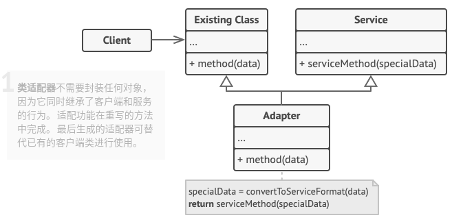

# 适配器模式

## 简介


在系统设计中，当需要组合使用的类不兼容时，也需要类似于变压器一样的适配器来协调这些不兼容者，这就是适配器模式。

**适配器模式：将一个类的接口转换成客户希望的另一个接口，适配器模式可以让那些接口不兼容的类一起工作。**

## 结构

**对象适配器**：它使用了构成(关联)原则，适配器实现了其中一个对象的接口，并对另一个对象进行封装。所有流行的编程语言都可以实现适配器。


**类适配器**：它使用了继承机制，适配器同时继承两个对象的接口。值得**注意**的是，这种方式仅能在支持多重继承的编程语言中实现，例如`C++`。



## 实现

实现方式：

* 确保至少有两个类的接口不兼容：
  * 一个无法修改(通常是第三方、遗留系统或者存在众多已有依赖的类)的功能性服务类。
  * 一个或多个将受益于使用服务类的客户端类。
* 声明客户端接口，描述客户端如何与服务交互。
* 创建遵循客户端接口的适配器类。所有方法暂时都为空。
* 在适配器类中添加一个成员变量用于保存对于服务对象的引用。通常情况下会通过构造函数对该成员变量进行初始化，但有时在调用其方法时将该变量传递给适配器会更方便。
* 依次实现适配器类客户端接口的所有方法。适配器会将实际工作委派给服务对象，自身只负责接口或数据格式的转换。
* 客户端必须通过客户端接口使用适配器。这样以来，你就可以在不影响客户端代码的情况下修改或扩展适配器。

```c++
#include <iostream>
#include <string>
#include <algorithm>

// 目标抽象类：定义客户所需要的接口
class Target {
public:
    virtual ~Target() = default;
    virtual std::string Request() const {
        return "Target: The default target`s behavior.";
    }
};

// 适配者类
class Adaptee {
public:
    std::string SpecificRequest() const {
        return ".eetpadA eht fo roivaheb laicepS";
    }
};

// 适配器类
class Adapter: public Target {
private:
    Adaptee *adaptee_;

public:
    Adapter(Adaptee *adaptee) : adaptee_(adaptee) {}
    std::string Request() const override {
        std::string to_reverse = this->adaptee_->SpecificRequest();
        std::reverse(to_reverse.begin(), to_reverse.end());
        return "Adapter: (TRANSLATED) " + to_reverse;
    }
};

// 客户端
void ClientCode(const Target* target) {
    std::cout << target->Request();
}

int main(int argc, char *argv[]) {
    std::cout << "Client: 处理任何数据" << std::endl;
    Target* target = new Target;
    ClientCode(target);
    std::cout << std::endl << std::endl;

    std::cout << "Client: 我不能理解这个数据" << std::endl;
    Adaptee* adaptee = new Adaptee;
    std::cout << "Adaptee: " << adaptee->SpecificRequest();
    std::cout << std::endl << std::endl;

    std::cout << "Client: 结合适配器可以理解这个数据" << std::endl;
    Adapter *adapter = new Adapter(adaptee);
    ClientCode(adapter);
    std::cout << std::endl << std::endl;

    delete target;
    delete adaptee;
    delete adapter;

    return 0;
}
```

```python
# -*- coding: utf-8 -*-


class Target:

    def request(self):
        return "Target: The default target's behavior."


class Adaptee:

    def specific_request(self):
        return ".eetpadA eht fo roivaheb laicepS"


class Adapter(Target, Adaptee):

    def request(self):
        return "Adapter: (TRANSLATED) {0}".format(self.specific_request()[::-1])


def client_code(target):

    print(target.request())


if __name__ == "__main__":
    print("Client: 处理任何数据")
    target = Target()
    client_code(target)
    print("\n")

    print("Client: 我不能理解这个数据")
    adaptee =  Adaptee()
    print("Adaptee: {0}".format(adaptee.specific_request()))
    print("\n")

    print("Client: 结合适配器可以理解这个数据")
    adapter = Adapter()
    client_code(adapter)
```

## 实例

### 问题描述

假设某公司A与某公司B需要合作，公司A需要访问公司B的人员信息，但公司A与公司B协议接口不同，该如何处理？

### 问题解答

```python
# Example.py

# -*- coding: utf-8 -*-


class AStaff:
    name = ""
    id = ""
    phone = ""

    def __init__(self, id):
        self.id = id

    def getName(self):
        print "A protocol getName method...id:%s"%self.id
        return self.name

    def setName(self, name):
        print "A protocol setName method...id:%s"%self.id
        self.name = name

    def getPhone(self):
        print "A protocol getPhone method...id:%s"%self.id
        return self.phone

    def setPhone(self, phone):
        print "A protocol setPhone method...id:%s"%self.id
        self.phone=phone


class BStaff:
    name = ""
    id = ""
    telephone = ""

    def __init__(self, id):
        self.id=id

    def get_name(self):
        print "B protocol get_name method...id:%s"%self.id

        return self.name
    def set_name(self, name):
        print "B protocol set_name method...id:%s"%self.id
        self.name = name

    def get_telephone(self):
        print "B protocol get_telephone method...id:%s"%self.id
        return self.telephone

    def set_telephone(self, telephone):
        print "B protocol get_name method...id:%s"%self.id
        self.telephone = telephone


# 适配器
class StaffAdapter:
    adapter = ""

    def __init__(self, id):
        self.adapter = BStaff(id)

    def getName(self):
        return self.adapter.get_name()

    def getPhone(self):
        return self.adapter.get_telephone()

    def setName(self, name):
        self.adapter.set_name(name)

    def setPhone(self, phone):
        self.adapter.set_telephone(phone)


if __name__ == "__main__":
    a_staff= AStaff("123")
    a_staff.setName("AAA")
    a_staff.setPhone("0731-36262324")
    print("A Staff Name: ", a_staff.getName())
    print("A Staff Phone: ", a_staff.getPhone())
    print("\n")

    b_staff = StaffAdapter("456")
    b_staff.setName("BBB")
    b_staff.setPhone("023-54323425")
    print("B Staff Name: ", b_staff.getName())
    print("B Staff Phone: ", b_staff.getPhone())
    print("\n")

```

## 总结

### 优点

* 将目标类和适配者类解耦，引入一个适配器类实现代码重用，无需修改原有结构。符合**单一职责原则**和**开闭原则**。
* 增加类的透明和复用，对于客户端而言，适配者类是透明的。
* 对象适配器可以把不同适配者适配到同一个目标

### 缺点

* 对编程语言的限制：例如`Java`不支持多重继承，一次最多只能适配一个适配者类，不能同时适配多个适配者类。
* 代码整体复杂度增加，因为你需要新增一系列接口和类。有时直接更改服务类使其与其他代码兼容会更简单。

### 场景

* 系统需要使用一些现有的类，但这些类的接口不符合系统需要，或者没有这些类的源代码。
* 想创建一个重复使用的类，用于和一些彼此没有太大关联的类一起工作

### 与其他模式的关系

* **桥接模式**通常会在开发前期进行设计，使你能够将程序的各个部分独立开来以便开发。另一方面，**适配器模式**通常在已有程序中使用，让相互不兼容的类能很好地合作。
* **适配器模式**可以对已有对象的接口进行修改，**装饰模式**则在不改变对象接口的前提下强化对象功能。此外，**装饰模式**还支持递归组合，**适配器模式**则无法实现。
* **适配器模式**能为封装对象提供不同的接口，**代理模式**能为对象提供相同的接口，**装饰模式**则能为对象提供加强的接口。
* **外观模式**为现有对象定义一个新接口，**适配器模式**则会试图运用已有的接口。**适配器模式**通常只是封装一个对象，**外观模式**通常会作用于整个对象子系统上。
* **桥接模式**、**状态模式**和**策略模式**(某种程序上包括**适配器模式**)的接口都非常相似，实际上，它们都基于**组合模式**，即将工作委派给其他对象，不过也都各自解决了不同的问题。
