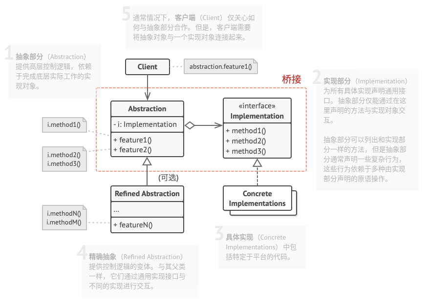

# 桥接模式

## 简介


桥接模式将两个独立变化的维度设计成两个独立的继承等级结构，而不会将两者耦合在一起形成多层继承结构，在抽象层将二者建立起一个抽象关联，该关联关系类似一座桥，将两个独立的等级结构连接起来。

**桥接模式：将抽象部分与他的实现部分解耦，使得两者都能独立变化。**

## 结构



## 实现

实现方式：

* 明确类中独立的维度。独立的概念可能是：抽象/平台，域/基础设施，前端/后端，接口/实现。
* 了解客户端的业务需求，并在抽象基类中定义它们。
* 确定在所有平台上都可执行的业务。并在通用实现接口中声明抽象部分所需的业务。
* 为你域内的所有平台创建实现类，但需确保它们遵循实现部分的接口。
* 在抽象类中添加指向实现类型的引用成员变量。抽象部分会将大部分工作委派给该成员变量所指向的实现对象。
* 如果你的高层逻辑有多个变体，则可通过拓展抽象积累为每一个变体创建一个精确抽象。
* 客户端代码必须将实现对象传递给抽象部分的构造函数才能使其能够相互关联。此后，客户端只需与抽象对象进行交互，无需和实现对象打交道。

```c++
#include <iostream>
#include <string>

// 实现部分(实现类接口)
class Implementation {
public:
    virtual ~Implementation() {}
    virtual std::string OperationImplementation() const = 0;
};

// 具体实现
class ConcreteImplementationA : public Implementation {
public:
    std::string OperationImplementation() const override { 
        return "ConcreteImplementationA: 这是平台A上的结果.\n";
    }
};

// 具体实现
class ConcreteImplementationB : public Implementation {
public:
    std::string OperationImplementation() const override { 
        return "ConcreteImplementationB: 这是平台B上的结果.\n";
    }
};

// 抽象部分(抽象类)
class Abstraction {
protected:
    Implementation* implementation_;

public:
    Abstraction(Implementation* implementation) : implementation_(implementation) {}
    virtual ~Abstraction() {}
    virtual std::string Operation() const {
        return "Abstraction: Base operation with:\n" +
           this->implementation_->OperationImplementation();
    }
};

// 精确抽象(扩展抽象类)
class ExtendedAbstraction: public Abstraction {
public:
    ExtendedAbstraction(Implementation* implementation): Abstraction(implementation) {}
    std::string Operation() const override {
        return "ExtendedAbstraction: Extended operation with:\n" +
           this->implementation_->OperationImplementation();
    }
};

void ClientCode(const Abstraction& abstraction) {
    // ...
    std::cout << abstraction.Operation();
    // ...
}

int main(int argc, char *argv[]) {
    Implementation* implementation = new ConcreteImplementationA;
    Abstraction* abstraction = new Abstraction(implementation);
    ClientCode(*abstraction);
    std::cout << std::endl;
    delete implementation;
    delete abstraction;

    implementation = new ConcreteImplementationB;
    abstraction = new ExtendedAbstraction(implementation);
    ClientCode(*abstraction);
    delete implementation;
    delete abstraction;

    return 0;
}
```

```python
# -*- coding: utf-8 -*-

from __future__ import annotations
from abc import ABC, abstractmethod


class Abstraction:
    """
    """

    def __init__(self, implementation: Implementation) -> None:
        self.implementation = implementation

    def operation(self) -> str:
        return (f"Abstraction: Base operation with:\n"
                f"{self.implementation.operation_implementation()}")


class ExtendedAbstraction(Abstraction):
    """
    """

    def operation(self) -> str:
        return (f"ExtendedAbstraction: Extended operation with:\n"
                f"{self.implementation.operation_implementation()}")


class Implementation(ABC):
    """
    """

    @abstractmethod
    def operation_implementation(self) -> str:
        pass


class ConcreteImplementationA(Implementation):
    def operation_implementation(self) -> str:
        return "ConcreteImplementationA: 这是平台A上的结果."


class ConcreteImplementationB(Implementation):
    def operation_implementation(self) -> str:
        return "ConcreteImplementationB: 这是平台B上的结果."


def client_code(abstraction: Abstraction) -> None:
    """
    """

    # ...

    print(abstraction.operation(), end="")

    # ...


if __name__ == "__main__":
    """
    """

    implementation = ConcreteImplementationA()
    abstraction = Abstraction(implementation)
    client_code(abstraction)

    print("\n")

    implementation = ConcreteImplementationB()
    abstraction = ExtendedAbstraction(implementation)
    client_code(abstraction)
```

## 实例

### 问题描述

我们知道新手机上能够迅速安装并运行游戏，此时要求新增加一个游戏时，能够在已有手机上安装并运行。

### 问题解答

分析知，手机是`Abstraction`，安装并运行游戏是`Implementor`，不同的手机是`RefinedAbstraction`，安装并运行不同的游戏是`ConcreteImplementor`。

```c++
// Example.cppp

#include <iostream>


// 实现类接口
class Game {
public:
    virtual ~Game() {}
    virtual void play() const = 0;
};

// 具体实现类GmaeA
class GameA: public Game {
public:
    void play() const override {
        std::cout << "玩游戏A" << std::endl;
    }
};

// 具体实现类GmaeB
class GameB: public Game {
public:
    void play() const override {
        std::cout << "玩游戏B" << std::endl;
    }
};

// 抽象类Phone
class Phone {
private:
    Game *game;

public:
    virtual ~Phone() {}
    virtual void run(Game *game) = 0;
    virtual void play() const = 0;
};

// 扩充抽象类PhoneA
class PhoneA : public Phone {
private:
    Game *game;

public:
    void run(Game *game) override {
        this->game = game;
    }
    void play() const override {
        this->game->play();
    }
};


int main(int argc, char *argv[]) {
    Phone *phone = new PhoneA;

    Game *game = new GameA;
    phone->run(game);
    phone->play();
    delete game;

    game = new GameB;
    phone->run(game);
    phone->play();
    delete game;

    delete phone;

    return 0;
}
```

## 总结

### 优点

* 你可以创建与平台无关的类和程序。
* 客户端代码仅与高层抽象部分进行互动，不会接触到平台的详细信息。
* **开闭原则**。你可以新增抽象部分和实现部分，且它们之间不会相互影响。
* **单一职责原则**。抽象部分专注于处理高层逻辑，实现部分处理平台细节。

### 缺点

* 对高内聚的类使用该模式可能会让代码更加复杂。

### 场景

* 如果你想要拆分或重组一个具有多重功能的庞杂类（例如能与多个数据库服务器进行交互的类），可以使用该模式。
* 如果你希望在几个独立维度上扩展一个类，可使用该模式。
* 如果你需要在运行时切换不同实现方法，可使用该模式。

### 与其他模式的关系

* **桥接模式**通常会在开发前期进行设计，使你能够将程序的各个部分独立开来以便开发。另一方面，**适配器模式**通常在已有程序中使用，让相互不兼容的类能很好地合作。
* **桥接模式**、**状态模式**和**策略模式**(某种程序上包括**适配器模式**)的接口都非常相似，实际上，它们都基于**组合模式**，即将工作委派给其他对象，不过也都各自解决了不同的问题。
* 可以将**抽象工厂模式**和**桥接模式**搭配使用。如果**桥接模式**定义的抽象只能与特定实现合作，这一对模式搭配将非常有用。在这种情况下，**抽象工厂模式**可以对这些关系进行封装，并且对客户端代码隐藏其复杂性。
* 可以结合使用**生成器(建造者)模式**和**桥接模式**，主管类负责抽象工作，各种不同的生成器负责实现工作。
