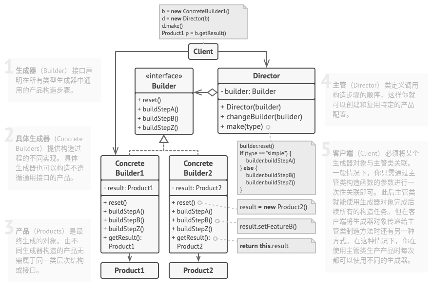

# 建造者模式

## 简介


建造者模式将客户端与包含多个部件的复杂对象的创建过程分离，客户端不必知道复杂对象的内部组成方式和装配方式，只需要知道所需建造者的类型即可。

**建造者模式：将一个复杂对象的构建与它的表示分离，使得同样的构建过程可以创建不同的表示。**

## 结构



## 实现

实现方式：

* 清晰地定义通用步骤，确保它们可以制造所有形式的产品。否则你将无法进一步实施该模式。
* 在基本生成器中接口中声明这些步骤。
* 为每个形式的产品创建具体生成器类，并实现其构造步骤。
* 考虑创建主管类。它可以使用同一生成器对象来封装多种构造产品的方式。
* 客户端代码会同时创建生成器和主管对象。
* 只有在所有产品都遵循相同接口的情况下，构造结果可以直接通过主管类获取。否则，客户端应当通过生成器获取构造结果。

```c++
#include <iostream>
#include <string>
#include <vector>
#include <memory>

// 产品
class Product1 {
public:
    std::vector<std::string> parts_;
    void ListParts() const {
        std::cout << "Product parts: ";
        for(size_t i = 0; i < parts_.size(); ++i) {
            if(parts_[i] == parts_.back()) {
                std::cout << parts_[i];
            } else {
                std::cout << parts_[i] << ", ";
            }
        }
        std::cout << std::endl << std::endl;
    }
};

// 生成器
class Builder {
public:
    virtual ~Builder(){}
    virtual void ProducePartA() const = 0;
    virtual void ProducePartB() const = 0;
    virtual void ProducePartC() const = 0;
};

// 具体生成器
class ConcreteBuilder1 : public Builder {
private:
    Product1* product;

public:
    ConcreteBuilder1() {
        this->Reset();
    }
    ~ConcreteBuilder1() {
        delete product;
    }
    void Reset() {
        this->product = new Product1();
    }
    void ProducePartA() const override {
        this->product->parts_.push_back("PartA1");
    }
    void ProducePartB() const override {
        this->product->parts_.push_back("PartB1");
    }
    void ProducePartC() const override {
        this->product->parts_.push_back("PartC1");
    }
    Product1* GetProduct() {
        Product1* result = this->product;
        this->Reset();
        return result;
    }
};

// 主管
class Director {
private:
    Builder* builder;

public:
    void set_builder(Builder* builder) {
        this->builder = builder;
    }
    void buildMinimalViableProduct() {
        this->builder->ProducePartA();
    }
    void buildFullFeaturedProduct() {
        this->builder->ProducePartA();
        this->builder->ProducePartB();
        this->builder->ProducePartC();
    }
};

void ClientCode(Director& director) {
    ConcreteBuilder1* builder = new ConcreteBuilder1();
    director.set_builder(builder);

    std::cout << "Standard basic product:\n";
    director.buildMinimalViableProduct();
    Product1* p = builder->GetProduct();
    p->ListParts();
    delete p;

    std::cout << "Standard full featured product:\n";
    director.buildFullFeaturedProduct();
    p = builder->GetProduct();
    p->ListParts();
    delete p;

    std::cout << "Custom product:\n";
    builder->ProducePartA();
    builder->ProducePartC();
    p = builder->GetProduct();
    p->ListParts();
    delete p;

    delete builder;
}


int main(int argc, char *argv[]) {
    std::shared_ptr<Director> director = std::make_shared<Director>();
    ClientCode(*director);

    return 0;
}
```

```python
from __future__ import annotations
from abc import ABC, abstractmethod, abstractproperty
from typing import Any


class Builder(ABC):
    """
    """

    @abstractproperty
    def product(self) -> None:
        pass

    @abstractmethod
    def produce_part_a(self) -> None:
        pass

    @abstractmethod
    def produce_part_b(self) -> None:
        pass

    @abstractmethod
    def produce_part_c(self) -> None:
        pass


class ConcreteBuilder1(Builder):
    """
    """

    def __init__(self) -> None:
        """
        """
        self.reset()

    def reset(self) -> None:
        self._product = Product1()

    @property
    def product(self) -> Product1:
        """
        """
        product = self._product
        self.reset()
        return product

    def produce_part_a(self) -> None:
        self._product.add("PartA1")

    def produce_part_b(self) -> None:
        self._product.add("PartB1")

    def produce_part_c(self) -> None:
        self._product.add("PartC1")


class Product1():
    """
    """

    def __init__(self) -> None:
        self.parts = []

    def add(self, part: Any) -> None:
        self.parts.append(part)

    def list_parts(self) -> None:
        print(f"Product parts: {', '.join(self.parts)}", end="")


class Director:
    """
    """

    def __init__(self) -> None:
        self._builder = None

    @property
    def builder(self) -> Builder:
        return self._builder

    @builder.setter
    def builder(self, builder: Builder) -> None:
        """
        """
        self._builder = builder

    def build_minimal_viable_product(self) -> None:
        self.builder.produce_part_a()

    def build_full_featured_product(self) -> None:
        self.builder.produce_part_a()
        self.builder.produce_part_b()
        self.builder.produce_part_c()


if __name__ == "__main__":
    """
    """
    director = Director()
    builder = ConcreteBuilder1()
    director.builder = builder

    print("Standard basic product: ")
    director.build_minimal_viable_product()
    builder.product.list_parts()
    print("\n")

    print("Standard full featured product: ")
    director.build_full_featured_product()
    builder.product.list_parts()
    print("\n")

    print("Custom product: ")
    builder.produce_part_a()
    builder.produce_part_b()
    builder.product.list_parts()
```

## 实例

### 问题描述

建造简易的房子。

### 问题解答

```c++
#include <iostream>


// 产品类
class House {
private:
    std::string floor;
    std::string wall;
    std::string roof;

public:
    void setFloor(std::string floor) {
        this->floor = floor;
    }
    void setWall(std::string wall) {
        this->wall = wall;
    }
    void setRoof(std::string roof) {
        this->roof = roof;
    }
    void printInfo() {
        std::cout << "Include: " << this->floor << " " << this->wall << " " << this->roof << std::endl;
    }
};

// 抽象建造者
class AbstractBuilder{
public:
    virtual ~AbstractBuilder(){}
    virtual void buildFloor() const = 0;
    virtual void buildWall() const = 0;
    virtual void buildRoof() const = 0;
};

// 具体建造者A
class ConcreteBuilderA: public AbstractBuilder{
private:
    House* house;

public:
    ConcreteBuilderA() {
        std::cout << "ConcreteBuilderA" << std::endl;
        house = new House();
    }
    ~ConcreteBuilderA() {
        delete house;
    }
    void buildFloor() const override {
        this->house->setFloor("FloorA");
    }
    void buildWall() const override {
        this->house->setWall("WallA");
    }
    void buildRoof() const override {
        this->house->setRoof("RoofA");
    }
    House* getHouse() {
        return this->house;
    }

};

// 具体建造者B
class ConcreteBuilderB: public AbstractBuilder{
private:
    House* house;

public:
    ConcreteBuilderB() {
        std::cout << "ConcreteBuilderB" << std::endl;
        house = new House();
    }
    ~ConcreteBuilderB() {
        delete house;
    }
    void buildFloor() const override {
        this->house->setFloor("FloorB");
    }
    void buildWall() const override {
        this->house->setWall("WallB");
    }
    void buildRoof() const override {
        this->house->setRoof("RoofB");
    }
    House* getHouse() {
        return this->house;
    }

};

// 主管类(指挥者类)
class Director {
private:
    AbstractBuilder* builder;

public:
    void setBuilder(AbstractBuilder* builder) {
        this->builder = builder;
    }
    void buildHouse() {
        this->builder->buildFloor();
        this->builder->buildWall();
        this->builder->buildRoof();
    }
};


int main(int argc, char * argv[]) {
    // 抽象建造者

    // 主管
    Director* director = new Director();
    // 产品
    House* house = nullptr;

    // 指定具体建造者A
    auto builderA = new ConcreteBuilderA();
    director->setBuilder(builderA);
    director->buildHouse();
    house = builderA->getHouse();
    house->printInfo();
    delete builderA;
    std::cout << std::endl;

    // 指定具体建造者B
    auto builderB = new ConcreteBuilderB();
    director->setBuilder(builderB);
    director->buildHouse();
    house = builderB->getHouse();
    house->printInfo();
    delete builderB;

    delete director;

    return 0;
}
```

## 总结

### 优点

* 你可以分步创建对象，暂缓创建步骤或递归运行创建步骤。
* 生成不同形式的产品时，你可以复用相同的制造代码。
* 你可以将复杂构造代码从产品的业务逻辑中分离出来。符合单一职责原则。

### 缺点

* 由于该模式需要新增多个类， 因此代码整体复杂程度会有所增加。

### 场景

* 需要生成的产品对象有复杂的内部结构(通常包含多个成员变量)；
* 产品对象内部属性有一定的生成顺序；
* 同一个创建流程适用于多种不同的产品。

### 与其他模式的关系

* 在许多设计工作的初期都会使用**工厂方法模式**(较为简单，而且方便通过子类进行定制)，随后演变为使用**抽象工厂模式**、**原型模式**或**建造者模式**。
* **建造者模式**重点关注如何分步生成复杂对象。**抽象工厂模式**专门用于生产一系列相关对象。抽象工厂会马上返回产品，建造者则允许你在获取产品前执行一些额外构造步骤。
* 你可以在创建复杂**组合模式**树时使用**建造者模式**， 因为这可使其构造步骤以递归的方式运行。
* 你可以结合使用**建造者模式**和**桥接模式**： 主管类负责抽象工作， 各种不同的建造者负责实现工作。
* **抽象工厂模式**、 **建造者模式**和**原型模式**都可以用单例模式来实现。
