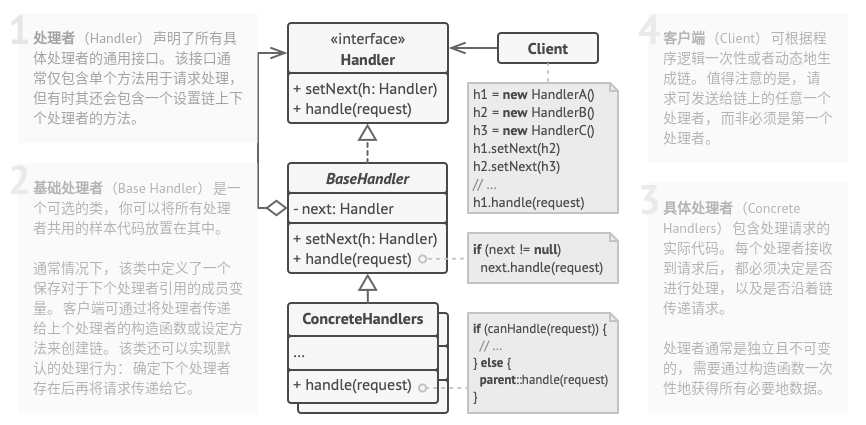

# 职责链模式

## 简介


职责链模式允许你将请求沿着处理者链进行发送。收到请求后，每个处理者均可对请求进行处理，或将其传递给链上的下个处理者。

> **职责链模式：避免将一个请求的发送者和接收者耦合在一起，让多个对象都有机会处理请求。将接收请求的对象连接成一条链，并且沿着这条链传送请求，直到有一个对象能够处理它为止。**

## 结构



## 实现

实现方式：

* 声明处理者接口并描述请求处理方法的签名。
* 为了在具体处理者中消除重复的样本代码，可以根据处理者接口创建抽象处理者基类。
* 依次创建具体处理者子类并实现其处理方法。每个处理者在接收到请求后都必须做出两个决定：
  * 是否自行处理这个请求。
  * 是否将该请求沿着链进行传递。
* 客户端可以自行组装链，或者从其他对象处获得预先组装好的链。在后一种情况下，你必须实现工厂类以根据配置或环境设置来创建链。
* 客户端可以触发链中的任意处理者，而不仅仅是第一个。请求将通过链进行传递，直至某个处理者拒绝继续传递，或者请求到达链尾。
* 由于链的动态性，客户端需要准备好处理以下情况：
  * 链中可能只有单个链接。
  * 部分请求可能无法到达链尾。
  * 其他请求可能直到链尾都未被处理。

```c++
#include <iostream>
#include <string>
#include <vector>

class Handler {
public:
    virtual ~Handler() {}
    virtual Handler *setNext(Handler *handler) = 0;
    virtual std::string Handle(std::string request) = 0;
};

class AbstractHandler : public Handler {
private:
    Handler *next_handler_;

public:
    AbstractHandler() : next_handler_(nullptr) {}
    Handler *setNext(Handler *handler) override {
        this->next_handler_ = handler;
        return handler;
    }
    std::string Handle(std::string request) override {
        if( this->next_handler_ ) {
            return this->next_handler_->Handle(request);
        }
        return {};
    }
 };

class ConcreteHandlerA: public AbstractHandler {
public:
    std::string Handle(std::string request) override {
        if(request == "A") {
            return "A: 我 能 处 理 它 " + request + ".\n";
        } else {
            return AbstractHandler::Handle(request);
        }
    }
};

class ConcreteHandlerB: public AbstractHandler {
public:
    std::string Handle(std::string request) override {
        if(request == "B") {
            return "B: 我 能 处 理 它 " + request + ".\n";
        } else {
            return AbstractHandler::Handle(request);
        }
    }
};

class ConcreteHandlerC: public AbstractHandler {
public:
    std::string Handle(std::string request) override {
        if(request == "C") {
            return "C: 我 能 处 理 它 " + request + ".\n";
        } else {
            return AbstractHandler::Handle(request);
        }
    }
};

void ClientCode(Handler &handler) {
    std::vector<std::string> request = {"B", "A", "D"};
    for(const std::string &r: request) {
        std::cout << "Client: 谁 能 处 理 "  << r << " ？\n";
        const std::string result = handler.Handle(r);
        if(!result.empty()) {
            std::cout << " " << result;
        } else {
            std::cout << " " << r << ": 不 能 被 处 理！\n";
        }
    }
}

int main(int argc, char *argv[]) {
    ConcreteHandlerA *a = new ConcreteHandlerA;
    ConcreteHandlerB *b = new ConcreteHandlerB;
    ConcreteHandlerC *c = new ConcreteHandlerC;
    a->setNext(b)->setNext(c);

    std::cout << "Chain: A > B > C\n";
    ClientCode(*a);
    std::cout << "\n";

    std::cout << "Chain: B > C\n";
    ClientCode(*b);

    delete a;
    delete b;
    delete c;

    return 0;
}
```

```python
# -*- coding: utf-8 -*-

from __future__ import annotations
from abc import ABC, abstractmethod
from typing import Any, Optional

class Handler(ABC):
    """
    """

    @abstractmethod
    def set_next(self, handler: Handler) -> Handler:
        pass

    @abstractmethod
    def handle(self, request) -> Optional[str]:
        pass


class AbstractHandler(Handler):
    """
    """
    _next_handler: Handler = None

    def set_next(self, handler: Handler) -> Handler:
        self._next_handler = handler
        return handler

    @abstractmethod
    def handle(self, request: Any) -> str:
        if self._next_handler:
            return self._next_handler.handle(request)

        return None


class ConcreteHandlerA(AbstractHandler):
    """
    """
    def handle(self, request: Any) -> str:
        if request == "A":
            return f"A: 我 能 处 理 它 {request}"
        else:
            return super().handle(request)


class ConcreteHandlerB(AbstractHandler):
    """
    """
    def handle(self, request: Any) -> str:
        if request == "B":
            return f"B: 我 能 处 理 它 {request}"
        else:
            return super().handle(request)


class ConcreteHandlerC(AbstractHandler):
    """
    """
    def handle(self, request: Any) -> str:
        if request == "C":
            return f"C: 我 能 处 理 它 {request}"
        else:
            return super().handle(request)


def client_code(handler: Handler) -> None:
    for r in ["B", "A", "D"]:
        print(f"Client: 谁 能 处 理 {r} ?")
        result = handler.handle(r)
        if result:
            print(f" {result}")
        else:
            print(f" {r} 不 能 被 处 理.")


if __name__ == "__main__":
    a = ConcreteHandlerA()
    b = ConcreteHandlerB()
    c = ConcreteHandlerC()
    a.set_next(b).set_next(c)

    print("Chain: A > B > C")
    client_code(a)
    print("\n")

    print("Subchain: B > C")
    client_code(b)

```

## 实例

### 问题描述

同上。

### 问题解答

同上。

## 总结

### 优点

* 可以控制请求处理的顺序。
* **单一职责原则**。可对发起操作和执行操作的类进行解耦。
* **开闭原则**。可以在不更改现有代码的情况下在程序中新增处理者。

### 缺点

* 部分请求可能未被处理。
* 比较长的职责链，其处理过程会很长。
* 如果职责链建立不当，可能导致循环调用或者调用失败。

### 场景

* 当程序需要使用不同方式处理不同种类请求，而且请求类型和顺序预先未知时，可以使用责任链模式。
* 当必须按顺序执行多个处理者时，可以使用该模式。
* 如果所需处理者及其顺序必须在运行时进行改变，可以使用责任链模式。

### 与其他模式的关系

* **责任链模式**、**命令模式**、**中介者模式**和**观察者模式**用于处理请求发送者和接收者之间的不同连接方式：
  * 责任链按照顺序将请求动态传递给一系列的潜在接收者，直至其中一名接收者对请求进行处理。
  * 命令在发送者和请求者之间建立单向连接。
  * 中介者清除了发送者和请求者之间的直接连接，强制它们通过一个中介对象进行间接沟通。
  * 观察者允许接收者动态地订阅或取消接收请求。
* **责任链模式**通常和**组合模式**结合使用。在这种情况下，叶组件接收到请求后，可以将请求沿包含全体父组件的链一直传递至对象树的底部。
* **责任链**的管理者可使用**命令模式**实现。在这种情况下，可以对由请求代表的同一个上下文对象执行许多不同的操作。
* **责任链模式**和**装饰模式**的类结构非常相似。两者都依赖递归组合将需要执行的操作传递给一系列对象。但是，两者有几点重要的不同之处：
  * 责任链的管理者可以相互独立地执行一切操作，还可以随时停止传递请求。
  * 另一方面，各种装饰可以在遵循基本接口的情况下扩展对象的行为。此外，装饰无法中断请求的传递。
