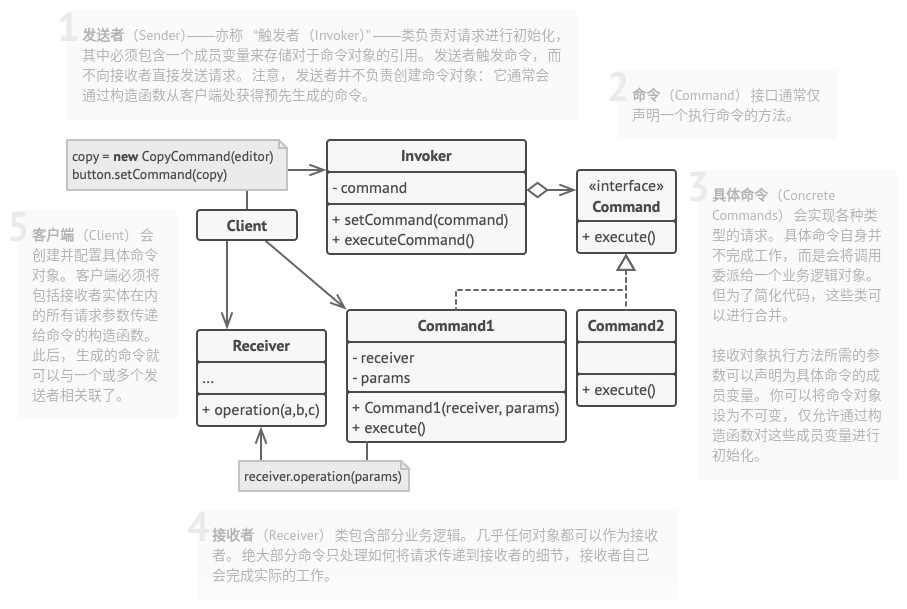

# 命令模式

## 简介


命令模式可以将请求(命令)的发送者与接收者完全解耦，发送者和接收者之间没有直接引用关系，发送请求的对象只需要知道如何发送请求，而不必知道请求是如何完成的。

> **命令模式：将一个请求封装为一个对象，从而可用不同的请求对客户进行参数化，对请求排队或者记录请求日志，以及支持可撤销的操作。**

## 结构



## 实现

实现方式：

* 声明仅有一个执行方法的命令接口。
* 抽取请求并使之成为实现命令接口的具体命令类。每个类都必须有一组成员变量来保存请求参数和对于实际接收者对象的引用。所有这些变量的数值都必须通过命令构造函数进行初始化。
* 找到担任发送者职责的类。在这些类中添加保持命令的成员变量。发送者只能通过命令接口与其命令进行交互。发送者自身通常并不创建命令对象，而是通过客户端代码获取。
* 修改发送者使其执行命令，而非直接将其请求发送给介接收者。
* 客户端必须按照一下顺序来初始化对象：
  * 创建接收者。
  * 创建命令，如有需要可将其关联至接收者。
  * 创建发生者并将其与特定命令关联。

```c++
#include <iostream>
#include <string>

class Receiver {
 public:
    void DoSomething(const std::string &a) {
        std::cout << "Receiver: 工作在 (" << a << ".)\n";
    }
    void DoSomethingElse(const std::string &b) {
        std::cout << "Receiver: 也工作在 (" << b << ".)\n";
    }
};

class Command {
public:
    virtual ~Command() {}
    virtual void Execute() const = 0;
};

class SimpleCommand : public Command {
private:
    std::string pay_load_;

public:
    explicit SimpleCommand(std::string pay_load) : pay_load_(pay_load) {}
    void Execute() const override {
        std::cout << "SimpleCommand: 自己做一些简单的事情 (" << this->pay_load_ << ")\n"; 
    }
};

class ComplexCommand : public Command {
private:
    Receiver *receiver_;
    std::string a_;
    std::string b_;

public:
    ComplexCommand(Receiver *receiver, std::string a, std::string b) : receiver_(receiver), a_(a), b_(b) {}
    void Execute() const override {
        std::cout << "ComplexCommand: 由接收者对象完成一些负责的事情 \n";
        this->receiver_->DoSomething(this->a_);
        this->receiver_->DoSomethingElse(this->b_);
    }
};


class Invoker {
private:
    Command *on_start_;
    Command *on_finish_;

public:
    ~Invoker() {
        delete on_start_;
        delete on_finish_;
    }
    void setOnStart(Command *command) {
        this->on_start_ = command;
    }
    void setOnFinish(Command *command) {
        this->on_finish_ = command;
    }
    void DoSomethingImportant() {
        std::cout << "Invoker: 开始！\n";
        if(this->on_start_) {
            this->on_start_->Execute();
        }
        std::cout << "Invoker: 中途！\n";
        std::cout << "Invoker: 完成！\n";
        if(this->on_finish_) {
            this->on_finish_->Execute();
        }
    }
};


int main(int argc, char * argv[]) {
    Invoker *invoker = new Invoker;
    invoker->setOnStart(new SimpleCommand("你好！"));
    Receiver *receiver = new Receiver;
    invoker->setOnFinish(new ComplexCommand(receiver, "发送邮件！", "准备回报材料！"));
    invoker->DoSomethingImportant();

    delete invoker;
    delete receiver;

    return 0;
}
```

```python
# -*- coding: utf-8 -*-

from __future__ import annotations
from abc import ABC, abstractmethod


class Command(ABC):
    """
    """

    @abstractmethod
    def execute(self) -> None:
        pass


class SimpleCommand(Command):
    def __init__(self, payload: str) -> None:
        self._payload = payload

    def execute(self) -> None:
        print(f"SimpleCommand: See, I can do simple things like printing"
              f"({self._payload})")


class ComplexCommand(Command):
    """
    """

    def __init__(self, receiver: Receiver, a: str, b: str) -> None:
        self._receiver = receiver
        self._a = a
        self._b = b

    def execute(self) -> None:
        print("ComplexCommand: Complex stuff should be done by a receiver object", end="")
        self._receiver.do_something(self._a)
        self._receiver.do_something_else(self._b)


class Receiver:
    """
    """

    def do_something(self, a: str) -> None:
        print(f"\nReceiver: Working on ({a}.)", end="")

    def do_something_else(self, b: str) -> None:
        print(f"\nReceiver: Also working on ({b}.)", end="")


class Invoker:
    """
    """

    _on_start = None
    _on_finish = None

    def set_on_start(self, command: Command):
        self._on_start = command

    def set_on_finish(self, command: Command):
        self._on_finish = command

    def do_something_important(self) -> None:
        print("Invoker: Does anybody want something done before I begin?")
        if isinstance(self._on_start, Command):
            self._on_start.execute()

        print("Invoker: ...doing something really important...")

        print("Invoker: Does anybody want something done after I finish?")
        if isinstance(self._on_finish, Command):
            self._on_finish.execute()


if __name__ == "__main__":
    """
    """

    invoker = Invoker()
    invoker.set_on_start(SimpleCommand("Say Hi!"))
    receiver = Receiver()
    invoker.set_on_finish(ComplexCommand(
        receiver, "Send email", "Save report"))

    invoker.do_something_important()
```

## 实例

### 问题描述

模拟开关功能，开关可控制电灯和空调等。

### 问题解答

```c++
// Example.cpp

#include <iostream>
#include <string>


// 接收者：电灯类
class Lamp {
private:
    bool lampState_;

public:
    Lamp() {
        this->lampState_ = false;
    }
    void on() {
        lampState_ = true;
        std::cout << "电灯已开启！\n";
    }
    void off() {
        lampState_ = false;
        std::cout << "电灯已关闭！\n";
    }
    bool getLampState() const {
        return lampState_;
    }
};

// 接收者：空调类
class Air {
private:
    bool airState_;

public:
    Air() {
        this->airState_ = false;
    }
    void on() {
        airState_ = true;
        std::cout << "空调已开启！\n";
    }
    void off() {
        airState_ = false;
        std::cout << "空调已关闭！\n";
    }
    bool getAirState() const {
        return airState_;
    }
};

// 抽象命令类
class Command {
private:
    Command *command;

public:
    virtual ~Command() {}
    virtual void execute() const = 0;
};

// 具体命令类
class LampCommand : public Command {
private:
    Lamp *lamp;

public:
    LampCommand() {
        std::cout << "开发控制电灯！\n";
        lamp = new Lamp();
    }
    ~LampCommand() {
        delete lamp;
    }
    void execute() const override {
        if(lamp->getLampState()) {
            lamp->off();
        } else {
            lamp->on();
        }
    }
};

// 具体命令类
class AirCommand : public Command {
private:
    Air *air;

public:
    AirCommand() {
        std::cout << "开发控制空调！\n";
        air = new Air();
    }
    ~AirCommand() {
        delete air;
    }
    void execute() const override {
        if(air->getAirState()) {
            air->off();
        } else {
            air->on();
        }
    }
};

// 调用者：按钮类
class Button {
private:
    Command *command_;

public:
    void setCommand(Command *command) {
        this->command_ = command;
    }
    void click() const {
        std::cout << "点击开关：";
        command_->execute();
    }
};


int main(int argc, char * argv[]) {
    Button * button = new Button;

    // 按钮控制电灯
    Command *lampCommand = new LampCommand();
    button->setCommand(lampCommand);
    button->click();
    button->click();
    button->click();
    button->click();
    std::cout << "\n";

    // 按钮控制空调
    Command *airCommand = new AirCommand();
    button->setCommand(airCommand);
    button->click();
    button->click();
    button->click();

    delete button;

    return 0;
}
```

## 总结

### 优点

* **单一职责原则**。可以解耦触发和执行操作的类。
* **开闭原则**。你可以在不修改已有客户端代码的情况下在程序中创建新的命令。
* 可以实现撤销和恢复功能。
* 可以实现操作的延迟执行。
* 可以实现命令队列或宏命令。
* 可以将一组简单命令组合成一个复杂命令。

### 缺点

* 代码可能会变得更加复杂，因为在发送者和接收者之间增加了一个全新的层次。

### 场景

* 如果你需要通过操作来参数化对象，可使用命令模式。
* 如果你想要将操作放入队列中、操作的执行或者远程执行操作，可使用命令模式。
* 如果你想要实现操作回滚功能，可使用命令模式。

### 与其他模式的关系

* **责任链模式**、**命令模式**、**中介者模式**和**观察者模式**用于处理请求发送者和接收者之间的不同连接方式：
  * 责任链按照顺序将请求动态传递给一系列的潜在接收者，直至其中一名接收者对请求进行处理。
  * 命令在发送者和请求者之间建立单向连接。
  * 中介者清除了发送者和请求者之间的直接连接，强制它们通过一个中介对象进行间接沟通。
  * 观察者允许接收者动态地订阅或取消接收请求。
* **责任链模式**的管理者可使用**命令模式**实现。在这种情况下，你可以对由请求代表的同一个上下文对象执行许多不同的操作。还有另外一种实现方式，那就是请求自身就是一个命令对象。在这种情况下，你可以对由一系列不同上下文连接而成的链执行相同的操作。
* 可以同时使用**命令模式**和**备忘录模式**来实现“撤销”。在这种情况下，命令用于对目标对象执行各种不同的操作，备忘录用来保存一条命令执行前该对象的状态。
* **命令模式**和**策略模式**看上去很像，因为两者都能通过某些行为来参数化对象。但是，它们的意图有非常大的不同。
  * 你可以使用命令来将任何操作转换为对象。操作的参数将成为对象的成员变量。你可以通过转换来延迟操作的执行、将操作放入队列、保存历史命令或者向远程服务发送命令等。
  * 另一方面，策略通常可用于描述完成某件事的不同方式，让你能够在同一个上下文类中切换算法。

* **原型模式**可用于保存命令的历史记录。

* 可以将**访问者模式**视为**命令模式**的加强版本，其对象可对不同类的多种对象执行操作。
