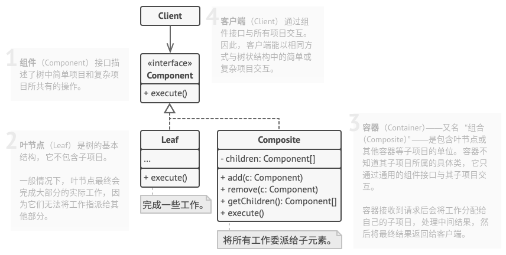

# 组合模式

## 简介


组合模式为叶子节点和容器节点提供了公共的抽象构建类，客户端无需关心所操作的对象是叶子节点还是容器节点，只需针对抽象构建类编程处理即可。

**组合模式：组合多个对象形成树形结构以表示具有部分-整体关系的层次结构。组合模式让客户端可以统一对待单个对象和组合对象。**

## 结构



## 实现

* 确保应用的核心模式能够以树状结构表示。尝试将其分解成简单元素和容器。记住，容器必须能够同时包含简单元素和其他容器。
* 声明组件接口及其一系列方法，这些方法对简单和复杂元素都有意义。
* 创建一个叶节点类表示简单元素。程序中可以有多个不同的叶节点类。
* 创建一个容器类表示复杂元素。在该类中，创建一个数组成员变量来存储对于其子元素的引用。该数组必须能同时保存叶节点和容器，因此请确保将其声明为组合接口类型。
* 最后，在容器中定义添加和删除子元素的方法。

```c++
#include <iostream>
#include <algorithm>
#include <list>
#include <string>
#include <memory>
#include <typeinfo>

// 组件类
class Component {
protected:
    Component *parent_;

public:
    virtual ~Component() {}
    void setParent(Component *parent) {
        this->parent_ = parent;
    }
    Component* getParent() const {
        return this->parent_;
    }
    virtual void add(Component* component) {}
    virtual void remove(Component* component) {}
    virtual bool isComposite() const {
        return false;
    }
    virtual std::string operation() const = 0;
};

// 叶节点类
class Leaf: public Component {
public:
    std::string operation() const override {
        return "Leaf";
    }
};

// 容器类
class Composite: public Component {
protected:
    std::list<Component *> children_;

public:
    void add(Component *component) override {
        this->children_.push_back(component);
        component->setParent(this);
    }
    void remove(Component *component) override {
        // if( find(children_.begin(), children_.end(), component) != children_.end() ) {
        //     children_.remove(component);
        //     component->setParent(nullptr);
        // }
        children_.remove(component);
        component->setParent(nullptr);
    }
    bool isComposite() const override {
        return true;
    }
    std::string operation() const override {
        std::string result;
        for(const Component* c : children_) {
            if( c == children_.back() ) {
                result += c->operation();
            } else {
                result += c->operation() + "+";
            }
        }
        return "Branch(" + result + ")";
    }
};

//
void ClientCode(Component* component) {
    //...
    std::cout << "REST: " << component->operation();
    //...
}

//
void ClientCode2(Component* component1, Component* component2) {
    //...
    if(component1->isComposite()) {
        component1->add(component2);
    }
    std::cout << "REST: " << component1->operation();
    //...
}

int main(int argc, char *argv[]) {
    // std::shared_ptr<Component> simple = std::make_shared<Leaf>();
    // std::shared_ptr<Component> simple(new Leaf);
    Component *simple = new Leaf;
    std::cout << "Client: simple component: " << std::endl;
    ClientCode(simple);
    std::cout << std::endl << std::endl;

    // std::shared_ptr<Component> tree = std::make_shared<Composite>();
    // std::shared_ptr<Component> branch1 = std::make_shared<Composite>();
    // std::shared_ptr<Component> branch2 = std::make_shared<Composite>();
    // std::shared_ptr<Component> leaf_1 = std::make_shared<Leaf>();
    // std::shared_ptr<Component> leaf_2 = std::make_shared<Leaf>();
    // std::shared_ptr<Component> leaf_3 = std::make_shared<Leaf>();
    Component *tree = new Composite;
    Component *branch1 = new Composite;
    Component *branch2 = new Composite;
    Component *leaf_1 = new Leaf;
    Component *leaf_2 = new Leaf;
    Component *leaf_3 = new Leaf;
    branch1->add(leaf_1);
    branch1->add(leaf_2);
    branch2->add(leaf_3);
    tree->add(branch1);
    tree->add(branch2);
    std::cout << "Client: component tree: " << std::endl;
    ClientCode(tree);
    std::cout << std::endl << std::endl;

    std::cout << "Client: component tree not check: " << std::endl;
    branch1->remove(leaf_2);
    // branch1->remove(leaf_2);
    ClientCode2(tree, simple);
    std::cout << std::endl << std::endl;

    delete simple;
    delete tree;
    delete branch1;
    delete branch2;
    delete leaf_1;
    delete leaf_2;
    delete leaf_3;

    return 0;
}
```

```python
# -*- coding: utf-8 -*-

from __future__ import annotations
from abc import ABC, abstractmethod
from typing import List


class Component(ABC):
    """
    """

    @property
    def parent(self) -> Component:
        return self._parent

    @parent.setter
    def parent(self, parent: Component):
        self._parent = parent

    def add(self, component: Component) -> None:
        pass

    def remove(self, component: Component) -> None:
        pass

    def is_composite(self) -> bool:
        return False

    @abstractmethod
    def operation(self) -> str:
        pass


class Leaf(Component):
    """
    """

    def operation(self) -> str:
        return "Leaf"


class Composite(Component):
    """
    """

    def __init__(self) -> None:
        self._children: List[Component] = []

    def add(self, component: Component) -> None:
        self._children.append(component)
        component.parent = self

    def remove(self, component: Component) -> None:
        self._children.remove(component)
        component.parent = None

    def is_composite(self) -> bool:
        return True

    def operation(self) -> str:
        results = []
        for child in self._children:
            results.append(child.operation())
        return f"Branch({'+'.join(results)})"


def client_code(component: Component) -> None:
    print(f"RESULT: {component.operation()}", end="")


def client_code2(component1: Component, component2: Component) -> None:
    if component1.is_composite():
        component1.add(component2)

    print(f"RESULT: {component1.operation()}", end="")


if __name__ == "__main__":
    simple = Leaf()
    print("Client: I've got a simple component:")
    client_code(simple)
    print("\n")

    tree = Composite()

    branch1 = Composite()
    branch1.add(Leaf())
    branch1.add(Leaf())

    branch2 = Composite()
    branch2.add(Leaf())

    tree.add(branch1)
    tree.add(branch2)

    print("Client: Now I've got a composite tree:")
    client_code(tree)
    print("\n")

    print("Client: I don't need to check the components classes even when managing the tree:")
    client_code2(tree, simple)
```

## 实例

### 问题描述

同上。

### 问题解答

同上。

## 总结

### 优点

* 你可以利用多态和递归机制更方便地使用复杂树结构。
* 开闭原则。 无需更改现有代码， 你就可以在应用中添加新元素， 使其成为对象树的一部分。

### 缺点

* 对于功能差异较大的类， 提供公共接口或许会有困难。 在特定情况下， 你需要过度一般化组件接口， 使其变得令人难以理解。

### 场景

* 如果你需要实现树状对象结构，可以使用该模式。
* 如果你希望客户端代码以相同方式处理简单和复杂元素，可以使用该模式。

### 与其他模式的关系

* **桥接模式**、**状态模式**和**策略模式**(某种程序上包括**适配器模式**)的接口都非常相似，实际上，它们都基于**组合模式**，即将工作委派给其他对象，不过也都各自解决了不同的问题。
* 可以在创建复杂**组合树**时使用**生成器(建造者)模式**，因为这可使其构造步骤以递归的方式运行。
* **责任链模式**通常和**组合模式**结合使用。在这种情况下，叶组件接收到请求后，可以将请求沿包含全体父组件的链一直传递至对象树的底部。
* 可以使用**迭代器模式**来遍历**组合树**。
* 可以使用**访问者模式**对整个**组合树**执行操作。
* 可以使用**享元模式**实现**组合树**的共享叶节点以节省内存。
* **组合模式**和**装饰模式**的结构图很相似， 因为两者都依赖递归组合来组织无限数量的对象。
* 大量使用**组合模式**和**装饰模式**的设计通常可从对于**原型模式**的使用中获益。 你可以通过该模式来复制复杂结构， 而非从零开始重新构造。
