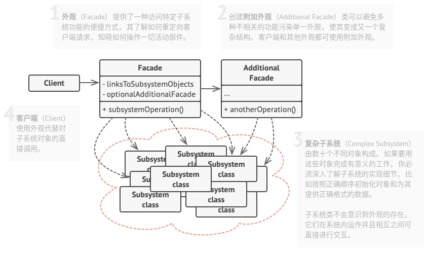

# 外观模式

## 简介


外观模式提供一个外观角色封装多个复杂的子系统，简化客户端和子系统之间的交互，方便客户端使用。外观模式可以降低系统的耦合度。如果没有外观类，不同的客户端在需要和多个不同的子系统交互，系统中将存在复杂的引用关系。

**外观模式：为子系统中的一组接口提供一个统一的入口。外观模式定义了一个高层接口，这个接口使得这一子系统更加容易使用。**

## 结构



## 实现

实现方式：

* 考虑能否在现有子系统的基础上提供一个更简单的接口。如果该接口能让客户端代码独立与众多子系统类，那么你的方向就是正确的。
* 在一个新的外观类中声明并实现该接口。外观应将客户端代码的调用重定向到子系统中的相应对象处。如果客户端代码没有对子系统进行初始化，也没有对其后续生命周期进行管理，那么外观必须完成此类工作。
* 如果要充分发挥这一模式的优势，必须确保所有客户端代码仅能通过外观与子系统进行交互。此后客户端代码将不会收到任何由子系统代码修改而造成的影响。
* 如果外观变得过于臃肿，可以考虑将其部分行为抽取为一个新的专用外观类。

```c++
#include <iostream>
#include <string>
#include <memory>

class Subsystem1 {
public:
    std::string Operation1() const {
        return "Subsystem1: Ready!\n";
    }
    // ...
    std::string OperationN() const {
        return "Subsystem1: Go!\n";
    }
};

class Subsystem2 {
public:
    std::string Operation1() const {
        return "Subsystem2: Ready!\n";
    }
    // ...
    std::string OperationZ() const {
        return "Subsystem2: Go!\n";
    }
};

// 外观类
class Facade {
protected:
    Subsystem1* subsystem1_;
    Subsystem2* subsystem2_;

public:
    Facade(Subsystem1* subsystem1 = nullptr, Subsystem2* subsystem2 = nullptr) {
        this->subsystem1_ = subsystem1 ?: new Subsystem1;
        this->subsystem2_ = subsystem2 ?: new Subsystem2;
    }
    ~Facade() {
        delete subsystem1_;
        delete subsystem2_;
    }
    std::string Operation() {
        std::string result = "Facade initializes subsystems:\n";
        result += this->subsystem1_->Operation1();
        result += this->subsystem2_->Operation1();
        result += "Facade orders subsystems to perform the action:\n";
        result += this->subsystem1_->OperationN();
        result += this->subsystem2_->OperationZ();
        return result;
    }
};

void ClientCode(Facade* facade) {
    // ...
    std::cout << facade->Operation();
    // ...
}


int main(int argc, char * argv[]) {
    Subsystem1* subsystem1 = new Subsystem1;
    Subsystem2* subsystem2 = new Subsystem2;
    // std::shared_ptr<Facade> facade = std::make_shared<Facade>(subsystem1, subsystem2);
    Facade *facade = new Facade(subsystem1, subsystem2);
    ClientCode(facade);
    delete facade;

    return 0;
}
```

```python
from __future__ import annotations


class Facade:
    """
    """

    def __init__(self, subsystem1: Subsystem1, subsystem2: Subsystem2) -> None:
        self._subsystem1 = subsystem1 or Subsystem1()
        self._subsystem2 = subsystem2 or Subsystem2()

    def operation(self) -> str:
        results = []
        results.append("Facade initializes subsystems:")
        results.append(self._subsystem1.operation1())
        results.append(self._subsystem2.operation1())
        results.append("Facade orders subsystems to perform the action:")
        results.append(self._subsystem1.operation_n())
        results.append(self._subsystem2.operation_z())
        return "\n".join(results)


class Subsystem1:
    """
    """

    def operation1(self) -> str:
        return "Subsystem1: Ready!"

    # ...

    def operation_n(self) -> str:
        return "Subsystem1: Go!"


class Subsystem2:
    """
    """

    def operation1(self) -> str:
        return "Subsystem2: Get ready!"

    # ...

    def operation_z(self) -> str:
        return "Subsystem2: Fire!"


def client_code(facade: Facade) -> None:
    print(facade.operation(), end="")


if __name__ == "__main__":
    subsystem1 = Subsystem1()
    subsystem2 = Subsystem2()
    facade = Facade(subsystem1, subsystem2)
    client_code(facade)
```

## 实例

### 问题描述

电脑主机（Mainframe）中只需要按下主机的开机按钮（powerOn），即可调用其他硬件设备和软件的启动方法，如内存（Memory）的自检（selfCheck）、CPU的运行（run）、硬盘（HardDisk）的读取（read）、操作系统（OS）的载入（load）等。如果某一过程发生错误则电脑开机失败。

### 问题解答

```c++
// Example.cpp

#include <iostream>
#include <memory>

//子系统：内存
class Memory
{
public:
    void selfCheck()
    {
        std::cout << "…………内存自检……\n";
    }
};

//子系统：CPU
class CPU
{
public:
    void run()
    {
        std::cout << "…………运行CPU运行……\n";
    }
};

//子系统：硬盘
class HardDisk
{
public:
    void read()
    {
        std::cout << "…………读取硬盘……\n";
    }
};

//子系统：操作系统
class OS
{
public:
    void load()
    {
        std::cout << "…………载入操作系统……\n";
    }
};

//外观类
class Facade
{
private:
    Memory *memory;
    CPU *cpu;
    HardDisk *hardDisk;
    OS *os;

public:
    Facade()
    {
        memory = new Memory();
        cpu = new CPU();
        hardDisk = new HardDisk();
        os = new OS();
    }
    void powerOn()
    {
        std::cout << "正在开机……\n";
        memory->selfCheck();
        cpu->run();
        hardDisk->read();
        os->load();
        std::cout << "开机完成……\n";
    }
};

int main(int argc, char *argv[])
{
    std::shared_ptr<Facade> facade = std::make_shared<Facade>();
    facade->powerOn();

    return 0;
}
```

## 总结

### 优点

* 可以让自己的代码独立于复杂子系统，可以大大降低耦合度。

### 缺点

* 外观可能成为与程序中所有类都耦合的上帝对象(即一个了解过多或者负责过多的对象)。
* 如果需要增加或者减少子系统，需要修改外观类，违反**开闭原则**。

### 场景

* 如果你需要一个指向复杂子系统的直接接口，且该接口的功能有限，则可以使用该模式。
* 如果需要将子系统组织为多层结构，则可以使用该模式。

### 与其他模式的关系

* **外观模式**为现有对象定义了一个新接口，**适配器模式**则会试图运用已有的接口。适配器通常只封装一个对象，外观通常会作用于整个对象子系统上。
* 当只需要客户端代码隐藏子系统创建对象的方式时，可以使用**抽象工厂模式**来替代**外观模式**。
* **享元模式**展示了如何生成大量的小型对象，**外观模式**则展示了如何用一个对象来代表整个子系统。
* **外观模式**和**中介者模式**的职责类似：它们都尝试在大量紧密耦合的类中组织起合作。
  * 外观为子系统中的所有对象定义了一个简单接口，但是它不提供任何新功能。子系统本身不会意识到外观的存在。子系统中的对象可以直接进行交流。
  * 中介者将系统中组件的沟通行为中心化。各组件只知道中介者对象，无法直接相互交流。
* **外观模式**类通常可以转换为**单例模式**类，因为在大部分情况下一个外观对象就足够了。
* **外观模式**和**代理模式**的相似之处在于它们都缓存了一个复杂实体并自行对其初始化。代理模式与其服务对象遵循同一个接口，使得自己和服务对象客户互换，在这一点上它与外观不同。
