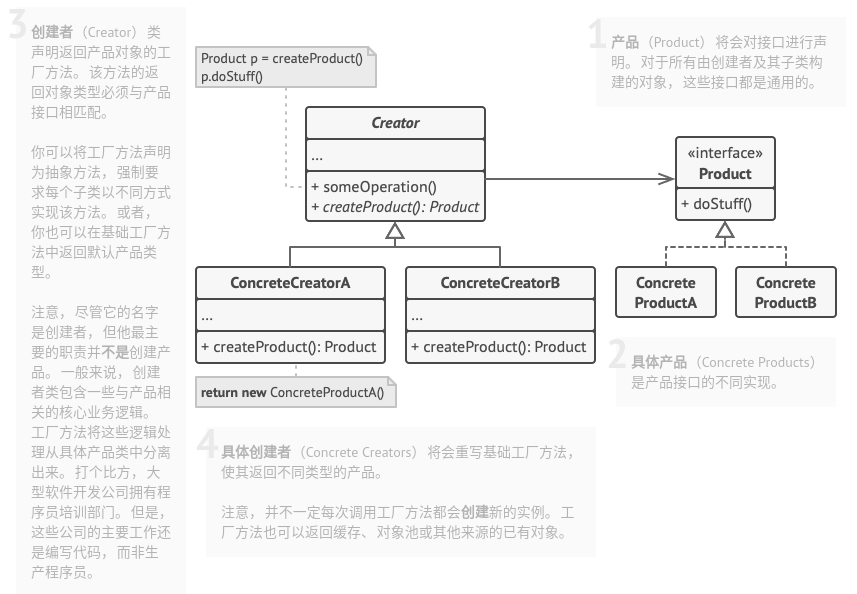

# 工厂方法模式

## 简介


为了利用简单工厂模式且遵循开闭原则，工厂方法模式中不再使用工厂类统一创建所有的具体产品，而是针对不同的产品设计了不同的工厂，每一个工厂只生产特定的产品。

**工厂方法模式：定义一个用于创建对象的接口，但是让子类决定将哪一个类实例化。工厂方法模式让一个类的实例化延迟到其子类。**

## 结构



## 实现

实现方式：

* 让所有产品都遵循同一接口。该接口必须声明对所有产品都有意义的方法。
* 在创建类中添加一个空的工厂方法。该方法的返回类型必须遵循通用的产品接口。
* 在创建者代码中找到对于产品构造函数的所有引用。将它们依次替换为对于工厂方法的调用，同时将创建产品的代码移入工厂方法。你可能需要在工厂方法中添加临时参数来控制返回的产品类型。
* 为工厂方法中的每种产品编写一个创建者子类，然后在子类中重写工厂方法，并将基本方法中的相关创建代码移动到工厂方法中。
* 如果应用中的产品类型太多，那么为每个产品创建子类并无太大必要，这时你也可以在子类中复用基类中的控制参数。
* 如果代码经过上述移动后，基础工厂方法中已经没有任何代码，你可以将其转变为抽象类。如果基础工厂中还有其他语句，你可以将其设置为该方法的默认行为。

```c++
#include <iostream>
#include <memory>

class Product {
public:
    virtual ~Product() {}    // virtual
    virtual std::string Operation() const = 0;
};

class ConceteProduct1: public Product {
public:
    std::string Operation() const override {
        return "{Result of the ConcreteProduct1}";
    }
};

class ConceteProduct2: public Product {
public:
    std::string Operation() const override {
        return "{Result of the ConcreteProduct2}";
    }
};

class Creator {
public:
    virtual ~Creator() {}   // virtual
    virtual Product* FactoryMethod() const = 0;
    std::string SomeOperation() const {
        Product* product = this->FactoryMethod();
        std::string result = "Creator: The same creator's code has just worked with " + product->Operation();
        delete product;
        return result;
    }

};

class ConcreteCreator1: public Creator {
public:
    Product* FactoryMethod() const override {
        return new ConceteProduct1();
    }
};

class ConcreteCreator2: public Creator {
public:
    Product* FactoryMethod() const override {
        return new ConceteProduct2();
    }
};

void ClientCode(const Creator& creator) {
    // ...
    std::cout << "Client: I'm not aware of the creator's class, but it still works.\n" << creator.SomeOperation() << std::endl;
    // ...
}

int main(int argc, char *argv[]) {
    std::cout << "App: Launched with the ConcreteCreator1.\n";
    // Creator* creator = new ConcreteCreator1();
    std::shared_ptr<Creator> creator = std::make_shared<ConcreteCreator1>();
    ClientCode(*creator);
    std::cout << std::endl;

    std::cout << "App: Launched with the ConcreteCreator2.\n";
    // Creator* creator = new ConcreteCreator2();
    std::shared_ptr<Creator> creator2 = std::make_shared<ConcreteCreator2>();
    ClientCode(*creator2);
    std::cout << std::endl;

    return 0;
}
```

```python
from __future__ import annotations
from abc import ABC, abstractmethod


class Creator(ABC):
    """
    """

    @abstractmethod
    def factory_method(self):
        """
        """
        pass

    def some_operation(self) -> str:
        """
        """
        product = self.factory_method()

        # Now, use the product.
        result = f"Creator: The same creator's code has just worked with {product.operation()}"

        return result


class ConcreteCreator1(Creator):
    """
    """

    def factory_method(self) -> ConcreteProduct1:
        return ConcreteProduct1()


class ConcreteCreator2(Creator):
    def factory_method(self) -> ConcreteProduct2:
        return ConcreteProduct2()


class Product(ABC):
    """
    """

    @abstractmethod
    def operation(self) -> str:
        pass


class ConcreteProduct1(Product):
    def operation(self) -> str:
        return "{Result of the ConcreteProduct1}"


class ConcreteProduct2(Product):
    def operation(self) -> str:
        return "{Result of the ConcreteProduct2}"


def client_code(creator: Creator) -> None:
    """
    """

    print(f"Client: I'm not aware of the creator's class, but it still works.\n"
          f"{creator.some_operation()}", end="")


if __name__ == "__main__":
    print("App: Launched with the ConcreteCreator1.")
    client_code(ConcreteCreator1())
    print("\n")

    print("App: Launched with the ConcreteCreator2.")
    client_code(ConcreteCreator2())
```

## 实例

### 问题描述

同学们想要进行户外运动，他们可以选择打篮球、踢足球或者玩排球。它们分别有篮球保管室、足球保管室和排球保管室管理，只需要去相应的保管室就能拿到相应的球。

### 问题解答

```c++
// Example.cpp

#include <iostream>


// 抽象产品类
class AbstractSportProduct {
public:
    virtual ~AbstractSportProduct() {}
    virtual void printName() const = 0;
    virtual void play() const = 0;
};

// 具体产品类
class Basketball: public AbstractSportProduct {
public:
    Basketball() {
        printName();
        play();
    }
    void printName() const {
        std::cout << "get Basketball" << std::endl;
    }
    void play() const {
        std::cout << "play Basketball" << std::endl;
    }
};

// 具体产品类
class Football: public AbstractSportProduct {
public:
    Football() {
        printName();
        play();
    }
    void printName() const {
        std::cout << "get Football" << std::endl;
    }
    void play() const {
        std::cout << "play Football" << std::endl;
    }
};

// 具体产品类
class Volleyball: public AbstractSportProduct {
public:
    Volleyball() {
        printName();
        play();
    }
    void printName() const {
        std::cout << "get Volleyball" << std::endl;
    }
    void play() const {
        std::cout << "play Volleyball" << std::endl;
    }
};

// 抽象工厂类
class AbstractFactory {
public:
    virtual ~AbstractFactory() {}
    virtual AbstractSportProduct *getSportProduct() const  = 0;
};

// 具体工厂类
class BasketballFactory : public AbstractFactory {
public:
    BasketballFactory() {
        // ...
    }
    AbstractSportProduct* getSportProduct() const {
        std::cout << "basketball" << std::endl;
        return new Basketball();
    }
};

// 具体工厂类
class FootballFactory : public AbstractFactory {
public:
    FootballFactory() {
        // ...
    }
    AbstractSportProduct* getSportProduct() const {
        std::cout << "football" << std::endl;
        return new Football();
    }
};

// 具体工厂类
class VolleyballFactory : public AbstractFactory {
public:
    VolleyballFactory() {
        // ...
    }
    AbstractSportProduct* getSportProduct() const {
        std::cout << "volleyball" << std::endl;
        return new Volleyball();
    }
};


int main(int argc, char* argv[]) {
    AbstractFactory* fac = nullptr;
    AbstractSportProduct* pro = nullptr;

    fac = new BasketballFactory();
    pro = fac->getSportProduct();
    std::cout << std::endl;

    fac = new FootballFactory();
    pro = fac->getSportProduct();
    std::cout << std::endl;

    fac = new VolleyballFactory();
    pro = fac->getSportProduct();
    std::cout << std::endl;

    delete fac;
    delete pro;

    return 0;
}
```

## 总结

### 优点

* 工厂方法模式更加符合**开闭原则**，它是使用频率最高的设计模式之一，是很多开源框架和类库的核心模式。
* 工厂方法模式更加符合**单一职责原则**，你可以将产品创建代码放在程序的单一位置，从而使代码更加容易维护。
* 工厂方法用于创建客户所需产品，同时向客户隐藏某个具体产品类将被实例化的细节，用户只需要关心所需产品对应的工厂。
* 工厂自主决定创建何种产品，并且创建过程封装在具体工厂对象内部，多态性设计是工厂模式的关键。

### 缺点

* 添加新产品时需要同时添加新的产品工厂，系统中的类的数量成对增加，增加了系统复杂度和额外开销。

### 场景

* 当你在编写代码时，如果无法预知对象确切类别和其依赖关系时，可使用工厂方法模式。
* 如果你希望用户能扩展你软件库或者框架的内部组件，可使用工厂方法模式。
* 如果你希望复用现有对象来节省系统资源，而不是每次都重新创建对象，可使用工厂方法模式。

### 与其他模式的关系

* 在许多设计工作的初期都会使用**工厂方法模式**(较为简单，而且方便通过子类进行定制)，随后演变为使用**抽象工厂模式**、**原型模式**或**建造者模式**。
* **抽象工厂模式**通常基于一组**工厂方法**，但你也可以使用**原型模式**来生成这些类的方法。
* 你可以同时使用**工厂方法模式**和**迭代器模式**来让子类集合返回不同类型的迭代器，并使得迭代器与集合相匹配。
* **工厂方法模式**是**模板方法模式**的一直特殊形式，同时，工厂方法可以作为一个大型模板方法中的一个步骤。
