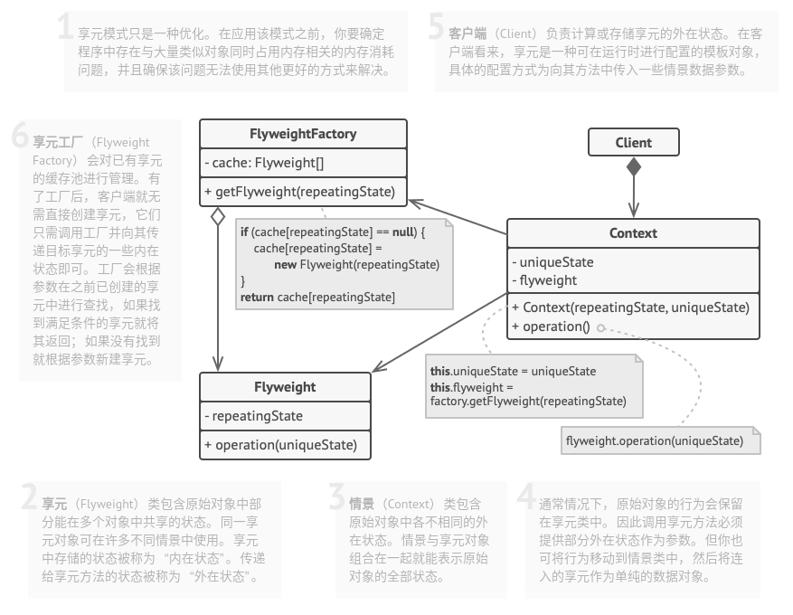

# 享元模式

## 简介


如果一个系统在运行时创建太多相同或者相似的对象，会占用大量内存和资源，导致系统性能降低。享元模式通过共享技术实现相同或相似的**细粒度对象**的复用，提供一个享元池存储已经创建好的对象，并通过享元工厂类将享元对象提供给客户端使用。

**享元模式：运行共享技术有效地支持大量细粒度对象的复用。**

享元对象能够做到共享的关键在于区分内部状态和外部状态：

* **内部状态**：存储在享元对象内部，不会随着环境的改变而改变，内部状态可以共享。
* **外部状态**：随环境变化而变化，不可以共享的状态。

## 结构



## 实现

实现方式：

* 将需要改写为享元的类成员变量拆分为两个部分：
  * 内在状态：包含不变的、可在许多对象中重复使用的数据的成员变量。
  * 外在状态：包含每个对象各自不同的情景数据的成员变量。
* 保留类中表示内在状态的成员变量，并将其属性设置为不可修改。这些变量仅可构造函数中获得初始值。
* 找到所有使用外在状态成员变量的方法，为在方法中所用的每个成员变量新建一个参数，并使用该参数代替成员变量。
* 可以有选择地创建工厂类来管理享元缓存池，它复杂在新建享元时检查已有的享元。如果选择使用工厂，客户端就只能通过工厂来请求享元，它们需要将享元的内在状态作为参数传递给工厂。
* 客户端必须存储和计算外在状态的数值，因为只有这样才能调用享元对象的方法。为了使用方便，外在状态和引用享元的成员比哪里可以移动到单独的情景类中。

```c++

```

```python
# -*- coding: utf-8 -*-

import json
from typing import Dict


class Flyweight():
    """
    """

    def __init__(self, shared_state: str) -> None:
        self._shared_state = shared_state

    def operation(self, unique_state: str) -> None:
        s = json.dumps(self._shared_state)
        u = json.dumps(unique_state)
        print(f"Flyweight: Displaying shared ({s}) and unique ({u}) state.", end="")


class FlyweightFactory():
    """
    """

    _flyweights: Dict[str, Flyweight] = {}

    def __init__(self, initial_flyweights: Dict) -> None:
        for state in initial_flyweights:
            self._flyweights[self.get_key(state)] = Flyweight(state)

    def get_key(self, state: Dict) -> str:

        return "_".join(sorted(state))

    def get_flyweight(self, shared_state: Dict) -> Flyweight:

        key = self.get_key(shared_state)

        if not self._flyweights.get(key):
            print("FlyweightFactory: Can't find a flyweight, creating new one.")
            self._flyweights[key] = Flyweight(shared_state)
        else:
            print("FlyweightFactory: Reusing existing flyweight.")

        return self._flyweights[key]

    def list_flyweights(self) -> None:
        count = len(self._flyweights)
        print(f"FlyweightFactory: I have {count} flyweights:")
        print("\n".join(map(str, self._flyweights.keys())), end="")


def add_car_to_police_database(
    factory: FlyweightFactory, plates: str, owner: str,
    brand: str, model: str, color: str
) -> None:
    print("\n\nClient: Adding a car to database.")
    flyweight = factory.get_flyweight([brand, model, color])
    flyweight.operation([plates, owner])


if __name__ == "__main__":

    factory = FlyweightFactory([
        ["Chevrolet", "Camaro2018", "pink"],
        ["Mercedes Benz", "C300", "black"],
        ["Mercedes Benz", "C500", "red"],
        ["BMW", "M5", "red"],
        ["BMW", "X6", "white"],
    ])

    factory.list_flyweights()

    add_car_to_police_database(
        factory, "CL234IR", "James Doe", "BMW", "M5", "red")

    add_car_to_police_database(
        factory, "CL234IR", "James Doe", "BMW", "X1", "red")

    print("\n")

    factory.list_flyweights()
```

## 实例

### 问题描述

模拟共享网络设备。

### 问题解答

```c++
// Example.cppp

#include <iostream>
#include <string>
#include <mutex>
#include <vector>

// 抽象享元类
class NetDevice{
public:
    virtual ~NetDevice() {}
    virtual std::string getName() const = 0;
    void printName() {
        std::cout << "NetDevice: " << getName() << std::endl;
    }
};

// 具体享元类：集线器
class Hub: public NetDevice {
public:
    std::string getName() const override {
        return "集线器";
    }
};

// 具体享元类：交换机
class Switch: public NetDevice {
public:
    std::string getName() const override {
        return "交换机";
    }
};

// 享元工厂类，使用单例模式，保证工厂实例的唯一性
class NetDeviceFactory {
private:
    // 单例
    static NetDeviceFactory* instance;
    static std::mutex m_mutex;

    // 共享池
    std::vector<NetDevice*> devicePool;

    NetDeviceFactory() {
        devicePool.push_back(new Hub());
        devicePool.push_back(new Switch());
    }

public:
    NetDevice* getNetDevice(const std::string& name) {
        if(name == "集线器") {
            return devicePool[0];
        } else if(name == "交换机") {
            return devicePool[1];
        } else {
            std::cout << "Error" << std::endl;
            return nullptr;
        }
    }

    static NetDeviceFactory* getInstance() {
        if(instance == nullptr) {
            m_mutex.lock();
            if(instance == nullptr) {
                instance = new NetDeviceFactory();
            }
            m_mutex.unlock();
        }
        return instance;
    }
};

NetDeviceFactory* NetDeviceFactory::instance = nullptr;
std::mutex NetDeviceFactory::m_mutex;


int main(int argc, char *argv[]) {
    NetDeviceFactory *factory = NetDeviceFactory::getInstance();
    NetDevice *device1, *device2, *device3, *device4;

    device1 = factory->getNetDevice("集线器");
    device1->printName();
    device2 = factory->getNetDevice("集线器");
    device2->printName();
    std::cout << "两个集线器是否为同一个？" << std::endl;
    std::cout << "device1: " << device1 << std::endl;
    std::cout << "device1: " << device2 << std::endl;
    std::cout << std::endl;

    device3 = factory->getNetDevice("交换机");
    device3->printName();
    device4 = factory->getNetDevice("交换机");
    device4->printName();
    std::cout << "两个交换机是否为同一个？" << std::endl;
    std::cout << "device3: " << device3 << std::endl;
    std::cout << "device4: " << device4 << std::endl;

    return 0;
}
```

## 总结

### 优点

* 如果程序中有很多相似对象，那么将可以节省大量内存。
* 享元模式通过内部状态和外部状态的区分，外部状态相互独立，客户端可以根据需求任意使用。

### 缺点

* 可能需要牺牲执行速度来换取内存，因为他人每次调用享元方法时都需要重新计算部分情景数据。
* 代码会变得更加复杂。团队中的新成员总是会问：“为什么要像这样拆分一个实体的状态？”。

### 场景

* 在程序必须支持大量对象且没有足够的内存容量时，可以使用该模式。

### 与其他模式的关系

* 可以使用**享元模式**实现**组合模式**树的共享叶节点以节省内存。
* **享元模式**展示了如何生成大量的小型对象，**外观模式**则展示了如何用一个对象来代表整个子系统。
* 如果能将对象的所有共享状态简化为一个享元对象，那么**享元模式**就和**单例模式**类似了。但这两个模式有两个根本性的不同：
  * 只会有一个单例实体，但是享元类可以有多个实体，各实体的内在状态也可以不同。
  * 单例对象可以是可变的。享元对象是不可变的。
