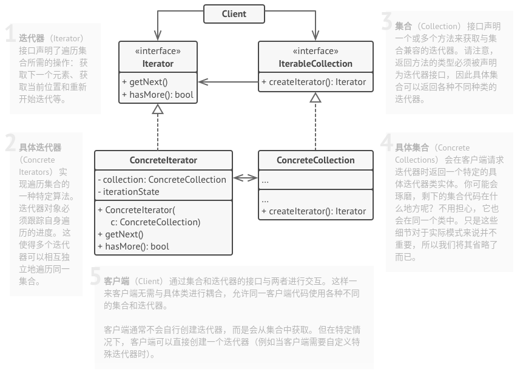

# 迭代器模式

## 简介


通过引入迭代器，可以将数据的遍历功能从聚合对象中分离出来，这样一来，聚合对象只需负责存储数据，而迭代器对象负责遍历数据，使得聚合对象的职责更加单一，符合**单一职责原则**。

> **迭代器模式：提供一种方法顺序访问一个聚合对象中的各个元素，而又不暴露该对象的内部表示。**

## 结构



## 实现

实现方式：

* 声明迭代器接口。该接口必须提供至少一个方法来获取集合中的下个元素。但为了使用方便，还可以添加一些其他方法，例如获取前一个元素、记录当前位置和判断迭代是否已经结束。
* 声明集合接口并描述一个获取迭代器的方法。其返回值必须是迭代器接口。如果计划拥有多组不同的迭代器，则可以声明多个类似的方法。
* 为希望使用迭代器进行遍历的集合实现具体迭代器类。迭代器对象必须与单个集合实体链接。链接关系通常通过迭代器的构造函数建立。
* 在集合类中实现集合接口。其主要思想是针对特定集合为客户端代码提供创建迭代器的快捷方式。集合对象必须将自身传递给迭代器的构造函数来创建两者之间的链接。
* 检查客户端代码，使用迭代器替代所有集合遍历代码。每当客户端需要遍历集合元素时都会获取一个新的迭代器。

```c++
#include <iostream>
#include <string>
#include <vector>

template <typename T, typename U>
class Iterator {
public:
    typedef typename std::vector<T>::iterator iter_type;
    Iterator(U *p_data, bool reverse = false) : m_p_data_(p_data), m_it_(m_p_data_->m_data_.begin()) {}
    void first() {
        m_it_ = m_p_data_->m_data_.begin();
    }
    void next() {
        m_it_++;
    }
    bool isDone() {
        return (m_it_ == m_p_data_->m_data_.end());
    }
    iter_type Current() {
        return m_it_;
    }

private:
    U *m_p_data_;
    iter_type m_it_;
};

template <class T>
class Container {
    friend class Iterator<T, Container>;

private:
    std::vector<T> m_data_;

public:
    void add(T a) {
        m_data_.push_back(a);
    }
    Iterator<T, Container> *CreateIterator() {
        return new Iterator<T, Container>(this);
    }
};

class CustomData {
private:
    int m_data_;

public:
    CustomData(int a = 0) : m_data_(a) {}
    void setData(int a) {
        m_data_ = a;
    }
    int data() const { 
        return m_data_;
    }
};

void ClientCode() {
    std::cout << "Iterator with int:\n";
    Container<int> cont;
    for(int i = 0; i < 10; ++i) {
        cont.add(i);
    }

    Iterator<int, Container<int>> *it = cont.CreateIterator();
    for(it->first(); !it->isDone(); it->next()) {
        std::cout << *it->Current() << std::endl;
    }

    std::cout << "\n";

    std::cout << "Iterator with custom Class:\n";
    Container<CustomData> cont2;
    CustomData a(100), b(1000), c(10000);
    cont2.add(a);
    cont2.add(b);
    cont2.add(c);
    Iterator<CustomData, Container<CustomData>> *it2 = cont2.CreateIterator();
    for(it2->first(); !it2->isDone(); it2->next()) {
        std::cout << it2->Current()->data() << std::endl;
    }

    delete it;
    delete it2;
}

int main(int argc, char *argv[]) {
    ClientCode();

    return 0;
}
```

```python
from __future__ import annotations
from collections.abc import Iterator, Iterable
from typing import Any, List


class AlphabeticalOrderIterator(Iterator):
    """
    """
    _position: int = None
    _reverse: bool = False

    def __init__(self, collection: WordsCollection, reverse: bool = False) -> None:
        self._collection = collection
        self._reverse = reverse
        self._position = -1 if reverse else 0

    def __next__(self):
        try:
            value = self._collection[self._position]
            self._position += -1 if self._reverse else 1
        except IndexError:
            raise StopIteration()

        return value


class WordsCollection(Iterable):
    """
    """
    def __init__(self, collection: List[Any] = []) -> None:
        self._collection = collection

    def __iter__(self) ->AlphabeticalOrderIterator:
        return AlphabeticalOrderIterator(self._collection)

    def get_reverse_iterator(self) -> AlphabeticalOrderIterator:
        return AlphabeticalOrderIterator(self._collection, True)

    def add_item(self, item: Any):
        self._collection.append(item)


if __name__ == "__main__":
    collection = WordsCollection()
    collection.add_item("First")
    collection.add_item("Second")
    collection.add_item("Third")

    print("Straight traversal:")
    print("\n".join(collection))
    print("")

    print("Reverse traversal:")
    print("\n".join(collection.get_reverse_iterator()), end="")

```

## 实例

### 问题描述

模拟遥控器操作电视频道的过程。

### 问题解答

```c++
// Example.cpp


```

## 总结

### 优点

* **单一职责原则**。通过将体积庞大的遍历算法代码抽取为独立的类，可对客户端代码和集合进行整理。
* **开闭原则**。可实现新型的集合和迭代器并将其传递给现有代码，无需修改现有代码。
* 可以并行遍历同一集合，因为每个迭代器对象都包含其自身的遍历状态。
* 相似的，可以暂停遍历并在需要时继续。

### 缺点

* 如果程序只与简单的集合进行交互，应用该模式可能会矫枉过正。
* 对于某些特殊集合，使用迭代器可能比直接遍历的效率低。

### 场景

* 当集合背后为复杂的数据结构，且希望对客户端隐藏其复杂性时（出于使用便利性或安全性的考虑），可以使用迭代器模式。
* 使用该模式可以减少程序中重复的遍历代码。
* 希望代码能够遍历不同的甚至是无法预知的数据结构，可以使用迭代器模式。

### 与其他模式的关系

* 可以使用**迭代器模式**来遍历**组合模式**树。
* 可以同时使用**工厂方法模式**和**迭代器模式**来让子类集合返回不同类型的迭代器，并使得迭代器与集合相匹配。
* 可以同时使用**备忘录模式**和**迭代器模式**来获取当前迭代器的状态，并在需要的时候进行回滚。
* 可以同时使用**访问者模式**和**迭代器模式**来遍历复杂数据结构，并对其中的元素执行所需操作，即使这些元素所属的类完全不同。
