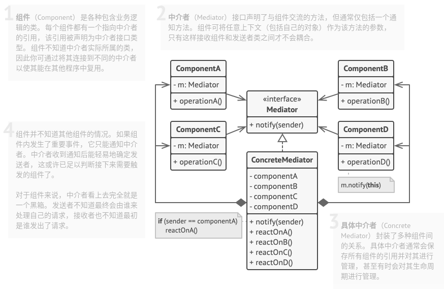

# 中介者模式

## 简介


如果一个系统里各个对象之间存在多对多的相互关系，可以将对象之间的一些交互行为从各个对象中分离出来，集中封装在一个中介者对象中，使其耦合松散，并由中介者统一协调。通过中介者，对象之间的多对多关系就简化了相对更简单的一对多关系。

> **中介者模式：定义一个对象来封装一系列对象的交互。中介者模式使各个对象之间不需要显示地相互引用，从而使其耦合松散，而且用户可以独立地改变它们之间的交互。**

## 结构



## 实现

中介者模式的核心在于引入了中介者类，中介者类承担了两个层次的职责：

* **结构上起中转作用**：通过中介者的中转，各个同事之间不必再相互调用或者引用，只需通过中介者实现间接调用的目的。
* **行为上起协调作用**：中介者可以进一步地将同事之间的关系进行封装，同事可以一致地和中介者进行交互，而不必指出中介者具体该如何操作，中介者根据封装在自身内部的协调逻辑对同事的请求进一步处理，将同事成员之间的关系行为进行分离和封装。

实现方式：

* 找到一组当前紧密耦合，且提供其独立能带来更大好处的类。
* 声明中介者接口并描述中介者和各个组件之间所需的交流接口。
* 实现具体中介者类。该类可从自行保存其下所有组件的引用中受益。
* 可以更进一步，让中介者负责组件对象的创建和销毁。此后，中介者可能会与工厂或外观类似。
* 组件中必须保存对于中介者对象的引用。该连接通常在组件的构造函数中建立，该函数会将中介者作为参数传递。
* 修改组件代码。使其可调用中介者的通知方法，而非其他组件的方法。然后将调用其他组建的代码抽取到终结者类中，并在中介者接收到该组件通知时执行这些代码。

```c++
#include <iostream>
#include <string>
#include <memory>


class BaseComponent;

// 中介者
class Mediator {
public:
    virtual ~Mediator() {}
    virtual void Notify(BaseComponent *sender, std::string event) const = 0;
};

// 基础组件
class BaseComponent {
protected:
    Mediator *m_mediator;

public:
    BaseComponent(Mediator *mediator = nullptr) :m_mediator(mediator) {}
    virtual ~BaseComponent() {}
    void setMediator(Mediator *mediator) {
        this->m_mediator = mediator;
    }
};

// 具体组件
class Component1: public BaseComponent {
public:
    void doA() {
        std::cout << "Component1 doss A.\n";
        this->m_mediator->Notify(this, "A");
    }
    void doB() {
        std::cout << "Component1 doss B.\n";
        this->m_mediator->Notify(this, "B");
    }
};

// 具体组件
class Component2: public BaseComponent {
public:
    void doC() {
        std::cout << "Component1 doss C.\n";
        this->m_mediator->Notify(this, "C");
    }
    void doD() {
        std::cout << "Component1 doss D.\n";
        this->m_mediator->Notify(this, "D");
    }
};

class ConcreteMediator : public Mediator {
private:
    std::shared_ptr<Component1> m_component1;
    std::shared_ptr<Component2> m_component2;

public:
    ConcreteMediator(std::shared_ptr<Component1> component1, std::shared_ptr<Component2> component2) : m_component1(component1), m_component2(component2) {
        this->m_component1->setMediator(this);
        this->m_component2->setMediator(this);
    }
    void Notify(BaseComponent *sender, std::string event) const override {
        if(event == "A") {
            std::cout << "中介者对A做出反应并触发以下操作：\n";
            this->m_component2->doC();
        }
        if(event == "D") {
            std::cout << "中介者对D做出反应并触发以下操作：\n";
            this->m_component1->doB();
            this->m_component2->doC();
        }
    }
};


int main(int argc, char * argv[]) {
    std::shared_ptr<Component1> c1 = std::make_shared<Component1>();
    std::shared_ptr<Component2> c2 = std::make_shared<Component2>();
    std::shared_ptr<ConcreteMediator> mediator = std::make_shared<ConcreteMediator>(c1, c2);

    std::cout << "Client：触发A操作：\n";
    c1->doA();
    std::cout << "\n";

    std::cout << "Client：触发D操作：\n";
    c2->doD();

    return 0;
}
```

```python
# -*- coding: utf-8 -*-

from __future__ import annotations
from abc import ABC


class Mediator(ABC):
    """
    """

    def notify(self, sender: object, event: str) -> None:
        pass


class ConcreteMediator(Mediator):
    def __init__(self, component1: Component1, component2: Component2) -> None:
        self._component1 = component1
        self._component1.mediator = self
        self._component2 = component2
        self._component2.mediator = self

    def notify(self, sender: object, event: str) -> None:
        if event == "A":
            print("Mediator reacts on A and triggers following operations:")
            self._component2.do_c()
        elif event == "D":
            print("Mediator reacts on D and triggers following operations:")
            self._component1.do_b()
            self._component2.do_c()


class BaseComponent:
    """
    """

    def __init__(self, mediator: Mediator = None) -> None:
        self._mediator = mediator

    @property
    def mediator(self) -> Mediator:
        return self._mediator

    @mediator.setter
    def mediator(self, mediator: Mediator) -> None:
        self._mediator = mediator


class Component1(BaseComponent):
    def do_a(self) -> None:
        print("Component 1 does A.")
        self.mediator.notify(self, "A")

    def do_b(self) -> None:
        print("Component 1 does B.")
        self.mediator.notify(self, "B")


class Component2(BaseComponent):
    def do_c(self) -> None:
        print("Component 2 does C.")
        self.mediator.notify(self, "C")

    def do_d(self) -> None:
        print("Component 2 does D.")
        self.mediator.notify(self, "D")


if __name__ == "__main__":
    # The client code.
    c1 = Component1()
    c2 = Component2()
    mediator = ConcreteMediator(c1, c2)

    print("Client triggers operation A.")
    c1.do_a()

    print("\n", end="")

    print("Client triggers operation D.")
    c2.do_d()
```

## 实例

### 问题描述

租户通过中介租房。可以从中介了解到房东的信息(姓名、电话、地址、价格)，房东可以从中介注册自己的房源，同时也可以从中介了解到组合的信息(姓名、电话)。

### 问题解答

```c++
// Example.cpp
#include <iostream>
#include <string>
#include <vector>
#include <memory>

enum PERSON_TYPE {
    TENANT,
    LANDLORD
};

class BaseComponent;

class BaseMediator {
public:
    virtual ~BaseMediator() {}
    virtual void registerInfo(BaseComponent *component) = 0;
    virtual void getInfo(BaseComponent *component) = 0;
};

class BaseComponent {
protected:
    BaseMediator *m_mediator;
    PERSON_TYPE personType;

public:
    BaseComponent(BaseMediator *mediator = nullptr) : m_mediator(mediator) {}
    virtual ~BaseComponent() {}
    void setMediator(BaseMediator *mediator) {
        this->m_mediator = mediator;
    }
    virtual void ask() = 0;
    virtual void answer() = 0;
    virtual PERSON_TYPE getType() const = 0;
};

// 租户
class Tenant: public BaseComponent {
private:
    std::string m_name;
    std::string m_phoneNumber;

public:
    Tenant(const std::string& name = "NULL", const std::string& phoneNumber="NULL") : m_name(name), m_phoneNumber(phoneNumber) {
        personType = TENANT;
    }
    void ask() override {
        std::cout << "租户查看房东信息：\n";
        this->m_mediator->getInfo(this);
    }
    void answer() override {
        std::cout << "[租户信息] " << " 姓名：" << m_name << "\t" << " 电话：" << m_phoneNumber  << "\t" << "\n";
    }
    PERSON_TYPE getType() const override {
        return personType;
    }
};

// 房东
class Landlord: public BaseComponent {
private:
    std::string m_name;
    std::string m_phoneNumber;
    std::string m_address;
    std::string m_price;

public:
    Landlord(const std::string& name = "NULL", const std::string& phoneNumber="NULL", const std::string& address="NULL", const std::string& price="NULL") : m_name(name), m_phoneNumber(phoneNumber), m_address(address), m_price(price) {
        personType = LANDLORD;
    }
    void ask() override {
        std::cout << "房东查看租户信息：\n";
        this->m_mediator->getInfo(this);
    }
    void answer() override {
        std::cout << "[房东信息] " << " 姓名：" << m_name  << "\t" << " 电话：" << m_phoneNumber  << "\t" << " 地址：" << m_address  << "\t" << " 价格：" << m_price  << "\t" << "\n";
    }
    PERSON_TYPE getType() const override {
        return personType;
    }
};

// 中介
class ConcreteMediator: public BaseMediator {
private:
    Tenant *tenant;
    Landlord *landlord;
    std::vector<Tenant*> tenantVector;
    std::vector<Landlord*> landlordVector;

public:
    void registerInfo(BaseComponent* component) override {
        if (component->getType() == TENANT) {
            tenantVector.push_back((Tenant*)component);
        } else if (component->getType() == LANDLORD) {
            landlordVector.push_back((Landlord*)component);
        } else {
            std::cerr << "ERROR\n";
        }
    }
    void getInfo(BaseComponent *component) override {
        if(component->getType() == TENANT) {
            for(const auto &landlord : landlordVector) {
                landlord->answer();
            }

        } else if (component->getType() == LANDLORD) {
            for(const auto &tenant : tenantVector) {
                tenant->answer();
            }
        }
    }
};


int main(int argc, char * argv[]) {
    ConcreteMediator *mediator = new ConcreteMediator;

    Tenant *t1 = new Tenant("张三", "111111");
    Tenant *t2 = new Tenant("李四", "222222");
    t1->setMediator(mediator);
    t2->setMediator(mediator);
    mediator->registerInfo(t1);
    mediator->registerInfo(t2);

    Landlord *l1 = new Landlord("北京房东", "010-241235", "北京市朝阳区", "5500");
    Landlord *l2 = new Landlord("北京房东", "010-3253523", "北京市大兴区", "3500");
    Landlord *l3 = new Landlord("重庆房东", "023-3463177", "重庆市沙坪坝区", "1500");
    l1->setMediator(mediator);
    l2->setMediator(mediator);
    l3->setMediator(mediator);
    mediator->registerInfo(l1);
    mediator->registerInfo(l2);
    mediator->registerInfo(l3);

    t1->ask();
    std::cout <<"\n";
    l1->ask();

    delete t1;
    delete t2;
    delete l1;
    delete l2;
    delete l3;

    return 0;
}
```

## 总结

### 优点

* **单一职责原则**。可以将多个组件间的交流抽取到同一位置，使其更易于理解和维护。
* **开闭原则**。无需修改实际组件就能增加新的中介者。
* 可以减轻应用中多个组件间的耦合情况。
* 可以更方便地复用各个组件。

### 缺点

* 一段时间后，中介者可能会演化成为**上帝对象**。
* 具体中介者类中包含了组件之间交互的细节和逻辑，可能使得中介者类很复杂以至于难以管理维护。

### 场景

* 当一些对象和其他对象紧密耦合以至于难以对其进行修改时，可使用中介者模式。
* 当组件因过于依赖其他组件而无法在不同应用中复用时，可使用中介者模式。
* 如果为了能在不同情景下复用一些基本行为，导致需要被迫创建大量组件子类时，可使用中介者模式。

### 与其他模式的关系

* **责任链模式**、**命令模式**、**中介者模式**和**观察者模式**用于处理请求发送者和接收者之间的不同连接方式：
  * 责任链按照顺序将请求动态传递给一系列的潜在接收者，直至其中一名接收者对请求进行处理。
  * 命令在发送者和请求者之间建立单向连接。
  * 中介者清除了发送者和请求者之间的直接连接，强制它们通过一个中介对象进行间接沟通。
  * 观察者允许接收者动态地订阅或取消接收请求。
* **外观模式**和**中介者模式**的职责类似：它们都尝试在大量紧密耦合的类中组织起合作。
  * 外观为子系统中的所有对象定义了一个简单接口，但是它不提供任何新功能。子系统本身不会意识到外观的存在。子系统中的对象可以直接进行交流。
  * 中介者将系统中组件的沟通行为中心化。各组件只知道中介者对象，无法直接相互交流。
* **中介者模式**和**观察者模式**之间往往很难区分。在大部分情况下，可以使用其中一种模式，而有时可以同时使用。
  * **中介者**的主要目标是消除一系列系统组件之间的相互依赖。这些组件将依赖于同一个中介者对象。**观察者**的目标是在对象之间建立动态的单向连接，使得部分对象可作为其他对象的附属发挥作用。
  * 有一种流行的中介者模式实现方式依赖于观察者。中介者对象担当发布者的角色，其他组件则作为订阅者，可以订阅中介者的事件或取消订阅。当中介者以这种方式实现时，它可能看上去与观察者非常相似。
  * 假设有一个程序，其所有的组件都变成了发布者，它们之间可以相互建立动态连接。这样程序中就没有中心化的中介者对象，而只有一些分布式的观察者。
