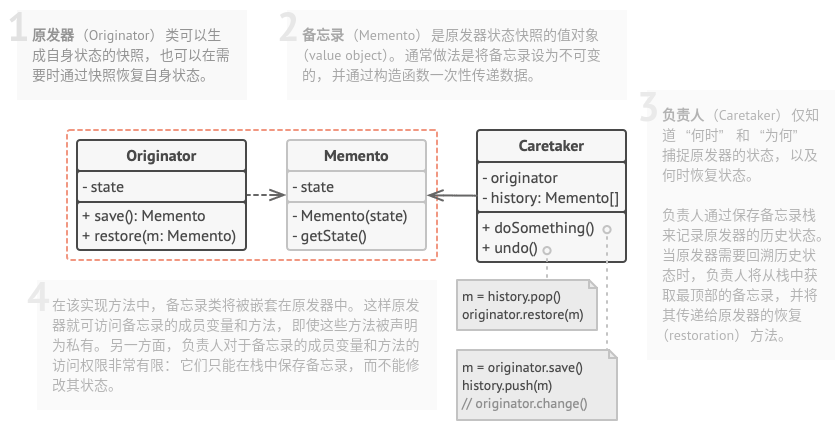
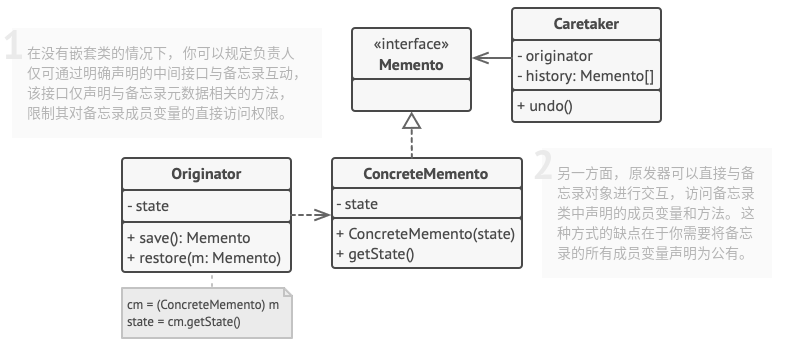
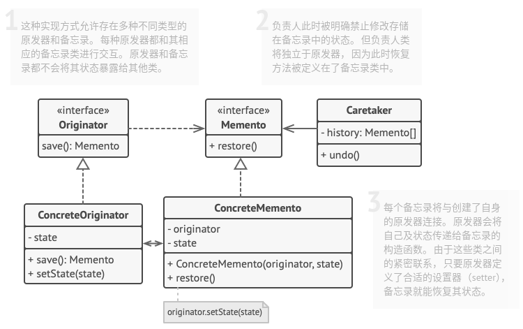

# 备忘录模式

## 简介


备忘录模式提供了一种状态恢复的机制，用户可以方便地回到指定的某个历史状态。很多软件的撤销操作，就使用了备忘录模式。

> **备忘录模式：在不破坏封装的前提下捕获一个对象的内部状态，并在该对象之外保存这个状态，这样可以在以后将对象恢复到原先保存的状态**

## 结构

* **基于嵌套类的实现**：该模式的经典实现方式依赖与许多流行编程语言(例如C++、C#和Java等)所支持的嵌套类。


* **基于中间接口的实现**：适用于不支持嵌套类的编程语言(PHP等...)。


* **封装更加严格的实现**：如果不想让其他类有任何机会通过备忘录来访问原发器的状态。


## 实现

实现方式：

* 确认担任原发器角色的类。重要的是明确程序使用的一个原发器中心对象，还是多个较小的对象。
* 创建备忘录类。逐一声明对应每个原发器成员变量的备忘录成员变量。
* 将备忘录类设为不可变。备忘录只能通过构造函数一次性接收数据。该类中不能包含设置器。
* 在原发器中添加一个创建备忘录的方法。原发器必须通过备忘录构造函数的一个或多个实际参数来将自身状态传递给备忘录。
* 在原发器类中添加一个用于恢复自身状态的方法。
* 无论负责人是命令对象、历史记录还是其他完全不同的东西，它都必须要知道何时向原发器请求新的备忘录、如何存储备忘录以及何时使用特定备忘录对原发器进行恢复。
* 负责人与原发器之间的连接可以移动到备忘录中。

```c++
#include <iostream>
#include <string>
#include <vector>
#include <ctime>

// 抽象备忘录
class Memento {
public:
    virtual ~Memento() {}
    virtual std::string getName() const = 0;
    virtual std::string date() const = 0;
    virtual std::string state() const = 0;
};

// 具体备忘录
class ConcreteMemento: public Memento {
private:
    std::string m_state;
    std::string m_date;

public:
    ConcreteMemento(std::string state) {
        m_state = state;
        std::time_t now = std::time(0);
        m_date = std::ctime(&now);
    }
    std::string getName() const override {
        return m_date + " / (" + m_state.substr(0, 9) + "...)";
    }
    std::string date() const override {
        return m_date;
    }
    std::string state() const override {
        return m_state;
    }
};

// 原发器
class Originator {
private:
    std::string m_state;
    std::string generateRandomString(int length = 10) {
        const std::string alphanum = "0123456789abcdefghijklmnopqrstuvwxyzABCDEFGHIJKLMNOPQRSTUVWXYZ";
        int alphanumLength = alphanum.size() - 1;
        std::string randomString;
        for(int i = 0; i < length; i++) {
            randomString += alphanum[std::rand() % alphanumLength];
        }
        return randomString;
    }

public:
    Originator(std::string state) : m_state(state) {
        std::cout << "原发器：初始化状态为 " << m_state << std::endl;
    }
    void doSomeBusinessLogic() {
        std::cout << "原发器：执行一些操作。\n";
        m_state = this->generateRandomString(30);
        std::cout << "原发器：状态变成为 " << m_state << std::endl;
    }
    Memento *save() {
        return new ConcreteMemento(m_state);
    }
    void restore(Memento *memento) {
        m_state = memento->state();
        std::cout << "原发器：状态变成为 " << m_state << std::endl;
    }
};

// 负责人
class Caretaker {
private:
    std::vector<Memento *> m_mementos;
    Originator *m_originator;

public:
    Caretaker(Originator *originator) : m_originator(originator) {}
    void backup() {
        std::cout << "负责人：保存了原发器状态...\n";
        m_mementos.push_back(m_originator->save());
    }
    void undo() {
        if(!m_mementos.size()) {
            return;
        }
        Memento *memento = m_mementos.back();
        m_mementos.pop_back();
        std::cout << "负责人：恢复状态到 " << memento->getName() << "\n";
        try {
            m_originator->restore(memento);
        } catch (...) {
            this->undo();
        }
    }
    void showHistory() const {
        std::cout << "负责人：历史操作记录：\n";
        for(Memento *memento : m_mementos) {
            std::cout << memento->getName() << "\n";
        }
    }

};

void ClientCode() {
    Originator *originator = new Originator("Super-super-super.");
    Caretaker * caretaker = new Caretaker(originator);
    caretaker->backup();
    originator->doSomeBusinessLogic();
    std::cout << "\n";
    caretaker->backup();
    originator->doSomeBusinessLogic();
    std::cout << "\n";
    caretaker->backup();
    originator->doSomeBusinessLogic();
    std::cout << "\n";

    caretaker->showHistory();
    std::cout << "\n";

    std::cout << "Client：回滚一次！\n";
    caretaker->undo();
    std::cout << "\n";
    std::cout << "Client：再回滚一次！\n";
    caretaker->undo();

    delete originator;
    delete caretaker;
}

int main(int argc, char *argv[]) {
    std::srand(static_cast<unsigned int>(std::time(nullptr)));
    ClientCode();

    return 0;
}
```

```python
# -*- coding: utf-8 -*-

from __future__ import annotations
from abc import ABC, abstractmethod
from datetime import datetime
from random import sample
from string import ascii_letters, digits


class Originator():
    """
    """

    _state = None

    def __init__(self, state: str) -> None:
        self._state = state
        print(f"Originator: My initial state is: {self._state}")

    def do_something(self) -> None:
        print("Originator: I'm doing something important.")
        self._state = self._generate_random_string(30)
        print(f"Originator: and my state has changed to: {self._state}")

    def _generate_random_string(self, length: int = 10) -> None:
        return "".join(sample(ascii_letters, length))

    def save(self) -> Memento:
        return ConcreteMemento(self._state)

    def restore(self, memento: Memento) -> None:
        self._state = memento.get_state()
        print(f"Originator: My state has changed to: {self._state}")


class Memento(ABC):
    """
    """

    @abstractmethod
    def get_name(self) -> str:
        pass

    @abstractmethod
    def get_date(self) -> str:
        pass


class ConcreteMemento(Memento):
    def __init__(self, state: str) -> None:
        self._state = state
        self._date = str(datetime.now())[:19]

    def get_state(self) -> str:
        return self._state

    def get_name(self) -> str:
        return f"{self._date} / ({self._state[0:9]}...)"

    def get_date(self) -> str:
        return self._date


class Caretaker():
    """
    """

    def __init__(self, originator: Originator) -> None:
        self._mementos = []
        self._originator = originator

    def backup(self) -> None:
        print("\nCaretaker: Saving Originator's state...")
        self._mementos.append(self._originator.save())

    def undo(self) -> None:
        if not len(self._mementos):
            return

        memento = self._mementos.pop()
        print(f"Caretaker: Restoring state to: {memento.get_name()}")
        try:
            self._originator.restore(memento)
        except Exception:
            self.undo()

    def show_history(self) -> None:
        print("Caretaker: Here's the list of mementos:")
        for memento in self._mementos:
            print(memento.get_name())


if __name__ == "__main__":
    originator = Originator("Super-duper-super-puper-super.")
    caretaker = Caretaker(originator)

    caretaker.backup()
    originator.do_something()

    caretaker.backup()
    originator.do_something()

    caretaker.backup()
    originator.do_something()

    print()
    caretaker.show_history()

    print("\nClient: Now, let's rollback!\n")
    caretaker.undo()

    print("\nClient: Once more!\n")
    caretaker.undo()
```

## 实例

### 问题描述

同上。

### 问题解答

同上。

## 总结

### 优点

* 可以在不破坏对象封装情况的前提下创建对象状态快照。
* 可以通过让负责人维护原发器状态历史记录来简化原发器代码。

### 缺点

* 如果客户端过于频繁地创建备忘录，程序将消耗大量内存。
* 负责人必须完整跟踪原发器的生命周期，这样才能销毁弃用的备忘录。
* 绝大部分动态编程语言（例如 PHP、 Python 和 JavaScript）不能确保备忘录中的状态不被修改。

### 场景

* 当你需要创建对象状态快照来恢复其之前的状态时，可以使用备忘录模式。
* 当直接访问对象的成员变量、获取器或设置器将导致封装被破坏时，可以使用备忘录模式。

### 与其他模式的关系

* 可以同时使用**命令模式**和**备忘录模式**来实现"撤销"。在这种情况下，命令用于对目标对象执行各种不同的操作，备忘录用来保存一条命令执行前该对象的状态。
* 可以同时使用**备忘录模式**和**迭代器模式**来获取当前迭代器的状态，并且在需要的时候进行回滚。
* 有时候**原型模式**可以作为**备忘录模式**的一个简化版本，其条件是你需要在历史记录中存储的对象的状态比较简单，不需要链接其他外部资源，或者链接可以方便地重建。
