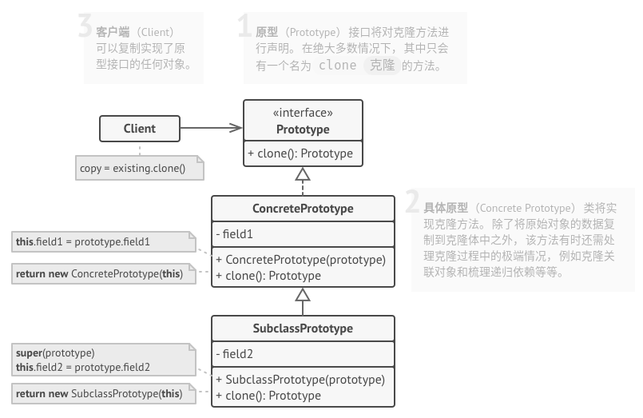
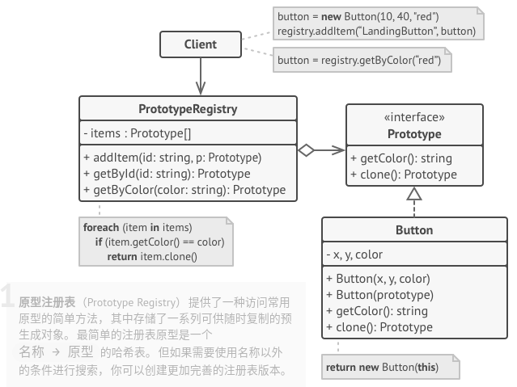

# 原型模式

## 简介


原型模式通过复制一个已有对象来获取更多相同或者相似的对象。

**原型模式：使用原型实例指定待创建对象的类型，并且通过复制这个原型创建新的对象。**

## 结构




## 实现

实现方式：

* 创建原型接口，并在其中声明**克隆**方法。如果你已有类层次结构，则只需在其所有类中添加该方法即可。
* 原型类必须另行定义一个以该类对象为参数的构造函数。构造函数必须复制参数对象中的所有成员变量值到新建实体中。如果你需要修改子类，则必须调用父类构造函数，让父类复制其私有成员变量值。
* 克隆方法通常只有一行代码：使用`new`运算符调用原型版本的构造函数。注意，每个类都必须显式重写克隆方法并使用自身类名调用`new`运算符。否则，克隆方法可能会生成父类的对象。
* 还可以创建一个中心化原型注册表， 用于存储常用原型。

```c++
#include <iostream>
#include <unordered_map>

enum Type {
    PROTOTYPE_1 = 0,
    PROTOTYPE_2
};

class Prototype {
protected:
    std::string prototype_name_;
    float prototype_field_;

public:
    Prototype() {}
    Prototype(std::string prototype_name): prototype_name_(prototype_name) {}
    virtual ~Prototype() {}
    virtual Prototype *Clone() const  = 0;
    virtual void Method(float prototype_field) {
        this->prototype_field_ = prototype_field;
        std::cout << "Call Method from " << prototype_name_ << " with field: " << prototype_field << std::endl;
    }
};

class ConcretePrototype1 : public Prototype {
private:
    float concrete_prototype_field1_;

public:
    ConcretePrototype1(std::string prototype_name, float concrete_prototype_field): Prototype(prototype_name), concrete_prototype_field1_(concrete_prototype_field) {}
    Prototype *Clone() const override { 
        return new ConcretePrototype1(*this);
    }
};

class ConcretePrototype2 : public Prototype {
private:
    float concrete_prototype_field2_;

public:
    ConcretePrototype2(std::string prototype_name, float concrete_prototype_field): Prototype(prototype_name), concrete_prototype_field2_(concrete_prototype_field) {}
    Prototype *Clone() const override { 
        return new ConcretePrototype2(*this);
    }
};

class PrototypeFactory {
private:
    std::unordered_map<Type, Prototype*, std::hash<int>> prototypes_;

public:
    PrototypeFactory() {
        prototypes_[Type::PROTOTYPE_1] = new ConcretePrototype1("PROTOTYPE_1", 50.f);
        prototypes_[Type::PROTOTYPE_2] = new ConcretePrototype2("PROTOTYPE_2", 60.f);
    }
    ~PrototypeFactory() {
        delete prototypes_[Type::PROTOTYPE_1];
        delete prototypes_[Type::PROTOTYPE_2];
    }
    Prototype *CreatePrototype(Type type) {
        return prototypes_[type]->Clone();
    }
};

void ClientCode(PrototypeFactory &prototype_factory) {
    std::cout << "Let`s create a Prototype 1\n";
    Prototype *prototype = prototype_factory.CreatePrototype(Type::PROTOTYPE_1);
    prototype->Method(90);
    delete prototype;
    std::cout << std::endl;

    std::cout << "Let`s create a Prototype 2\n";
    prototype = prototype_factory.CreatePrototype(Type::PROTOTYPE_2);
    prototype->Method(10);
    delete prototype;
    std::cout << std::endl;
}

int main(int argc, char *argv[]) {
    PrototypeFactory *prototype_factory = new PrototypeFactory();
    ClientCode(*prototype_factory);
    delete prototype_factory;

    return 0;
}
```

```python
# -*- coding: UTF-8 -*-

import copy


class SelfReferencingEntity:
    def __init__(self):
        self.parent = None

    def set_parent(self, parent):
        self.parent = parent


class SomeComponent:
    """
    """

    def __init__(self, some_int, some_list_of_objects, some_circular_ref):
        self.some_int = some_int
        self.some_list_of_objects = some_list_of_objects
        self.some_circular_ref = some_circular_ref

    def __copy__(self):
        """
        """
        # 创建嵌套对象的副本
        some_list_of_objects = copy.copy(self.some_list_of_objects)
        some_circular_ref = copy.copy(self.some_circular_ref)

        # 使用准备好的嵌套对象克隆来克隆对象本身
        new = self.__class__(
            self.some_int, some_list_of_objects, some_circular_ref
        )
        new.__dict__.update(self.__dict__)

        return new

    def __deepcopy__(self, memo={}):
        """
        """
        # 创建嵌套对象的副本
        some_list_of_objects = copy.deepcopy(self.some_list_of_objects, memo)
        some_circular_ref = copy.deepcopy(self.some_circular_ref, memo)

        # 使用准备好的嵌套对象克隆来克隆对象本身
        new = self.__class__(
            self.some_int, some_list_of_objects, some_circular_ref
        )
        new.__dict__ = copy.deepcopy(self.__dict__, memo)

        return new


if __name__ == "__main__":

    list_of_objects = [1, {1, 2, 3}, [1, 2, 3]]
    circular_ref = SelfReferencingEntity()
    component = SomeComponent(23, list_of_objects, circular_ref)
    circular_ref.set_parent(component)

    shallow_copied_component = copy.copy(component)

    # 更改列表，检查是否发生变化
    shallow_copied_component.some_list_of_objects.append("another object")
    if component.some_list_of_objects[-1] == "another object":
        print("已发生变化")
    else:
        print("未发生变化")

    # 在对象列表中更改设置
    component.some_list_of_objects[1].add(4)
    if 4 in shallow_copied_component.some_list_of_objects[1]:
        print("已发生变化")
    else:
        print("未发生变化")


    deep_copied_component = copy.deepcopy(component)

    deep_copied_component.some_list_of_objects.append("one more object")
    if component.some_list_of_objects[-1] == "one more object":
        print("已发生变化")
    else:
        print("未发生变化")


    component.some_list_of_objects[1].add(10)
    if 10 in deep_copied_component.some_list_of_objects[1]:
        print("已发生变化")
    else:
        print("未发生变化")

    print("id(deep_copied_component.some_circular_ref.parent): {0}".format(id(deep_copied_component.some_circular_ref.parent)))
    print("id(deep_copied_component.some_circular_ref.parent.some_circular_ref.parent): {0}".format(id(deep_copied_component.some_circular_ref.parent.some_circular_ref.parent)))
```

## 实例

### 问题描述

如果用过类似于Photoshop的平面设计软件，一定都知道图层的概念。图层概念的提出，使得设计、图形修改等操作更加便利。设计师既可以修改和绘制当前图像对象，又可以保留其它图像对象，逻辑清晰，且可以及时得到反馈。

### 问题解答

```python
# Example.py

# -*- coding: utf-8 -*-

from copy import copy, deepcopy

class SimpleLayer:
    background = [0, 0, 0, 0]
    content = "blank"

    def get_content(self):
        return self.content

    def get_background(self):
        return self.background

    def paint(self, painting):
        self.content = painting

    def set_background(self, background):
        self.background[3] = background

    def fill_background(self, background):
        self.background = background

    def clone(self):
        return copy(self)

    def deep_clone(self):
        return deepcopy(self)


if __name__ == "__main__":
    # 一般深拷贝比浅拷贝复制得更加完全，但也更占资源（包括时间和空间资源）
    # 浅拷贝：会拷贝对象内容及其内容的引用或者子对象的引用，但不会拷贝引用的内容和子对象本身
    dog_layer = SimpleLayer()
    dog_layer.paint("Dog")
    dog_layer.fill_background([0, 0, 255, 0])
    print("Original background: ", dog_layer.get_background())
    print("Original Painting: ", dog_layer.get_content())
    print("\n")

    copy_dog_layer = dog_layer.clone()
    copy_dog_layer.paint("Puppy")
    copy_dog_layer.set_background(128)
    print("Original background: ", dog_layer.get_background())
    print("Original Painting: ", dog_layer.get_content())
    print("Copy background: ", copy_dog_layer.get_background())
    print("Copy Painting: ", copy_dog_layer.get_content())
    print("\n")


    # 深拷贝：不仅拷贝了对象和内容的引用，也会拷贝引用的内容
    dog_layer = SimpleLayer()
    dog_layer.paint("Dog")
    dog_layer.fill_background([0, 0, 255, 0])
    print("Original background: ", dog_layer.get_background())
    print("Original Painting: ", dog_layer.get_content())
    print("\n")

    deep_copy_dog_layer = dog_layer.deep_clone()
    deep_copy_dog_layer.paint("Puppy")
    deep_copy_dog_layer.set_background(128)
    print("Original background: ", dog_layer.get_background())
    print("Original Painting: ", dog_layer.get_content())
    print("DeepCopy background: ", deep_copy_dog_layer.get_background())
    print("DeepCopy Painting: ", deep_copy_dog_layer.get_content())
```

## 总结

### 优点

* 当创建新的对象实例较为复杂时，原型模式可以简化创建过程，提高创建对象的效率。
* 模式中提供了抽象原型类，具体原型类可适当拓展。
* 创建结构简单：创建工厂即为原型对象本身。

### 缺点

* 深拷贝代码较为复杂。
* 每一个类都必须有一个Clone方法，且该方法位于类的内部，修改时违背**开闭原则**。

### 场景

* 如果你需要复制一些对象， 同时又希望代码独立于这些对象所属的具体类， 可以使用原型模式。
* 如果子类的区别仅在于其对象的初始化方式， 那么你可以使用该模式来减少子类的数量。 别人创建这些子类的目的可能是为了创建特定类型的对象。
* 对象在修改过后，需要复制多份的场景。当创建新的对象实例较为复杂时，原型模式可以简化创建过程。

### 与其他模式的关系

* 在许多设计工作的初期都会使用**工厂方法模式**（较为简单， 而且可以更方便地通过子类进行定制），随后演化为使用**抽象工厂模式**、**原型模式**或**生成器模式**（更灵活但更加复杂）。
* **抽象工厂模式**通常基于一组**工厂方法**，但你也可以使用**原型模式**来生成这些类的方法。
* **原型**可用于保存命令模式的历史记录。
* 大量使用**组合模式**和**装饰模式**的设计通常可从对于原型的使用中获益。你可以通过该模式来复制复杂结构，而非从零开始重新构造。
* **原型**并不基于继承，因此没有继承的缺点。另一方面，原型需要对被复制对象进行复杂的初始化。**工厂方法**基于继承，但是它不需要初始化步骤。
* 有时候**原型**可以作为**备忘录模式**的一个简化版本，其条件是你需要在历史记录中存储的对象的状态比较简单，不需要链接其他外部资源，或者链接可以方便地重建。
* **抽象工厂**、**生成器**和**原型**都可以用**单例模式**来实现。
