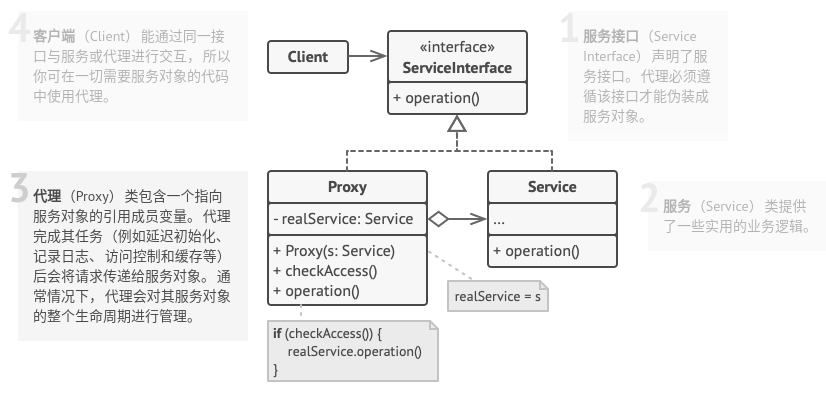

# 代理模式

## 简介


在代理模式中引入一个代理对象，它在客户端和目标访问对象之间起到中介的作用。代理对象可以屏蔽或删除客户不想访问的内容和服务，也可以根据客户需求增加新的内容和服务。

**代理模式：给某一个对象提供一个代理或者占位符，并由代理对象来控制对原对象的访问。**

## 结构



## 实现

实现方式：

* 创建代理类，其中必须包含一个存储指向服务的引用的成员变量。通常情况下，代理负责创建服务i并对其整个生命周期进行管理。在一些特殊情况下，客户端会通过构造函数将服务传递给代理。
* 根据需求实现代理方法。在大部分情况下，代理在完成一些任务后应将工作委派给服务对象。
* 可以考虑新建一个构建方法来判断客户端可获取的是代理还是实际服务。可以在代理类中创建一个简单的静态方法，也可以创建一个完整的工厂方法。
* 可以考虑为服务对象实现延迟初始化。

```c++
#include <iostream>

// 抽象主题角色类
class Subject {
public:
    virtual ~Subject() {}
    virtual void Request() const = 0;
};

// 真实主题角色类
class RealSubject : public Subject {
public:
    void Request() const override {
        std::cout << "RealSubject: 处理要求.\n";
    }
};

// 代理主题角色类
class Proxy: public Subject {
private:
    RealSubject *real_subject_;
    bool checkAccess() const {
        std::cout << "Proxy:在发出真实请求之前检查访问权限。\n";
        return true;
    }
    void logAccess() const {
        std::cout << "Proxy: 记录请求时间。\n";
    }

public:
    Proxy(RealSubject* real_subject) : real_subject_(new RealSubject(*real_subject)) {}
    ~Proxy() {
        delete real_subject_;
    }
    void Request() const override {
        if(this->checkAccess()) {
            this->real_subject_->Request();
            this->logAccess();
        }
    }
};


void ClientCode(const Subject& subject) {
    // ...
    subject.Request();
    // ...
}


int main(int argc, char * argv[]) {
    std::cout << "Client: 执行真实角色:\n";
    RealSubject *real_subject = new RealSubject;
    ClientCode(*real_subject);
    std::cout << "\n";

    std::cout << "Client: 执行代理角色:\n";
    Proxy *proxy = new Proxy(real_subject);
    ClientCode(*proxy);

    delete real_subject;
    delete proxy;

    return 0;

}
```

```python
# -*- coding: utf-8 -*-

from abc import ABC, abstractmethod


class Subject(ABC):
    """
    """

    @abstractmethod
    def request(self) -> None:
        pass


class RealSubject(Subject):
    """
    """

    def request(self) -> None:
        print("RealSubject: 处理要求.")


class Proxy(Subject):
    """
    """

    def __init__(self, real_subject: RealSubject) -> None:
        self._real_subject = real_subject

    def request(self) -> None:
        if self.check_access():
            self._real_subject.request()
            self.log_access()

    def check_access(self) -> bool:
        print("Proxy:在发出真实请求之前检查访问权限。")
        return True

    def log_access(self) -> None:
        print("Proxy: 记录请求时间。", end="")


def client_code(subject: Subject) -> None:
    # ...

    subject.request()

    # ...


if __name__ == "__main__":
    print("Client: 执行真实角色:")
    real_subject = RealSubject()
    client_code(real_subject)

    print("")

    print("Client: 执行代理角色:")
    proxy = Proxy(real_subject)
    client_code(proxy)
```

## 实例

### 问题描述

在某应用软件中需要记录业务方法的调用日志，在不修改现有业务的基础上位每个类提供一个日志记录代理类，在代理类中输出日志。

### 问题解答

```c++
// Example.cpp

#include <iostream>
#include <string>
#include <ctime>


class Subject {
public:
    virtual ~Subject() {}
    virtual void method() const = 0;
};

class RealSubject: public Subject {
public:
    void method() const override {
        std::cout << "RealSubject: 调用业务方法。\n";
    }
};

class Log {
public:
    std::string getTime() const {
        time_t t = time(nullptr);
        // std::cout << "当前调用时间：" << asctime(localtime(&t)) << std::endl;
        return asctime(localtime(&t));
    }
};

class Proxy: public Subject {
private:
    RealSubject *real_subject_;
    Log *log_;
    void preCallMethod() const {
        std::cout << "method()被调用，当前调用时间：" << log_->getTime() << std::endl;
    }
    void postCallMethod() const {
        std::cout << "method()调用成功." << std::endl;
    }

public:
    Proxy() {
        real_subject_ = new RealSubject();
        log_ = new Log();
    }
    ~Proxy() {
        delete real_subject_;
        delete log_;
    }
    void method() const override {
        this->preCallMethod();
        this->real_subject_->method();
        this->postCallMethod();
    }
};

int main(int argc, char *argv[]) {
    Subject *subject = new Proxy();
    subject->method();

    delete subject;

    return 0;
}
```

## 总结

### 优点

* 可以在客户端毫无察觉的情况下控制服务对象。
* 如果客户端对服务对象的生命周期没有特殊要求，你可以对生命周期进行管理。
* 即使服务对象还未准备好或不存在，代理也可以正常工作。
* **开闭原则**。你可以在不对服务或客户端做出修改的情况下创建新代理。

### 缺点

* 代码可能会变得复杂，因为需要新建许多类。
* 服务响应可能会延迟。

### 场景

* **延迟初始化（虚拟代理）**。如果有一个偶尔使用的重量级服务对象，一直保持该对象运行会消耗系统资源时，可使用代理模式。
* **访问控制（保护代理）**。如果只希望特定客户端使用服务对象，这里的对象可以是操作系统中非常重要的部分 而客户端则是各种已启动的程序（包括恶意程序），此时可使用代理模式。
* **本地执行远程服务（远程代理）**。适用于服务对象位于远程服务器上的情形。
* **记录日志请求（日志记录代理）**。适用于当你需要保存对于服务对象的请求历史记录时。 代理可以在向服务传递请求前进行记录。
* **智能引用**。可在没有客户端使用某个重量级对象时立即销毁该对象。

### 与其他模式的关系

* **适配器模式**能为被封装对象提供不同接口，**代理模式**能为对象提供相同的接口，**装饰模式**则能为对象提供加强的接口。
* **外观模式**和**代理模式**相似之处在于他们都缓存了一个复杂实体并自行对其进行初始化。代理与其服务对象遵循同一接口，使得自己和服务对象可以互换，在这一点上它与外观不同。
* **装饰模式**和**代理模式**有着相似的结构，但是其意图却非常不同。这两个模式的构建都基于组合原则，也就是说一个对象应该将部分工作委派给另一个对象。两者之间的不同之处在于代理通常自行管理其服务对象的生命周期，而装饰的生成则总是由客户端进行控制。
