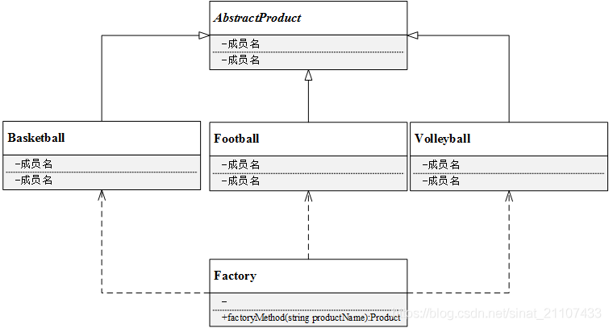

# 简单工厂模式

## 简介

简单工厂模式是最简单的设计模式之一，其实它并不严格属于23种设计模式，但是其应用也相当频繁，同时它也是其余创建型模式的基础。

**简单工厂模式：定义一个简单工厂类，它可能根据参数的不同返回不同类的实例，被创建的实例通常都具有共同的父类。**

## 结构



## 实现

实现方式：

* 设计一个抽象产品类，它包含一些公共方法的实现。
* 从抽象产品类中派生出很多具体产品类，它实现具体产品生产的相关代码。
* 设计一个工厂类，工厂类中提供一个生产各种产品的工厂方法，该方法根据传入参数创建不同的具体产品类对象。
* 客户只需调用工厂类的工厂方法，并传入具体产品参数，即可得到一个具体产品对象。

```c++
// 抽象产品类
class AbstractProduct {
public:
    // 抽象方法
};

// 具体产品类
class ConcreteProduct: public AbstractProduct {
public:
    // 具体实现方法
};

class Factory {
public:
    AbstractProduct createProduct(std::string productName) {
        AbstractProduct pro = nullptr;
        if(productName == "ProductA") {
            pro = new ProductA();
        } else if(productName == "ProductB") {
            pro = new ProductB();
        }
    }
};

```

## 实例

### 问题描述

同学们想要进行户外运动，他们可以选择打篮球、踢足球或者玩排球。他们需要凭票去体育保管室拿，票上写着一个具体球类运动的名字，比如“篮球”。体育保管室负责人根据票上的字提供相应的体育用品。

### 问题解答

```c++
// Example.cpp

#include <iostream>
#include <memory>

// 抽象产品类
class AbstractSportProduct {
public:
    virtual ~AbstractSportProduct(){}
    // 抽象方法
    virtual void printName() = 0;
    virtual void play() = 0;
};


// 具体产品类Basketball
class Basketball: public AbstractSportProduct {
public:
    Basketball(){
        printName();
        play();
    }
    // 具体实现
    void printName(){
        std::cout << "get Basketball." << std::endl;
    }
    void play(){
        std::cout << "play Basketball." << std::endl;
    }
};


// 具体产品类Football
class Football: public AbstractSportProduct {
public:
    Football(){
        printName();
        play();
    }
    // 具体实现
    void printName(){
        std::cout << "get Football." << std::endl;
    }
    void play(){
        std::cout << "play Football." << std::endl;
    }
};


// 具体产品类Volleyball
class Volleyball: public AbstractSportProduct {
public:
    Volleyball(){
        printName();
        play();
    }
    // 具体实现
    void printName(){
        std::cout << "get Volleyball." << std::endl;
    }
    void play(){
        std::cout << "play Volleyball." << std::endl;
    }
};


// 工厂类
class Factory {
public:
    AbstractSportProduct* getSportProduct(std::string productName) {
        AbstractSportProduct *pro = nullptr;
        if(productName == "Basketball") {
            pro = new Basketball();
        } else if(productName == "Football") {
            pro = new Football();
        } else if(productName == "Volleyball") {
            pro = new Volleyball();
        }
        return pro;
    }
};


int main(int argc, char *argv[]) {
    std::shared_ptr<Factory> fac = std::make_shared<Factory>();
    AbstractSportProduct *pro = nullptr;

    pro = fac->getSportProduct("Basketball");
    pro = fac->getSportProduct("Football");
    pro = fac->getSportProduct("Volleyball");

    return 0;
}
```

## 总结

### 优点

* 工厂类提供创建具体产品的方法，并包含一定判断逻辑，客户不必参与产品的创建过程。
* 客户只需要知道对应的产品的参数即可。

### 缺点

* 明显违背了**开闭原则(对拓展开放，对修改关闭)**，即在拓展功能时修改了既有的代码。
* 简单工厂模式所有的判断逻辑都在工厂类中实现，一旦工厂类设计故障，则整个系统都会受到影响。

### 场景

*

### 与其他模式的关系

* **简单工厂模式**是其余创建型模式(**工厂方法模式**、**抽象工厂模式**)的基础。
