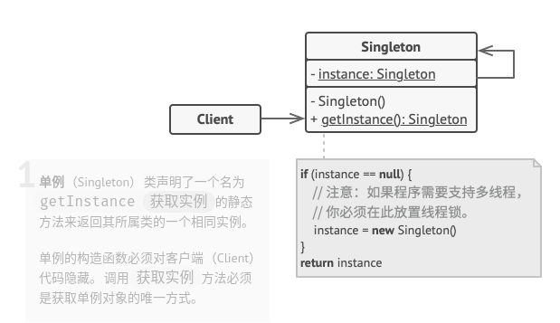

# 单例模式

## 简介


你能在电脑上调出两个`Windows`任务管理器吗？假设能，如果两个管理器显示的数据相同，那何必要存在两个呢？如果两个管理器显示的数据不同，那我该相信哪一个呢？

**单例模式：确保一个类只有一个实例，并提供一个全局访问点来访问这个唯一实例。**

它的三个要点分别为：

* 这个类只能有一个实例
* 它必须自己创建这个实例
* 它必须自己向整个系统提供这个实例

## 结构



## 实现

```c++
// singleton.h

#ifndef __SINGLETON_H__
#define __SINGLETON_H__

#include <iostream>
#include <string>
#include <thread>
#include <chrono>
#include <mutex>
#include <pthread.h>
#include <unistd.h>

// 单线程版本
class Singleton {
public:
    static Singleton* getInstance() {   // 提供外部接口，满足了第三个要点
        if(instance == nullptr) {
            std::cout << "New Singleton" << std::endl;
            instance = new Singleton();
        }
        return instance;
    }
private:
    Singleton(){}   // 构造函数是私有的，即只能在类内部实例化，满足了第二个要点
    static Singleton* instance; // instance是static的，满足了第一个要点
};

Singleton* Singleton::instance = nullptr;


// 线程安全的多线程版本
class SingletonA {
public:
    static SingletonA* getInstance() {
        if(instance == nullptr) {
            m_mutex.lock(); // 添加互斥锁
            // std::lock_guard<std::mutex> lock(m_mutex);
            if(instance == nullptr) {
                std::cout << "New SingletonA" << std::endl;
                instance = new SingletonA();
            }
            m_mutex.unlock();
        }
        return instance;
    }

private:
    SingletonA() {}
    static SingletonA* instance;
    static std::mutex m_mutex;
};

SingletonA* SingletonA::instance = nullptr;
std::mutex SingletonA::m_mutex;

#endif  //__SINGLETON_H__
```

```c++
// main.cpp

#include "singleton.h"

void* CallSingleton(void *arg) {
    Singleton::getInstance();
    std::cout << "num: " << arg << std::endl;
    return nullptr;
}

void* CallSingletonA(void *arg) {
    SingletonA::getInstance();
    std::cout << "num: " << arg << std::endl;
    return nullptr;
}

int main(int argc, char *argv[]) {
    CallSingleton(0);
    CallSingleton(0);

    CallSingletonA(0);
    CallSingletonA(0);

    // Windows
    std::thread t1(CallSingleton);
    std::thread t2(CallSingleton);
    t1.join();
    t2.join();

    // Linux
    // pthread_t tid[2];
    // pthread_create(&tid[0], NULL, CallSingleton, NULL);
    // pthread_create(&tid[1], NULL, CallSingleton, NULL);

    return 0;
}
```

```python
# singleton.py

from threading import Thread, Lock


# 单线程版本，使用元类
class SingletonMeta(type):

    _instance = {}

    def __call__(cls, *args, **kw):
        if cls not in cls._instance:
            instance = super().__call__(*args, **kw)
            cls._instance[cls] = instance
        return cls._instance[cls]


class TestSingleton(metaclass=SingletonMeta):
    def some_business_logic(self):
        # ...
        pass


# 线程安全的多线程版本，使用元类
class SingletonMateA(type):

    _instance = {}
    _lock: Lock = Lock()

    def __call__(cls, *args, **kw):
        with cls._lock:
            if cls not in cls._instance:
                instance = super().__call__(*args, **kw)
                cls._instance[cls] = instance
        return cls._instance[cls]


class TestSingletonA(metaclass=SingletonMateA):
    value :str = None

    def __init__(self, value: str) -> None:
        self.value = value

    def some_business_logic(self):
        # ...
        pass


def TestTestSingletonA(value: str) -> None:
    rsa = TestSingletonA(value)
    print(rsa.value)


if __name__ == "__main__":
    #
    s1 = TestSingleton()
    s2 = TestSingleton()
    if id(s1) == id(s2):
        print(id(s1))
    else:
        print(id(s1), id(s2))

    #
    process1 = Thread(target=TestTestSingletonA, args=("FOO",))
    process2 = Thread(target=TestTestSingletonA, args=("BAR",))
    process1.start()
    process2.start()
```

## 实例

### 问题描述

总线是计算机各种功能部件或者设备之间传送数据、控制信号等信息的公共通信解决方案之一。现假设有如下场景：某中央处理器（CPU）通过某种协议总线与一个信号灯相连，信号灯有64种颜色可以设置，中央处理器上运行着三个线程，都可以对这个信号灯进行控制，并且可以独立设置该信号灯的颜色。抽象掉协议细节（用打印表示），如何实现线程对信号等的控制逻辑。

### 问题解答

加线程锁进行控制，无疑是最先想到的方法，但各个线程对锁的控制，无疑加大了模块之间的耦合。较好的方法是使用单例模式：

```c++

```

```python
# example.py

# encoding=utf8
import threading
import time


# 这里使用方法__new__来实现单例模式
class Singleton(object):  # 抽象单例
    def __new__(cls, *args, **kw):
        if not hasattr(cls, '_instance'):
            orig = super(Singleton, cls)
            cls._instance = orig.__new__(cls, *args, **kw)
        return cls._instance


# 总线
class Bus(Singleton):
    lock = threading.RLock()

    def sendData(self, data):
        self.lock.acquire()
        time.sleep(3)
        print("Sending Signal Data...", data)
        self.lock.release()


# 线程对象，为更加说明单例的含义，这里将Bus对象实例化写在了run里
class VisitEntity(threading.Thread):
    my_bus = ""
    name = ""

    def getName(self):
        return self.name

    def setName(self, name):
        self.name = name

    def run(self):
        self.my_bus = Bus()
        self.my_bus.sendData(self.name)


if __name__ == "__main__":
    for i in range(3):
        print("Entity %d begin to run..." % i)
        my_entity = VisitEntity()
        my_entity.setName("Entity_"+str(i))
        my_entity.start()
```

## 总结

### 优点

* 保证一个类只有一个实例，可以节省较多的内存空间。
* 为实例提供一个全局访问点，可以更好地进行数据同步控制，避免多重占用。
* 可以常驻内存，可以减少系统开销。

### 缺点

* 该模式同时解决了两个问题(保证一个类只有一个实例、为实例提供一个全局访问点)，违反了单一职责原则。
* 多线程下需要考虑线程安全机制。
* 单例模式没有抽象层，不方便扩展。

### 场景

* 生成全局惟一的序列号。
* 访问全局复用的惟一资源，如磁盘、总线等。
* 单个对象占用的资源过多，如数据库等。
* 系统全局统一管理，如`Windows`下的`Task Manager`。
* 网站计数器。

### 与其他模式的关系

* **外观模式**类通常可以转换为**单例模式**类，因为在大部分情况下一个外观对象就够了。
* 如果你能将对象的所有共享状态简化为一个享元对象， 那么**享元模式**就和**单例模式**类似了。 但这两个模式有两个根本性的不同。
  * 只会有一个单例实体， 但是享元类可以有多个实体， 各实体的内在状态也可以不同。
  * 单例对象可以是可变的。 享元对象是不可变的。
* **抽象工厂模式**、 **生成器模式**和**原型模式**都可以用**单例模式**来实现。
