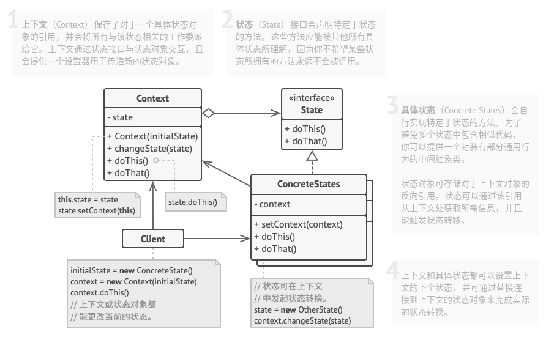

# 状态模式

## 简介


状态模式将一个对象的状态从对象中分离出来，封装到专门的状态类中，使得对象状态可以灵活变化。对于客户端而言，无需关心对象状态的转换以及对象所处的的当前状态，无论处于何种状态的对象，客户端都可以一致处理。

> **状态模式：允许一个对象在其内部状态改变时改变它的行为，对象看起来似乎修改了它的类。**

## 结构



## 实现

实现方式：

* 确定哪些类是上下文。它可能是包含依赖于状态的代码的已有类；如果特定于状态的代码分散在多个类中，那么它可能是一个新的类。
* 声明状态接口。虽然可能会需要完全复制上下文中声明的所有方法，但最好是仅把关注点放在那些可能包含特定于状态的行为的方法上。
* 为每个实际状态创建一个继承于状态接口的类。然后检查上下文中的方法并将与特定状态相关的所有代码抽取到新建的类中。
* 在上下文类中添加一个状态接口类型的引用成员变量，以及一个用于修改该成员变量值的公有设置器。
* 再次检查上下文中的方法，将空的条件语句替换为相应的状态对象方法。
* 为切换上下文状态，需要创建某个状态实例并将其传递给上下文。可以在上下文、各种状态或客户端中完成这项工作。无论在何处完成这项工作，该类都将依赖于其所实例化的具体类。

```c++
#include <iostream>
#include <typeinfo>

// 上下文
class Context;

// 状态
class State {
protected:
    Context *m_context;

public:
    virtual ~State() {}
    void setContext(Context *context) {
        m_context = context;
    }
    virtual void handle1() = 0;
    virtual void handle2() = 0;
};

class Context {
private:
    State *m_state;

public:
    Context(State *state) : m_state(nullptr) {
        transitionTo(state);
    }
    ~Context() {
        delete m_state;
    }

    void transitionTo(State *state) {
        std::cout << "上下文：转换状态为 " << typeid(*state).name() << "\n";
        if(m_state != nullptr) {
            delete m_state;
        }
        m_state = state;
        m_state->setContext(this);
    }
    void request1() {
        m_state->handle1();
    }
    void request2() {
        m_state->handle2();
    }
};

// 具体状态
class ConcreteStateA: public State {
public:
    void handle1() override;
    void handle2() override {
        std::cout << "状态A：处理请求2。\n";
    }
};

// 具体状态
class ConcreteStateB: public State {
public:
    void handle1() override {
        std::cout << "状态B：处理请求1。\n";
    }
    void handle2() override {
        std::cout << "状态B：处理请求2。\n";
        std::cout << "状态B：想要更改上下文状态。\n";
        m_context->transitionTo(new ConcreteStateA);
    }
};

void ConcreteStateA::handle1() {
    std::cout << "状态A：处理请求1。\n";
        std::cout << "状态A：想要更改上下文状态。\n";
        m_context->transitionTo(new ConcreteStateB);
}

void ClientCode() {
    Context *context = new Context(new ConcreteStateA);
    context->request1();
    std::cout << "\n";
    context->request2();
    std::cout << "\n";
    context->request2();

    delete context;
}

int main(int argc, char *argv[]) {
    ClientCode();

    return 0;
}
```

```python
# -*- coding: utf-8 -*-

from __future__ import annotations
from abc import ABC, abstractmethod


class Context(ABC):
    """
    """

    _state = None

    def __init__(self, state: State) -> None:
        self.transition_to(state)

    def transition_to(self, state: State):
        print(f"Context: Transition to {type(state).__name__}")
        self._state = state
        self._state.context = self

    def request1(self):
        self._state.handle1()

    def request2(self):
        self._state.handle2()


class State(ABC):
    """
    """

    @property
    def context(self) -> Context:
        return self._context

    @context.setter
    def context(self, context: Context) -> None:
        self._context = context

    @abstractmethod
    def handle1(self) -> None:
        pass

    @abstractmethod
    def handle2(self) -> None:
        pass


class ConcreteStateA(State):
    def handle1(self) -> None:
        print("ConcreteStateA handles request1.")
        print("ConcreteStateA wants to change the state of the context.")
        self.context.transition_to(ConcreteStateB())

    def handle2(self) -> None:
        print("ConcreteStateA handles request2.")


class ConcreteStateB(State):
    def handle1(self) -> None:
        print("ConcreteStateB handles request1.")

    def handle2(self) -> None:
        print("ConcreteStateB handles request2.")
        print("ConcreteStateB wants to change the state of the context.")
        self.context.transition_to(ConcreteStateA())


if __name__ == "__main__":
    # The client code.

    context = Context(ConcreteStateA())
    context.request1()
    print("\n")
    context.request2()
    print("\n")
    context.request2()
```

## 实例

### 问题描述

同上。

### 问题解答

同上。

## 总结

### 优点

* **单一职责原则**。将与特定状态相关的代码放在单独的类中。
* **开闭原则**。无需修改已有状态类和上下文就能引入新状态。
* 通过消除臃肿的状态机条件语句简化上下文代码。

### 缺点

* 如果状态机只有很少的几个状态，或者很少发生改变，那么应用该模式可能会显得小题大作。

### 场景

* 如果对象需要根据自身当前状态进行不同行为，同时状态的数量非常多且与状态相关的代码会频繁变更的话，可使用该模式。
* 如果某个类需要根据成员变量的当前值改变自身行为，从而需要使用大量的条件语句时，可使用该模式。
* 当相似状态和基于条件的状态机转换中存在许多重复代码时，可使用该模式。

### 与其他模式的关系

* **桥接模式**、**状态模式**和**策略模式**(某种程序上包括**适配器模式**)的接口都非常相似，实际上，它们都基于**组合模式**，即将工作委派给其他对象，不过也都各自解决了不同的问题。
* **状态模式**可被视为**策略模式**的扩展。两者都基于组合机制：它们都通过将部分工作委派给“帮手”对象来改变其在不同情景下的行为。策略使得这些对象相互之间完全独立，它们不知道其他对象的存在。但状态模式没有限制具体状态之间的依赖，且允许它们自行改变在不同情景下的状态。
