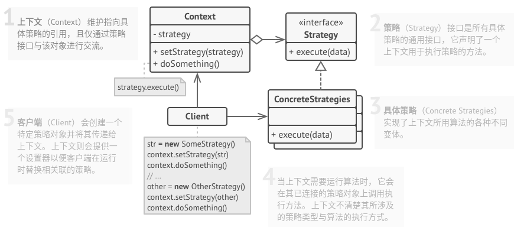

# 策略模式

## 简介


策略模式用于算法的自由切换和拓展，对应于解决某一问题的一个算法族，允许用户从该算法族中任意选择一个算法解决问题，同时还可以方便地更换算法或增加新的算法。策略模式将算法族中的每一个算法都封装成一个类，每一个类称为一个策略(`Strategy`)。

> **策略模式：定义一系列算法，将每一个算法封装起来，并让它们可以相互替换。策略模式让算法可以独立于使用它的客户而改变**。

## 结构



## 实现

实现方式：

* 从上下文类中找出修改频率较高的算法(也可能是用于在运行时选择某个算法变体的复杂条件运算符)。
* 声明该算法所有变体的通用策略接口。
* 将算法逐一抽取到各自的类中，它们都必须实现策略接口。
* 在上下文类中添加一个成员变量用于保存对于策略对象的引用。然后提供设置器以修改该成员变量。上下文仅可通过策略接口同策略对象进行交互，如有需要还可定义一个接口来让策略访问其数据。
* 客户端必须将上下文类与相应策略进行关联，使上下文可以以预期的方式完成其主要目标。

```c++
#include <iostream>
#include <string>
#include <vector>
#include <algorithm>
#include <memory>

// 通用策略接口类
class Strategy {
public:
    virtual ~Strategy() {}
    // 接口
    virtual std::string doAlgorithm(const std::vector<std::string> &data) const = 0;
};

// 上下文类
class Context {
private:
    Strategy *strategy_;

public:
    Context(Strategy *strategy = nullptr): strategy_(strategy){}
    // ~Context() {
    //     delete this->strategy_;
    // }
    void setStrategy(Strategy *strategy) {
        // delete this->strategy_;
        this->strategy_ = strategy;
    }
    void doSomeBusinessLogic() const {
        // ...
        std::cout << "Context: Sorting data using the strategy (not sure how it'll do it)\n";
        std::string result = this->strategy_->doAlgorithm(std::vector<std::string>{"a", "e", "c", "b", "d"});
        std::cout << result << std::endl;
        // ...
    }
};

// 策略A类
class ConcreteStrategyA: public Strategy {
public:
    std::string doAlgorithm(const std::vector<std::string> &data) const override {
        std::string result;
        std::for_each(std::begin(data), std::end(data), [&result](const std::string &letter) {
            result += letter;
        });

        // 升序
        std::sort(std::begin(result), std::end(result));

        return result;
    }
};

// 策略B类
class ConcreteStrategyB: public Strategy {
public:
    std::string doAlgorithm(const std::vector<std::string> &data) const override {
        std::string result;
        for(const auto letter: data) {
            result += letter;
        }

        // 降序
        std::sort(std::rbegin(result), std::rend(result));

        return result;
    }
};


// 客户端
void ClientCode() {
    std::shared_ptr<Context> context = std::make_shared<Context>(new ConcreteStrategyA);
    // std::shared_ptr<Context> context(new Context(new ConcreteStrategyA));
    // Context *context = new Context(new ConcreteStrategyA);

    std::cout << "Client: Strategy is set to normal sorting." << std::endl;
    context->doSomeBusinessLogic();
    std::cout << context.use_count() << std::endl;
    std::cout << std::endl;


    std::cout << "Client: Strategy is set to reverse sorting." << std::endl;
    context->setStrategy(new ConcreteStrategyB);
    context->doSomeBusinessLogic();
    std::cout << context.use_count() << std::endl;

    // delete context;
}

int main(int argc, char *argv[]) {
    ClientCode();

    return 0;
}
```

```python
# strategy.py

from __future__ import annotations
from abc import ABC, abstractmethod
from typing import List


class Strategy(ABC):
    """
    """

    @abstractmethod
    def do_algorithm(self, data: List):
        pass


class Context(object):
    """
    """

    def __init__(self, strategy: Strategy) -> None:
        """
        """
        self._strategy = strategy

    @property
    def strategy(self) ->Strategy:
        """
        """
        return self._strategy

    @strategy.setter
    def strategy(self, strategy: Strategy) -> None:
        self._strategy = strategy

    def do_some_business_logic(self) -> None:
        """
        """
        print("Context: Sorting data using the strategy (not sure how it'll do it)")
        result = self._strategy.do_algorithm(["a", "b", "c", "d", "e"])
        print(",".join(result))


class ConcreteStrategyA(Strategy):
    """
    """
    def do_algorithm(self, data: List) -> List:
        return sorted(data)


class ConcreteStrategyB(Strategy):
    """
    """
    def do_algorithm(self, data: List) -> List:
        return reversed(sorted(data))


if __name__ == "__main__":
    context = Context(ConcreteStrategyA())
    print("Client: Strategy is set to normal sorting.")
    context.do_some_business_logic()
    print()

    print("Client: Strategy is set to reverse sorting.")
    context.strategy = ConcreteStrategyB()
    context.do_some_business_logic()
```

## 实例

### 问题描述

同上。

### 问题解答

同上。

## 总结

### 优点

* 符合**开闭原则**，策略模式易于拓展，增加新的算法时只需要继承抽象策略类，新设计实现一个具体策略类即可。
* 客户端可以无差别地通过公共接口调用，利用**里式替换原则**，灵活使用不同的算法策略。
* 提供了一个算法族管理机制和维护机制。

### 缺点

* 客户端必须要知道所有的策略，以便在在使用时按需实例化具体策略。
* 系统会产生很多单独的类，增加系统中类的数量。
* 客户端在同一时间只能使用一种策略。

### 场景

* 系统需要在一个算法族中动态选择一种算法，可以将这些算法封装到多个具体算法类中，这些算法类都有共同的基类，即可以通过一个统一的接口调用任意一个算法，客户端可以使用任意一个算法。
* 不希望客户端知道复杂的、与算法相关的数据结构，在具体策略类中封装与算法相关的数据结构，可以提高算法的安全性。
* 算法策略比较经常地需要被替换时。

### 与其他模式的关系

* **桥接模式**、**状态模式**和**策略模式** （在某种程度上包括**适配器模式**）模式的接口非常相似。实际上，**它们都基于组合模式——即将工作委派给其他对象**，不过也各自解决了不同的问题。模式并不只是以特定方式组织代码的配方，你还可以使用它们来和其他开发者讨论模式所解决的问题。
* **命令模式**和**策略模式**看上去很像， 因为两者都能通过某些行为来参数化对象。 但是， 它们的意图有非常大的不同。

  * 你可以使用**命令**来将任何操作转换为对象。 操作的参数将成为对象的成员变量。 你可以通过转换来延迟操作的执行、 将操作放入队列、 保存历史命令或者向远程服务发送命令等。
  * 另一方面， **策略**通常可用于描述完成某件事的不同方式， 让你能够在同一个上下文类中切换算法。
* **装饰模式**可让你更改对象的外表， **策略模式**则让你能够改变其本质。

* **模板方法模式**基于继承机制： 它允许你通过扩展子类中的部分内容来改变部分算法。 **策略模式**基于组合机制： 你可以通过对相应行为提供不同的策略来改变对象的部分行为。 模板方法在类层次上运作， 因此它是静态的。 策略在对象层次上运作， 因此允许在运行时切换行为。
* **状态模式**可被视为**策略模式**的扩展。 **两者都基于组合机制**： 它们都通过将部分工作委派给 “帮手” 对象来改变其在不同情景下的行为。 策略使得这些对象相互之间完全独立， 它们不知道其他对象的存在。 但状态模式没有限制具体状态之间的依赖， 且允许它们自行改变在不同情景下的状态。
