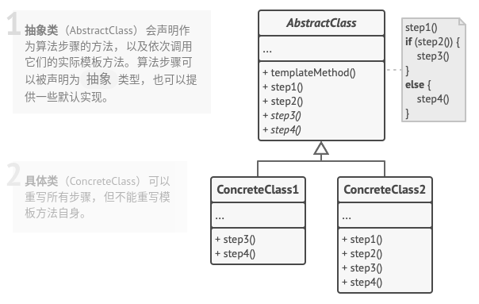

# 模板方法模式

## 简介


模板方法模式是较简单且常用的一种设计模式，是基于类的继承的一种代码复用技术，其结构只存在基类和派生类之间的继承关系。模板方法是一个具体的方法，给出了一个顶层逻辑流程框架。

> **模板方法模式：定义一个操作中的算法的框架，而将一些步骤延迟到子类中，使得子类可以不改变一个算法的结构即可重新定义该算法的某些特定的步骤。子类实现的具体方法叫作基本方法，实现对基本方法高度的框架方法，叫作模板方法。**

## 结构



## 实现

```c++
#ifndef __DEMO_H__
#define __DEMO_H__

// 抽象类(基类)
class AbstractClass {
public:
    void templateMethod() {
        // do something
        method1();
        method2();
        method3();
    }

    // 基本方法-公共方法
    void method1() {
        // do something
    }

    // 基本方法2
    virtual void method2() = 0;

    // 基本方法3-默认实现
    void method3() {
        // do something
    }
};

// 具体类(派生类)
class ConceteClass: public AbstractClass {
public:
    //
    void method2() {
        // do something
    }

    //
    void method3() {
        // do something
    }
};


#endif
```

## 实例

### 问题描述

某个指纹处理模块可以在两种模式下处理算法，即安全模式和非安全模式。在安全模式下，为了保证数据安全，某个指纹识别流程需要对采得的指纹图像进行加密，在处理图像之前再对加密数据进行解密。而非安全模式这不需要加密解密过程。指纹算法流程如下：采图——加密——解密——算法处理指纹——处理结果。现用模板方法模式模拟上述过程。

### 问题解答

```c++
// FingerprintModule.h

#ifndef __FINGERPRINTMODULE_H__
#define __FINGERPRINTMODULE_H__

// FingerprintModule.h

#include <cstdio>

// 基类
class FingerprintModule
{
public:
    FingerprintModule() {}
    void getImage()
    {
        printf("采指纹图像\n");
    }
    void output()
    {
        printf("指纹图像处理完成!\n");
    }
    virtual bool isSafeMode() = 0;
    virtual void processImage() = 0;
    // 加解密
    virtual void encrypt() = 0;
    virtual void decrypt() = 0;

    // 模板方法
    void algorithm()
    {
        // 1.采图
        getImage();
        // 2.安全模式下加密和解密
        if (isSafeMode())
        {
            // 2.1. 加密
            encrypt();
            // 2.2. 解密
            decrypt();
        }
        // 3.处理Image
        processImage();
        // 4.处理结果
        output();
    }
};

// 派生类
class FingerprintModuleA : public FingerprintModule
{
public:
    FingerprintModuleA() {}
    void processImage()
    {
        printf("使用 第一代版本算法 处理指纹图像\n");
    }
    bool isSafeMode()
    {
        printf("安全模式\n");
        return true;
    }
    void encrypt()
    {
        printf("使用RSA密钥加密\n");
    }
    void decrypt()
    {
        printf("使用RSA密钥解密\n");
    }
};

// 派生类
class FingerprintModuleB : public FingerprintModule
{
public:
    FingerprintModuleB() {}
    void processImage()
    {
        printf("使用 第二代版本算法 处理指纹图像\n");
    }
    bool isSafeMode()
    {
        printf("非安全模式\n");
        return false;
    }
    void encrypt() {}
    void decrypt() {}
};

// 派生类
class FingerprintModuleC : public FingerprintModule
{
public:
    FingerprintModuleC() {}
    void processImage()
    {
        printf("使用 第一代版本算法 处理指纹图像\n");
    }
    bool isSafeMode()
    {
        printf("安全模式\n");
        return true;
    }
    void encrypt()
    {
        printf("使用DH密钥加密\n");
    }
    void decrypt()
    {
        printf("使用DH密钥解密\n");
    }
};

#endif
```

```c++
// example.cpp

// main.cpp

#include "FingerprintModule.h"

int main(int argc, char *argv[])
{
    FingerprintModule *fp = new FingerprintModuleA();
    fp->algorithm();

    printf("\n");

    fp = new FingerprintModuleB();
    fp->algorithm();

    printf("\n");

    fp = new FingerprintModuleC();
    fp->algorithm();

    delete fp;

    return 0;
}
```

## 总结

### 优点

* 在基类中定义算法的框架，并声明一些流程方法，有具体派生类实现具体细节，派生类中的实现并不会影响基类定义的算法的框架流程。
* 公共行为在基类中提供实现，有利于代码复用。
* 派生类可以覆盖基类的方法，重新实现某些方法，具有灵活性。
* 可以很方便的扩展和更换派生类而不影响基类和其他派生类。**符合开闭原则和单一职责原则**。

### 缺点

* 模板方法模式在抽象类中定义了子类的方法，即子类对父类产生了影响，部分影响了代码的可读性。
* 模板方法中的步骤过多，其维护工作就可能会越困难。

### 场景

* 分割开复杂算法，可以将算法的框架流程定义在基类中，设计为模板方法，而具体的细节由派生类设计实现。例如机器学习中的监督学习算法有很多，如决策树、KNN、SVN等，但其流程大致相同，都包括输入样本、拟合、预测等过程，把这些过程提取出来，构造模板方法，并通过**钩子方法**控制流程。
* 各个派生类的公共部分提取到基类中，以实现代码复用。
* 派生类需要覆盖基类的某些方法。

### 与其他模式的关系

* **工厂方法模式**是**模板方法模式**的一种特殊形式。同时，工厂方法可以作为一个大型模板方法中的一个步骤。
* **模板方法基于继承机制**：她允许你通过扩展子类中的部分内容来改变部分算法。而**策略模式基于组合机制**：你可以通过对相应行为提供不同的策略来改变对象的部分行为。模板方法模式在类层次上运作，因此它是静态的。而策略模式在对象层次上运行，因此运行在运行时切换行为。
