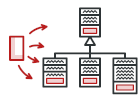
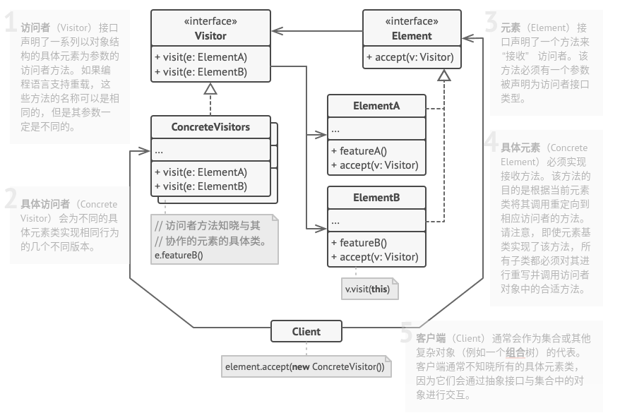

# 访问者模式

## 简介



> **访问者模式：封装一些作用于某种数据结构中的各元素的操作，它可以在不改变数据结构的前提下定义于这些元素的新操作。**

**重要：为什么不能通过方法重载来简单地替换访问者？**

```c++
class Exporter is
    method export(s: Shape) is
        print("导出形状")
    method export(d: Dot)
        print("导出点")
    method export(c: Circle)
        print("导出圆形")
    method export(r: Rectangle)
        print("导出矩形")
    method export(cs: CompoundGraphic)
        print("导出组合图形")

// 使用
class App() is
    method export(shape: Shape) is
        Exporter exporter = new Exporter()
        exporter.export(shape);

app.export(new Circle());
// 不幸的是，这里将输出“导出形状”。
```

### 后期/动态绑定

> **动态编程语言：`Python`、`Ruby`、`PHP`、`JavaScript`、`Erlang`等**

```python
# 编译这段代码：

method drawShape(shape: Shape) is
    shape.draw();
```

最终的机器代码将检查`shape`参数的类并且从合适的类中选择`draw`方法的实现。

这种动态类型检查被称为后期(或动态)绑定：

* **后期**，是因为在编译后和运行时才将对象及其实现链接起来。
* **动态**，是因为每个新对象都可能需要链接到不同的实现。

### 前期/静态绑定

> **静态编程语言：`C`、`C++`、`C#`、`Java`、`Object-C`等**

```c++
// 编译这段代码：

method exportShape(shape: Shape) is
    Exporter exporter = new Exporter()
    exporter.export(shape);
```

编译器不能确保存在适当的与重写后的方法相对应的重载方法。编译器无法应对这种模凌两可的情况。因此， 编译器开发者会选择安全的方式： 使用前期 （或静态） 绑定来处理重载方法。

* **前期**，是因为它发生在运行程序前编译的时候。
* **静态**，是因为它无法在运行时更改。

### 双分派

双分派是一个允许在重载是使用动态绑定的技巧。

```c++
class Visitor is
    method visit(s: Shape) is
        print("访问形状")
    method visit(d: Dot)
        print("访问点")

interface Graphic is
    method accept(v: Visitor)

class Shape implements Graphic is
    method accept(v: Visitor)
        // 编译器明确知道 `this` 的类型是 `Shape`。
        // 因此可以安全地调用 `visit(s: Shape)`。
        v.visit(this)

class Dot extends Shape is
    method accept(v: Visitor)
        // 编译器明确知道 `this` 的类型是 `Dot`。
        // 因此可以安全地调用 `visit(s: Dot)`。
        v.visit(this)


Visitor v = new Visitor();
Graphic g = new Dot();

// `accept` 方法是重写而不是重载的。编译器可以进行动态绑定。
// 因此在对象调用某个方法时，将执行其所属类中的 `accept`
// 方法（在本例中是 `Dot` 类）。
g.accept(v);

// 输出："访问点"
```

### 总结

尽管访问者模式基于双分派的原则创建，但是这并不是其主要目的。访问者的目的是让你能为整个类层次结构添加"外部"操作，而无需修改这些类的已有代码。

## 结构



## 实现

实现方式：

* 在访问者接口中声明一组"访问"方法，分别对应程序中的每个具体元素类。
* 声明元素接口。如果程序中已有元素类层次接口，可在层次结构基类中添加抽象的"接收"方法，该方法必须接受访问者对象作为参数。
* 在所有具体元素类中实现接收方法。这些方法必须将调用重定向到当前元素对应的访问者对象中的访问者方法上。
* 元素类只能通过访问者接口和访问者进行交互。不过访问者必须知晓所有的具体元素类，因为这些类在访问者方法中都被作为参数类型引用。
* 为每个无法在元素层次结构中实现的行为创建一个具体访问者类并实现所有的访问者方法。
* 客户端必须创建访问者对象并通过"接收"方法将其传递给元素。

```c++
#include <iostream>
#include <array>


class ConcreteComponentA;
class ConcreteComponentB;

// 访问者
class Visitor {
 public:
  virtual void VisitConcreteComponentA(const ConcreteComponentA *element) const = 0;
  virtual void VisitConcreteComponentB(const ConcreteComponentB *element) const = 0;
};

// 抽象组件
class Component {
 public:
  virtual ~Component() {}
  virtual void Accept(Visitor *visitor) const = 0;
};

// 具体组件A
class ConcreteComponentA : public Component {
 public:
  void Accept(Visitor *visitor) const override {
    visitor->VisitConcreteComponentA(this);
  }
  std::string ExclusiveMethodOfConcreteComponentA() const {
    return "A";
  }
};

// 具体组件B
class ConcreteComponentB : public Component {
 public:
  void Accept(Visitor *visitor) const override {
    visitor->VisitConcreteComponentB(this);
  }
  std::string SpecialMethodOfConcreteComponentB() const {
    return "B";
  }
};

// 具体访问者
class ConcreteVisitor1 : public Visitor {
 public:
  void VisitConcreteComponentA(const ConcreteComponentA *element) const override {
    std::cout << element->ExclusiveMethodOfConcreteComponentA() << " + ConcreteVisitor1\n";
  }

  void VisitConcreteComponentB(const ConcreteComponentB *element) const override {
    std::cout << element->SpecialMethodOfConcreteComponentB() << " + ConcreteVisitor1\n";
  }
};

// 具体访问者
class ConcreteVisitor2 : public Visitor {
 public:
  void VisitConcreteComponentA(const ConcreteComponentA *element) const override {
    std::cout << element->ExclusiveMethodOfConcreteComponentA() << " + ConcreteVisitor2\n";
  }
  void VisitConcreteComponentB(const ConcreteComponentB *element) const override {
    std::cout << element->SpecialMethodOfConcreteComponentB() << " + ConcreteVisitor2\n";
  }
};


void ClientCode(std::array<const Component *, 2> components, Visitor *visitor) {
  // ...
  for (const Component *comp : components) {
    comp->Accept(visitor);
  }
  // ...
}

int main() {
  std::array<const Component *, 2> components = {new ConcreteComponentA, new ConcreteComponentB};
  std::cout << "The client code works with all visitors via the base Visitor interface:\n";
  ConcreteVisitor1 *visitor1 = new ConcreteVisitor1;
  ClientCode(components, visitor1);
  std::cout << "\n";
  std::cout << "It allows the same client code to work with different types of visitors:\n";
  ConcreteVisitor2 *visitor2 = new ConcreteVisitor2;
  ClientCode(components, visitor2);

  for (const Component *comp : components) {
    delete comp;
  }
  delete visitor1;
  delete visitor2;

  return 0;
}
```

```python
# -*- coding: utf-8 -*-

from __future__ import annotations
from abc import ABC, abstractmethod
from typing import List


class Component(ABC):
    """
    """

    @abstractmethod
    def accept(self, visitor: Visitor) -> None:
        pass


class ConcreteComponentA(Component):
    """
    """

    def accept(self, visitor: Visitor) -> None:
        visitor.visit_concrete_component_a(self)

    def exclusive_method_of_concrete_component_a(self) -> str:
        return "A"


class ConcreteComponentB(Component):
    """
    """

    def accept(self, visitor: Visitor):
        visitor.visit_concrete_component_b(self)

    def special_method_of_concrete_component_b(self) -> str:
        return "B"


class Visitor(ABC):
    """
    """

    @abstractmethod
    def visit_concrete_component_a(self, element: ConcreteComponentA) -> None:
        pass

    @abstractmethod
    def visit_concrete_component_b(self, element: ConcreteComponentB) -> None:
        pass


class ConcreteVisitor1(Visitor):
    def visit_concrete_component_a(self, element) -> None:
        print(f"{element.exclusive_method_of_concrete_component_a()} + ConcreteVisitor1")

    def visit_concrete_component_b(self, element) -> None:
        print(f"{element.special_method_of_concrete_component_b()} + ConcreteVisitor1")


class ConcreteVisitor2(Visitor):
    def visit_concrete_component_a(self, element) -> None:
        print(f"{element.exclusive_method_of_concrete_component_a()} + ConcreteVisitor2")

    def visit_concrete_component_b(self, element) -> None:
        print(f"{element.special_method_of_concrete_component_b()} + ConcreteVisitor2")


def client_code(components: List[Component], visitor: Visitor) -> None:
    # ...
    for component in components:
        component.accept(visitor)
    # ...


if __name__ == "__main__":
    components = [ConcreteComponentA(), ConcreteComponentB()]

    print("The client code works with all visitors via the base Visitor interface:")
    visitor1 = ConcreteVisitor1()
    client_code(components, visitor1)

    print("It allows the same client code to work with different types of visitors:")
    visitor2 = ConcreteVisitor2()
    client_code(components, visitor2)
```

## 实例

### 问题描述

同上。

### 问题解答

同上。

## 总结

### 优点

* 开闭原则。可以引入在不同类对象上执行的新行为，且无需对这些类做出修改。
* 单一职责原则。可将同一行为的不同版本移到同一个类中。
* 访问者对象可以在与各种对象交互时收集一些有用的信息。当想要遍历一些复杂的对象结构 （例如对象树），并在结构中的每个对象上应用访问者时，这些信息可能会有所帮助。

### 缺点

* 每次在元素层次结构中添加或移除一个类时，都要更新所有的访问者。
* 在访问者同某个元素进行交互时，它们可能没有访问元素私有成员变量和方法的必要权限。

### 场景

* 如果你需要对一个复杂对象结构（例如对象树）中的所有元素执行某些操作，可使用该模式。
* 当某个行为仅在类层次结构中的一些类中有意义，而在其他类中没有意义时，可使用该模式。
* 可使用访问者模式来清理辅助行为的业务逻辑。

### 与其他模式的关系

* 可以将**访问者模式**视为**命令模式**的加强版本，其对象可对不同类的多种对象执行操作。
* 可以使用**访问者模式**对整个**组合模式**树执行操作。
* 可以同时使用**访问者模式**和**迭代器模式**来遍历复杂数据结构，并对其中的元素执行所需操作，即使这些元素所属的类完全不同。
