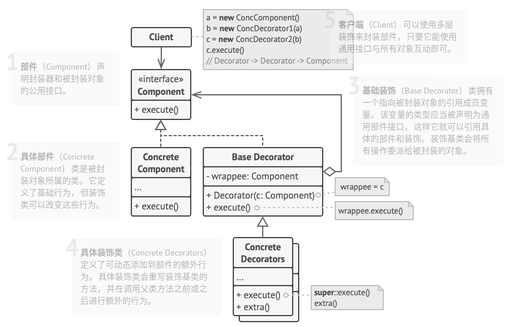

# 装饰模式

## 简介


装饰模式可以在不改变一个对象本身功能的基础上给对象增加额外的新行为。装饰模式是一种用于替代继承的技术。通过一种无须定义子类的方式给对象动态增加职责，使用对象之间的关联关系取代类之间的继承关系。装饰模式中引入了装饰类，在装饰类中既可以调用待装饰的原有对象的方法，还可以增加新的方法，以扩充原有类的功能。

**装饰模式：动态地给一个对象增加一些额外的职责。就拓展功能而言，装饰模式提供了一种比使用子类更加灵活的替代方案。**

## 结构



## 实现

实现方式：

* 确保业务逻辑可用一个基本组建以及多个额外可选层次表示。
* 找出基本组建和可选层次的通用方法。创建一个组件接口并在其中声明这些方法。
* 创建一个具体组件类，并定义其基础行为。
* 创建修饰基类，使用一个成员变量存储指向被封装对象的引用。该成员变量必须被声明为组件接口类型，从而能在运行时连接具体组件和装饰。装饰基类必须将所有工作委派给被封装的对象。
* 确保所有类实现组件接口。
* 将装饰基类拓展为具体装饰。具体装饰必须在调用父类(总是委派给被封装对象)之前或之后执行自身的行为。
* 客户端代码负责创建装饰并将其组合成客户端所需的形式。

```c++
#include <iostream>


// 抽象部(构)件
class Component {
public:
    virtual ~Component() {}
    virtual std::string Operation() const = 0;
};

// 具体部(构)件
class ConcreteComponent : public Component {
public:
    std::string Operation() const override {
        return "ConcreteComponent";
    }
};

// 抽象装饰
class Decorator : public Component {
protected:
    Component* component_;

public:
    Decorator(Component* component) : component_(component) {}
    std::string Operation() const override {
        return this->component_->Operation();
    }
};

// 具体装饰A
class ConcreteDecoratorA : public Decorator {
public:
    ConcreteDecoratorA(Component* component) : Decorator(component) {}
    std::string Operation() const override {
        return "ConcreteDecoratorA("  + Decorator::Operation()  + ")";
    }
};

// 具体装饰B
class ConcreteDecoratorB : public Decorator {
public:
    ConcreteDecoratorB(Component* component) : Decorator(component) {}
    std::string Operation() const override {
        return "ConcreteDecoratorB("  + Decorator::Operation()  + ")";
    }
};

void ClientCode(Component* component) {
    // ...
    std::cout << "RESULT: " << component->Operation() << std::endl;
    // ...
}

int main(int argc, char *argv[]) {
    Component* simple = new ConcreteComponent;
    std::cout << "Client: I've got a simple component:\n";
    ClientCode(simple);
    std::cout << "\n";

    // 为simple装饰上ConcreteDecoratorA和ConcreteDecoratorB
    Component* decorator1 = new ConcreteDecoratorA(simple);
    Component* decorator2 = new ConcreteDecoratorB(decorator1);
    std::cout << "Client: Now I've got a decorated component:\n";
    ClientCode(decorator2);
    std::cout << "\n";

    delete simple;
    delete decorator1;
    delete decorator2;

    return 0;
}
```

```python
# -*- coding: utf-8 -*-


class Component():
    """
    """

    def operation(self) -> str:
        pass


class ConcreteComponent(Component):
    """
    """

    def operation(self) -> str:
        return "ConcreteComponent"


class Decorator(Component):
    """
    """

    _component: Component = None

    def __init__(self, component: Component) -> None:
        self._component = component

    @property
    def component(self) -> str:
        return self._component

    def operation(self) -> str:
        return self._component.operation()


class ConcreteDecoratorA(Decorator):
    """
    """

    def operation(self) -> str:
        return f"ConcreteDecoratorA({self.component.operation()})"


class ConcreteDecoratorB(Decorator):
    """
    """

    def operation(self) -> str:
        return f"ConcreteDecoratorB({self.component.operation()})"


def client_code(component: Component) -> None:
    """
    """

    # ...

    print(f"RESULT: {component.operation()}", end="")

    # ...


if __name__ == "__main__":
    simple = ConcreteComponent()
    print("Client: I've got a simple component:")
    client_code(simple)
    print("\n")

    # 为simple装饰上ConcreteDecoratorA和ConcreteDecoratorB
    decorator1 = ConcreteDecoratorA(simple)
    decorator2 = ConcreteDecoratorB(decorator1)
    print("Client: Now I've got a decorated component:")
    client_code(decorator2)
```

## 实例

### 问题描述

同上。

### 问题解答

同上。

## 总结

### 优点

* 无需创建新子类即可扩展对象的行为。
* 可以在运行时添加或删除对象的功能。
* 可以用多个装饰封装对象来组合几种行为。
* **单一职责原则**。可以将实现了许多不同行为的一个大类拆分为多个较小的类。
* **开闭原则**。具体构件类和具体装饰类可以独立变化和扩展。

### 缺点

* 在封装器栈中删除特定封装器比较困难。
* 实现行为不受装饰栈顺序影响的装饰比较困难。
* 各层的初始化配置代码看上去可能会很糟糕。

### 场景

* 如果你希望在无需修改代码的情况下即可使用对象，且希望在运行时为对象新增额外的行为，可以使用该模式。
* 如果用继承来扩展对象行为的方案难以实现或者根本不可行，你可以使用该模式。

### 与其他模式的关系

* **适配器模式**可以对已有对象的接口进行修改，**装饰模式**则能在不改变对象接口的前提下强化对象功能。此外，装饰还支持递归组合，适配器则无法实现。

* **适配器**能为被封装对象提供不同的接口，**代理模式**能为对象提供相同的接口，**装饰**则能为对象提供加强的接口。

* **责任链模式**和**装饰模式**的类结构非常相似。两者都依赖递归组合将需要执行的操作传递给一系列对象。但是，两者有几点重要的不同之处。**责任链**的管理者可以相互独立地执行一切操作，还可以随时停止传递请求。另一方面，各种装饰可以在遵循基本接口的情况下扩展对象的行为。此外，装饰无法中断请求的传递。

* **组合模式**和**装饰模式**的结构图很相似，因为两者都依赖递归组合来组织无限数量的对象。装饰类似于组合，但其只有一个子组件。此外还有一个**明显不同**：装饰为被封装对象添加了额外的职责，组合仅对其子节点的结果进行了“求和”。但是 模式也可以相互合作：你可以使用装饰来扩展组合树中特定对象的行为。

* 大量使用**组合**和**装饰**的设计通常可从对于原型模式的使用中获益。你可以通过该模式来复制复杂结构，而非从零开始重新构造。

* **装饰模式**可让你更改对象的外表，**策略模式**则让你能够改变其本质。

* **装饰**和**代理**有着相似的结构，但是其意图却非常不同。这两个模式的构建都基于组合原则，也就是说一个对象应该将部分工作委派给另一个对象。两者之间的不同之处在于代理通常自行管理其服务对象的生命周期，而装饰的生成则总是由客户端进行控制。
