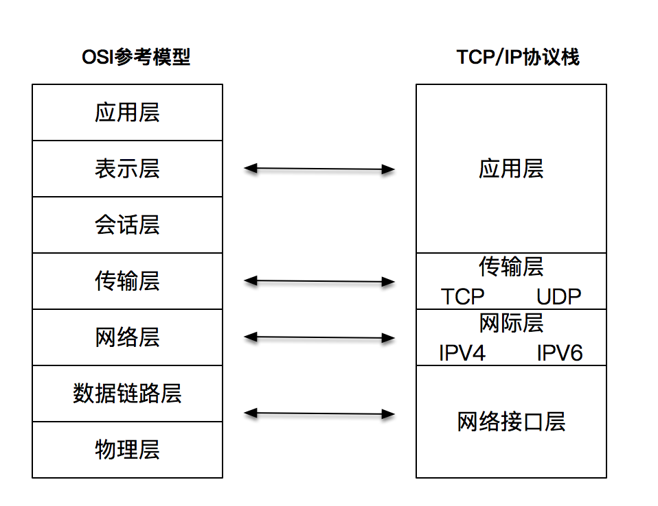

# 网络编程实战-基础篇

高性能网络编程，要掌握的两个核心要点：

* 理解网络协议，并在这个基础上和操作系统内核配合，感知各种网络 I/O 事件。
* 学会使用线程处理并发。

掌握网络编程，需要达到以下三个层次：

* 充分理解 TCP/IP 网络模型和协议。
* 结合对协议的理解，增强对各种异常情况的优雅处理能力。
* 写出可以支持大规模高并发的网络处理程序。

## TCP/IP 和 Linux

OSI参考模型和TCP_IP协议栈：

## 客户端-服务器网络模型的基本概念

## 套接字和地址

客户端和服务器工作的核心逻辑：

## TCP 三次握手

## 使用套接字进行读写

## UDP

## 本地套接字

## 各种工具

